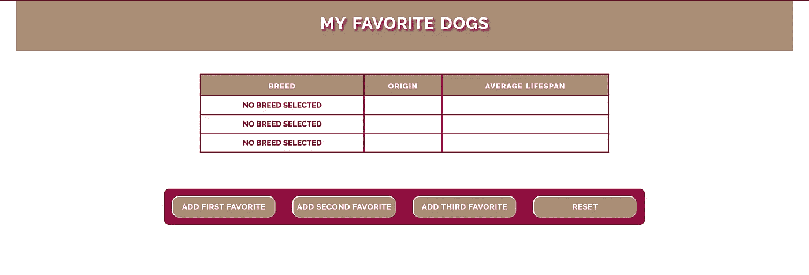
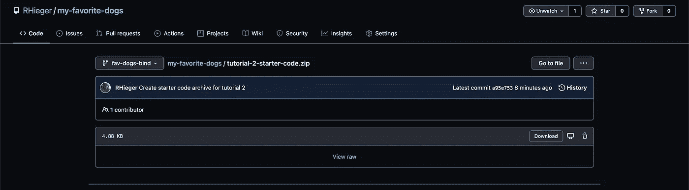
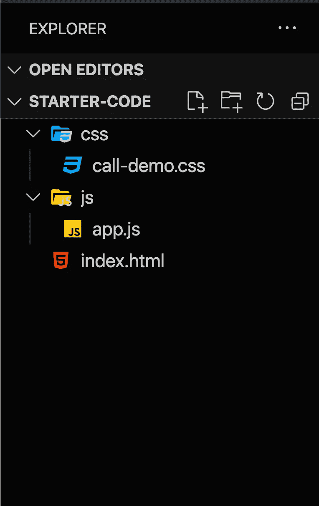
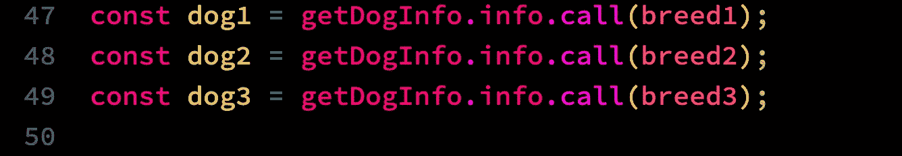
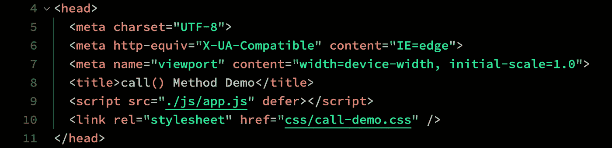
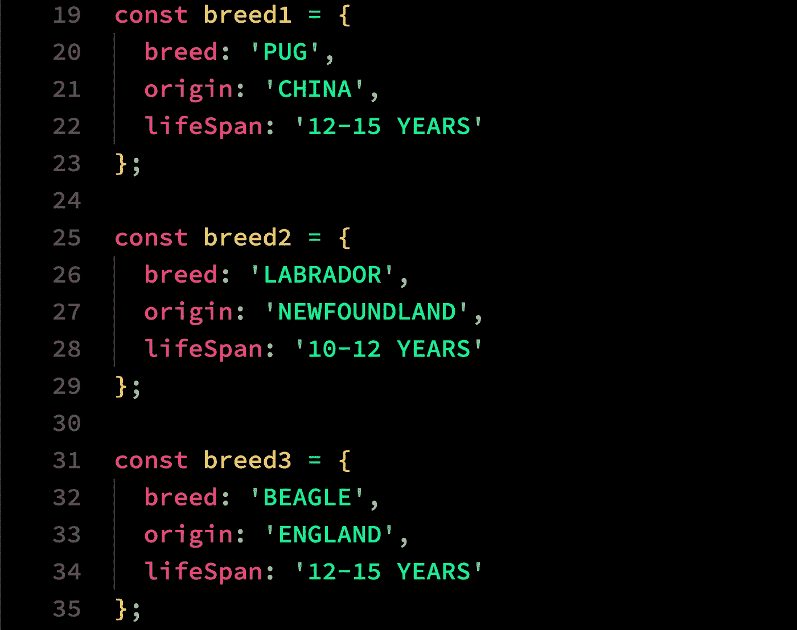
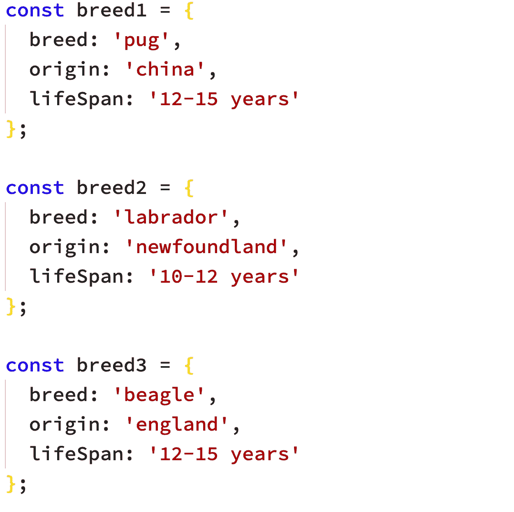
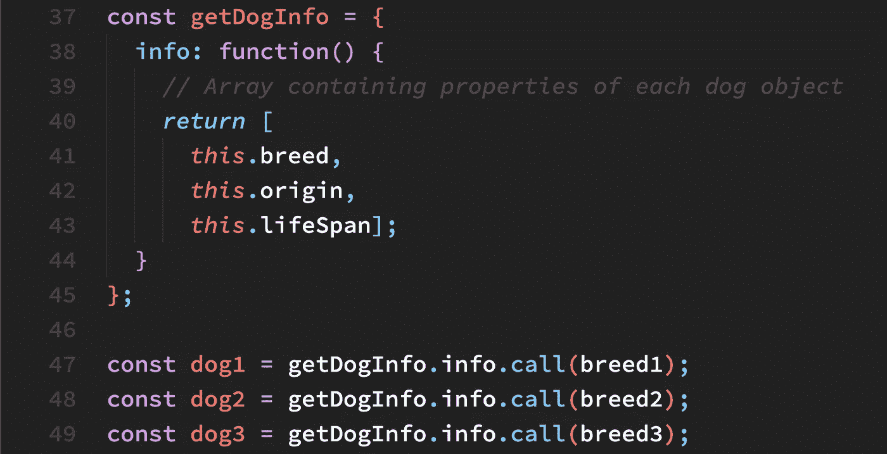
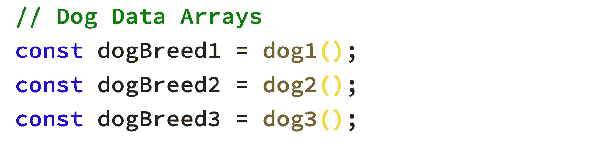

# 快速浏览一下 JavaScript bind()方法

> 原文：<https://javascript.plainenglish.io/a-quick-look-at-the-javascript-bind-method-part-ii-f08bc9451dcc?source=collection_archive---------6----------------------->

## 理解 JavaScript 中的 bind()方法

Photo by [Negative Space](https://www.pexels.com/@negativespace?utm_content=attributionCopyText&utm_medium=referral&utm_source=pexels) from [Pexels](https://www.pexels.com/photo/gray-laptop-computer-showing-html-codes-in-shallow-focus-photography-160107/?utm_content=attributionCopyText&utm_medium=referral&utm_source=pexels)

# 介绍

已经有一段时间了，我很高兴回到我承诺的系列教程。这是演示`call()`、`bind()`和`apply()`方法的一个小型项目的三个系列教程中的第二个，它们有相似之处，但也有明显的不同。

本系列的第一篇教程介绍了在一个小型项目中使用`call()`方法，通过点击表格下方的按钮来填充一个最喜欢的狗品种的表格。

本教程中使用的文本编辑器是 [Visual Studio Code](https://code.visualstudio.com/) (VSC)，这是微软的一个非常强大，但易于使用的可扩展程序员编辑器。而且是绝对免费的。但是，您可以使用您最喜欢的文本编辑器，只要它突出显示 JavaScript 的代码语法，因为这将便于阅读代码，并且最好是“智能感知”，以便在几次击键后预测您想要的代码。

在这三个教程的第二个中，我们将看看`bind()`方法，它与`call()`方法有些相似。

**这个迷你项目中的代码将产生与第一个教程相同的输出，但是使用** `bind()` **方法代替**。这需要对上一教程中的代码进行一些修改。

> ***先决条件:*** *如果您还没有看完本系列的第一篇教程，因为这里不会讨论大量的代码，您最好先看一下* [**快速浏览一下 JavaScript**](/a-quick-look-at-the-javascript-call-method-b5b2383eb4e6)`[**call()**](/a-quick-look-at-the-javascript-call-method-b5b2383eb4e6)`[**方法**](/a-quick-look-at-the-javascript-call-method-b5b2383eb4e6) **。**

**由于我们已经构建了一个完成项目的功能模型(如下面的**图 1 中所示)，我们在本教程中的重点将不是整个过程的演练，而是探索这个版本项目的代码差异。

**Fig. 1 Opening Screen of My Favorite Dogs**

> ***简单回顾一下，在第一个教程中，我们构建了一个非常简单的单页应用程序(SPA ),它有四个按钮，前三个按钮允许用户用最喜欢的狗品种的数据填充表格的三行。第四个按钮将表格重置为原始状态，如上所示。***

# 我们开始吧

要开始，请下载[教程启动代码](https://github.com/RHieger/my-favorite-dogs/blob/fav-dogs-bind/tutorial-2-starter-code.zip)。只需点击 Github 链接中的下载按钮，如下图**图 2** 所示:

**Fig. 2 Download Starter Code**

您可以将归档文件解压缩到您的本地驱动器上，您将看到以下文件结构，如下面的**图 3** 所示:

**Fig. 3 Starter Code File Structure**

**图 3** 显示了一个目录树，其中有一个包含项目外部样式表的 **css** 文件夹，一个包含应用程序逻辑的 **js** 文件夹，最后是包含应用程序内容的**index.html**文件。

# 需要改变什么？

为了使用`bind()`方法重构这个应用程序，必须做一些改变，有些是琐碎的，有些则更复杂一些。

我们需要对组成应用程序的所有三个文件进行修改。在**index.html**中，文件对外部样式表的引用会因为语义原因而改变，`<title>`标签中的内容也会改变。

然后，重构将发生在下面的**图 4** 所示的代码片段中:

**Fig. 4 Code Snippet 1: Setting the Contents of Table Rows**

上面图 2 所示的代码将被重构以使用`bind()`方法。由于`call()`和`bind()`方法之间的差异，这将需要一段额外的代码。

## **现在让我们重构代码**

有了上面概述的变化的知识，我们可以重构代码来演示`bind()`方法的使用。

# 第一步:对 index.html 进行必要的修改

**下面的图 6** 显示了包含在您的启动代码中的**index.html**文件的`<head>`部分:

**Fig. 6 <head> Section of index.html**

我们只关心上面图 6 的**线 8** 和**线 10** 。

对您的起始代码进行以下更改:

1.  更改第 8 行，使其显示为`<title>bind() Method Demo</title>`。
2.  将第 10 行修改如下:
    `<link rel="stylesheet" href="css/bind-demo.css" />`。

> ***第 10 行的这个变化使得 CSS 文件名在语义上对于本教程是正确的。***

# 第 2 步:重命名 CSS 样式表

如果您参考上面的**图 3** ，您将会看到 css 样式表被命名为**call-demo . CSS。**考虑到我们重构的代码是`bind()`方法的演示，这不仅在语义上是不正确的，而且会导致错误，因为在**步骤 1** 中，第 10 行现在引用了一个名为 **bind-demo.css 的 CSS 文件**。

为了解决这个问题，将 **call-demo.css** 重命名为**bind-demo . CSS**。如果您在浏览器中打开**index.html**，一切都会正确显示。事实上，如果您单击应用程序的按钮，它们将会像上一个教程中那样运行。这是因为我们的起始代码是在第一个教程中创建的代码。

> ***现在我们已经搭好了舞台。深呼吸，让我们深入研究重构 app.js 中的应用逻辑，让它利用*** `***bind()***` ***方法，而不是*** `***call()***` ***方法。***

# 第 3 步:重构品种对象

**下图 7** 显示了该步骤的相关代码:

**Fig. 7 The breed Objects**

正如您在上面的**图 7** 中看到的，三个按顺序编号的**品种**对象包含组成我们最喜欢的狗品种信息的属性，我们希望将这些信息动态地插入到我们的表中。

上面的代码绝对没有任何问题，对于这个演示来说，它可以正常工作。但是我会要求你改变上面的三个对象，使它们看起来像下面**图 8** 中的代码:

**Fig. 8 Refactored breed Objects Code**

***你可能会问自己，“为什么这是必要的？”*** 从某个角度来看，你是对的。我选择重构这段代码的原因如下:

1.  从下面的代码中可以看出，如上所示重构这段代码将排版的控制权交给了应用程序逻辑，而不是对大写字母进行硬编码。
2.  后来，特别是如果这个应用程序被开发成一个接受用户输入的功能更强的模型，那么用户可能输入的所有字符都可以通过转换用户输入的原始数据来清除。

本质上，这种行为更有深远意义，并且面向这个简单演示的进一步开发。

# 步骤 4:重构 dog 对象以使用 bind()方法

**下面的图 9** 显示了与我们任务相关的代码:

**Fig. 9 The getDogInfo() Object and the Derived dog Objects**

为了阐明我们将如何重构上述内容，让我们回顾一下图 9 中的代码，以阐明清单中发生了什么。

`getDogInfo()`对象包含一个单独的属性，一个名为`info()`的方法，其唯一的目的是返回它将从**品种**对象获得的值，尽管是间接的。注意，返回的值直接对应于**品种**对象中的属性，如图**图 8** 所示(重构的**品种**对象)。

**上面图 9** 中的第 47–49 行使用`**call()**`方法创建三个新的**狗**对象。在这种情况下，创建的对象是一个包含属性值的数组。

# **`**Function.prototype.bind()**` **与** `**Function.prototype.call()**` **有何不同？****

****简单解释一下。**如果你正在寻找关于这两种方法如何工作的完整解释，你可以在 Mozilla 开发者网络页面找到关于[function . prototype . call()](https://developer.mozilla.org/en-US/docs/Web/JavaScript/Reference/Global_Objects/Function/call)和[function . prototype . bind()](https://developer.mozilla.org/en-US/docs/Web/JavaScript/Reference/Global_objects/Function/bind)的最完整信息。**

**对这些差异的简单总结可以表达如下:**

1.  **`call()`方法调用一个函数对象，并接受一个指定`this`关键字引用哪个对象的参数。额外的参数也可以添加到`call()`方法签名中。**
2.  **与`call()`方法不同的是,`bind()`方法返回一个全新的函数，这个函数可以被调用，通过这个函数你可以传递一个数组和尽可能多的参数。**

> *****让我们看看如何重构图 9 中的第 47–49 行，以利用*** `***bind() method***` ***。*****

****对代码进行以下更改:****

1.  **在你的启动代码中修改**第 47 行**，使其显示为
    `const dog1 = getDogInfo.info.bind(breed1);`**
2.  **更改第 48 行，使其显示为
    `const dog2 = getDogInfo.info.bind(breed2);`**
3.  **更改**行 49** ，使其显示为
    `const dog3 = getDogInfo.info.bind(breed3);`**

**到目前为止，唯一的区别是我们在上面三个重构的声明中用`bind()`代替了`call()`。**

**但是现在真正的不同来了。在**下面第 49 行，**添加清单中显示的代码 inn **图 10** 下面:**

****

****Fig. 10 dog() Functions Invoked and Their Return Values Stored to Constants****

*****为什么多了这一步？*** 记住`bind()`方法做的是返回一个全新的函数。一个数组和任意数量的参数可以传递给这个新函数。对于我们的小型项目，我们将只使用一个数组。但是这个数组必须存储到一个常量中，从这个常量中可以访问它。图 10 中的三行代码实现了这一点。**

**随着三个**常量**的创建，如图**图 10** 、**所示，我们已经完成了迷你应用程序的重构。****

**要查看新重构的迷你应用程序，只需将**index.html**文件加载到浏览器中。您会发现它的功能与本系列第一篇教程中的应用程序完全相同。**

## **或者你可以访问 [codepen.io](https://codepen.io/RHieger/full/vYmpZPb) 上完成的重构应用。**

# **下一步是什么？**

**本系列的第三篇教程将再次重构这个应用程序，以利用`apply()`方法。正如您将看到的，这个方法与`bind()`方法也有一些相似之处。当我们使用第一篇教程中提到的三种方法中的最后一种来重构应用程序时，我们将探究这些差异。**

> **下期教程再见，**快速浏览 JavaScript**`**apply()**`**方法**。**

***更多内容请看*[***plain English . io***](http://plainenglish.io/)**