# 快速浏览一下 JavaScript call()方法

> 原文：<https://javascript.plainenglish.io/a-quick-look-at-the-javascript-call-method-b5b2383eb4e6?source=collection_archive---------10----------------------->

Photo by [James Harrison](https://unsplash.com/@jstrippa?utm_source=medium&utm_medium=referral) on [Unsplash](https://unsplash.com?utm_source=medium&utm_medium=referral)

我找到了一条全栈 web 开发的道路，虽然我有一点非典型的背景。我是一名演员、作家、导演和音乐家。全栈 web 开发和设计对我来说是一个非常自然的选择，因为它提供了锻炼我的想象力和在 web 视觉设计中美学表达的机会。

像我们许多从事或学习软件工程和设计的人一样，我坚信最好的老师之一是通过与他人分享知识来测试你的技能。

这是我打算写的 3 篇文章中的第一篇，这 3 篇文章是关于 JavaScript 函数对象公开的 3 个非常有用的方法——call()、**、bind()、**和 **apply()** 。这些方法彼此相似，因此很难学习。

本文中的演示迷你项目并不打算成为一篇关于使用 **call()** 方法的最佳且唯一的方法的论文。相反，我打算分享我在解决学习 **call()** 方法时遇到的困难时的发现。

我一生都是爱狗人士。我觉得创建一个网页，在表格中动态列出一些最喜欢的狗品种、它们的栖息地和它们的平均寿命，可能会很有趣。

让我们快速看一下我们将一起构建的迷你项目。下面的图 1 是完成的项目的截图。

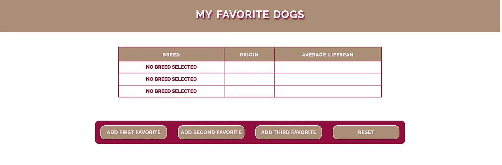

**Fig. 1 Opening Screen of MY FAVORITE DOGS Demo**

这个演示的目的是使用函数对象公开的 **call()** 方法从对象中提取属性，并动态地将它们分配给**文档对象模型(DOM)** 中的文本节点。

> 我坚信，最好的老师之一是通过与他人分享知识来测试你的技能。

在图 1 中，您可以看到成品的开始屏幕，其中显示了一个表格，其中有 3 个最喜欢的狗品种、它们的原产国家以及它们的平均寿命。

加载页面时，因为没有选择最喜欢的狗，所以**品种**栏的 3 项包含默认文本**没有选择品种**。

桌子下面是一个有 4 个按钮的按钮栏，前 3 个按钮允许用户添加第一、第二和第三喜欢的狗品种。

为了这个迷你演示的目的，我们不会寻求用户输入最喜欢的品种。这 3 个按钮通过将 3 个狗品种对象的属性分配给每个品种的表格单元格文本节点，来动态填充每个品种的 3 列。

第四个按钮将屏幕重置为原始状态。

# 本教程假设

本教程假设读者对 HTML 有基本的了解，并且牢固掌握 JavaScript 语言的基础知识，包括一些面向对象编程(OOP)的知识。了解一些级联样式表(CSS)的知识是可取的，但不是真正必要的，因为本教程的主要焦点是 JavaScript。

# call()方法是做什么的？

是啊，问题就在这里。为了从强大的 **call()** 方法中获益，你必须清楚地了解它的作用。

让我们从网上用于 JavaScript 研究的*资源*—[Mozilla Developer Network](https://developer.mozilla.org)(MDN)开始:

> `**call()**`方法使用给定的`**this**`值和提供的任何参数调用函数，以指定`***this***` 引用哪个值。

**这一切都很好，但这意味着什么？**JavaScript 中的`**this**` 关键字已经成为包括我自己在内的许多初涉开发人员的噩梦。它容易被误解，尤其是在早期的 JavaScript 标准中，可能会表现得非常奇怪。

**这个**，理论上应该是引用调用函数，但是因为**这个**的值不能在函数调用的时候设置，所以 JavaScript 会默认为全局上下文的值，也就是**窗口**。将返回该值，如本例所示，来自关于此的 [MDN 文章:](https://developer.mozilla.org/en-US/docs/Web/JavaScript/Reference/Operators/this)

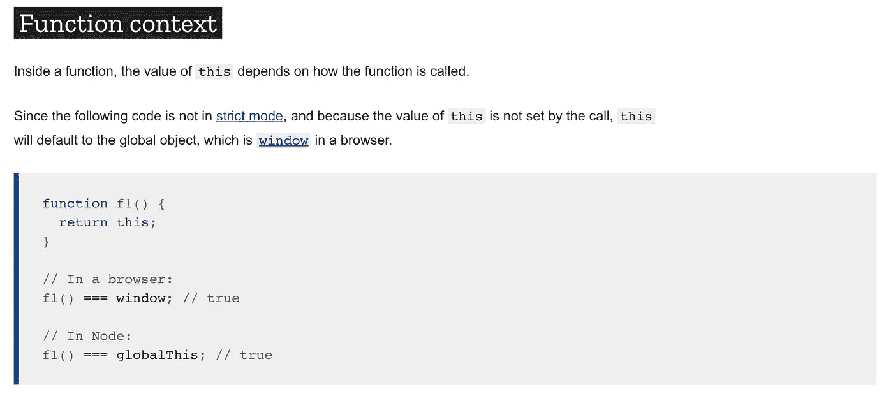

**Fig. 2 Excerpt from Mozilla Developer Network article on this keyword**

如图 2 所示，**这个**指的是全局对象，也就是**窗口**。由于**窗口**还没有指向我们需要的上下文，即文档对象模块中的**文档**(下一级)，所以除了**未定义**之外，函数 f1()没有值返回。

从作为我们迷你项目一部分的 JavaScript 代码中，**使用 **call()** 方法指定了这个**，并且引用了一个指定的对象。

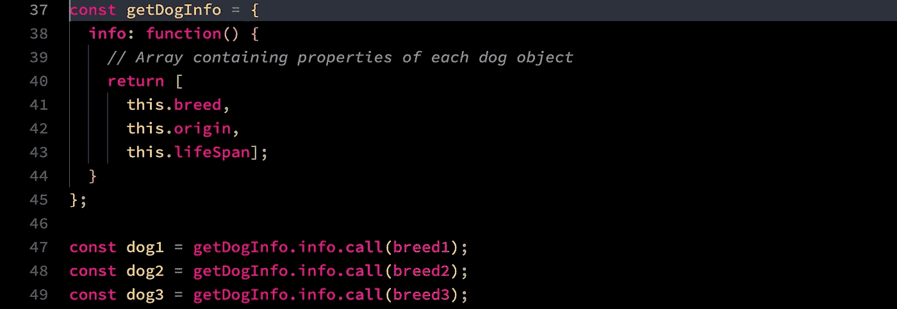

**Fig. 3 Code Listing from Mini-Project**

图 3 显示了一个名为 **getDogInfo** 的对象文字。在该对象中有一个名为 **info()** 的函数，它返回三个对象中存在的三个属性的数组，这三个对象分别被命名为 **breed1、breed2** 和 **breed3** 。

在随后的 3 条语句中，与此关联的值是通过指定此在链接到 **info** 的 **call()** 方法中引用的对象来确定的，这些方法又引用回由 **getDogInfo** 对象公开的 **info()** 方法。

你开始头晕了吗？别担心。我的也有过一段时间。让我们一步一步来。

# 现在让我们来建造它吧！

从下载[启动码](https://github.com/RHieger/my-favorite-dogs/releases/tag/v1.00)开始。

然后你就可以按照这些步骤来完成这个项目。因为这里的重点是 JavaScript，而不是 CSS 样式或 HTML，所以起始代码将提供构建教程迷你项目的基本结构。

# 第一步。下载启动代码

一旦您下载了启动代码，您将会发现一个 zip 存档，如下图**图 4** 所示。

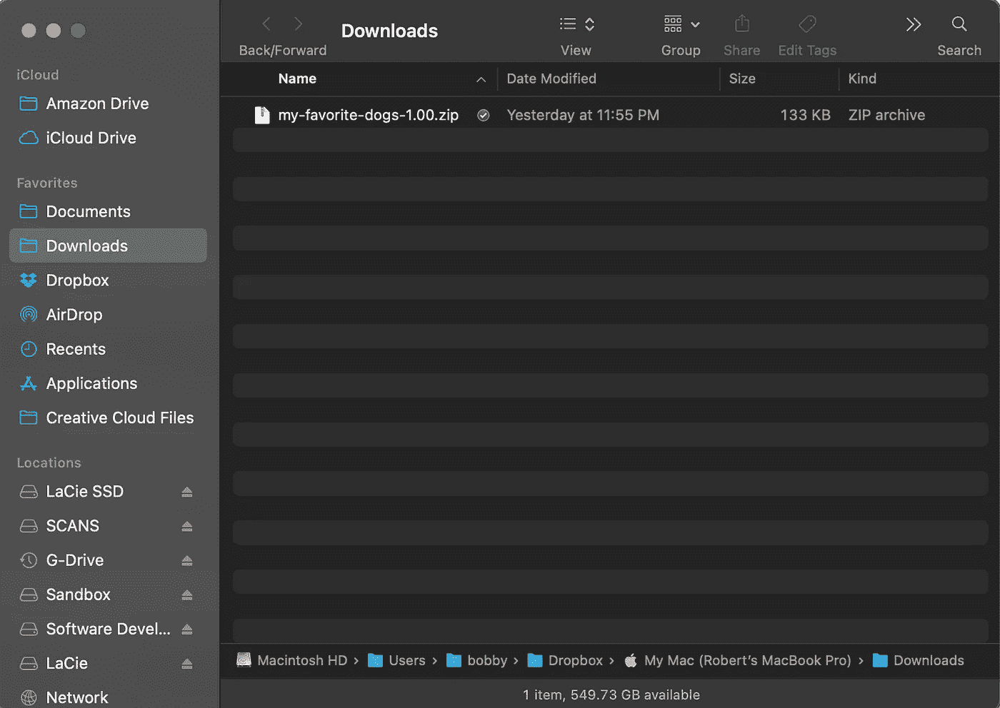

**Fig. 4 Downloading the Starter Code**

上面的截图显示了 Mac 上的**下载**文件夹中的 zip 存档。如果您运行的是 Windows 或其他操作系统，下载的位置可能会有所不同。

只需将 zip 存档文件移动到您希望的位置，然后将其解压缩。

或者，如果您愿意，您可以克隆 [git 库](https://github.com/RHieger/my-favorite-dogs.git)，并从使用 **starter-code** 文件夹中的 starter 代码开始。

我强烈建议你在完成本教程的步骤之前，不要去看已完成的项目文件夹。这样，当你把项目拼凑在一起时，你可以获得最好的洞察力。也就是说，如果你发现自己被卡住了，你当然可以对照库中的代码来检查你的代码。

一旦你解压如图**图 4** 所示的启动代码档案，你会发现项目文件结构如下图**图 5** 所示。

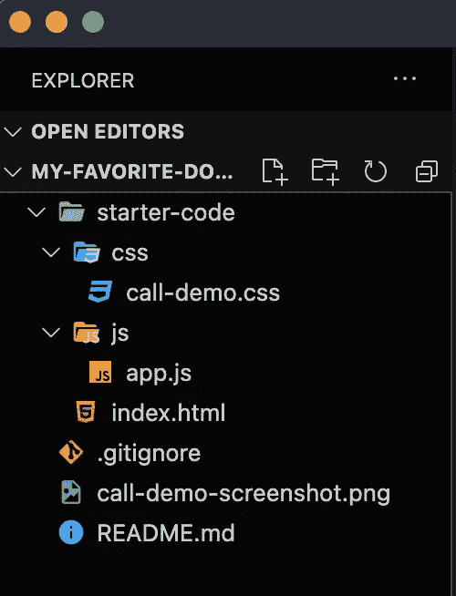

**Fig. 5 File Structure as displayed in Microsoft Visual Studio Code**

## **启动器代码简介**

起始代码包括一个
**css** 文件夹，其中有一个 css 文件—
**call-demo . CSS**—一个为
迷你项目提供样式的文件。

在 **js** 文件夹中是一个 starter**app . js**JavaScript 文件，它将最终包含教程的所有逻辑。

现在我们所有的起始文件都已经准备好了，我们可以开始项目了。

# **第二步。声明对象以引用所需的 HTML 元素**

为了动态地向 HTML 页面添加内容，您必须识别并捕获希望在 JavaScript DOM 对象中更改或增加的元素。

**下面的图 6** 显示了相关的 HTML，它是您的起始代码的一部分。

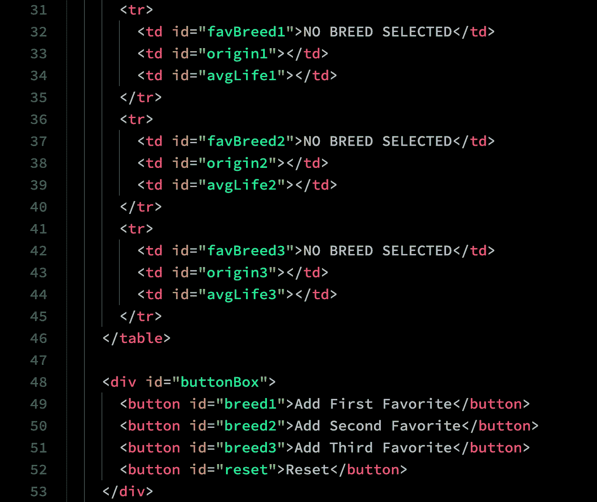

**Fig. 6 HTML code listing lines 31–53**

在图 6 中，显示了 index.html 文件的第 31–53 行。这些是需要在 DOM 中引用的元素。为此，我们必须创建指向**元素**(或**节点**，因为它们在 DOM 中是已知的)的 JavaScript 对象。

注意，上面的每个 **< td >** 和 **<按钮>** 元素都有一个 **id** 属性。虽然使用 JavaScript 访问 DOM 中的这些节点有很多方法，但我们将使用最简单和最基本的方法来实现这一点，即 **getElementById()** 方法。

**下面的图 7** 显示了我们的 starter **app.js** 文件，这将是我们迷你项目的大脑中心。

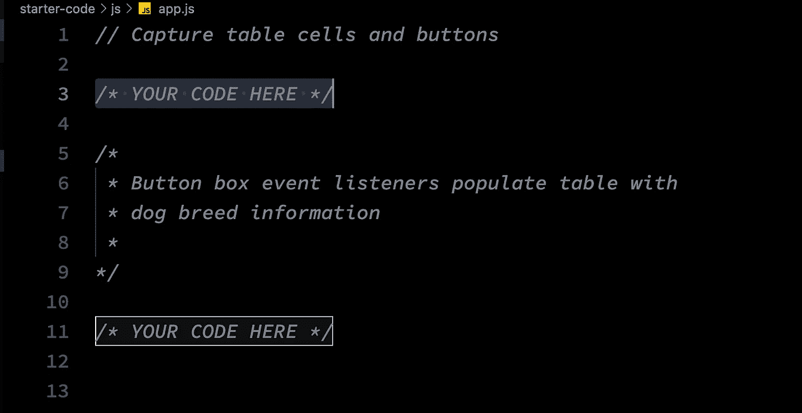

**Fig. 7 Starter code for app.js**

为了提供对 DOM 节点的访问，每个品种列和按钮栏中的按钮都必须存储在 DOM 对象中。为此，将图 7 中**启动代码的**行 3** 替换为图 8** 中的以下代码片段。

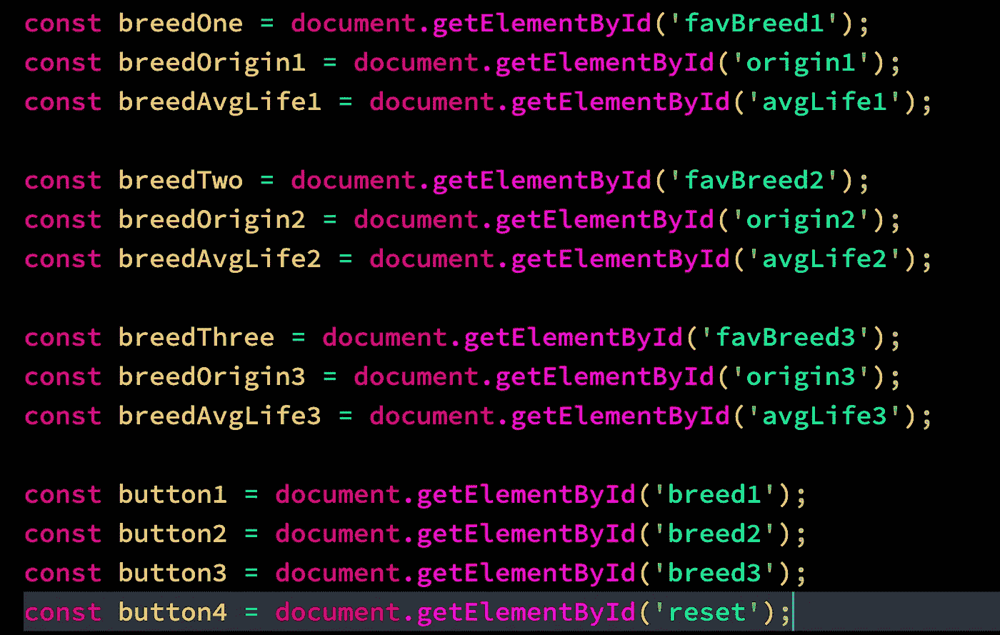

**Fig. 8 Code Listing #1—Creating the DOM Objects**

现在我们已经创建了必要的 DOM 对象，我们可以通过 JavaScript 直接引用和操作它们。为了证明我们可以访问上面 DOM 常量捕获的任何节点，您可以使用浏览器的 JavaScript 控制台来查看 DOM 对象返回的内容，如下面的图 9 所示。

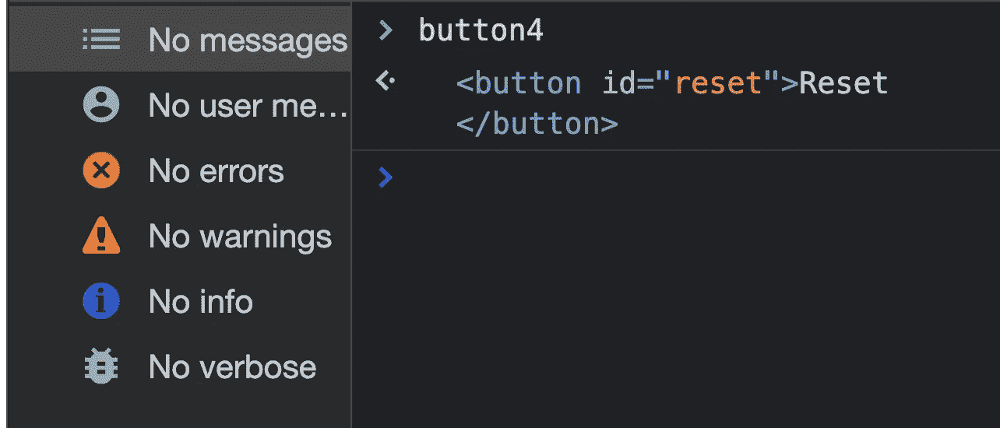

**Fig. 9 JavaScript console showing the output of button4**

# 第三步。创建 3 个狗对象

我们旅程的下一段将带我们进入问题的核心。我们现在已经创建了引用三个表行的对象，这三个表行将包含关于我们最喜欢的狗的信息。但是我们如何将这些信息转换成 JavaScript 可以用来填充行的表单呢？

有几种方法可以做到这一点。出于本教程的目的，我们使用如下图**图 10** 所示的对象字面语法声明 3 个 dog 对象。

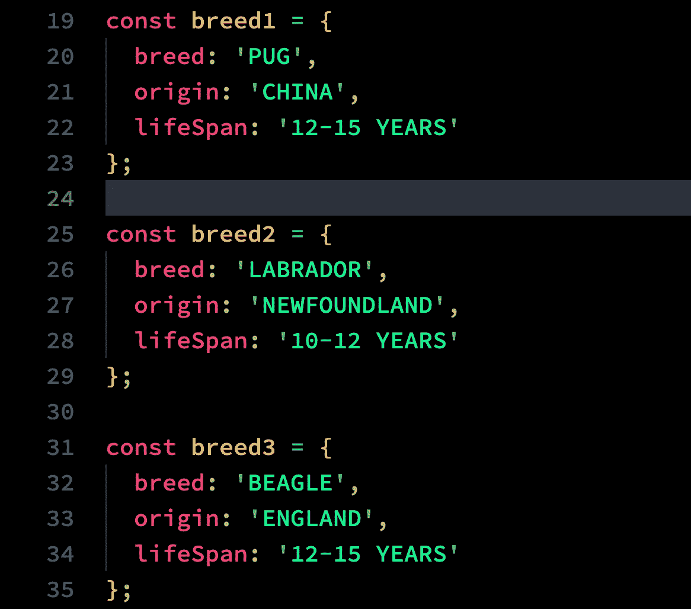

**Fig. 10 Code Listing #2—Declaring the dog objects**

在图 10 中，第 19–35 行显示了定义了属性 **breed、origin** 和**寿命**的 **breed1、breed2** 和 **breed3** 对象。你可能会问为什么我没有声明一个 **Dog** 类，然后从中实例化 3 个 **Dog** 对象。

虽然使用类是一种高效而优雅的对象编码方式，但是如上所示的单个对象文字的定义将演示 **call()** 方法的作用。事实上，使用类可以避免使用 **call()** 方法，因为属性和方法都封装在一个对象中。

在另一篇教程中，我将展示同样的小型项目，它被重构为使用类声明和对象实例化。

现在你应该把上面的代码添加到你的 **app.js** starter 文件的末尾。

我们现在有了所需的原材料。*但是我们如何从上面的* ***breed*** *对象中提取属性，并将它们一个接一个地注入到上面定义的表格单元格中呢？*

为此，我们需要一个函数来获取这些信息，并将其转换成我们可以用来注入所需内容的形式。

# 第四步。编码 getDogInfo()对象

现在我们实现了 **getDogInfo()** 对象，它唯一的属性是一个名为 **info 的方法。**这个方法从上面定义的**品种**对象中提取属性，并从这些属性中返回一个带有所需值的数组，如下图**图 11** 所示。

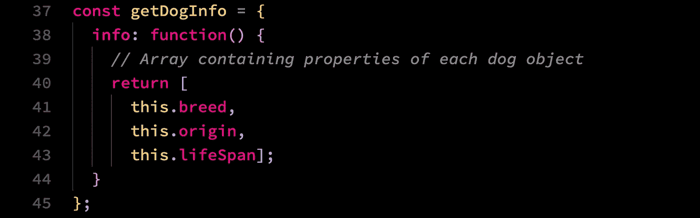

**Fig. 11 Code Listing #3—the getDogInfo() Function**

在上面代码清单的第 37 行，我们声明了 **getDogInfo()** 对象。方法返回第 40–44 行的数组。

现在，您应该将上面的代码添加到您的 **app.js** starter 文件的末尾。

为了利用返回的数组，我们需要将 **getDogInfo()** 的返回值存储在一个变量中。这是我们接下来要做的。

# 第五步。使用 **call()方法指定我们希望其属性作为数组**返回的对象

虽然 **getDogInfo()** 对象和它的 **info()** 方法提供了提取我们需要的对象属性的逻辑，以便在网页上插入内容，但就其本身而言， **getDogInfo()** 不具有指定我们希望从哪个对象返回属性值的功能。

进入 **call()** 方法，这是所有函数对象公开的原型方法。此时所需的变量声明中采用的基本语法将采用以下形式:

**const obj = getdoginfo . info . call(' desire object ')；**

让我们把这句话拆开来，弄清楚它在做什么。在左侧，我们声明了一个名为 **obj** 的常量，并将从 **getDogInfo()** 对象返回的值存储到该常量中。使用[对象点标记法](https://developer.mozilla.org/en-US/docs/Web/JavaScript/Reference/Operators/Property_accessors#dot_notation)，我们在 **getDogInfo()** 上链接 **info()** 方法，之后是内置的 **call()** 方法，该方法采用您希望引用的对象名称的单个参数 **this** 。

**下面的图 12** 显示了返回期望的值数组所需的结果代码。

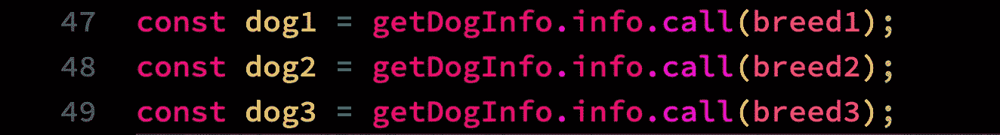

**Fig. 12 Code Listing #4—Using the call() method**

现在，您应该将图 12 中的代码添加到您的 **app.js** starter 文件的末尾。

现在几乎一切都准备就绪，但仍有一些关键的缺失部分。第一个函数将由出现在本文开头的图 1**中的**复位**按钮调用。它的目的是在点击左侧的其他三个按钮后，将犬种表恢复到原来的状态。**

为此，我们将构建一个名为 **resetTable()** 的函数。

# 第六步。实现可重置的()函数

**下面的图 13** 展示了 **resetTable()** 函数的实现，它执行了大量的后台工作来将我们的表重置到它的开始状态。

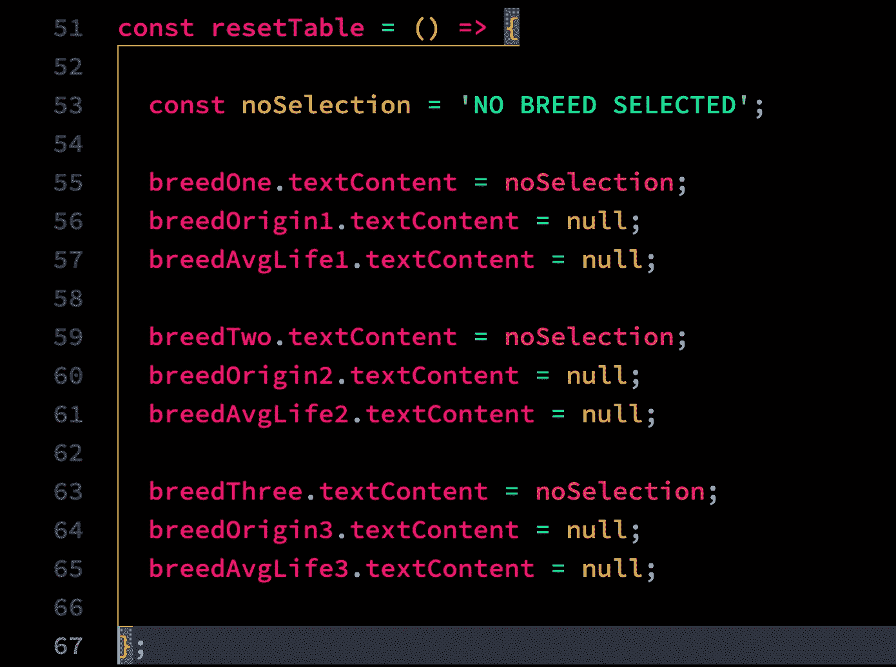

**Fig. 13 Code Listing #5—the resetTable() function**

**resetTable()** 被实现为一个 arrow 函数，但是它也可以使用早于 **ECMAScript 6** 的**函数 myFunction() { }** 语法。两者都可以。我碰巧更喜欢 arrow 函数的优雅语法。

这里发生了很多事情，但是让我们简单地把它分开。您会记得，在图 1 的**中，**表格最左边的一列每行都填充了内容**未选择品种。**

当点击**添加第一喜欢的、添加第二喜欢的**和**添加第三喜欢的**按钮时，这些条目将被替换为狗的品种名称。与其为每个表行单独指定这个值，不如用这个值声明一个常量，因此常量 **noSelection** 出现在上面清单的第 53 行。

作为上面清单中所有 DOM 对象引用的一个提示，你可以参考上面的**图 8** ，也可以参考你的**index.html**启动代码中的匹配代码。

在第 55–65 行，为每个表格行定义的每个 DOM 对象的 **textContent** 属性被设置为其原始值。在**品种**列的情况下，该列被设置为存储在 **noSelection** 常量中的值。剩下的两列简单地设置为 null，删除单击前三个按钮时注入的内容。

现在，您应该将上面图 13 中的代码添加到您的 **app.js** starter 文件的末尾。

当点击**添加第一个收藏夹**到**添加第三个收藏夹**按钮时，还需要一个关键功能来设置每个表格行的内容。这将由 **setRowContent()** 函数来完成，该函数将充当按钮的关联事件监听器的回调()函数，这将在**步骤 8 中变得明显。**

# 第七步。实现 setRowContent()函数

**下图 14** 显示了 **setRowContent()** 函数的实现。

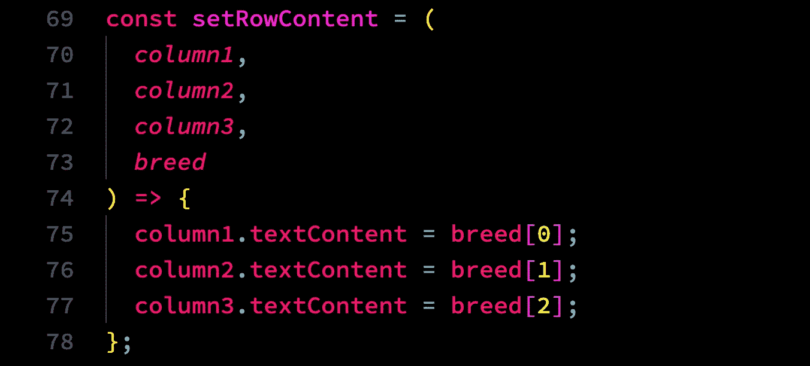

**Fig. 14 Code Listing #6—the setRowContent() function**

如您所见， **setRowContent()** 函数有四个参数，一个用于表格行中的三列，第四个用于指定我们将从中提取所需属性的对象。我们在运行时通过将所有四个参数传递给函数来设置这些参数，以便填充表中的每一行。

我们现在几乎完成了，但是仍然缺少一个关键的组件。如果你点击任何一个按钮，绝对不会发生任何事情。我们需要将按钮连接到我们目前定义的功能上。当然，这是通过事件侦听器来完成的。我们将为屏幕上每个按钮的点击定义一个事件监听器。

# 第八步。实现事件侦听器

现在我们到了在网页上启用动态内容的最后一步。

页面上有 4 个按钮，因此我们需要 4 个事件处理程序。我们正在监听的事件类型是当用户点击 4 个按钮中的任何一个时的**点击**事件。

**下图 15** 显示了实施情况。

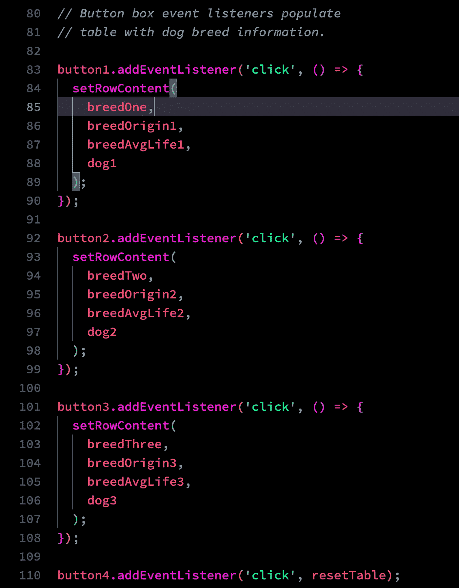

**Fig. 15 Code Listing #7—Implementing the event listeners**

在上面的第 83–110 行中，为本教程开头的**图 1** 中所示的四个按钮声明了一个事件监听器。在**按钮 1** 到**按钮 3、**的前三个事件监听器中，我们使用了一个 [**匿名函数**](https://medium.com/@tonyparkerkenz/callback-and-anonymous-functions-in-javascript-8849d57f5ce9) ，它又调用了在**步骤 7** 中实现的 **setRowContent()** 函数。

因为这些是 **click** 事件，所以当用户点击按钮时，附加到该按钮的动态内容将被注入到函数调用中指定的表格行和单元格中。

最后，在第 110 行 button4 的事件监听器中，我们使用了一个回调函数——即前面在**步骤 6 中定义的 **resetTable()** 函数。**

我们的迷你项目现在完成了。如果你想看这个项目的运作，你可以在 [**上找到它。**](https://codepen.io/RHieger/pen/jOyYVKP)

# 最后一句话

当然，最终产品有点缺乏艺术性，因为用户只能添加 JavaScript 代码中包含的三只狗的硬编码属性。在现实世界的例子中，您可能希望弹出一个模态对话框，要求用户输入最喜欢的狗品种的数据。

几乎可以肯定，您也不希望表中有预先确定的行数，而只是在用户输入选择时将行动态地添加到表中。我将构建这个更复杂的应用程序，并在不久的将来为它发布一个教程。

然而，本教程的目的是提供一个工作的、至少有点意义的例子，说明内置 JavaScript function 对象公开的 **call()** 函数是如何工作的。我对未来的文章或迷你项目的任何建议持开放态度。

我希望你觉得这个教程很有趣。

*更多内容请看*[*plain English . io*](http://plainenglish.io/)