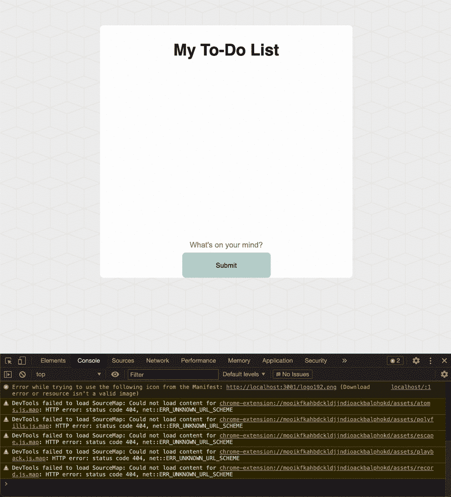

# 假人反应的完整快速入门

> 原文：<https://javascript.plainenglish.io/a-quickstart-to-reactjs-2021-3bf88eae7719?source=collection_archive---------0----------------------->

# 链接到外部资源的先决条件:

*   **HTML，CSS，& JavaScript**

**Bash Shell 命令:**

# React JS 到底是什么，为什么强大？


React JS 是一个 JavaScript 前端框架，允许 web 开发人员使用组件重用传统的 HTML 代码，以保持代码的整洁、动态和快速。这个框架是声明性的，允许您根据数据的变化自动更新组件。React JS 还可以帮助你创建一个更快的网站，因为它利用了单页面应用程序(SPA)的概念。要了解有关 SPA 的更多信息，您可以参考此处的文章:

[](https://dzone.com/articles/the-comparison-of-single-page-and-multi-page-appli) [## 单页面和多页面应用程序的比较

### 有数以百万计的网络应用程序帮助公司提供商品和服务，与客户联系…

dzone.com](https://dzone.com/articles/the-comparison-of-single-page-and-multi-page-appli) 

# 谁使用 ReactJS？


非常著名的企业的聚集利用了 React 的多功能性和强大功能；包括网飞、特斯拉和可汗学院在内的大型公司都使用了这一框架。在这篇文章中，我们将回顾 React 中的一些重要概念，并应用我们所学的知识来创建一个待办事项列表网站。

# 下载所有依赖项

我们需要安装的第一个依赖项是 *Node.js* ，它允许你的计算机在本地运行 JavaScript 代码。当你下载 *Node.js* 时，它包括一个方便的名为 *npm* 的包管理器，允许我们利用其他开发人员已经编写的代码，而不是我们自己从头开始编写一切。


要下载 Node.js，请到 https://nodejs.org/en/[下载 Node.js 的最新版本](https://nodejs.org/en/)


安装 Node.js 之后，打开您的终端并确保 Node.js 和 npm 都已安装。要检查这一点，只需键入:

```
node -vnpm -v
```

如果这两行代码运行并向您显示 npm 和 Node.js 的正确版本，那么您就万事俱备了！

# 设置项目

现在您已经安装了 npm，再次打开您的终端并键入:

```
npx create-react-app <application name>
```

这个命令用样板代码初始化并创建一个 React 应用程序。

```
npx create-react-app demo
```

在您的终端中运行上面的命令。按照命令，在您选择的 IDE 中打开新的 React 项目。


打开文件夹时，您会看到三个主要文件夹:

*   节点 _ 模块
*   公众的
*   科学研究委员会

node_modules 文件夹包含项目依赖的所有依赖项；“公共”文件夹只是存放一些你在网站中有时会用到的项目，比如图像或图标。src 文件夹是我们保存所有 JSX 组件的地方，稍后我会详细介绍。
公共文件夹中最重要的项目是 index.html 文件，这是我们渲染 JSX 组件的地方。最后，您将在页面底部看到一个 package.json 文件，它基本上保存了应用程序的重要信息，比如依赖项和脚本。在我们真正开始编码之前，请随意删除公共文件夹中除 index.html 和 manifest.json 之外的所有文件；您还可以删除 src 文件夹中除 App.css、App.js 和 index.js 之外的所有文件。


# 了解 ReactJS 项目的结构

如果你打开 index.html，你会发现除了页面底部的一个 id =“root”的 div 之外，没有什么别的了。这个看似无关紧要的事实对于 ReactJS 的正常工作是绝对必要的。Awe 将把我们需要的 JSX 组件插入到 div 中，以便在其他 JavaScript 文件中呈现。JSX 是一种静态类型语言，允许我们在 react JSX 中编写 HTML 代码。组件是返回 HTML 代码的函数。它们可以用来表示你的网站上经常被渲染的对象，让我们避免代码的重复。


Root div from index.html

在 index.js 中，您将看到 React 与 ReactDOM 一起被导入 index.js。ReactDOM (React 文档对象模型)是呈现您选择的各个 JSX 组件所必需的；这是在 ReactDOM.render 函数中完成的。该函数的第二个参数简单地指定了组件应该插入的位置，也就是“根”div。在这种情况下，呈现的 React 组件是 App。您需要删除导入 reportWebVitals 的行，因为我们之前已经删除了该文件。render 函数中的<react.strictmode>围绕着 App 组件，告诉 React 为应用程序添加额外的开发人员警告。</react.strictmode>

此外，在 index.js 中，您可以看到“App”正在从本地 App 文件导入，并在 ReactDOM.render()函数中呈现；如果我们转到 App.js 文件并查看其内容，我们可以看到函数 App 返回一个包含一些 HTML 的 div。App.js 本质上是创建一个可以导入并在其他文件中使用的组件。每个 JSX 组件中必须有一个函数，该函数返回一些 HTML 来描述该组件，并在以后导出，如 App.js 文件底部所示。按照惯例，这个函数的名称就是文件的名称。当我使用这个组件时，我所要做的就是导入 index.js 中看到的应用程序文件，并在我希望我的应用程序组件的 HTML 显示的位置键入<app>。当您在 App.js 上时，删除 App.js 的 return 语句中的 img 标记和 logo.svg 导入，因为我们删除了那个文件。</app>

这里需要注意的一点是，每个组件的函数只能返回一个 HTML“块”。

如果您不想通过将所有内容都包装在一个 div 中而向 DOM 添加额外的 div，可以使用 React 片段。

React Fragments

要在本地服务器上运行我们的应用程序并查看我们所有的更改，请打开您的终端并运行以下命令:

```
npm start
```

# 构建简单的待办事项列表应用程序(设置):


现在我们对 React 有了一个快速的介绍，我可以带您看一个使用 ReactJS 的例子，同时介绍 ReactJS 的一些更复杂的特性。

首先，我不会去查看项目的 CSS 来关注网站的 React 方面。请随意阅读/下载 CSS，并参考我的代码沙箱中的 React 代码:

> [*https://codesandbox.io/s/to-do-list-frq2q?file =/src/components/input . js*](https://codesandbox.io/s/to-do-list-frq2q?file=/src/components/Input.js)

其次，在项目的 src 文件夹中创建名为“Components”和“Css”的文件夹。将 src 中除 index.js 之外的所有文件拖到各自的文件夹中；这将使你的代码有条理。根据这一变化，您可能需要从每个 JavaScript 文件中调整导入语句。

最后，在我们开始之前，删除 App.js 的 return 方法中的所有 HTML 代码，除了 div。然后，将 div 的类名更改为“app ”,以便代码沙箱中的 CSS 正确显示。

# 构建一个简单的待办事项列表应用程序(笔记组件):

创建任何 ReactJS 应用程序的第一步是彻底考虑您的网站中需要哪些组件或项目。我发现画出我希望我的应用程序看起来像什么，然后在我的网站上画出我想要的每个特定项目周围的框很有帮助。在消息应用程序的情况下，您可能拥有的典型组件是消息。


Drawing of a website

对于待办事项应用程序，我认为笔记组件是必要的，这样我就不会写重复的代码；这将是既有复选框又有相应文本的 HTML。因此，在 Components 文件夹中创建一个名为“Note.js”的新 JavaScript 文件，并从 CSS 文件夹中导入 React 及其相应的 CSS 文件。顺便说一下，按照惯例，组件的名称应该大写。

因为每个注释都应该像一个 div 一样，既有复选标记又有一些文本，所以我让我的注释函数准确地返回这个值，但是我不需要自己编写一个完整的复选框，而是决定使用我们安装的软件包管理器 npm 来简单地下载和导入一个复选框。

要下载这个复选框，我们需要再次打开我们的终端并键入(“I”是 install 的缩写):

```
npm i @material-ui/core
```

安装带有预制 UI 组件的模块。要使用复选框，我们只需将这个导入添加到我们的 Note.js 文件中:

```
import { Checkbox } from '@material-ui/core';
```

在我们将@material-ui/core 安装到应用程序中之后，npm 将依赖项添加到我们的 package.json 中。


package.json

现在，我们可以在 Note 函数的内部输入<checkbox>了。然而，由于我们还需要一些文本，我将在 div 中添加一个</checkbox>

### 。

最后，我将把这一行代码添加到我的 Note.js 文件的底部，这样我就可以把我的 Note 组件导出给任何想要导入和使用它的人。

```
export default Note;
```

这将是我们笔记组件的基础。如果您想了解 Note 组件的样子，只需转到 App.js 文件并导入我们刚刚制作的 Note 组件，这样您就可以将其放入 App.js 的返回语句中。

所以，现在如果你看看你的反应应用程序，你会看到我们的应用程序看起来像这样。


现在我们已经有了笔记的基本结构，我们应该在可以键入新笔记的地方创建另一个组件。我将调用这个组件，Input。

# 构建一个简单的待办事项列表应用程序(输入组件):

正如我们之前所做的，我将创建一个名为 Input.js 的新的 JavaScript 文件，它将保存我需要的该组件的所有代码。我们还将导入 reaction 和 Input.css

希望这开始成为常规，但是现在我将创建一个名为 Input 的函数，它将返回我想要作为组件的 HTML 代码。最后，我会打字

```
export default Input;
```

在文件的底部，允许其他导入 Input 的文件访问其返回的 HTML。

因为我本质上想要一个 HTML 表单来处理我从用户那里得到的输入，我将把它添加到我的 input 函数的返回语句中，用一个名为“Input”的 div 包围起来，以便我的 CSS 作为目标。

在为我的 CSS 添加了几个 id 之后，我得到的输入文件如下所示:

Input.js


为了给这个应用添加一个“标题”，我可以在我的 App.js 文件中，在我的 Note 和 Input 组件之上添加一个

# 。这将留给我一个 App.js 文件，如下所示:

和一个看起来非常接近我们最终结果的整体应用程序:


# 事件侦听器

我们需要存储输入到输入标签中的值。为此，我们可以在输入中添加一个“onChange”事件侦听器，这样我们就可以始终跟踪输入标记中的值。此外，我们需要处理当我们按下提交按钮时会发生什么，所以我将为 HTML 表单添加一个“onSubmit”事件侦听器。我需要传入一个函数作为这些事件侦听器的值，这样当这些特定事件发生时，我就可以执行我想要的任何代码。以下是添加这两个更改的效果:

Input.js

每当我在输入标签中键入新内容时，就会调用 handleChange 函数，而每当用户按下提交按钮时，就会调用 handleSubmisson 函数。

事件处理程序周围的大括号允许 JSX 将其中的代码解释为 JavaScript。

# 反应道具

要回答在这两个函数中放入什么的问题，我们必须首先讨论反应道具、反应钩子和事件参数。了解这三个主题对于开发任何反应应用程序都是不可或缺的。

为了介绍 React Props，我将使用一些熟悉的代码。

这里，我只是用 HTML 创建了一个图像，它有一些属性，比如:src、alt、width 和 height。这基本上是 React 道具的基础；假设我想将自己的属性 msg 传递给我的 Note 组件。我该怎么做呢？我该如何获得传递给我的组件的属性呢？

要完成问题的第一部分，您需要键入属性的名称，并在自定义 ReactJS 组件的尖括号内将其设置为您选择的值。

针对后一个问题，我可以向名为 props 的 Note 函数传递一个参数，默认情况下，该函数将保存传入属性的键值对。

为了展示 React Props 的工作，我决定将我的 Note 组件的

### 中的文本设置为 msg 属性，该属性是在 App 中使用 Note 组件时传递给它的。


关于 React Props 要记住的最后一点是，您不需要总是将原始数据类型传入 React 组件；你可以把任何东西从一个对象传入一个函数。在介绍了 React 钩子和事件参数之后，我们将在 Input.js 中利用这个事实。

# 反应钩

那么什么是反应钩呢？从顶层来看，React 挂钩只是一个允许您“挂钩”React 的当前状态并更新它们的函数。ReactJS 中的状态本质上只是跟踪需要在组件之间传递的重要信息的变量。

通过使用 React 钩子来操纵状态，可以自动触发组件的重新呈现。在我们的待办事项列表应用程序中，如果您只有一个变量，其中保存了一组注释，并且每次有人按下提交按钮时都按下该变量，则不会触发重新呈现，并且网站将保持不变。

我们可以通过将该数组作为属性传入 Input.js 文件来解决这个问题，并基于该数组呈现 Note 组件。

要根据数组的内容呈现 notes 组件，需要调用 JavaScript map 函数将 notes 数组中的每个元素“映射”到一个 notes 组件上，然后返回它。

Turning each element inside my notes array into a Note Component.

现在，我将进入 Input.js 并更改 handleSubmission 处理程序，将“hi”推送到每次单击 submit 按钮时传递的数组。理想情况下，我希望这样做就能显示我所有的笔记，但不幸的是，情况并非如此，因为没有重新渲染被触发。此外，我向提交处理程序传递了一个参数 e，以防止应用程序在提交时自动刷新页面。这个我以后再讲。

我还添加了一个日志来确保我们正在进入提交处理程序。

在运行应用程序并尝试按 submit 时，您将看到以下内容:



为了确定这是重新渲染的问题，即使我用几个字符串初始化我的数组，开始时，我仍然会遇到同样的问题，看不到弹出的额外注释。


App.js

尽管这种方法不起作用，但我们至少知道我们将每个音符正确地映射到了它们各自的音符组件中。为了解决数组改变时不能重新渲染的问题，我们可以使用 React 钩子，这是我们之前讨论过的。

要使用 React 钩子，我们必须从 React 导入 useState 模块。在 import 语句之后，我们现在可以将旧的数组改变为状态数组，并在适当的位置挂上钩子供我们使用。这样，对数组的任何更改都会重新呈现组件。要创建 React 挂钩，请键入以下内容来代替数组:

```
const [notes, changeNotes] = useState([])
```

这一行代码告诉 React 您正在创建一个名为 notes 的状态数组，它最初被设置为一个空数组。useState 返回一个包含状态和钩子的数组。我们使用数组析构来分别给状态和钩子分配注释和修改注释。changeNotes 是一个“钩子”,它允许我们改变我们的 Notes 状态。因此，每当您想要对 notes 状态进行更改并重新呈现使用它的组件时，您必须调用这个 changeNotes 函数/hook。这是创建 react 挂钩的语法:

```
const [{name of state}, {name of function to change state}] = useState({initial value of state})
```

现在我已经创建了这个状态，我需要将 changeNotes 钩子从 App.js 传递到我的输入组件中，这样我就可以在需要的时候调用它并更改“Notes”。

App.js

我将需要调用从 App.js 传入的 changeNotes 属性，而不是在 Input 组件中推入我的 notes 状态。

Input.js

正如您所看到的，现在我将我的 notes 状态设置为一个新的数组，其中包含 notes 中的前一个元素，并在末尾附加了一个新的 notes，在本例中是“hi”。“…props.notes”告诉我的 changeNotes 钩子，当我给 notes state 一个新值时，我应该包含以前的值。

现在，当我们运行代码时，当我们按下提交按钮时，我们将看到一个动态的注释列表！


但是，如果您按 submit 按钮的次数足够多，您可以在我的输入组件后面看到消息。我们稍后将解决这个问题。

# 事件参数

我已经在我的 handleSubmission 事件处理程序中使用了 event 参数，但是现在我将明确地谈论它的作用以及为什么我之前需要它。

event 参数只是一个包含所发生事件信息的对象。由于参数是一个对象，它有许多有用的属性供我们在事件处理程序中使用。在 handleSubmission 案例中，我用它来防止 HTML 表单的默认行为；HTML 表单在提交时会自动刷新整个页面。


Printing The Event Parameter

可以说，事件参数最有用的部分是它的“目标”值。当您试图通过键入“event.target”来访问事件的目标值时，您将可以访问该 HTML 元素并能够读取其所有属性。

# 构建一个简单的待办事项列表应用程序(将所有内容结合在一起):

现在我们已经知道了 props、hooks 和 event 参数，我们可以完成 Input.js 函数中的 handleChange 侦听器了。首先，我将返回到我的 App.js 文件，并为每个音符添加一个新的挂钩，如下所示:

```
const [note, changeNote] = useState("");
```

我将把音符状态和 changeNote 钩子传递到我的输入组件中。我需要这两个值来跟踪用户在我的输入组件中输入了什么。

我的 App.js 现在是这样的:

App.js

在我的 Input.js 文件中，我需要将输入标记的值设置为“props.note ”,这样我就可以跟踪和更新注释的状态。此外，通过将输入的值设置为“props.note ”,我可以很容易地从 handleSubmission 函数中清除输入标记中的所有文本。

接下来，我将调用 props.changeNote 并传入 e.target.value，这样我的注释现在就是 Input.js 中输入标记内的文本。

我需要在 Input.js 中做的最后一个更改是像以前一样用值…props.notes 调用 props.changeNotes，还有 props.note，它保存用户放入输入标记中的文本。之后，我将把我的注释设置为一个空字符串，这样我就可以清除任何先前输入的文本的输入标签。

Input.js

当我们再次运行我们的应用程序时，我们会看到添加注释工作得非常好。


除此之外，您可以让 Input.js 中的 handleSubmission 函数检查用户是否输入了空注释，方法是将该函数更改为:

handleSubmission()

这个版本的 handleSubmission 函数防止用户试图创建空笔记。

正如您在上面看到的，单击复选标记根本不会删除注释。要添加这个功能，我们只需向每个笔记传递一个 id 属性，这样我们就知道要删除哪个；我们将把每个笔记的 id 作为它在 notes 状态数组中的索引。要访问这个索引，我们只需在 App.js 的 map 函数中向 arrow 函数添加第二个参数。

此外，因为我的笔记状态数组在 App.js 中，所以我需要传入一个函数，该函数指示如何根据 id 移除特定的笔记。我使用 JavaScript filter 函数来获取 notes 数组，但没有我要删除的注释。现在，我可以使用 notes 钩子将 notes 状态设置为使用 filter 函数获得的数组。

App.js

在 Note.js 中，我可以简单地在我的复选框上设置一个 onClick 监听器，然后让事件处理程序调用我之前用 id 传递的 remove 函数。

Note.js

如果您愿意，也可以将 onClick 侦听器设置为一个名为“props.remove(props.id)”的匿名函数。然而，为了简单起见，我选择在上面明确定义一个函数。

因为我已经正确地定义了 onClick 处理程序，所以现在可以在单击复选框时删除注释。


# 构建一个简单的待办事项列表应用程序(收尾工作):

因为我们不希望消息出现在我们的输入组件下，所以我可以将另一个属性传递给我的 notes 组件，该组件只向我的 notes 数组中的最后一个元素添加填充；我将传入一个类名。为了找出我的 notes 数组中的最后一个元素，我可以检查一个注释的索引是否等于小于我的 notes 数组长度的那个值。我已经使用三元运算符为每个 Note 组件添加了正确的类属性。

Finished App.js

在 Note.js 中，我可以像以前一样将 Note 组件的 div 的 className 设置为“Note ”,同时设置传入的 class 属性。

Note.js

完成后，我们的待办事项列表应用程序就完成了！


# 代码

恭喜你走到这一步！您可以在这里访问我在本文中编写的代码:

如果你是一名寻求提高编程技能的高中生，欢迎在 2021 年 7 月 23 日至 25 日期间参加我们的黑客马拉松，锻炼你的新技能！

[](https://explorehacks.org/) [## 探索黑客

### Explore Hacks 是一个黑客马拉松，为高中生提供探索从构思到产品执行的过程的机会。

explorehacks.org](https://explorehacks.org/) 

# 后续步骤:

如果您有兴趣了解更多关于 React 的知识，请随意阅读我在下面提出的一些主题。感谢阅读！

[](https://redux.js.org/introduction/getting-started) [## Redux | Redux 入门

### Redux 是 JavaScript 应用程序的可预测状态容器。它帮助您编写行为一致的应用程序…

redux.js.org](https://redux.js.org/introduction/getting-started) [](https://reactjs.org/docs/hooks-effect.html) [## 使用效果钩-反应

### 钩子是 React 16.8 中的新增功能。它们允许您使用状态和其他 React 特性，而无需编写类。的…

reactjs.org](https://reactjs.org/docs/hooks-effect.html) [](https://blog.logrocket.com/guide-to-react-usereducer-hook/) [## React useReducer Hook - LogRocket 博客的最终指南

### useReducer 是 React 16.8 附带的附加挂钩之一。作为 useState 钩子的替代，它有助于…

blog.logrocket.com](https://blog.logrocket.com/guide-to-react-usereducer-hook/) [](https://kentcdodds.com/blog/usememo-and-usecallback) [## 何时使用备忘录和使用回调

### 性能优化总是有代价的，但并不总是有好处的。让我们谈谈成本和…

kentcdodds.com](https://kentcdodds.com/blog/usememo-and-usecallback) [](https://create-react-app.dev/docs/deployment/) [## 部署|创建 React 应用

### npm 运行构建创建一个包含应用程序生产版本的构建目录。设置您最喜欢的 HTTP 服务器，以便…

创建-反应-应用程序.开发](https://create-react-app.dev/docs/deployment/) 

# 作者:

[徐丁](https://medium.com/u/2c31921662ce?source=post_page-----3bf88eae7719--------------------------------)

*更多内容尽在*[plain English . io](http://plainenglish.io/)