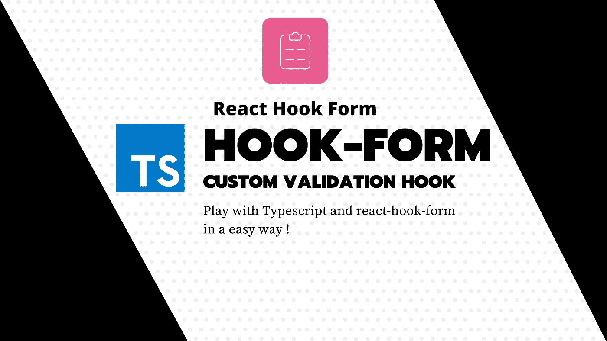

# 一个带有验证器的 react-hook-form 类型脚本就绪钩子

> 原文：<https://javascript.plainenglish.io/a-react-hook-form-typescript-ready-hook-with-yup-validator-3e5b9e0bd90e?source=collection_archive---------2----------------------->

## 代码片段

## 厌倦了每次导入 yup 并定义与验证模式匹配的接口吗？用这个特殊的钩子



React hook form 是 React 和 react native 构建表单的最具性能和灵活性的框架之一。尽管 yup 是验证数据结构的最简单和最好的库之一，但是通过将两者结合起来，你会得到一个很好的工作流程，我强烈建议你尝试一下。

在意识到我每次都在复制相同的代码后，我最终创建了这两个挂钩，以便在 react 应用程序中快速创建一个带有验证的表单。

我在想:

*   为什么我必须在表单的每个组件中导入`yup`？除了`yup`自动导入跟 TS 相当破。
*   如何才能少写代码，利用 TypeScript 类型推断？

然后，我编写了那些受益于 TypeScript 类型推断的代码片段，以提供自动完成和类型安全。

# 代码片段

# 用法示例

没有什么真正复杂的，所以只是复制上面的片段并尝试使用它，它有两种不同的格式，每一个都有自己的目的。

请注意，您不需要向“useform”参数传递解析器，因为如您所见，它将被代码片段覆盖。

这里真正的价值在于 Typescript 类型推断，它提供了很好的自动完成和类型安全性

## 使用已经存在的模式

```
import * as yup from "yup";const schema = yup.object({
  quantity: yup.number().min(props.minQuantityDynamic)
})const MyComponent: React.FC = () => {
  const { register } = useFormWithSchema(formSchema);// …
}
```

## 使用构建器

如果您还没有一个模式，并且不想到处导入，请使用 factory builder 函数。此外，这允许玩动态验证。

这样做的性能代价很小，因为每次都要重新渲染，所以每次都要构建一个新的模式。你可以考虑另一种方法。

```
const { register } = useFormWithSchemaBuilder((yup) => yup.object({
  quantity: yup.number().min(props.minQuantityDynamic)
}));
```