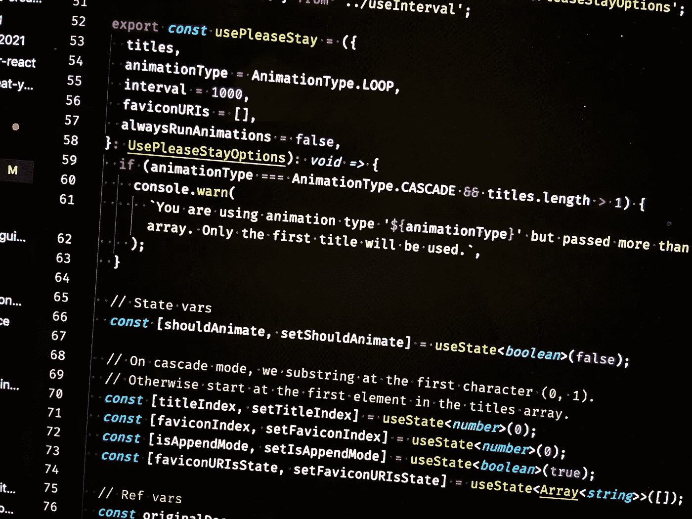
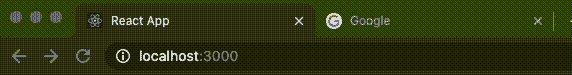

# 一个 React 钩子来激活页面(文档)标题和图标

> 原文：<https://javascript.plainenglish.io/a-react-hook-to-animate-the-page-document-title-and-favicon-6739ee912eb?source=collection_archive---------8----------------------->

## 介绍 react-use-please-stay:一个**用这个强大的钩子轻松地创建 react 项目中的文档标题和图标！**

usePleaseStay.ts in an editor.

react-use-please stay at work!

# TL；灾难恢复—演示、npm 包和代码

[互动演示在这里。](https://princefishthrower.github.io/react-use-please-stay/)

[NPM 包在这里。](https://www.npmjs.com/package/react-use-please-stay)

[GitHub 回购来了。](https://github.com/princefishthrower/react-use-please-stay)

尽情享受吧！

# react-use-please-stay 背后的背景

虽然我肯定这是我以前见过的东西，但我最近在访问荷兰版的 Mikkeller 网店时偶然发现了一个动画标题和不断变化的 favicon。favicon 变成了一脸悲伤的 Henry ( [Henry 和 Sally 是著名的 Mikkeller 吉祥物](https://www.google.com/search?q=henry+and+sally&sxsrf=ALeKk00N9zVdsht4oto1yj8qxXC7R5x-KQ:1619419497927&source=lnms&tbm=isch&sa=X&ved=2ahUKEwjmyqnfp5vwAhVFCewKHbnJDLQQ_AUoAXoECAEQAw&cshid=1619419527383437&biw=1920&bih=969))，标签标题在:

亨利很难过。

和

记住你的啤酒。

不知道奇怪的语法是不是故意的，但整件事让我大笑。在下载了源代码并做了一些调查之后，(也就是通过搜索`**document.title**`)，我所能找到的是一个名为`**pleasestay.js**`的文件，它包含了可见性变化事件监听器，但是它是模块化的，长度超过 11000 行！它肯定不是可用的形式，在谷歌搜索后，我只能找到这个 GitHub gist 的 jQuery 实现。

# 包的创建

我不得不承认 Mikkeler 商店的小动画*确实让*把我拉回了网站。至少，这是一种你在很多网站上看不到的美妙触感。我认为它会成为一个很棒的 React 钩子——特别是如果我可以让它配置多个选项和标题的话。所以我构建了 [react-use-please-stay](https://www.npmjs.com/package/react-use-please-stay) 包来实现这个目的！

正如我经常做的那样，我使用我的博客 [chrisfrew.in](https://chrisfrew.in) 作为这个钩子的测试平台。当我的博客打开时，如果你打开浏览器中的其他标签，你会看到我的博客的图标和标题开始显示。

# 撰写本文时的源代码

同样，这个包是[完全开源的](https://github.com/princefishthrower/react-use-please-stay)，在这里你可以找到最新的代码，但是如果你想马上了解钩子是如何工作的，这里有:

# 谢谢！

这是一个有趣的小钩子，花了几个多小时才解决了所有的问题。到目前为止，它在我的网站上是稳定的，我愿意接受请求、评论和进一步的功能！

干杯！

*—克里斯*

*更多内容请看*[*plain English . io*](http://plainenglish.io/)