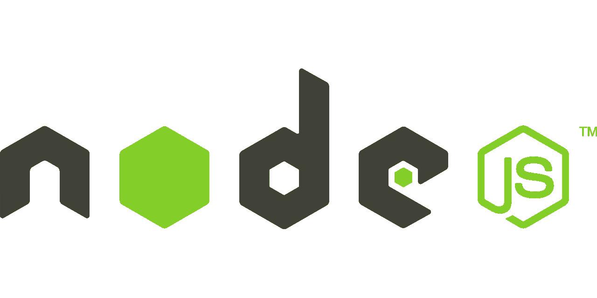

# JavaScript 及其发展简史

> 原文：<https://javascript.plainenglish.io/a-short-history-of-javascript-and-its-evolution-6f254cc016ee?source=collection_archive---------8----------------------->

Photo by [Ferenc Almasi](https://unsplash.com/@flowforfrank?utm_source=medium&utm_medium=referral) on [Unsplash](https://unsplash.com?utm_source=medium&utm_medium=referral)

## JavaScript 如何演变成今天的样子。

今天，JavaScript 到处都在使用。从前端网站到网络服务器再到游戏，一切都使用 JavaScript 来运行它们的逻辑。但并不是每个人都知道它是如何开始的，以及从开始到现在发生了多大的变化。或者某些工具和库如何改变了它的发展轨迹。

By Netscape Corporation — Public Domain on [Wikimedia](https://commons.wikimedia.org/wiki/File:Netscape_logo.svg)

## LiveScript 的开始

现在是 1995 年。后来创建了 Mozilla 公司的 Brendan Eich 正与 Netscape 和 Sun Microsystems 合作，创建一种全新的脚本语言，以使 web 动态化，补充 Java“小程序”,并增加网站的功能。他们在 Netscape Navigator 2 中发布这种语言时将它命名为 LiveScript，三个月后它被重命名为 JavaScript。

JavaScript 的发布还包括 Netscape LiveWire 的实现，Netscape 的 web 服务器，它允许 JavaScript 和 Java 在服务器上运行以呈现网页。这是服务器端 JavaScript 的第一个版本，比 Node.js 早了 13 年。

By Microsoft — Public Domain on [Wikimedia](https://commons.wikimedia.org/wiki/File:Internet_Explorer_9_icon.svg)

## Internet Explorer 和 JScript

也是在 1995 年，微软首次推出了 Internet Explorer，在版本 3 中，推出了一种叫做 JScript 的语言。JScript 基于 LiveScript，但有许多基本的区别。这在两种语言之间造成了很大的分歧，导致网站主要只支持一种浏览器或另一种浏览器，显示诸如“在 Internet Explorer 中最佳浏览”之类的内容，或者使用大型代码库来创建在 Internet Explorer 和 Netscape 中使用的标准化 API。

## ECMAScript:标准化的尝试

1996 年，为了使 JavaScript 标准化，Netscape 和 Sun Microsystems 向 Ecma International 提议将 JavaScript 作为 web 的标准化语言。1997 年，Ecma 发布了 ECMAScript 1.0，也就是现在通常所说的 JavaScript。

## Internet Explorer 增长

当 Ecma 试图标准化 web 脚本时，Internet Explorer 继续使用 JScript，并且它的使用份额上升，在 1998 年末超过了 Netscape。在此之前，许多网站会试图在两者之间建立兼容性，但那时，大多数网站只关注 Internet Explorer 和 JScript，而忽略了 ECMAScript 规范。

By OpenJS Foundation — [Open Source](https://brand.jquery.org/logos/)

## JQuery 成为网站的标准

由于浏览器对 JavaScript 支持的分歧和限制，许多开发人员最终依赖代码库来弥补不同浏览器之间的差距。JQuery 是这些库中最大的一个。

时至今日，包括谷歌在内的前 1000 万网站中，有一半以上都在使用 jQuery。jQuery 所做的是创建跨浏览器兼容性，同时使事情比任何浏览器的默认 API 都更容易，比如能够使用 CSS 选择器来查找元素，而不是局限于默认的东西。

现在，使用 jQuery 是不被认可的，但最初，由于其广泛的浏览器支持和易用性，它非常受欢迎。

By [Statcounter](https://gs.statcounter.com/browser-market-share/desktop-mobile/worldwide/#monthly-200901-201307) — [Creative Commons Attribution-Share Alike 3.0 Unported License](http://creativecommons.org/licenses/by-sa/3.0/)

## 浏览器复兴

虽然 ie 浏览器统治了浏览器市场一段时间，但没有什么是永恒的。Firefox 和 Safari 于 2000 年初问世，Chrome 紧随其后。他们带来了一种新的做事方式，实现了 ECMAScript 规范并试图将其标准化。虽然这需要一段时间，但它们最终成长为比 Internet Explorer 更大，Chrome 在 2012 年超过了它，甚至 Internet Explorer 最终也采用了 ECMAScript 规范。

这导致了一个相对统一的时代，浏览器能够支持大多数用户，而不需要使用大量的填充来填补空白。此外，ECMAScript 不断发展，发布了具有更多特性的新版本，并且它的实现变得更快，使用 JIT 编译代替了解释。

By [CopyrightFreePictures](https://pixabay.com/users/copyrightfreepictures-203/) — Public Domain

## Node.js 允许在服务器上使用 JavaScript

随着 JavaScript/ECMAScript 越来越流行，人们需要在浏览器之外使用 JavaScript 的新方法。这导致了 Node.js 的出现，这是 Chrome 的 JavaScript 引擎的一个版本，设计用于服务器。Node.js 允许开发人员使用 JavaScript 来制作 web 服务器、命令行工具等等。这导致了 JavaScript 进一步发展，并导致它现在在 web 服务器上非常流行。

## React 为 JavaScript 带来了新一代框架

以前，开发人员主要使用像 jQuery 这样的框架，或者只是普通的 JavaScript。React 改变了这一切。它的中心不是提高 JavaScript 操作能力或使它们一致，而是彻底改变它们。与 JavaScript 中使用的典型命令式编程不同，如果你想在网站上显示数据更新，你必须通过更改元素来设置文本，React 允许你在 JSX 中设置模板，就像 HTML 一样，并在你更改数据时动态更新数据。但是 React 并不是现有的唯一这样的框架。它导致了像 Vue 和 Preact 这样的新框架，允许开发者有更多的选择。

## ES6: JavaScript 改头换面了

虽然 JavaScript 仍在发展，但它有很多问题和奇怪的功能语法。ES6 试图在保持向后兼容性的同时解决这些问题。它于 2015 年发布，包括许多新事物，如新的运算符、创建变量的新方法和新的模块系统(ECMAScript 模块)。虽然大多数浏览器花了很多年才支持所有东西，但最终他们做到了。

# 结论

JavaScript 未来会怎样？我会关注 Web 汇编、ECMAScript 模块的进步和 Deno，但是谁知道呢？这篇文章没有太深入，关于 JavaScript 的历史，你还可以了解更多，但是我希望你喜欢阅读！

*更多内容尽在*[*plain English . io*](http://plainenglish.io/)