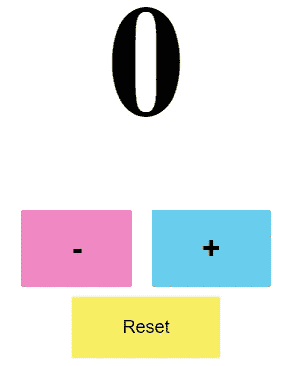
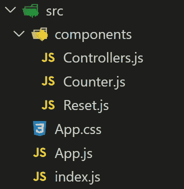
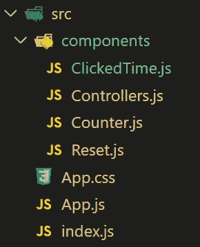
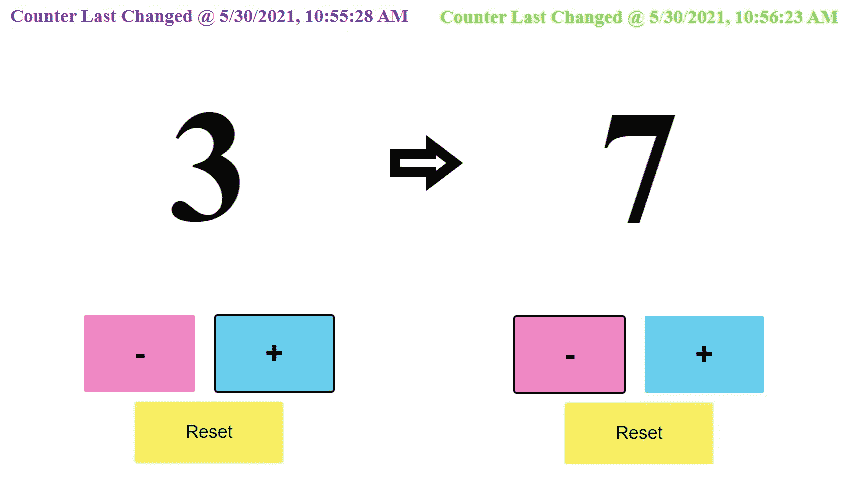
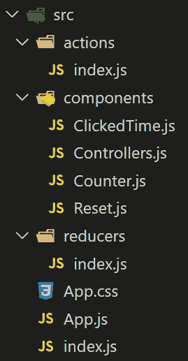

# 一个简单的计数器应用程序，学习 React 钩子和 React-Redux 钩子

> 原文：<https://javascript.plainenglish.io/a-simple-counter-app-to-learn-react-hooks-and-react-redux-hooks-4fc4f4fb4f40?source=collection_archive---------5----------------------->


React & Redux… and Hooks!

人们说 ***钩子*** 是反应过来的未来，我同意！它们简单、干净、轻便。在这篇博客中，我将简要介绍它们与以前创建 React 组件的方式有何不同。此外，我还将展示几个 React-Redux 挂钩，它们将帮助许多程序员有效地清理他们的代码。

我们将制作一个简单的反作用应用程序，所以请一起编码。首先，让我们使用下一行代码创建一个 React 应用程序:

```
npx create-react-app counter-with-hooks
```

而且，抓紧了，因为冒险可能会有点长！！！



Our Expectation~^^~

# 1.反应没有钩子，没有冗余



index.js, App.js & some basic components + one css file

我们要做的第一件事是用简单的经典 React 创建计数器应用程序，没有钩子和 Redux！为此，我们将准备一些具有上述文件夹结构的文件。我们的`App.js`文件将如下所示:

它调用`ReactDOM.render`方法，将`<App />`组件作为第一个参数，将`document.getElementById('root')`作为第二个参数。

1 constructor, 3 event handlers, and 1 render method

`App`组件用一个`css`文件导入 2 个子组件(`Counter.js` & `Reset.js`)。在其`constructor`中，有一个`count`的`state`，设置为初始值`0`。

`Counter.js`将负责显示计数并控制计数。于是，它将 1 个显示属性(`count`)和 2 个控制方法(`handleMinusBtnClick` & `handlePlusBtnClick`)作为道具传了下来。每种方法都会将 count 的状态值增加或减少 1。

`Reset.js`将计数器复位到 0。在 click 事件中，它将调用一个名为`handleResetBtnClick`的方法，使用`setState`方法将 count 的应用状态值更改为 0。

`Counter.js`文件显示计数器的当前值，并将控制功能委托给其子组件`Controllers.js`。在`h1`标签中，显示了`count`道具，双手道具方法将作为道具再次传递给子组件`Controllers`。

`Controllers.js`文件有两个按钮:一个用于减少计数器值，另一个用于增加计数器值。当一个特定的点击事件发生时，这两个传下来的正确方法将被调用。因此，这些正确的方法将改变`App.js`文件中的计数状态值。并且，该状态改变将导致计数器重新呈现为减小/增大的值。

`handleBtnClick`此文件的方法使用 ***计算属性名称*** 来为每种情况调用正确的方法。为此，每个按钮都有一个`name`属性。`e.target.name`将化为方法名并完成其预期功能。

`Reset.js`文件控制应用的复位功能。它从其父组件(`App.js`)采用`handleResetBtnClick`方法。点击，该方法会将`App.js`中的`count`状态更改回 0，如果不是。

仅供参考，所有`className`和`id`属性都已分配给简单的`css`化妆。你可以在我的报告中找到链接在本文末尾的`css`文件。

# 2.与钩子反应，无需 Redux



正如您可能注意到的，到目前为止，我们只使用了类组件。在第二阶段，我们将使用 React 钩子将所有这些类组件转换成功能组件。下面是将 3 个无状态类组件转换成功能性组件的一些变化:

变化并不是很困难。只需注意，在功能组件中，不需要使用`render`方法。`props`也是作为论据传下来的，所以我们做 ***不是*** 把它们当作`this.props`，而是当作`props`。最后一点，我们不再需要从 React 导入`Component`。

最后，我们在这里遇到我们的第一个反应钩: ***状态钩*** 。众所周知，功能组件没有构造函数，因此我们无法设置`state`，这对于我们跟踪数据来说是一个很大的问题。但是，通过使用`useState()`，现在我们可以在功能组件中跟踪我们的数据。

怎么用？首先，我们从 React 库中导入它，并将其返回值指定为 2 个变量。`useState()`方法返回一个包含 2 个元素的数组:初始值及其设置(=写入)方法。人们通常使用 ES6 析构语法来分配它们(见第 5 行)。值和方法的命名取决于您，这意味着您可以随意命名它们。但是，按照惯例，该方法的名称是`set***YourVriable***`。(这里，状态变量被命名为`count`，设置器被命名为`setCount`)。

如果你认可，有一个新的文件导入:`ClickedTime.js`。添加这个文件是为了展示 React 钩子的另一个例子: ***效果钩子*** 。

该组件的作用是显示最后点击的日期和时间，可以是计数器 ***组件第一次挂载*** 的初始时间，也可以是 ***组件通过点击更新*** 的时间。对于 React 类组件，这些功能分别由 React 生命周期方法执行，如`componentDidMount`和`componentDidUpdate`。不过，对于功能组件，这些可以通过使用名为`useEffect()`的钩子来完成。

正如我们所看到的，我们首先从 React 库中导入这个钩子，并把它作为一个方法放在功能组件中。然后，每当组件被(重新)渲染时，它将完成指定的工作。第 7 行和第 8 行以随机的十六进制格式设置组件的颜色。而且，每当计数器改变时，就会触发这种颜色变化。状态更改和组件重新呈现。多么好用，多么干净的代码，多么好看~



# 3.用钩子反应，用 Redux



现在是时候将我们的 React 应用程序链接到 Redux 了！首先，让我们为两个新包运行`npm install`，一个用于 Redux 本身，另一个用于 React-Redux 连接:

```
npm install redux react-redux --save
```

然后，要使用 Redux 全局存储，我们必须创建它，通常在`index.js`文件中:

因为 Redux 只有`state`的一个全局`store`，所以当组件或其父组件被`Provider`(一个 reactor-Redux 类)包装并赋予`store`道具时，通过`createStore()`方法新创建的`store`将可以从任何需要特定数据信息的组件中访问。在我们的案例中，`App`组件及其所有子组件都可以访问这个 Redux 全局`store`。

为了处理与`store`相关的事件(无论是`onClick`或`onSubmit`或任何其他事件)，该`store`与处理事件的`reducer`相连(在我们的例子中为`click` s)。在谈论这款减压器之前，我想先介绍一下更加干净的`App.js`，因为它不用再把任何`props`传给它的孩子了。每一个都能分别接近`store`。

现在让我们看看`App`的子组件是如何处理它们访问 Redux `store`的需求的。

这是使用 Redux `store`对`Counter.js`进行的修改部分。你能说出发生了什么变化吗？我们首先要认识到的是`import`正在使用一种叫做`connect`的反应还原法。**此法字面意思为*连接*** s a ***反应成分*** 至 ***Redux store*** 。

第 19 行，利用自定义方法返回的对象参数调用`connect`方法，访问`state`的全局`store`，并返回另一个新函数，以`Counter`组件作为参数。最终，这将返回`export`一个可以访问`store`的升级的`Counter`组件。

要使用全局`state`，这个功能组件`Counter`必须带`props`参数(名称可以自己选择，虽然`props`是约定)，它可以被`props.***propName***`使用(我们这里是`props.count`)。

最后，我们可以看到`Counter`有它的孩子`Controllers`，没有传递任何道具，因为`Controllers`组件现在有它自己的对`store`的访问。

`Controllers`组件有`store`的 2 个用例。当它监听来自按钮的增加/减少事件时，它需要帮助。以前，帮助是作为来自其父组件`Counter`的两个 prop 方法给出的，并且它自己的`handleBtnClick`方法相应地处理每个事件。

但是现在没有从父组件传递任何`props`。更确切地说，这些按钮是`connect` ed 到 Redux `dispatch`函数，该函数接受动作创建者(`decreaseCount` & `increaseCount`)到`handleBtnClick`的返回值。当一个`dispatch`方法以动作对象作为参数被调用时，它调用`reducer`文件，根据它的动作类型，存储`state`被更新，相关组件被重新呈现。

正如我们所看到的，这个 reducer 文件(`actions/index.js`)也处理来自`Reset`组件的`count`复位事件。

当点击按钮时，`Reset`组件也被`connect`固定到减速器上，与`RESET_COUNT`外壳配合。这一次，因为`resetCount` action creator 是使用 ES6 析构语法作为对象直接传入的，`dispatch`方法没有明显地出现，而是使用 Redux magic 在幕后工作(注意，使用`mapDispatchToProps`【如在`Controllers`组件中】和直接传递 action creator 的对象返回值【如在`Reset`组件中】工作方式完全相同)。

因为`ClickedTime`组件用`count`状态响应，所以它也需要用`store`响应`connect`。并且，`useEffect()`钩子的第二个参数作为一个数组给出，只在呈现的状态改变时触发这个方法*(换句话说，只有当商店的`count`状态更新时，点击时间的颜色才会发生变化)。*

# 4.用钩子反应，用 Redux & React-Redux 钩子

React-Redux 也有自己的钩子。在这最后的阶段，我想分享如何使用其中的一些。它们以更清晰的方式链接 React 和 Redux。这里主要是使用`connect`方法的组件将被重构。

这是`ClickedTime.js`文件的最终版本，使用了一个 ***React 钩子*** 和一个 ***React-Redux 钩子*** 。正如我们所看到的，没有其他的方法了。相反，我们正在使用一个名为`useSelector()`的 React-Redux 钩子。

第 7 行是如何使用这个钩子。在我们的回调函数(`state => state.count`)中，我们从`store`返回`count`状态，并将其赋给一个名为`count`的变量，然后将其作为普通变量使用。简单！并且，我们不使用`connect`创建和`export`新组件。我们只是`export`这个简单正常的`ClickedTime`组件。

组件的最终版本也使用了与 T2 组件相同的方法。

在`Controllers`组件的最终版本中，我们可以找到另一种 React-Redux 钩子:`useDispatch()`。我们首先从`react-redux`库中`import`这个方法。然后，方法的调用值被赋给一个变量(这里是`dispatch`，但是名字并不重要)。

当事件需要真正的`dispatch` ing(在我们的例子中是`onClick`)时，它成为回调箭头函数的返回值，通过 action creator result 的参数调用(即`dispatch(decreaseCount(count))` / `dispatch(increaseCount(count))`)。

`Reset`组件的最终版本也使用`useDispatch()`，其使用方式与`Controllers`组件相同。其他文件(`index.js`、`App.js`、动作创建者`index.js`、缩减者`index.js`等)保持不变。

React 很牛逼，Redux 也有很多粉丝。钩子的引入是为了帮助程序员享受更干净、更简单的代码。

在这篇文章中，我试图展示如何根据我们现有的反应知识来理解这些。我强烈建议你熟悉这些相对较新的技能，因为它们在很多方面都很有帮助。这个小项目的全部最终代码，请访问[我的回购](https://github.com/jinook929/counter-wit-hooks)。

开心编码~

*更多内容请看*[*plain English . io*](http://plainenglish.io/)