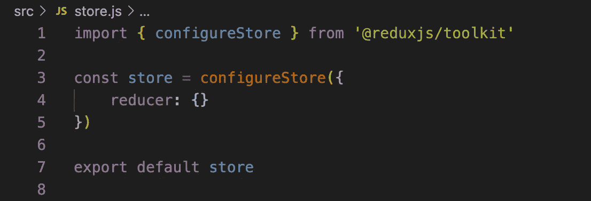
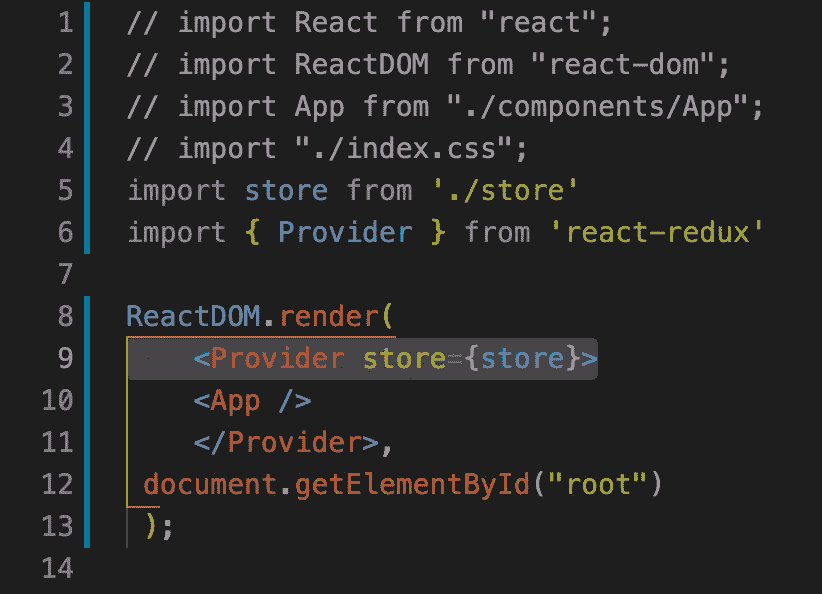
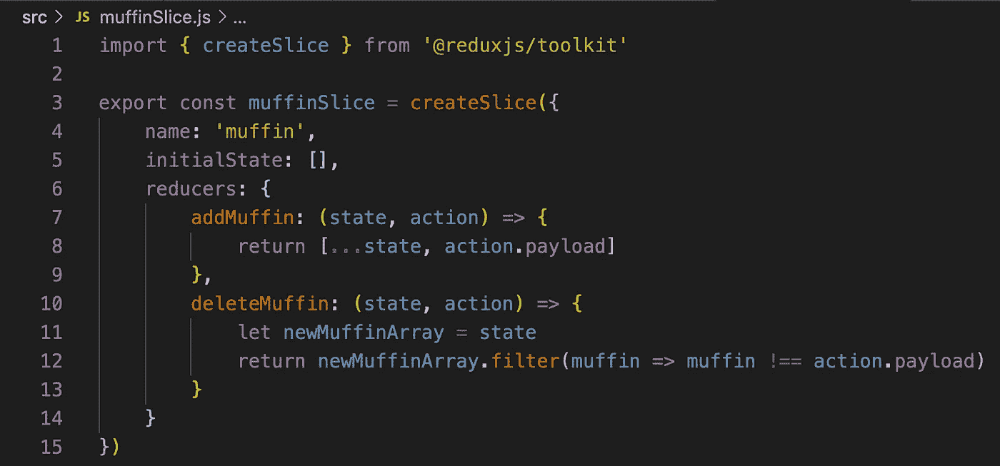
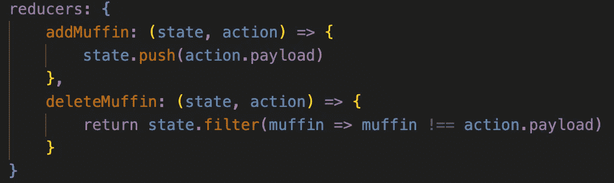
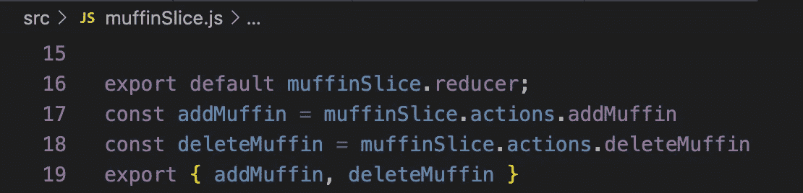
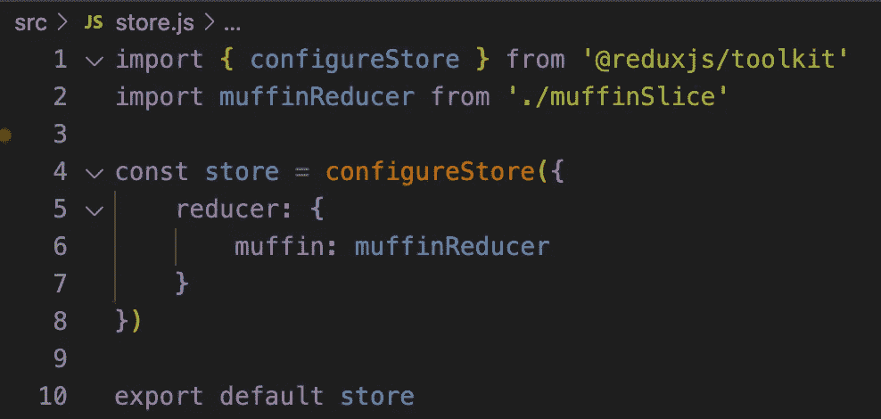
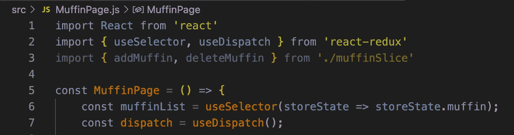
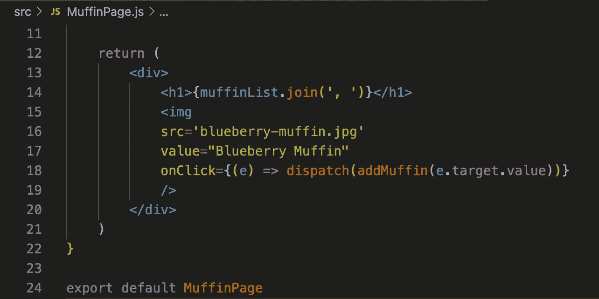

# Redux 工具包的简单指南

> 原文：<https://javascript.plainenglish.io/a-simple-guide-to-the-redux-toolkit-e360e28dcb5c?source=collection_archive---------3----------------------->

## 涵盖从 configureStore 到 createSlice 的所有内容的简单分步指南。


Redux Logo

# 介绍

Redux 是一个 JavaScript 库，它使用存储和 reducers 来管理应用程序的全局状态。因为前端框架“React”非常擅长管理状态，所以 Redux 和 React 是彼此的完美组合。

这就是为什么 Redux devs 创建了 [Redux Toolkit](https://redux-toolkit.js.org/) ，这是一个有用的 React 库，它使得设置和维护全局状态比以往任何时候都更容易。许多开发人员在使用像 Redux 这样的大型库时遇到的一个问题是，在开始一个新项目时，忘记了基本的设置。这个博客希望提供一个简单的分步指南。

# 开始—配置存储和提供者

创建 React 应用程序后，您想做的第一件事是运行:

```
npm install @reduxjs/toolkit react-redux
```

这将使您能够访问 React-Redux 和 Redux 工具包。接下来，您需要在源文件夹中创建一个“store.js”文件。我建议制作一个单独的“redux”文件夹来存放我的存储和所有的 redux，但这取决于你。



store.js file

现在你可以看到我们没有减速器，但是很快我们就会有了。首先，我们必须确保我们的应用程序可以访问商店，所以我们希望将我们的组件包装在<provider>组件中。</provider>



The non-Redux code is commented out for clarity!

现在我们已经将“store”作为一个道具传递了下去，我们的应用程序可以访问这个全局状态，我们可以设置我们的 reducers 来帮助我们更新这个状态。

# 创建切片

切片是 Redux Toolkit 的一个有用的更新，它允许我们将多个不同的商店作为整个商店的“切片”。我们可以把它们放在一起，用它们各自的减速器，做成一个全球商店，由许多切片组成。

假设我们正在为朋友的松饼店制作一个数字购物应用程序。我们的朋友希望我们跟踪用户点击的所有松饼，但也希望我们使用许多组件。幸运的是，Redux 可以帮助我们跟踪所有的松饼，无论用户正在查看哪个组件。

让我们从创建一个“muffin slice”reducer 开始，它将跟踪初始状态和我们希望可用的任何 reducer 函数。



createSlice basics

我们首先通过导入我们的“createSlice”API 来访问 create slice 函数。然后，我们给我们的切片一个名称(“muffin”)、一个初始状态(一个空数组)和一些归约器(“addMuffin”和“deleteMuffin”)。

通常，Redux 要求我们在处理我们的 reducers 时使用一种叫做‘纯函数’的东西。这只是意味着函数应该创建状态的副本并对其进行变异，而不是直接弄乱状态本身并可能遇到异步问题。

幸运的是,‘create slice’API 让我们可以访问 [Immer](https://immerjs.github.io/immer/) ，它可以将我们不纯的函数转换成纯函数。所以让我们重构一下:



Refactor with mutating state

(state，action)参数允许我们访问给定时间的状态，以及我们希望通过操作的“有效负载”传递给 reducers 的任何数据。最后，我们可以导出我们的减速器和切片，以便在整个应用程序中使用。



Muffin Exports

我们还应该记得用新的 reducer 更新我们的“store.js”文件！



Update the store.js file

# 使用选择器和使用 Dispatch

现在我们设置好了！剩下要做的就是使用 React-Redux 钩子来查看和发送动作到我们的商店。

让我们导入“useSelector”来查看我们的商店，“useDispatch”将允许我们发送我们的操作。我们还必须记住从“muffinSlice.js”文件中导入我们的 reducer 操作。



Importing useSelector and useDispatch

这里，我们使用“useSelector”来获取名为“muffin”的“store.js”文件中的状态。如果我们想做一个纸杯蛋糕或者一个派缩减器，我们可以将它们添加到我们的“store.js”中，并对它们调用“useSelector”。

我们还设置了一个名为“dispatch”的常量，它允许我们在回调函数中使用“addMuffin”和“deleteMuffin”操作。



Displaying the store and dispatching an action

在这里，您可以看到我们使用了“muffinList”常量来显示我们选择的所有松饼的列表，以显示给用户。我们还添加了一个“onClick”事件监听器，它调度我们导入的“addMuffin”操作，将美味的蓝莓松饼添加到我们的全局状态中。

# 结论

Redux 是一个非常有用的工具，只需要一点点设置就可以习惯。本指南是为那些想深入 Redux 而又不想陷入半扩展设置的人准备的。如果你只是跟着图片走，把我的“松饼”换成你需要在你的应用程序中跟踪的任何东西，你就成功了。

哦，为你的谷歌 Chrome 浏览器下载 [Redux 开发工具](https://chrome.google.com/webstore/detail/redux-devtools/lmhkpmbekcpmknklioeibfkpmmfibljd?hl=en),让查看你的商店更新更加容易。

*更多内容尽在*[plain English . io](http://plainenglish.io/)