# 为初学者设计的简单 HTML 页面

> 原文：<https://javascript.plainenglish.io/a-simple-html-page-for-beginners-bb22980134e3?source=collection_archive---------6----------------------->


Photo by [Florian Olivo](https://unsplash.com/@florianolv?utm_source=medium&utm_medium=referral) on [Unsplash](https://unsplash.com?utm_source=medium&utm_medium=referral)

毫无疑问，HTML 是最基本和最简单的语言。作为初学者，你需要了解什么是**网络语言**，如何使用它们开发你想要的网站，以及它们之间的关系。在这篇文章中，我将解释网络语言的概念，HTML 和如何创建一个简单的 HTML 页面。为了便于理解，本文分为三个部分

*   **网络编程语言**的概念。
*   **HTML** 介绍。
*   如何创建一个简单的 HTML 页面的分步指南。

**网络语言的概念**

**Web 开发**是一个宽泛的分支，需要很多技能和知识([见第 1 篇](https://medium.com/@akandeolalekantoheeb9/introduction-to-web-development-81c7d3696f94))。成为一名熟练的开发人员所需的技能/知识之一是**编码**和**网络语言**的知识。

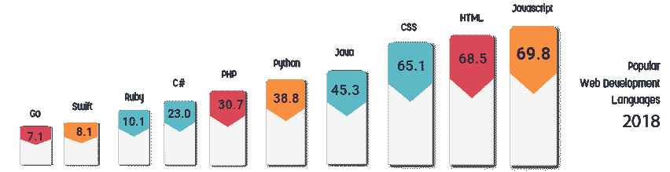

**Web 编程**是指 Web 开发中涉及的编写、标记、编码。这包括网络内容、网络安全以及网络客户端和服务器脚本。

自从 web 诞生以来，有许多语言被创造出来。每种语言都有它自己的功能，以及它在 web 开发的各个方面的位置。有些用于设计，有些用于结构，有些用于网站的响应度。这是由于它们的功能。一个 web 开发人员不需要掌握每一种语言的知识，只需要学习他/她需要的语言，就可以成为他/她选择的道路上的专家。

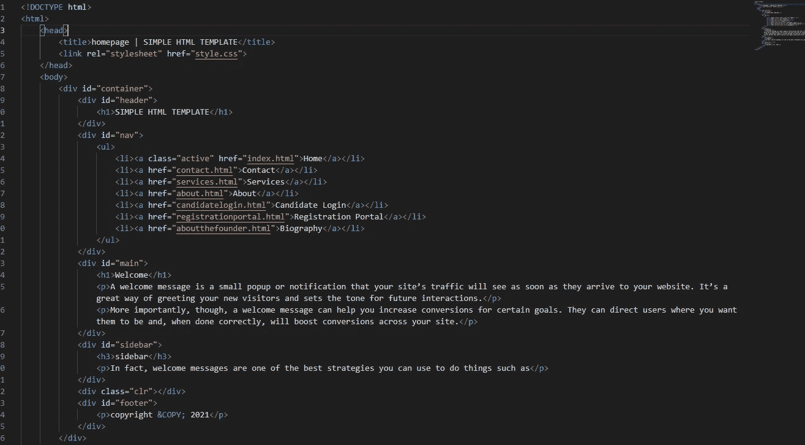

**HTML CODING**

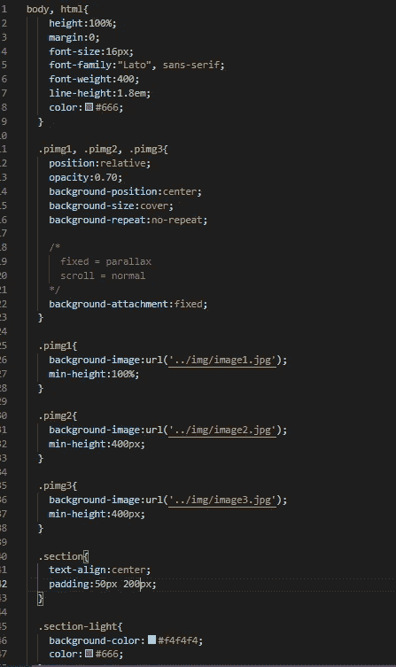

**CSS CODING**

## **HTML-超文本标记语言简介**

**HTML** 代表**超文本标记语言。It 是一种简单的语言，它使用**标记来描述**网页**的结构。HTML 也是在 1991 年创建的，并且正在创建许多版本以供研究。对旧版本的一些调整产生了新版本，这是为了改善我们网站的结构和响应度，并使网站开发对初学者来说更容易。以下是自 1991 年网站创建以来的版本列表****

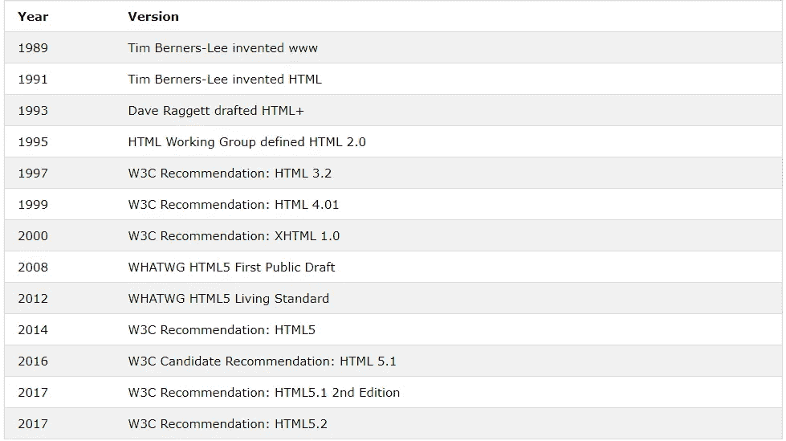

**HTML VERSIONS**

**HTML 元素**是 HTML 页面的构建块，用标签表示。**标签**由尖括号包围，通常成对出现(开始和结束标签)。结束标记的写法类似于开始标记，但是在标记名之前插入了一个正斜杠。开始标签、内容和结束标签组成一个元素。

<tag name="">…..内容放在这里…</tag>

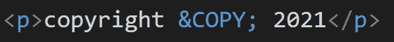

**An HTML Element**

一个简单的 HTML 文档是这样写的:-

```
<!DOCTYPE html><html><head><title> page title </title></head><body><h1> …. content…. </h1><p> …. content…. </p></body></html>
```

**下面是对上述结构**的分析

*   **<！DOCTYPE html >** 声明将该文档定义为 **HTML5。**
*   **< html >** 元素是 html 页面的根元素。
*   **< head >** 元素包含文档的元信息。
*   元素为文档指定一个标题。
*   **< body >** 元素包含可见的页面内容。
*   **< h1 >** 元素定义了一个大标题。
*   元素定义了一个段落。

**注** - **HTML 标题**用< h1 >到< h6 >标签定义。**h1>定义了最重要的标题。 **< h6 >** 定义了的最少航向。**

*   # 这是最大的标题

*   ## 这是一个更大的标题

*   ### 这是个大标题

*   #### 这是个小标题

*   ##### 这是一个较小的标题

*   ###### 这是最小的标题

## 如何创建一个简单的 HTML 页面的分步指南

开发一个响应式网站需要很多技术，但都是从基础开始的，那就是创建网站的网页。此网页需要以下步骤；

**第一步。**获得一个文本编辑器，你可以在其中输入代码以给出想要的输出。**记事本(PC)、Visual Studio Code (VS Code)和 TextEdit (Mac)** 都是文本编辑器的例子。我会推荐 VS 代码文本编辑器，因为它很有效。您可以在笔记本电脑上简单地搜索记事本或文本编辑。

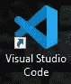

**VISUAL STUDIO CODE**

**第二步。**申报文件。这可以通过两种方式实现。

第一种方法是在你的电脑上打开一个新文件夹，用扩展名 HTML 命名。例如，index.html。


**A new folder saved with .html extension**

第二种方法是打开你的编辑器(VS 代码推荐)，打开一个新文件，选择语言为 html，然后点击“保存”按钮或 CTRL + S，用任何想要的名字命名文件，它肯定会以“HTML”扩展名保存。

[点击此处观看短片](https://youtube.com/shorts/pb_z1gj59MY?feature=share)

**步骤三。**通过声明代码在 HTML 5 中开始编写代码，前面已经解释过了。这是通过使用 HTML 5 声明来完成的

```
<!DOCTYPE html>
```

注意:一旦你开始写，VS 代码带来了可能的输入，这使得你的工作非常容易。

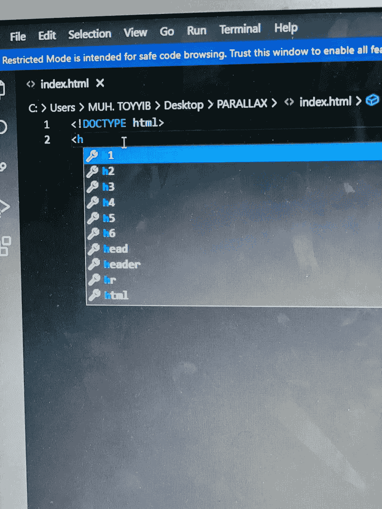

**VS code popping up possible outcome form an input**

**第四步。**在步骤 3 之后，点击下一行或按回车键，然后输入 HTML 开始和结束标签，如下所示:

```
<html></html>
```

**注:** 1。一旦输入开始标签，VS 代码会自动关闭所有标签，除非标签只有开始标签(不需要结束标签)，因为不是所有标签都需要结束标签。

2.所有其他的标签必须在 HTML 的开始和结束标签之间，就像前面输入的一样:

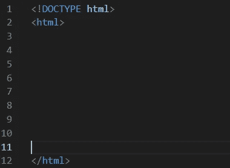

**第五步。**输入<头>标签。head 标签包含关于文档的元信息。例如，标题标签，CSS 样式位于头部的开始和结束标签之间。

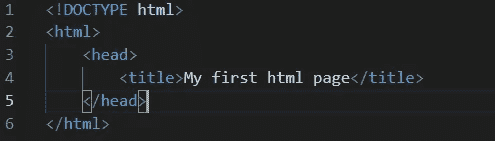

标题标签的内容将显示为网页的标题

**第六步。**输入<车身>标签。body 元素包含将出现在网页上的所有元素。

```
<body></body>
```

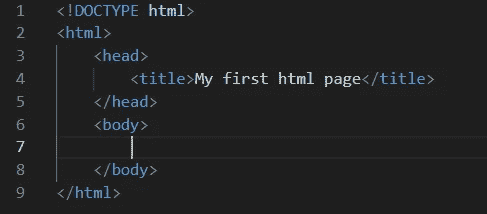

**第七步。**现在你可以开始使用< h1 >到< h6 >元素和< p >标签在你的页面中写任何我们满意的东西。

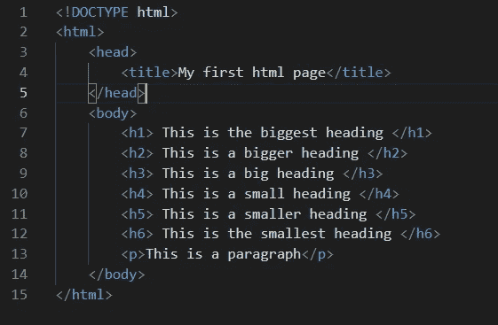

**The input**

**输出**

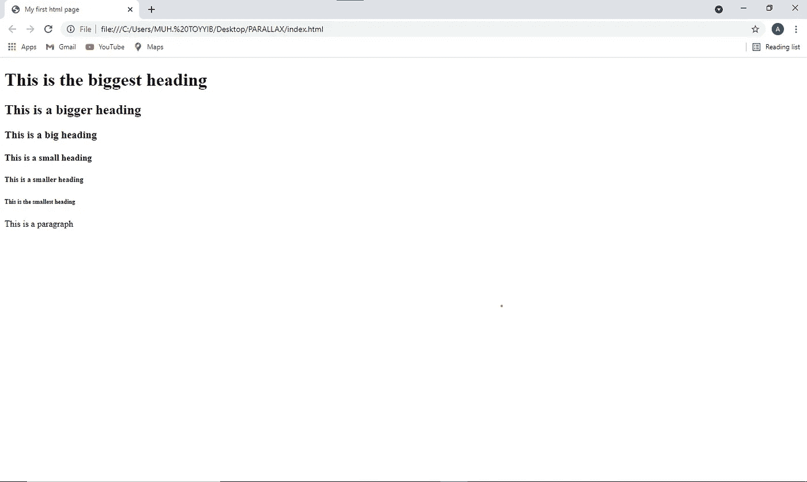

感谢阅读。

请随时在以下社交媒体上联系我: [Twitter](https://mobile.twitter.com/AkandeO08920463) 、[脸书](https://www.facebook.com/akande.olalekan.1238)、 [Instagram](https://www.instagram.com/muh_toyyib_0/) 或 [WhatsApp](https://wa.me/message/BUW6NXAJ2A3HA1) 。

*更多内容请看*[*plain English . io*](http://plainenglish.io/)*。报名参加我们的* [*免费每周简讯*](http://newsletter.plainenglish.io/) *。在我们的* [*社区不和谐*](https://discord.gg/GtDtUAvyhW) *获得独家获得写作机会和建议。*