# Three.js 入门

> 原文：<https://javascript.plainenglish.io/a-simple-introduction-to-threejs-9b060c1bb6e7?source=collection_archive---------1----------------------->

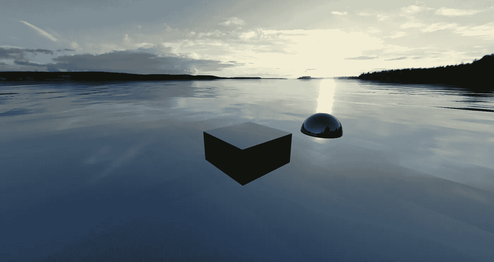

被锁在里面快一年了，我有了更多的空闲时间去做那些我本来不会去做或者不感兴趣的事情。

我从未想过我会对绘画、摄影或篮球感兴趣，然而去年我对这三个都感兴趣。我甚至不打算再说那一年了；你知道我在说什么…

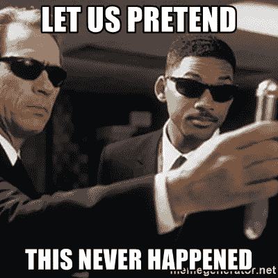

Gladly.

不管怎样，在我的空闲时间里，我一直在做的许多事情中有三件是 T1。ThreeJS 是一个 JavaScript 库，允许你在浏览器中实现实时 3D 渲染。在我们继续之前，让我们回顾一下简单的背景。当然，如果你想直接进入三个 j，可以随意跳到**让我们开始吧**部分。

# 一些背景

好吧，*允许*不是正确的术语。从技术上讲，你可以不用三个 j 就能做到这一点，因为所有现代的网络浏览器都给你提供了一个叫做 WebGL 的图形 API。如果你熟悉计算机图形学，那么你可能听说过这个叫做 OpenGL 的东西。这是一个 API，允许你通过直接与设备的 GPU 交互来渲染 3D 图形，如果你愿意，还可以渲染 2D。OpenGL 并不是唯一允许你这样做的 API。[微软的 DirectX API](https://docs.microsoft.com/en-us/windows/win32/direct3dgetstarted/building-your-first-directx-app) 、[苹果的 Metal](https://developer.apple.com/metal/) ，以及 block 上更新的 kid、 [Vulkan](https://www.khronos.org/vulkan/) ，也都可以做到这一点。然而，OpenGL 是最著名的。

不过有一个问题:它有一个非常陡峭的学习曲线。记住，OpenGL 是用来和你的 GPU 交互的，所以 API 必须有足够的性能来尽可能的利用你的硬件。实现性能效率的最好方法是用低级语言编写，这就是为什么 OpenGL 是用类似 C/C++的语言编写的，叫做 GLSL。为了让你对你在 OpenGL 中处理的东西有个概念，看看我为了渲染一个蓝色的圆圈而写的东西:


你或许可以用这么多代码编写一个还算过得去的 React 应用程序，但是计算机图形应用程序的计算量非常大，因此它们通常是对性能要求最高的应用程序之一。我的意思是，人们不得不制造硬件(GPU)来做这件事。

长话短说，WebGL 基本上可以让您在 web 浏览器中获得这种类似于 OpenGL 的效率。这是一个图形 API，你可以使用 JavaScript 而不是 C/C++与它交互……嗯，算是吧。现在，JavaScript 是一种高级得多的编程语言——不管是好是坏——所以你可能会想:“太棒了！那么 WebGL 肯定是一件轻而易举的事了！。对此，我想指出的是[代码，你需要它来显示一个基本的白色方块](https://github.com/mdn/webgl-examples/blob/gh-pages/tutorial/sample2/webgl-demo.js)。

## 然后是三个(JS)

那么，ThreeJS 在这一切中扮演了什么角色呢？这样，你就可以充分利用 WebGL 的诸多优势，同时摆脱让自己投入运营所需的繁重工作，专注于将想象中的 3D 内容变为现实。

这就结束了我们的背景。在继续讨论之前，我只想说，我绝不是在试图转储到 OpenGL 或 WebGL。两者都是非常强大的 API，如果你投入时间去学习它们，你会得到丰厚的回报。即使你不走远与他们，他们提供了一个大开眼界的经验，如何做计算机图形的硬件水平。事实上，这是对他们所做事情的过度简化。如果你对学习 OpenGL 或 WebGL 感兴趣，我在这篇文章的末尾发布了一些很棒的链接来帮助你入门。不管怎样，继续前进！

# 让我们开始吧。

现在我们已经排除了这种情况，让我们开始一个基本设置。

## 设置

首先，在桌面上创建一个名为“ThreeJS”的文件夹。你可以称之为任何你想要的，并把它放在任何你想要的地方，但如果你想遵循这个教程到球座，然后做我说！

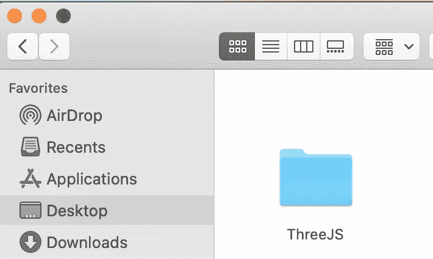

That wasn’t so hard, was it?

接下来，在此文件夹中创建两个文件。第一个是常规的 ole ' index.html 文件。第二个是一个 JavaScript 文件，我们称之为 script.js。复制下面的代码并将其放入您的 index.html 文件中:

```
<!DOCTYPE html>
<html lang="en">
  <head>
    <meta charset="UTF-8">
    <meta name="viewport" content="width=device-width, initial-    scale=1.0"> <title>Three JS Tutorial</title>
  </head><body style = "margin: 0; padding: 0;">
  <script defer src = "https://cdnjs.cloudflare.com/ajax/libs/three.js/r125/three.js">.     
  </script>
  <script defer src = "./script.js"></script>
</body>
</html>
```

在这里，我们用两个脚本创建一个基本的 HTML 文件。第一个脚本是对 ThreeJS 库的 CDN，而第二个脚本是我们自己的 JavaScript，我们将在本教程中编写它。这两个脚本标签中的**delay**属性告诉浏览器在实际运行这些脚本之前要等到页面加载完毕。这个属性不是必需的，但由于我们使用 CDN 从远程服务器进行提取，这是一个很好的安全措施。还有一件事。我通常会避免使用内联样式，但我们只想清除任何默认的边界和填充，所以它对我们来说没什么问题。在本教程的剩余部分中，我们将不再涉及这个 HTML 文件。让我们写一些三个 JS，好吗？

## 现在我们开始认真起来。

转到您的 script.js 文件。在本教程的剩余时间里，我们会一直在这里，所以把你的家具搬进来，舒服一下。现在，我们将要编写的第一段代码适用于您将要编写的任何 ThreeJS 项目。在做其他事情之前，你会需要它。这个起始代码给了我们最基本的东西:一个场景、一个摄像机和一个渲染器。将以下代码写入您的 script.js 文件。我们一会儿会过一遍它的含义:

```
const scene = new THREE.Scene();
const camera = new THREE.PerspectiveCamera(90, window.innerWidth / window.innerHeight, 0.1, 500);const renderer = new THREE.WebGLRenderer();
renderer.setSize(window.innerWidth, window.innerHeight);
renderer.render(scene, camera);
document.body.appendChild(renderer.domElement);
```

这是怎么回事？首先，注意我们想从 ThreeJS 中使用的所有东西都可以通过使用 THREE 对象来调用。我们会经常这样做。任何呼…

第一行创建了我们的场景。场景对象是我们希望在应用程序中显示的所有内容所在的位置。例如，如果你想显示一个茶壶的模型，那么你可以将这个茶壶模型添加到场景中。想把这个茶壶放在地板上吗？您还必须将地板模型添加到场景中。想点亮一盏灯吗？是的，你猜对了，给场景添加灯光。

第二行创建我们的摄像机，我们用它来实际观察我们的场景。ThreeJS 提供了多种类型的相机，但最常见的是我们这里的透视相机。这款相机有四个参数:FOV、长宽比、近景和远景。

第一个论点是视野，或 FOV。这是我们的相机可以观察的角度。更高的 FOV 让你不用旋转相机就能看到更多。如果你是 PUBG 或堡垒之夜等游戏的粉丝，那么你可能对这个很熟悉:更高的 FOV 让你看到你周围更多的游戏世界，从而帮助你发现更多的敌人。相反，较低的 FOV 会缩小你能看到的范围。使用现实生活中的相机时，较低的 FOV 有助于近距离摄影。放大倍数越大的镜头，FOV 就越低，因此你可以将大部分像素塞进你想要拍摄的特写镜头中，比如一碗水果。

第二个参数是我们的长宽比，这是屏幕的宽度和高度的比例。最常见的宽高比是 16:9 宽高比，这种宽高比常见于电视和电脑显示器。这是因为最常见的屏幕分辨率—例如 1280x720、1920x1080、3840x2160(又名 4K)都可以缩小到 16x9。不相信我？取分数 1920 / 1080，并将其减少到尽可能小的分数。现在，从微型智能手机到 100 英寸电视，各种尺寸的设备中都有网络浏览器。如果我们硬编码一个宽高比，那么任何不同宽高比的屏幕要么通过拉伸扭曲我们的内容，要么用空白像素包围它。不管怎样，我们都会破坏用户体验。相反，我们可以让 JavaScript 通过输入浏览器窗口的内部宽度除以其内部高度来为我们处理这个问题。为了记录，window.innerWidth 和 window.innerHeight 分别指我们在 HTML 主体中实际看到的宽度和高度。

最后两个参数，近和远，指的是我们相机的观看距离。在我们的代码中，我们的近值是 0.1，而远值是 500。这意味着，我们的摄像机不会观察到 500 米以外的任何东西。同样，小于 0.1 米的任何东西都不会被观察到。这个[链接](http://learnwebgl.brown37.net/08_projections/projections_perspective.html)给了你一些滑块，这样你可以看到透视相机在概念层面上是如何工作的。这篇文章是关于 WebGL 的，但是想法是一样的。记住，ThreeJS 只是在为我们做 WebGL！

设置代码的最后四行创建了我们的渲染器。渲染器是一切汇集的地方，基本上是三个 j 说*“表演时间到了！”*首先，我们需要说明我们使用的是哪种渲染引擎。第一行告诉我们希望使用 WebGL 渲染引擎。第二行使用渲染器的 setSize()方法告诉引擎我们希望渲染器的尺寸是多少。在这种情况下，我们希望它占据整个浏览器视图，所以我们传入 window.innerWidth 和 window.innerHeight 值。接下来，我们通过调用渲染器的 render()方法，告诉渲染器我们到底想要渲染什么。这个方法把我们的场景和摄像机，基本上就是说“摄像机，看这个场景。现在你有什么感觉？”好吧，render()不是治疗师，但是你明白了。它告诉我们的相机观察我们的场景，所以渲染器知道*它需要显示什么。最后，我们需要告诉我们的浏览器*我们想把它放在哪里。幸运的是，我们的渲染器有一个名为 domElement 的属性，这是一个 HTML 元素，包含我们的 WebGL 视图，可以附加到我们的 DOM 中。正如你可能已经猜到的，最后一行为我们做了这些:它将我们的渲染器附加到我们网页的主体。**

现在，在浏览器中打开 index.html 文件:

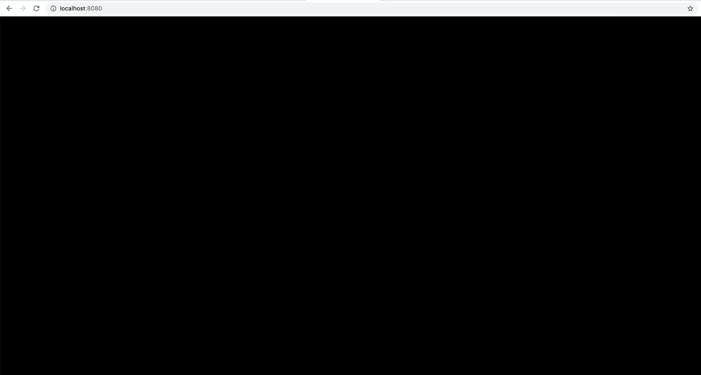

如果你得到的是一个没有任何意义的黑暗深渊，那么你做得很好！嗯，三个 j。你不会想要这样的生活。然而，在 ThreeJS 中，这是好的。这意味着一切都在工作。现在，还有一件事我们需要解决。与其告诉你，不如帮我一个忙，缩小查看渲染器的窗口，然后刷新页面:

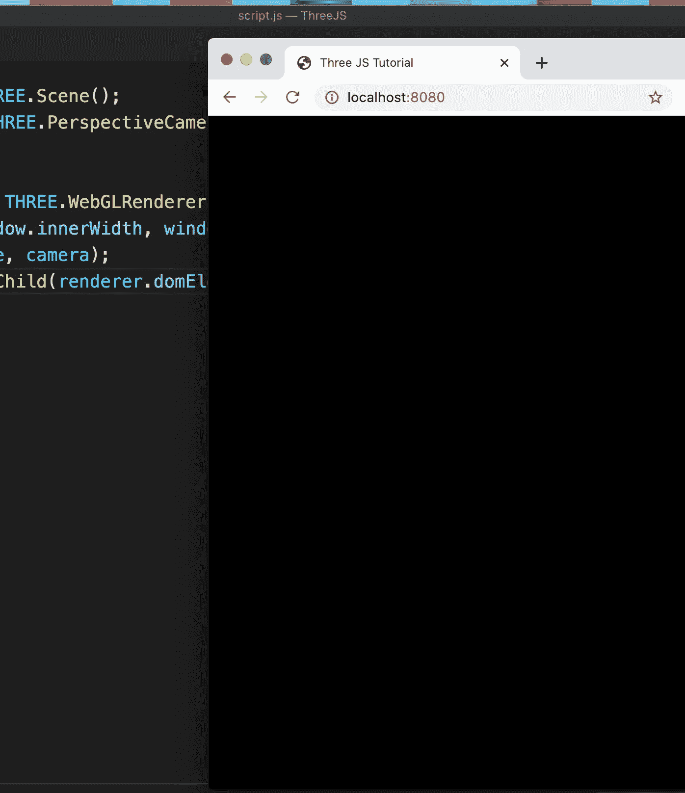

看起来不错，对吧？展开窗口:

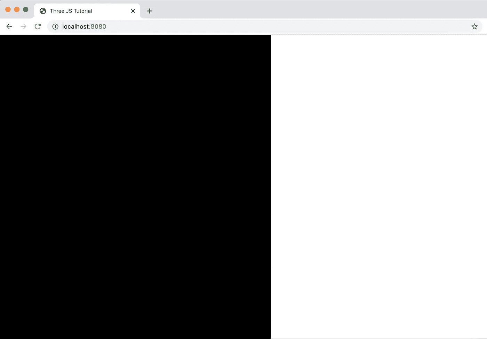

诶！我们希望我们的渲染器占据整个屏幕，而不是它的一部分。问题是，当我们缩小屏幕然后刷新页面时，ThreeJS 完全按照我们说的做了:占据整个屏幕。然而，整个屏幕是我们缩小的窗口，所以我们得到的是一个渲染器，当它完成加载时，它只占用我们窗口的大小。不用担心，这很容易补救。我们只需在调用 renderer.render()之前添加一个 resize 事件侦听器，并告诉它每当 resize 事件发生时更新所有内容:

```
window.addEventListener(‘resize’, () => {
  camera.aspect = window.innerWidth / window.innerHeight;
  camera.updateProjectionMatrix();
  renderer.setSize(window.innerWidth, window.innerHeight);
});
```

下面是这段代码的作用。每当 resize 事件发生时，我们首先更新纵横比。新的宽度和高度可以是任何值，并且不能保证它们的长宽比与原始窗口的相同，所以我们想立即重新计算。第二行调用摄像机的 updateProjectionMatrix()方法。基本上，我们需要在任何时候改变我们的摄像机时调用它。最后，第三行将更新我们的渲染器，这样，无论如何，它将占据我们的整个浏览器视图。请注意，我们只需要 11 行代码就可以做到这一步。还不错。

# 让我们大闹一场

现在，我们已经有了自己的场景，让我们添加一些东西。我们将从添加一个蓝色立方体开始。为了做到这一点，我们需要两样东西:一个*几何*，和一个*材质*。几何描述了我们的 3D 物体的形状。在这种情况下，我们的几何将是一个立方体的形状。幸运的是，ThreeJS 提供了许多简单的几何图形——在计算机图形学中通常被称为*原始形状*——供我们使用。我们称这些形状为基本形状，因为它们是你可能制作的每一个 3D 物体的组成部分:你在电影或游戏中看到的任何 3D 物体都是这些基本形状的某种组合和/或修改。立方体就是这样一种形状，球体、圆锥体和圆柱体也是如此，而三个 j 为所有这些提供了几何形状。我们可以使用 ThreeJS 的 BoxGeometry()对象创建立方体的几何图形。将以下代码行添加到我们的相机之后、渲染器代码之前的任意位置:

```
const geometry = new THREE.BoxGeometry(1, 1, 1);
```

这将创建一个 1 米宽、1 米长、1 米深的立方体几何体。像 ThreeJS 中的许多东西一样，实际上有比这三个更多的参数可以传入，但是现在这些就够了。

我们需要的第二样东西是我们的材料。这种材料描述了我们的物体将会是什么颜色，以及它如何与光相互作用。不同的材料可以创造不同的效果。例如，一个闪亮的球有一种光滑的材料，而我毛衣的面料有一种天鹅绒般的材料。对于我们的立方体，我们将使用 ThreeJS 提供的最简单的材料，MeshBasicMaterial。在我们的几何代码之后，添加以下内容:

```
const material = new THREE.MeshBasicMaterial({color: “#097aff”});
```

这条线制作的材料是一种蓝色阴影，不在乎光。我们将很快对此进行更深入的探讨。

现在我们有了几何图形和材质，我们想把它们放在一起:我们有立方体和蓝色。我们想要我们的蓝色立方体。为此，我们创建了一个叫做*的网格*。当我们把一个几何图形和一个材料结合在一起时，我们就得到一个网格。换句话说，它告诉我们我们的东西是什么形状，有什么材料。在我们的材料之后，添加下面一行代码:

```
const cube = new THREE.Mesh(geometry, material);
```

这一行代码简单地说:创建一个新的网格，它有我们的立方体几何体和蓝色材质。这是我们的蓝色立方体。我们需要做的只是简单地把它添加到我们的场景中，就像这样:

```
scene.add(cube);
```

要向场景中添加任何东西，我们只需将它传递给场景的 add()方法。现在刷新你的浏览器！


真令人失望，哪里出了问题？实际上没什么。立方体就在那里，只是我们看不见。我们看不到它的原因是，默认情况下，ThreeJS 会将我们制作的任何新对象放在我们屏幕的中心，也就是(0，0，0)的(x，y，z)位置，也就是我们的原点。相机在原点，立方体也在原点。为了解决这个问题，我们只需要将摄像机向后移动一点，为我们的立方体腾出空间。将这行代码放在我们创建相机的位置之后:

```
camera.position.z = 5;
```

这将使我们的摄像机移动 5 米远。在 ThreeJS 中，z 轴指向屏幕之外:z 值越大，它离我们越近。同时，x 轴穿过我们的屏幕，而 y 轴在屏幕上上下移动。这张照片比我能更好地解释它:

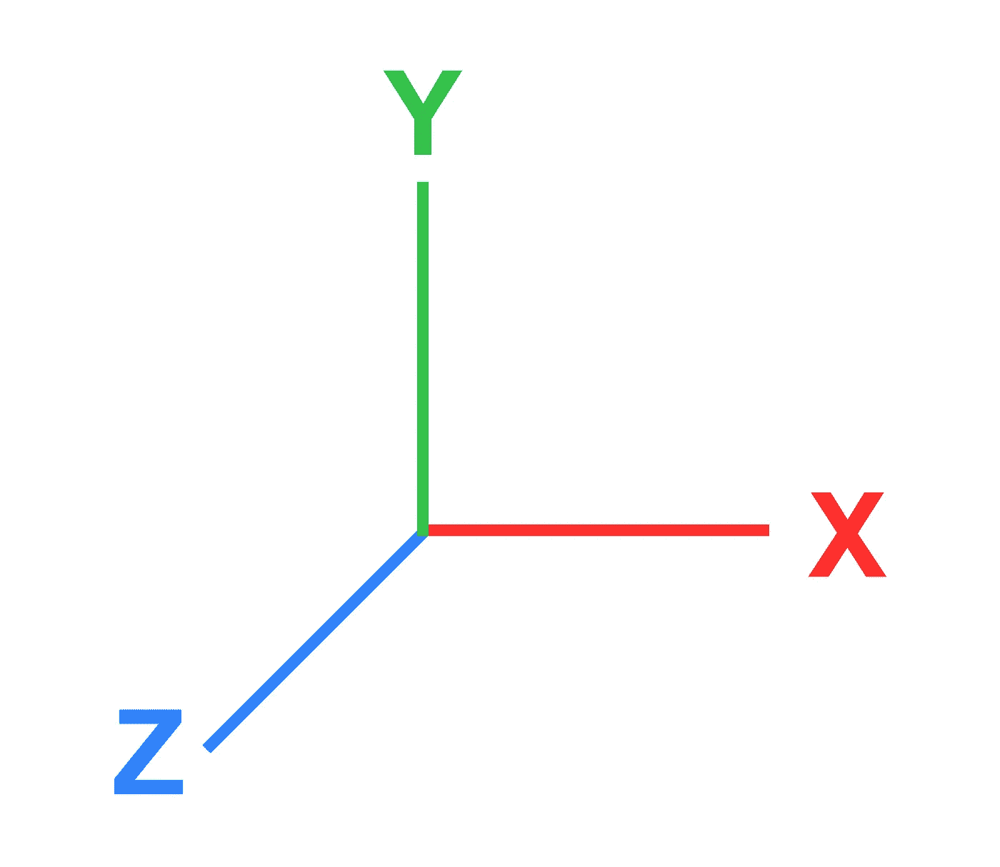

好，现在再刷新一次你的屏幕。

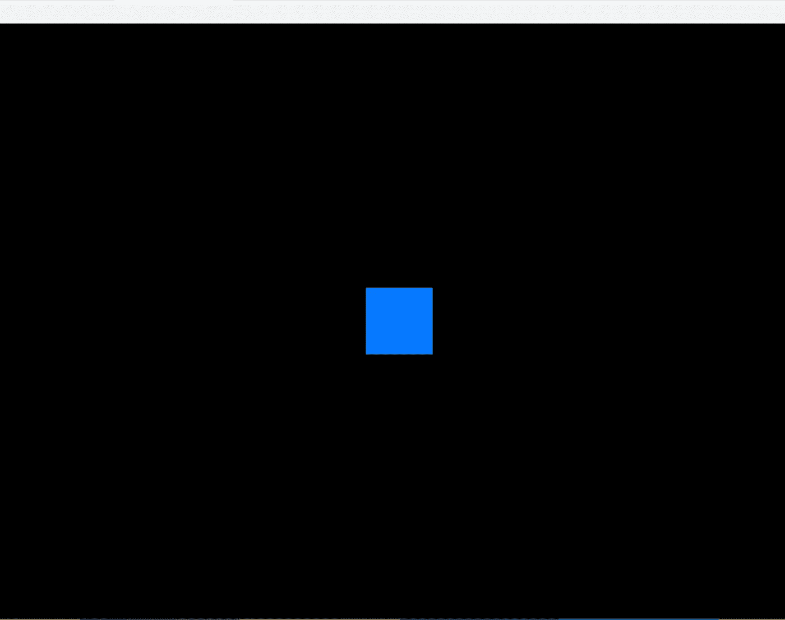

有用！拍拍自己的背，你用三个 j 做了你的第一个 3D 应用。实际上，这不是我们想要的。我是说，我们做了一个立方体，为什么我们得到的是一个正方形？嗯，它是一个立方体，但是是一个平放在三维空间中的立方体。为了显示更多的深度，我们可以沿着 y 轴旋转立方体。为此，请在我们的 scene.add(cube)行之前添加以下代码:

```
cube.rotation.y = 0.05;
```

这是我们得到的结果:

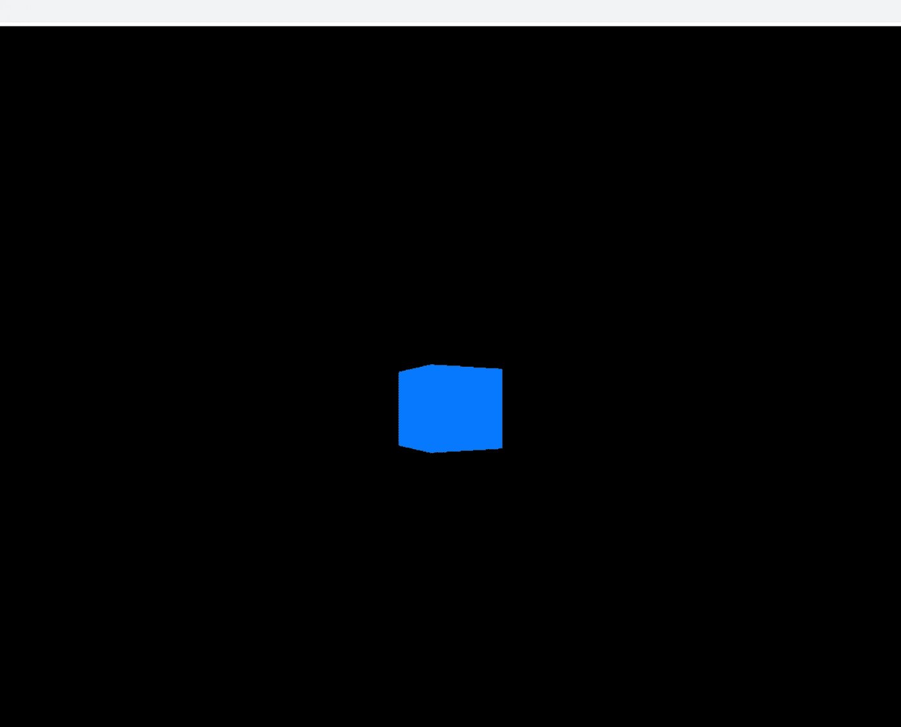

Told ya it was a cube.

看到了吗？一个立方体。当然，这并没有什么“阴影”，但这仅仅是因为我们的网状基本材料不与光相互作用。我们稍后会对此进行改进。

## 把它带到整个城市！

当我们对立方体进行旋转时，你可能想知道如何制作旋转的动画。换句话说，我们如何让这个立方体自动旋转？这是介绍我们如何做到这一点的基础知识的好时机。要制作 ThreeJS 中的任何东西的动画，无论是旋转的立方体还是过桥的角色，每次发生变化时，我们都需要重新渲染场景。立方体旋转了 0.01 弧度吗？我们需要重新渲染。我们的角色眨眼了吗？是的，我们需要重新渲染。

那么我们该如何做呢？

在过去的 JavaScript 时代，我们不得不使用 setInterval()方法，传入一个应用我们的更改的回调，以及我们希望发生这种情况的频率(或帧速率),来构建一些简单的解决方案。因为每秒 60 帧(或 60fps)通常是理想帧速率的几倍，所以我们希望传递的时间是 1000/60，大约是 16.7 毫秒。幸运的是，我们生活在更好的时代……除了现在正在发生的那件事。如今，JavaScript 有了一个名为 requestAnimationFrame(*foo*)的本地方法，它将接受我们传入的任何函数 *foo* ，并执行它，目标是 60fps，并为我们处理所有校准问题。这个函数 *foo* 是一个递归函数，因为我们希望它重复执行，所以我们将这个 requestAnimationFrame()调用放在函数的定义中。创建一个名为 animate 的函数，实现它并将其放在我们的 document . body . append(renderer . DOM element)行之前:

```
const animate = () => {
 requestAnimationFrame(animate);
 cube.rotation.y += 0.02;
 renderer.render(scene, camera);
};
```

我们的 animate()函数首先调用 requestAnimationFrame()函数，将自己传入，从而保证它将不断被调用。接下来，它将通过添加 0.02 弧度来更新我们立方体的 rotation.y 值。最后，它将重新渲染我们的场景，反映这一变化。要做到这一点，只需在声明之后立即调用 animate ():

```
animate();
```

刷新您的页面并…..

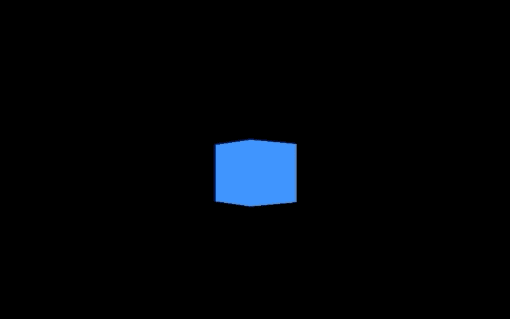

它活着！我们不仅渲染了一个立方体，而且还让它从此快乐地旋转起来。现在，后退一步。这是我们写了多少代码:

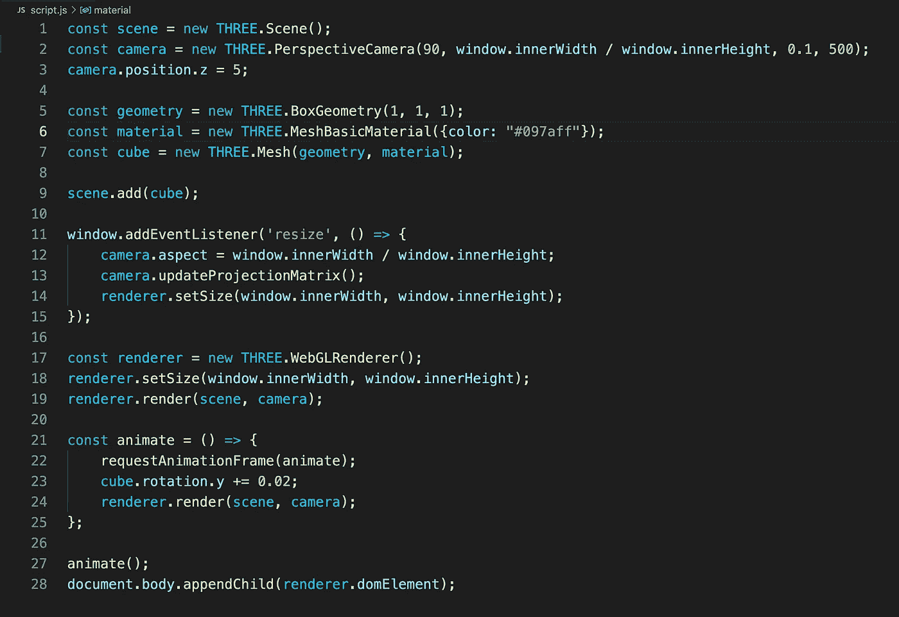

这还不到你之前看到的那个显示静态圆圈的 OpenGL 例子的一半代码，但是它做了更多。我不是一个过于关注你写了多少行代码的人(尽管我在本文中如此频繁地提到这一点表明事实正好相反)，但我只是想让你明白 ThreeJS 为你做了多少。不管怎样，给自己一点掌声吧。你已经做了一个真正的 3D 网络应用程序，你可以引以为豪。

## 让它变得阴暗

还记得材料的作用吗？它告诉我们我们的网格如何与光相互作用。到目前为止，我们使用的 MeshBasicMaterial 是一种不在乎光的材料。如果你正在制作，比如说，一个 2D 游戏，或者一个用户界面，那么这是一个很好的素材。然而，这是相当基本的；嘿，名字里有！ThreeJS 给了我们更多的材料，我们可以利用这些材料来告诉我们它们对光的反应。一种这样的材质是 MeshLambertMaterial，我们将使用它给立方体添加更多的“阴影”。为此，请转到创建材质的那一行，用 MeshLambertMaterial 替换 MeshBasicMaterial。也就是说，更换:

```
const material = new THREE.MeshBasicMaterial({color: “#097aff”});
```

使用:

```
const material = new THREE.MeshLambertMaterial({color: “#097aff”});
```

现在刷新您的页面，您将获得…


You’ll get this screen often in computer graphics. Get used to it.

啊，是的，我们改变了一行代码，我们的程序从几乎正常工作到崩溃，没有任何解释。如果你是编程新手，那就习惯它吧。这差不多就是你拿钱来处理的事情。

从技术上讲，这里没有发生“错误”。请记住，与网状基底材料不同，我们的网状基底材料会受到光的影响。问题是没有光。我们所有的场景都是我们的蓝色立方体。当我们的立方体有一个 MeshBasicMaterial 时，这很好，因为它不关心光，而 MeshLambertMatrial 关心光。因为没有光，我们看不见我们的盒子。要解决这个问题，我们需要为场景添加灯光。

## 放轻松

我们要添加到场景中的最后一个对象是光源。triple js 捆绑了各种各样的灯供我们使用。对于我们的例子，我们将使用方向灯。在我们创建立方体网格后，立即添加以下行:

```
const light = new THREE.DirectionalLight();
light.position.set(0, 2, 2);
```

上面的代码将创建一个新的方向灯，并把它放在 2 米以上和 2 米以外的原点。不过，您仍然会看到黑屏。我们需要给我们的场景增加灯光。我们可以像处理立方体一样进行处理。在正下方添加此行:

```
scene.add(light);
```

现在继续刷新您的页面。


Ain’t it beautiful?

好好看看吧，这次实际上是 3D 的！我们差不多结束了。然而，这只是最后一笔收尾工作。这没什么大不了的，但确实会让事情变得简单一些。你可能已经注意到我们的立方体边缘看起来有点粗糙。


这被称为“混叠”，是计算机图形学中的一个常见问题。三个 JS 对此有一个快速的解决方案。我们只需要在我们的 WebGLRenderer()中传递属性*抗锯齿*设置为*真*的对象。转到我们初始化渲染器的地方，并将其调整为如下所示:

```
const renderer = new THREE.WebGLRenderer({antialias: true});
```

这将使我们的立方体平滑，正如你从我们可笑的特写镜头中看到的:

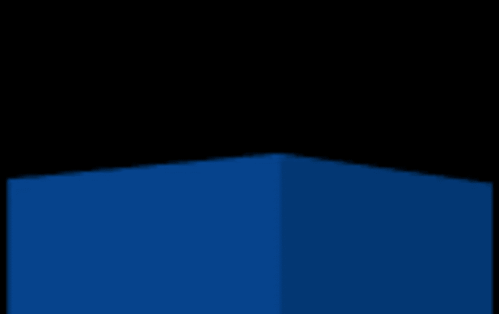

再次刷新你的页面，看看吧！

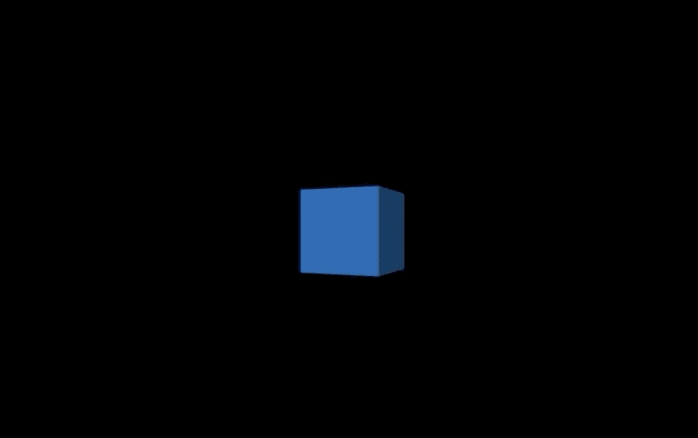

Now that’s smooth.

# 包扎

三个 JS 是在你的网络应用程序中实现实时 3D 图形的一个好方法，而不必与 WebGL 的困难作斗争。我上周才开始学习它，到目前为止，我一直对它很感兴趣，所以如果你刚刚开始你的三个 JS 之旅，并且走了这么远，那么我们在同一家公司。不过，你显然可以做比旋转立方体更多的事情。事实上，我在写这篇文章的时候正在做一个水模拟。你可以在这里观看我到目前为止的演示[。单击并拖动鼠标光标，或向上或向下滚动以平移并放大或缩小。](https://akheheh.github.io/LakeJS/index.html)

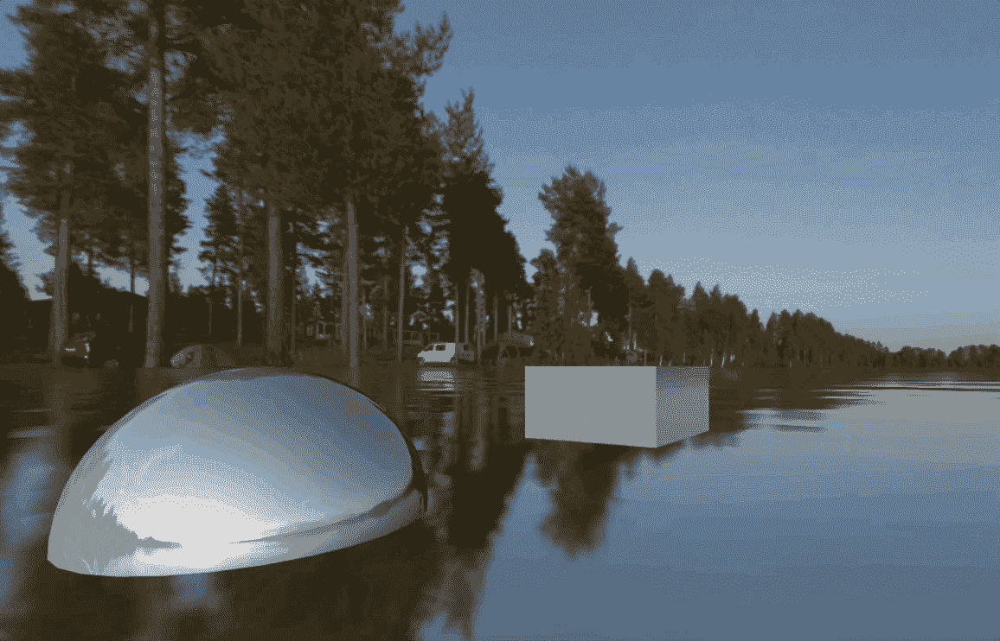

我希望你觉得这个教程很有帮助。三个 JS 充满了乐趣，因为它可以让你在如此小的设置下完成任务。我不知道我会深入到多深，但到目前为止，我喜欢我所看到的。也许继续关注更多！

# 有用链接

*   [本教程所基于的三个 JS 文档](https://threejs.org/docs/index.html#manual/en/introduction/Creating-a-scene)。组织得很好，这是我发现自己在试图解决问题时不必求助于 StackOverflow 的罕见记录之一。
*   [WebGL2 基础](https://webgl2fundamentals.org/)。一个深入 WebGL 的好地方。例子似乎仅限于 ES5。
*   [WebGL: 2D 和网络 3D 图形](https://developer.mozilla.org/en-US/docs/Web/API/WebGL_API)。学习 WebGL 的另一个很好的资源。由 Mozilla 开发者网络提供。
*   [学习 OpenGL](https://learnopengl.com/) 。也许是世界上学习 OpenGL 的最佳资源。对于那些想一路走下去的勇敢的人来说。

# 许可信息

天空盒的图像来自 Lycksele 2 天空盒包，该包是根据知识共享署名 3.0 未转让许可证从埃米尔·佩尔森的[网站](https://www.humus.name/index.php)获得的。你可以在这里找到这个特殊的天空盒[。](https://www.humus.name/index.php?page=Textures&ID=131)

据我所知，我正在根据知识共享署名 3.0 未转让许可证使用这些资产。你可以在这里找到这个许可证[。](https://creativecommons.org/licenses/by/3.0/legalcode)