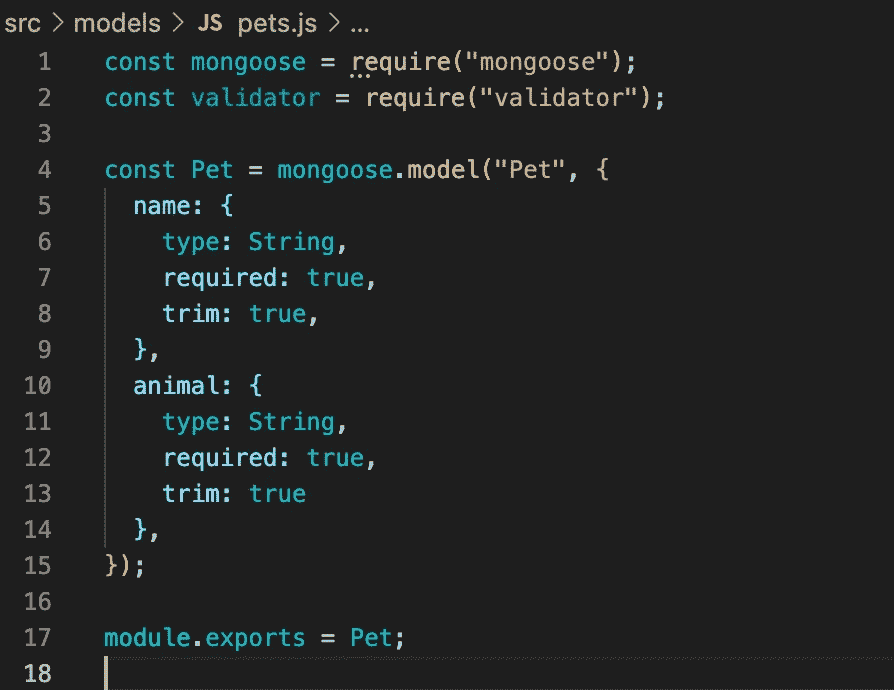
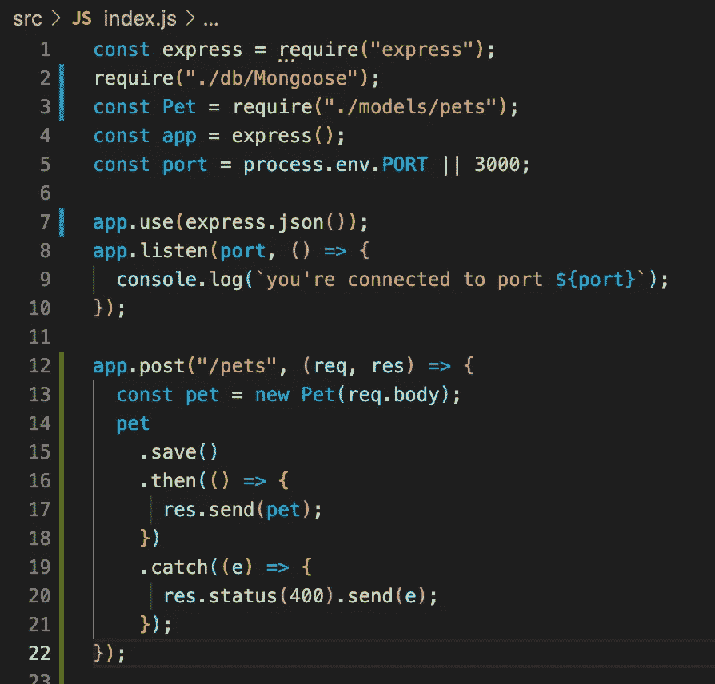
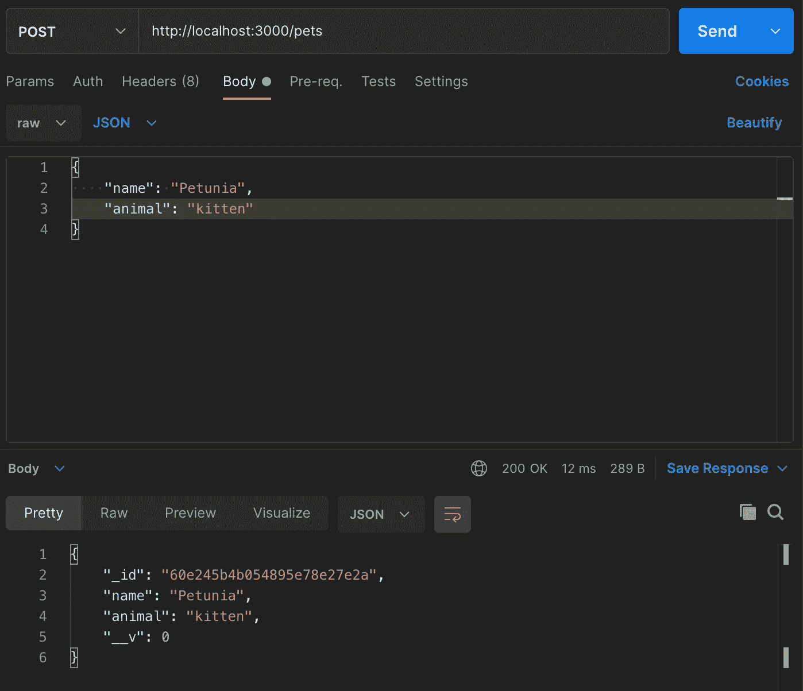
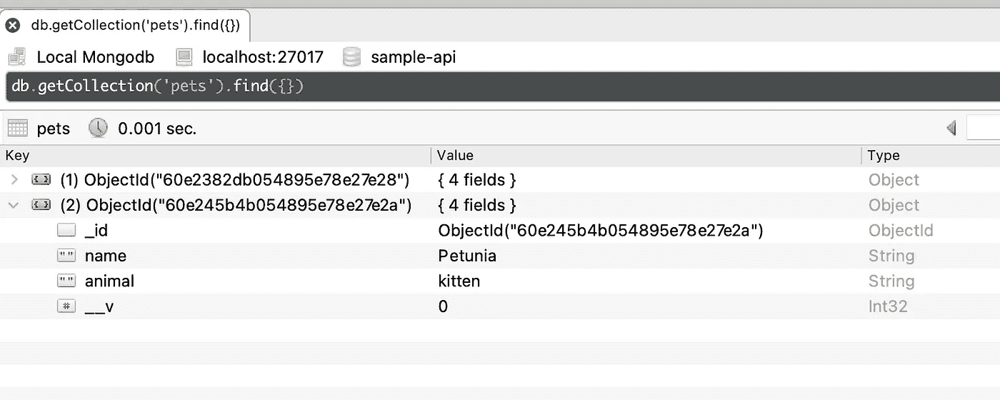

# 使用 mongose/MongoDB 和 Express 构建一个简单的 Node.js 应用程序，使用 Postman 和 Robo3T 进行验证

> 原文：<https://javascript.plainenglish.io/a-simple-node-js-app-using-mongoose-mongodb-and-express-verified-using-postman-and-robo3t-f68967c2e144?source=collection_archive---------12----------------------->

Photo by [Kevin Ku](https://unsplash.com/@ikukevk?utm_source=medium&utm_medium=referral) on [Unsplash](https://unsplash.com?utm_source=medium&utm_medium=referral)

为了继续我过去几周在 Node.js 上的博客，我汇集了几个流行的服务和库，它们代表了 Node 生态系统的一个更大的部分。我把我以前的一些相关博客与提到的特定图书馆的更多信息链接起来。

例如，我创建了一个简单的应用程序来记录宠物和它们的日常护理。这周，我只添加了动物的名字和种类。你可以把这些人看作“用户”

我的第一步是用 Mongoose 创建一个宠物模型，它为我的 MongoDB 数据库提供了一个结构。然后，我启动了一个带有“/pets”端点的 Express 服务器，用于向这个数据库添加新的宠物。接下来，我使用 Postman 发出这些 POST 请求。最后，我使用 Robo 3T 来验证我的数据库已经成功地更新了新宠物。

根据他们的[文件](https://mongoosejs.com/)，

> Mongoose 提供了一个直接的、基于模式的解决方案来建模您的应用程序数据。它包括内置的类型转换、验证、查询构建、业务逻辑挂钩等等。

为了开始使用 Mongoose，我将它安装为一个 NPM 包，然后在这个文件中需要它。上面概述的是我希望每个宠物条目如何在 MongoDB 服务器上结束的规范。

我指出了 name 和 animal 的值的类型——它们是字符串。我明确指出这些是必须的。这意味着如果缺少一个，我将抛出一个错误和一个 400 状态，尽管这是在 Express 中完成的。

我还包括了 NPM 包[验证器](https://www.npmjs.com/package/validator)。它有大量的能力来验证电子邮件，密码，邮政编码和十六进制代码，以及许多其他潜在的验证项目。它还有助于“净化”，这意味着它确保所有输入都符合某种审美，例如，所有内容都是小写的，或者——如上所示——所有多余的空白都从输入中删除，以消除混乱。最后，我导出了宠物模型，所以它可以在应用程序的其他地方使用。

在我创建了我的宠物模型之后，我创建了一个 index.js 文件，从这个文件中我运行应用程序本身。我必须首先要求 Express，以及我刚刚创建的模型。“app”变量将 express 激活为一个函数,“port”指定了应用程序运行的端口——在本例中是端口 3000。我还需要连接到 MongoDB 服务器的文件。我在这里写了更多关于这个过程[。](/using-node-with-mongodb-a-beginner-crud-exercise-83af468adb3c)

接下来，我告诉应用程序接收 JSON 输入，并从建立的特定端口接收信息。我添加了一个 console.log，让我知道我成功地连接到了哪个端口。

接下来，我建立了我的 RESTful 服务，设置了一个“/pets”端点。在这个函数的主体里面，我说了帖子请求的主体将会是一个新的宠物，按照我的规格在我的猫鼬宠物模型中制作。然后，我用回调函数保存模型，以发送回成功保存的宠物或一些错误处理，发送回 400 状态代码和错误的细节。

为了测试所有这些工作是否正常，我去了邮递员那里。我以前在[这里](https://foreman-alexander.medium.com/using-postman-for-api-testing-acd9de86a07b)写过。

您可以在上面看到，我向端口 3000 上的“/pets”端点发出了 POST 请求。请求的主体包括所需的名称和动物类型，因此您可以看到它返回一个成功的 200 状态，以及保存到数据库的对象。

最后一步，我使用 Robo 3T 来验证我是否成功地将这个新宠物保存到了我的 MongoDB 服务器上。

如您所见，ObjectId、name 和 animal 都与 Postman 中发回的对象相匹配。

所有这些都代表了创建一个更大、更复杂的应用程序的开始。但是您可以看到如何开始构建带有一些验证和对象建模的 RESTful API，然后如何测试这些信息。

*更多内容尽在*[***plain English . io***](http://plainenglish.io/)