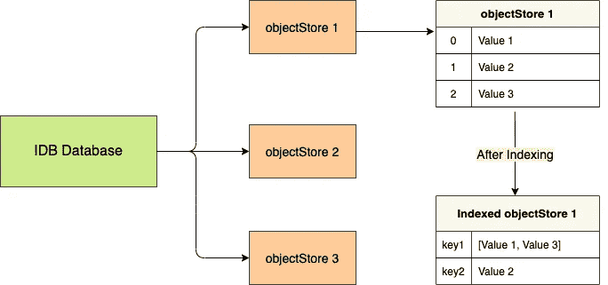

# 使用 IndexedDB 的更简单方法

> 原文：<https://javascript.plainenglish.io/a-simpler-way-to-use-indexeddb-6113761b3181?source=collection_archive---------7----------------------->

## *客户端的 NoSQL 数据库比 localStorage 强大很多？好好好！*

IndexedDB 是一个位于浏览器中的事务数据库，是一个异步的、基于键值的对象存储，只要有用户许可和空闲空间，就没有严格的数据存储限制。听起来很糟糕，对吧？

好了，这里是我真正喜欢`indexedDB`的一些地方:

*   它是一个事务数据库，这意味着您可以在一个事务中包装多个相关操作，如果任何操作失败，所有其他更改都将恢复到以前的状态，就好像该事务从未发生过一样。这确保了数据的可靠性。
*   `indexedDB`设计用于处理大量非结构化数据，包括文件/blob。
*   它是异步的，意味着在与数据库交互时不会阻塞宏任务，如果有大量的数据交互，这是非常方便的。
*   可以对对象存储进行索引，这有助于基于特定的关键字来分离数据，从而有助于更快地获取数据。

在最高级别，我们可以创建一个数据库，它由带有键-值对的 objectStores 组成，其中每个值都是一个表示单个记录的独立对象。

我们可以进一步使用记录中的键来索引数据，这些数据可以是唯一的或重复的。

这是同样的一个形象化的例子:



虽然`indexedDB`听起来很有趣，但当谈到与它互动时，有很多事情要考虑，这个过程真的很复杂。

我将尝试提及我在使用 indexedDB 时面临的一些挑战:

**回调:**

在`indexedDB`中发出的请求具有类似于 *onsuccess* 、 *onerror* 的事件，需要将回调附加到这些事件上以进行进一步的操作。

如果有相关的操作要做，这很容易导致我们进入回调地狱。

**模式版本化:**

`indexedDB`维护数据库的版本，并且维护版本号以确保每当发布新的应用版本时数据库都被更新。

在这种方法中，您必须保存版本历史，当`indexedDB`打开时，您必须检查本地版本并将其与当前版本进行比较，以获得更新之间的所有细节，从而将本地版本正确更新到当前版本。

当版本更新时，`upgradeneeded`事件被触发，只有在这个事件的回调中，我们才能创建任何`objectStore`或`index`。

所以每次你需要创建一个`objectStore`或者`index`的时候，你都要创建一个新的版本。

下面的代码是我们通常打开一个`indexedDB`数据库的方式:

为了将这些令人头疼的事情外包出去，并使这个过程更顺利一些，我为此创建了一个库:

[](https://www.npmjs.com/package/simplestore-indexeddb) [## simplestore-indexeddb

### indexedDB 的包装。这个项目的目的是使与 indexedDB 的互动尽可能顺利与最少的努力…

www.npmjs.com](https://www.npmjs.com/package/simplestore-indexeddb) 

因此，如果我必须执行与上面`SimpleStore`中所写的相同的过程，它会是这样的:

这里要做的就是将模式传递给`addStores` 方法，它将负责版本控制并返回`SimpleStore`的实例。

因为`SimpleStore`是一个可命名对象，所以你可以附加一个`then`方法或者使用`*await*` 语法来等待数据库更新。

现在，关于事务，让我向您展示我们如何将数据添加到存储中，然后再获取数据:

**索引数据库方式:**

**简单商店方式:**

我在这里主要关心的是有效地执行事务，为了做到这一点，宏队列中的所有操作都包装在一个事务中，基本上是在最后自动提交。

然而，如果您想将某些操作包装在一个事务中，您可以在最后使用`commit`方法来确保事务立即执行:

```
mystore.store("books")
       .add({name:"Thinking fast and slow"})
       .delete({name:"You don't know JS"})
       .commit()
       .then(()=>{console.log("data added.")})
```

下面是一个`SimpleStore`的例子:

你在表中添加的任何数据都将保留在浏览器内存中，不会在刷新时消失。所以一定要删除任何秘密的；)

如果你想玩这个包，这里有一个 cdn 链接:

[https://cdn . jsdelivr . net/NPM/simplestore-indexed db @ 1 . 2 . 1/dist/simplestore . min . js](https://cdn.jsdelivr.net/npm/simplestore-indexeddb@1.1.3/dist/simplestore.min.js)

要引用文档:

[](https://www.npmjs.com/package/simplestore-indexeddb) [## simplestore-indexeddb

### indexedDB 的包装。这个项目的目的是使与 indexedDB 的互动尽可能顺利与最少的努力…

www.npmjs.com](https://www.npmjs.com/package/simplestore-indexeddb) 

谢谢你的阅读，希望你喜欢！