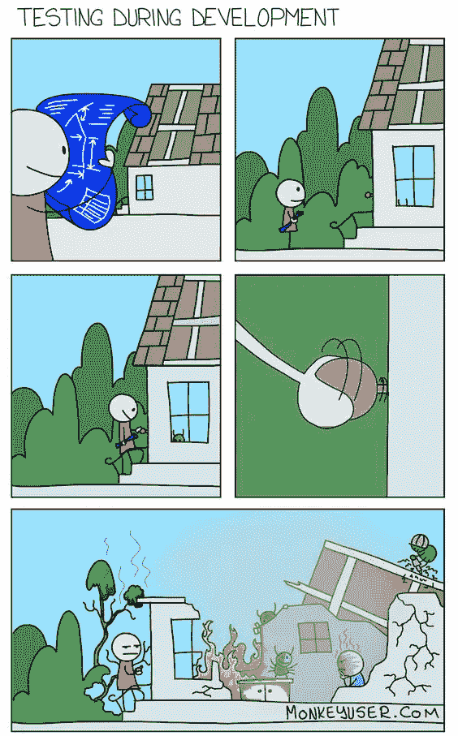
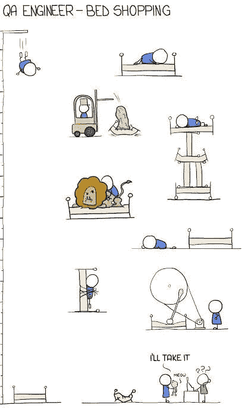
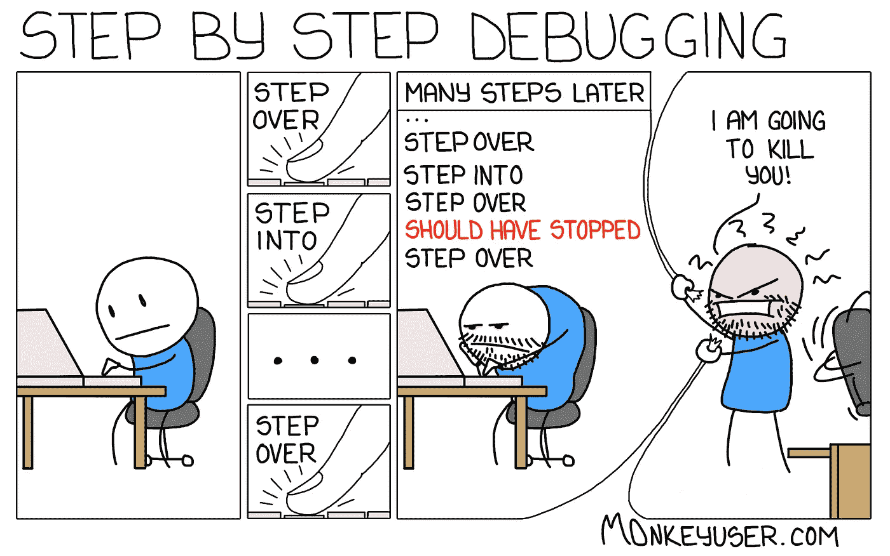

# 笑话形式的软件测试人员的生活

> 原文：<https://javascript.plainenglish.io/a-software-testers-life-in-the-form-of-jokes-721431e17901?source=collection_archive---------0----------------------->

## 每个人都能理解的最佳问答模因汇编。

Pic Credit: [https://www.monkeyuser.com/](https://www.monkeyuser.com/)

如果你是一名测试人员，你应该知道我们在敏捷中工作时是如何最终获得测试特性的，或者当我们报告错误时，开发人员是如何憎恨我们的，如果遗漏了什么，我们会受到责备。

我们也应该像其他开发者一样享受今天的乐趣，我正在整理这篇文章中最好的问答笑话。

# 当一名质量保证工程师去购物时

Pic Credit: [https://www.monkeyuser.com/](https://www.monkeyuser.com/)

# 当一个开发人员说所有的单元测试都覆盖了…

[https://gr.pinterest.com/pin/840273242960349141/](https://gr.pinterest.com/pin/840273242960349141/)

# 当一个 QA 在演示之前发现了一个 bug，并希望开发人员立即修复它。

[https://www.pinterest.ca/pin/636133516105162442/](https://www.pinterest.ca/pin/636133516105162442/)

# “BUG”对于软件开发员工来说是一个巨大的情感词汇…

[https://mailtrap.io/blog/qa-testing-memes/](https://mailtrap.io/blog/qa-testing-memes/)

# QA 重新打开 bug 时开发者的反应…

[https://www.monkeyuser.com/](https://www.monkeyuser.com/)

# 你是哪一个？

Pic Credit: [**flickr.com**](http://www.flickr.com/photos/softwaretestingclub/4742976322/in/set-72157624377617940/)

# 有时，QA 使用电子邮件或 BA 来接受他们的 bugs

[https://www.reddit.com/r/ProgrammerHumor/comments/e5vg3z/tester_developer_relationship/](https://www.reddit.com/r/ProgrammerHumor/comments/e5vg3z/tester_developer_relationship/)

# 当一家公司认为他们不需要人工测试人员时…你会使用自动化来执行所有的测试吗？

[https://www.quora.com/What-are-some-the-best-software-testing-jokes-and-memes](https://www.quora.com/What-are-some-the-best-software-testing-jokes-and-memes)

# 测试类型…

Pic Credit: [https://www.monkeyuser.com/](https://www.monkeyuser.com/)

# 经过测试……肯定是 bug

[https://twitter.com/qaqcarena](https://twitter.com/qaqcarena)

# 养虫子的基本方法…

Pic Credit: [https://testingqanotes.wordpress.com/category/miscellaneous/jokes/](https://testingqanotes.wordpress.com/category/miscellaneous/jokes/)

# 什么是测试？

Pic Credit: [https://testingqanotes.wordpress.com/category/miscellaneous/jokes/](https://testingqanotes.wordpress.com/category/miscellaneous/jokes/)

**最后备注:**耶！希望你玩得开心。继续查看我的其他文章，看看类似的有趣的汇编。

请使用这个[链接](https://sheetalpatel93.medium.com/membership)加入媒体，它让我保持动力。

# 奖励内容:

# 最喜欢的诗？让我们做一个迷因。英雄联盟

[https://www.reddit.com/r/ProgrammerHumor/comments/ooi4ov/haha/](https://www.reddit.com/r/ProgrammerHumor/comments/ooi4ov/haha/)

# 我可以做任何事…我喜欢在压力下工作…等等…

[https://www.reddit.com/r/ProgrammerHumor/comments/oorx87/halp/](https://www.reddit.com/r/ProgrammerHumor/comments/oorx87/halp/)

# 让我们完成这个简单的问题，不会花太多时间…

[https://www.reddit.com/r/ProgrammerHumor/comments/oog2m0/in_and_out_20_minute_adventure/](https://www.reddit.com/r/ProgrammerHumor/comments/oog2m0/in_and_out_20_minute_adventure/)

# 选谁？如此多的选择…

[https://www.reddit.com/r/ProgrammerHumor/comments/oorx87/halp/](https://www.reddit.com/r/ProgrammerHumor/comments/oorx87/halp/)

# 我知道怎么解决问题。因为我知道如何搜索…

[https://www.reddit.com/r/ProgrammerHumor/comments/ooiodh/my_job_in_a_nutshell/](https://www.reddit.com/r/ProgrammerHumor/comments/ooiodh/my_job_in_a_nutshell/)

# 让我们一步一步来解决这个问题

[https://www.monkeyuser.com/2017/step-by-step-debugging/?sc=true&dir=random](https://www.monkeyuser.com/2017/step-by-step-debugging/?sc=true&dir=random)

# 为什么代码中有这么多问题？因为你不听我们的…

[https://www.facebook.com/yuva.krishna.memes/photos/a.105527467815845/376691704032752/](https://www.facebook.com/yuva.krishna.memes/photos/a.105527467815845/376691704032752/)

# 一旦你发出通知..没人关心你…

[https://www.facebook.com/MyTechUpdatez/photos/a.1538993499579197/2517427421735795/](https://www.facebook.com/MyTechUpdatez/photos/a.1538993499579197/2517427421735795/)

# 为什么介绍得太多了？

[https://www.facebook.com/photo/?fbid=884349669091127&set=gm.6440648632627533](https://www.facebook.com/photo/?fbid=884349669091127&set=gm.6440648632627533)

*更多内容尽在*[***plain English . io***](http://plainenglish.io/)