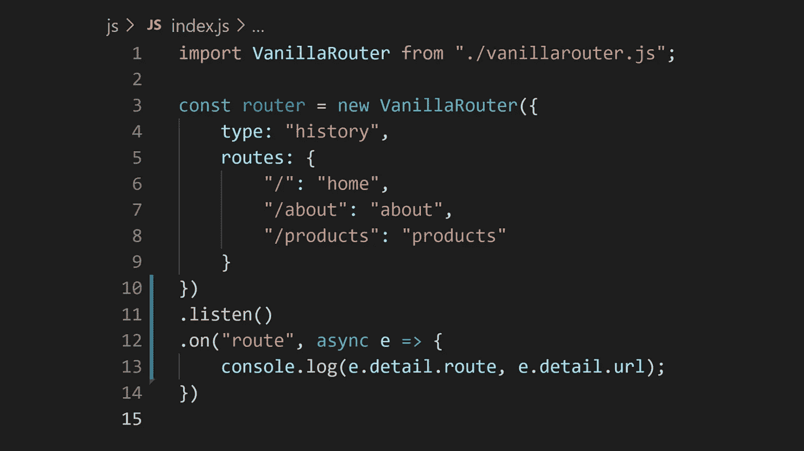

# 纯普通 ES6 JavaScript 的 SPA/PWA 路由器

> 原文：<https://javascript.plainenglish.io/a-spa-pwa-router-in-pure-vanilla-es6-javascript-e8f79cfd0111?source=collection_archive---------0----------------------->


Photo by [Arnold Francisca](https://unsplash.com/@clark_fransa?utm_source=medium&utm_medium=referral) on [Unsplash](https://unsplash.com?utm_source=medium&utm_medium=referral)

人们选择诸如 Angular、Vue 或 React 之类的 JavaScript 框架用于 SPAs/PWAs 的第一个也是最重要的原因之一是， **JavaScript 没有内置的路由器**。

看着我的谷歌搜索结果，我决定自己用普通的 ES6 JavaScript 写一个。

作为我自己，我对我的普通路由器有一些要求:

1.  应该是 ES6 类模块
2.  它应该支持历史(`pushState` / `popState`)和基于散列(`hashchange`)的路由
3.  它应该非常容易使用
4.  它应该提供真实的 JavaScript 事件来与之交互
5.  它应该与任何组件架构完全分离，这样开发人员就有充分的自由来应对路由变更
6.  它应该尽可能的简洁明了。

# 使用

我可以在这里列出所有的代码(正如我所说的，这并不多)，但我认为从用法开始更有意义，同时查看需求:



Using the VanillaRouter Component

事实上，从使用模式开始是测试驱动设计的基石，并且被认为是最佳实践，正如优秀的开发人员所知道的😉。

上面显示的代码还说明了如何满足 6 个需求中的 5 个。第 6 个要求，好吧，我邀请你看看代码(下面)。

# 履行

让我们先来看看基本设置:

```
class VanillaRouter {
   constructor(options = {}) {
     // ...
   }
}
```

listen 方法需要返回一个对路由器的引用，允许链接(参见 on() 方法中的

```
*listen() {
   // ...
   return this;
}*
```

## *核心*

*对于基于历史的路由，*window . history . pushstate()*和*窗口*上的 *popstate* 事件是你的好友。您可以在 [MDN](https://developer.mozilla.org/en-US/) 中查找它们。*

*对于基于散列的路由，我们依赖于*窗口*上的 *hashchange* 事件。*

*其他有趣的部分是启动时设置的 *routeHash* 。这有助于有效地将传入的 URL 与配置的路由进行匹配。*

*最后但同样重要的是，事件系统(完全组件化和可重用)使用 document . createdocumentfragment()能够简单地重用 HTML 事件调度和监听。很管用。我在任何地方都用这个。*

# *开源代码库*

*你可以在 https://github.com/mvneerven/vanillarouter 的[找到来源](https://github.com/mvneerven/vanillarouter)*

*[](https://github.com/mvneerven/vanillarouter) [## GitHub - mvneerven/vanillarouter

### 人们为 spa/PWAs 选择 JavaScript 框架的第一个原因是 JavaScript 没有一个…

github.com](https://github.com/mvneerven/vanillarouter) 

# 演示

看一个工作中的[演示](https://vanillaroute.z6.web.core.windows.net/)，作为一个无服务器的静态网站托管在 Azure Blob 存储上。

# 最上乘的白兰地酒（特陈级）

这里展示的普通路由器是我的 [XO-JS 组件库](https://www.xo-js.dev/)中路由器组件的独立副本。

# 最后的话

如果你喜欢这个，给点掌声和/或[在 GitHub](https://github.com/mvneerven/vanillarouter) 上开始回购。

*更多内容尽在*[***plain English . io***](http://plainenglish.io/)*