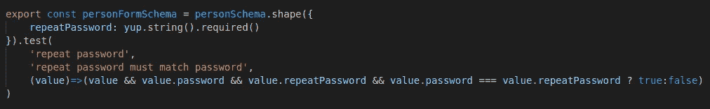

# TypeScript 运行时数据验证器比较

> 原文：<https://javascript.plainenglish.io/a-typescript-runtime-data-validators-comparison-15f0ea2e3265?source=collection_archive---------8----------------------->

## 第四部分:是的

这是基于我的实践经验的运行时数据验证器比较系列报告的第 4 篇。在继续本系列的其余部分之前，您应该阅读第一篇文章中的介绍，以理解制作该报告所涉及的目标和测试方法。

1.  [简介](/a-typescript-runtime-data-validators-comparison-50a6abf3c559)
2.  [io-ts](/a-typescript-runtime-data-validators-comparison-eeedc6b0583a)
3.  [joi](/a-typescript-runtime-data-validators-comparison-c422e431926a)
4.  是的
5.  [ajv](/a-typescript-runtime-data-validators-comparison-cdbb532f0b89)
6.  佐德
7.  [超级结构](/a-typescript-runtime-data-validators-comparison-67cb9abb599b)

# 介绍

Yup“深受 joi 的启发”，在很多方面与 joi 相似。然而，它声称“比 joi 更精简，以客户端验证为主要用例”。

# 设计目标的实现

## 1.一个定义，多种用途——通过小故障实现

Yup 提供现成的类型推断。事实上，它更进一步，通过提供两个类型推断操作符，`yup.TypeOf<typeof schema>`和`yup.Asserts<typeof schema>`，分别提取可能是**转换(类型强制)**结果的数据类型，以及将通过验证的**输入数据的类型。**

下面显示了“Person”模式是如何定义的。请注意，yup API 与 joi API 是多么相似。另外，请注意“性别”属性的定义有点绕弯。它可以被更简单地定义，但是“性别”属性的推断类型将只是字符串，而不是文字类型的联合。

类型推理通常是可行的，但也有一些小问题。下面是从 Person 模式推断出的类型。注意,“sex”属性不是可选的，与模式不匹配。如果我在调用链的末尾添加一个`.optional()`，那么“sex”属性的推断类型将变成`any`。此外，`TypeOf`操作符似乎只是将`undefined`添加到由`Asserts`操作符推断出的类型的联合中。在[这篇文章](https://colinhacks.com/essays/zod)中对 yup 的类型推断的批评比较多。

yup 文档承认“由于 yup 的动态性，并不是所有东西都可以安全地进行统计”，但认为它对大多数情况来说“足够好了”。

## 2.可组合和可扩展的模式—已实现

与 joi 类似,“Driver”模式是通过扩展“Person”模式定义的。

“车队”模式是通过组装“驾驶员”和“车辆”模式来定义的。

下面是从 Fleet 模式推断出的类型在 VS Code 代码辅助中的样子，不是很整洁漂亮。然而，当用于类型检查时，推断的类型仍然可以工作——只是有一些小问题。

## 3.丰富的功能集—已实现

Yup 提供了丰富的开箱即用的特性。

## 4.完成和中止-早期验证-已实现

与 joi 类似，yup 也接受一个`abortEarly`选项来选择执行完整验证还是提前中止验证。完整验证的结果提供了数据中发现的所有故障的详细信息。下面是无效车队对象的验证结果的一部分。

## 5.可组合和可定制—存档

组合验证关键字和添加自定义验证函数非常容易。

下面是 PersonForm 模式定义，带有一个自定义函数来验证重复密码是否与密码相同。

## 6.类型强制和默认—已实现

与 joi 类似，默认情况下，yup 执行类型强制。如果不需要，可以通过在模式中链接一个`.strict(true)`来跳过类型强制来关闭它。

为了提供默认值，在模式中链接一个`default()`调用。请参见上面 Person 模式中定义的“性别”属性作为示例。

## 7.可遍历模式—已实现

模式的内部配置可以通过调用它的`describe()`方法来公开。可以在项目的`/solutions/yup`目录下的`traversable.test.ts`测试用例中找到对 yup 模式的探索演示。

## 8.标准—否

# 摘要

Yup 深受 joi 的启发，两者都以其流畅的 API 和丰富的现成特性提供了良好的开发人员体验。Yup 进一步为 TypeScript 提供了类型推断。然而，当模式变得有点复杂时，yup 类型推理也有其缺陷。

Yup 声称是 joi 的更精简和浏览器友好的替代品。yup 和 joi 之间的相似性使得从一个转换到另一个很容易。