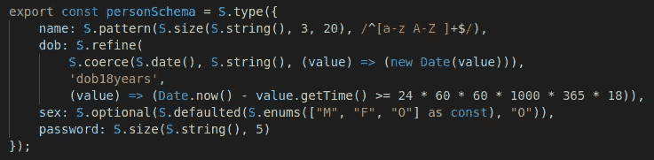
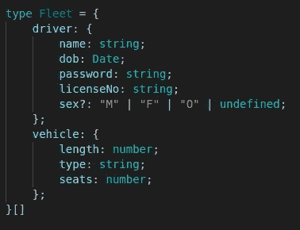
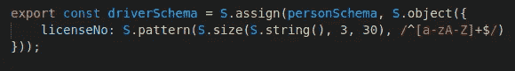
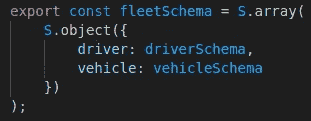
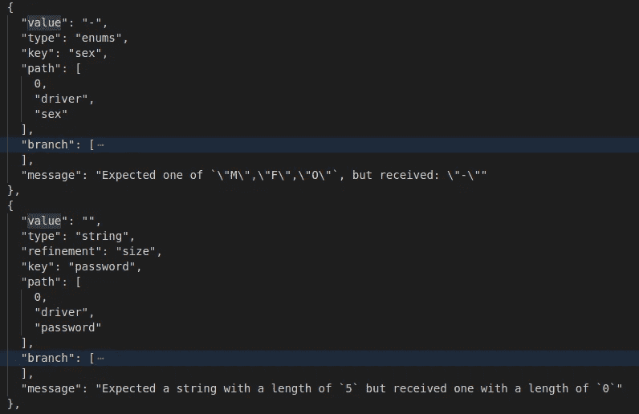
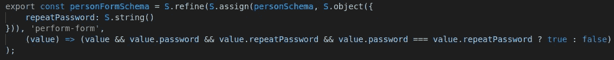

# TypeScript 运行时数据验证器比较

> 原文：<https://javascript.plainenglish.io/a-typescript-runtime-data-validators-comparison-67cb9abb599b?source=collection_archive---------10----------------------->

## 第 7 部分:上部结构

这是基于我的实践经验的运行时数据验证器比较系列报告的第 7 篇。在继续本系列的其余部分之前，您应该阅读第一篇文章中的介绍，以理解制作该报告所涉及的目标和测试方法。

1.  [简介](/a-typescript-runtime-data-validators-comparison-50a6abf3c559)
2.  [io-ts](/a-typescript-runtime-data-validators-comparison-eeedc6b0583a)
3.  [joi](/a-typescript-runtime-data-validators-comparison-c422e431926a)
4.  [对](/a-typescript-runtime-data-validators-comparison-15f0ea2e3265)
5.  [ajv](/a-typescript-runtime-data-validators-comparison-cdbb532f0b89)
6.  佐德
7.  建于

# 介绍

Superstruct 是另一个新人，创建于 2017 年 11 月。它没有依赖性，压缩后的大小只有 3.2 KB，是测试过的验证器中最小的包。后端和前端都可以用。

# 设计目标的实现

## 1.一个定义，多种用途—已实现

Superstruct 用“结构”定义数据。最简单的结构是那些验证原始值的结构，比如字符串和数字。“细化”，如“大小”、“模式”，接受一个现有的结构，并创建一个新的结构，进一步在其上添加一些额外的验证。下面显示了“Person”模式是如何定义的。

Superstruct 不使用 fluent API(方法链)。相反，细化，例如用于定义“name”属性的“pattern”和“size ”,将另一个结构作为第一个参数，然后跟随其他参数。这种嵌套风格的麻烦之处在于嵌套的括号层，对于最外层的调用，例如“name”属性中的“pattern”细化，您需要跳过所有其他内部调用及其参数来找到它的另一个参数，即模式。

尽管如此，这只是有点烦人，但还不算太糟糕。

还要注意“性别”属性定义中的“`as const`”，这是为了保留类型推断的文字值。

Superstruct 在类型推断方面做得非常出色。以下是车队的推断类型，测试项目中最复杂的数据。它是干净的，正确的，并且运行良好。

## 2.可组合和可扩展的模式—已实现

如下所示,“Driver”模式是通过扩展“Person”模式定义的。

“车队”模式是通过组装“驾驶员”和“车辆”模式来定义的。

## 3.丰富的功能集—已实现

Superstruct 提供了丰富的现成功能集。

## 4.完成和中止-早期验证-已实现

默认情况下，对于第一次遇到的失败，superstruct 会抛出一个错误。error 对象提供了一个生成器，然后可以迭代该生成器以检索更多的错误，直到完成完整的验证。这种“随需应变”的方法是非常聪明的设计。

下面是无效车队对象的验证结果的一部分。

## 5.可组合和可定制—存档

如前所述，Superstruct 使用“细化”来组合关键字。嵌套调用方式有点烦人，但还不算太糟糕。

下面是 PersonForm 模式定义，带有一个自定义的“refine”来验证重复密码是否与密码相同。

## 6.类型强制和默认—已实现

Superstruct 支持强制，即在验证输入数据之前对其进行转换。“默认”功能支持默认值功能。“强制”功能支持自定义强制或转换。它还提供了一个“trim”功能来确保输入字符串被修剪。因此，superstruct 不仅适用于数据验证，也适用于数据转换。

有关定义自定义强制和默认值的示例，请参见上面 Person 模式中“dob”和“sex”属性的定义。

## 7.可遍历模式—已实现

很容易从结构(模式)中遍历和提取有用的信息。查看`traversable.test.ts`测试案例了解更多详情。

## 8.标准—否

# 摘要

我很高兴我在研究中遇到了 Superstruct。它在各个方面都工作得很好。特别是，类型推理产生干净和正确的类型，工作得非常好。文件组织得很好。API 设计经过深思熟虑，提供了极大的灵活性。它是用 TypeScript 写的，非常支持 TypeScript。此外，它没有依赖性，大小只有 3.2KB。我唯一的抱怨是嵌套调用方式有点烦人，但还不算太糟糕。

Zod 或 Superstruct 可能是我下一个项目的选择。你的呢？