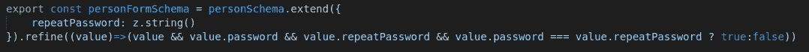

# TypeScript 运行时数据验证器比较

> 原文：<https://javascript.plainenglish.io/a-typescript-runtime-data-validators-comparison-92887e22ee65?source=collection_archive---------6----------------------->

## 第六部分:佐德

这是基于我的实践经验的运行时数据验证器比较系列报告的第 6 篇。在继续本系列的其余部分之前，您应该阅读第一篇文章中的介绍，以理解制作该报告所涉及的目标和测试方法。

1.  [简介](/a-typescript-runtime-data-validators-comparison-50a6abf3c559)
2.  [io-ts](/a-typescript-runtime-data-validators-comparison-eeedc6b0583a)
3.  [joi](/a-typescript-runtime-data-validators-comparison-c422e431926a)
4.  [对](/a-typescript-runtime-data-validators-comparison-15f0ea2e3265)
5.  [ajv](/a-typescript-runtime-data-validators-comparison-cdbb532f0b89)
6.  佐德
7.  [超级结构](/a-typescript-runtime-data-validators-comparison-67cb9abb599b)

# 介绍

Zod 是测试过的验证器中的新人，吸收了许多前辈的思想。zod 的创建者研究了几个流行的验证器(joi、yup 和提到的 io-ts ),并决定从头开始构建自己的验证器。这个验证器背后的思想可以在这里找到[。](https://colinhacks.com/essays/zod)

Zod 的依赖性为零，在浏览器和 Node.js 中都可以工作，而且体积非常小。它采用了函数式方法，但是非常容易使用，并且不需要对函数式编程有很深的理解。在撰写本文时，它也在积极开发中。

# 设计目标的实现

## 1.一个定义，多种用途—已实现

Zod 还使用一个流畅的 API 来定义数据，这使得使用它变得容易和愉快。下面显示了“Person”模式是如何定义的。请注意(1)我不需要像使用“Yep”时那样迂回地定义“sex”属性，以便更好地进行类型推断，(2)为“dob”属性进行内联自定义验证“refine ”,以检查该人是否至少 18 岁，以及(3)使用 transform()函数将类型转换为 Date 而不是 string。Zod 还支持使用[预处理()](https://github.com/colinhacks/zod#preprocess)来执行类型强制。

提供更好的类型推断(至少比 yup 更好)是 zod 的一个设计目标。它很好地实现了这个目标。下面是从舰队模式推断出的类型。它看起来和工作正常。

zod 如何不要求在“sex”属性的枚举定义中使用 const 断言(`as const`)，并且仍然设法将类型推断为文字类型的联合，从而避免文字类型扩大？我钻研了佐德的源代码，从中学习了一些技巧。如果你好奇，窍门就在这四行:看这里的，这里的，这里的，这里的。为佐德的创造者科林·麦克唐奈的杰作鼓掌！

## 2.可组合和可扩展的模式—已实现

如下所示,“Driver”模式是通过扩展“Person”模式定义的。

“车队”模式是通过组装“驾驶员”和“车辆”模式来定义的。

## 3.丰富的功能集—已实现

Zod 提供了丰富的现成特性集。

## 4.完成和中止-早期验证-完成验证

`.parse(data: unknown)`方法进行完整的验证。完整验证的结果提供了数据中发现的所有故障的详细信息。下面是无效车队对象的验证结果的一部分。

该文献没有提到快速、提前中止的验证。

## 5.可组合和可定制—存档

与 joi 和 yup 类似，使用 zod 的 API 来组合关键字并添加自定义验证功能非常容易。

下面是 PersonForm 模式定义，带有一个自定义的“refine”来验证重复密码是否与密码相同。

## 6.类型强制和默认—已实现

类型强制可以通过[预处理()](https://github.com/colinhacks/zod#preprocess)实现。默认值可以通过 [default()](https://github.com/colinhacks/zod#default) 实现。类型转换也可以用 [transform()](https://github.com/colinhacks/zod#transform) 实现。

## 7.可遍历模式—已实现

模式的内部配置可以在模式的`_def`属性下找到。很容易穿越。然而，属性名以下划线开头的事实表明，它是供内部使用的，可能会有变化。

## 8.标准—否

# 摘要

佐德是个新人，是 2020 年 3 月创建的。它吸收了前人的许多思想，很容易使用。它很小，没有依赖性，在浏览器和 Node.js 中都可以工作，它的类型推断工作得特别好。唯一缺少的特性是快速、提前中止的验证。