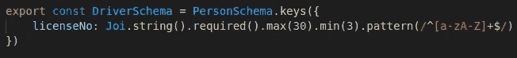
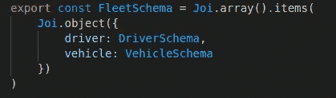

# TypeScript 运行时数据验证器比较

> 原文：<https://javascript.plainenglish.io/a-typescript-runtime-data-validators-comparison-c422e431926a?source=collection_archive---------9----------------------->

## 第三部分:joi

这是基于我的实践经验的运行时数据验证器比较系列报告的第 3 篇。在继续本系列的其余部分之前，您应该阅读第一篇文章中的介绍，以理解制作该报告所涉及的目标和测试方法。

1.  [简介](/a-typescript-runtime-data-validators-comparison-50a6abf3c559)
2.  [io-ts](/a-typescript-runtime-data-validators-comparison-eeedc6b0583a)
3.  约伊
4.  [没错](/a-typescript-runtime-data-validators-comparison-15f0ea2e3265)
5.  [ajv](/a-typescript-runtime-data-validators-comparison-cdbb532f0b89)
6.  [佐德](/a-typescript-runtime-data-validators-comparison-92887e22ee65)
7.  [超级结构](/a-typescript-runtime-data-validators-comparison-67cb9abb599b)

# 介绍

Joi 是最早创建的(2012 年 9 月),也是测试过的验证器中第二受欢迎的验证器(根据下载量)。它以定义数据的“简单、直观、可读的语言”而自豪，并在实现这一目标方面做得很好。

# 设计目标的实现

## 1.一个定义，多种用途—可实现

Joi 不是用 TypeScript 编写的，但是它提供了自己的类型定义，并且可以很好地使用 TypeScript 代码。下面显示了“Person”模式是如何定义的。请注意流畅的 API(方法链接)和现成的丰富特性，以及它如何使完成工作变得容易和愉快。

Joi 不提供从其模式到现成的 TypeScript 类型的类型推断。但是，您可以使用第三方库 [joi-to-typescript](https://www.npmjs.com/package/joi-to-typescript) ，将 joi 模式转换为 typescript 接口。下面是 joi-to-typescript 为 Person 模式生成的接口。

生成的接口与运行时模式非常匹配。“性别”属性被正确地类型化为文字类型的联合，并且是可选的。然而，代码生成方法意味着您确实需要在构建过程中添加一个步骤。

## 2.可组合和可扩展的模式—已实现

“驱动程序”模式是通过扩展“人”模式来定义的，而无需重新定义“人”模式的属性。

“车队”模式是通过组装“驾驶员”和“车辆”模式来定义的。

joi-to-typescript 为“Driver”和“Fleet”模式生成的接口看起来也非常好。

## 3.丰富的功能集—已实现

Joi 提供了丰富的开箱即用的特性。

## 4.完成和中止-早期验证-已实现

通过提供一个`abortEarly`选项，Joi 可以被配置为执行完整的和提前中止的验证。完整验证的结果提供了数据中发现的所有故障的详细信息。下面是无效车队对象的验证结果的一部分。

## 5.可组合和可定制—存档

Joi 的流畅 API 使得组合验证关键字变得非常容易。添加自定义验证函数也很容易。

下面是 PersonForm 模式定义，带有一个自定义函数来验证重复密码是否与密码相同。

## 6.类型强制和默认—已实现

Joi 默认提供类型强制。如果不需要，可以通过在模式中链接一个选项`.options({convert: false})`或链接一个`.raw()`来关闭它。有关示例，请参见上面的 Person 模式中定义的“dob”属性。

为了提供默认值，在模式中链接一个`default()`调用。请参见上面 Person 模式中定义的“性别”属性作为示例。

## 7.可遍历模式—已实现

模式的内部配置可以通过调用它的`describe()`方法来公开。joi 模式的探索演示可以在项目的`/solutions/joi`目录下的`traversable.test.ts`测试用例中找到。

## 8.标准—否

# 摘要

Joi 成熟、受欢迎，在提供流畅的开发人员体验方面做得很好。

然而，joi 包是测试过的验证器中最大的。并且它不为 TypeScript 提供现成的类型推断。此外，还有一个[声明](https://www.npmjs.com/package/joi-browser)称“为浏览器打包一个合理版本的 joi 有些困难”，这导致了“joi-browser”包的出现。

joi 的成功启发了其他一些验证器，包括 yup，这将在本系列的下一篇文章中讨论。