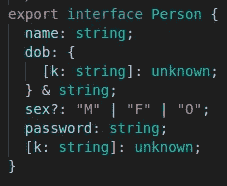

# TypeScript 运行时数据验证器比较

> 原文：<https://javascript.plainenglish.io/a-typescript-runtime-data-validators-comparison-cdbb532f0b89?source=collection_archive---------7----------------------->

## 第 5 部分:ajv

这是基于我的实践经验的运行时数据验证器比较系列报告的第 5 篇。在继续本系列的其余部分之前，您应该阅读第一篇文章中的介绍，以理解制作该报告所涉及的目标和测试方法。

1.  [简介](/a-typescript-runtime-data-validators-comparison-50a6abf3c559)
2.  [io-ts](/a-typescript-runtime-data-validators-comparison-eeedc6b0583a)
3.  [joi](/a-typescript-runtime-data-validators-comparison-c422e431926a)
4.  [对](/a-typescript-runtime-data-validators-comparison-15f0ea2e3265)
5.  ajv
6.  [佐德](/a-typescript-runtime-data-validators-comparison-92887e22ee65)
7.  [超级结构](/a-typescript-runtime-data-validators-comparison-67cb9abb599b)

# 介绍

Ajv 是一个基于 JSON 模式的验证器，这使它有别于其他测试过的验证器。Ajv 自称“超级快”，后端(Node.js)和前端(浏览器)都管用。独特的是，ajv 采用了一种代码生成方法，并支持生成独立的失效代码。

就下载量而言，ajv 是测试过的验证器中最受欢迎的，下载量是第二受欢迎的(joi)的 10 倍。

# 设计目标的实现

## 1.一个定义，多种用途——可实现，有故障

Ajv 是用 TypeScript 编写的，可以很好地使用 TypeScript。然而，ajv 本身并不提供从 JSON Schema 到 TypeScript 类型的生成，反之亦然。

下面是“个人”数据的模式。请注意“dob”属性中使用的自定义关键字“olderThanFromNow ”,以及为“sex”属性提供的默认值。

有一些第三方工具可以将 JSON 模式转换为 TypeScript 类型。我测试了[JSON-schema-to-type script](https://www.npmjs.com/package/json-schema-to-typescript)包。它可以工作，但是有一些小故障。下面是从“Person”模式生成的界面。

属性“sex”被类型化为文字类型的联合，并且是可选的，这与模式完全匹配。然而,“dob”属性的类型是错误的，不能给它赋值。

还有其他工具以相反的方式工作，从带注释的 TypeScript 类型生成 JSON 模式。然而，我发现他们的文件都有点不足。他们能处理自定义验证关键字吗？他们如何处理组合关键词，如“所有的”、“任何的”、“一个的”？这些都是悬而未决的问题。

我的观点是，最好用 JSON Schema 编写模式并生成 TypeScript 类型，而不是相反。首先，JSON Schema 拥有比 TypeScript 类型更丰富的一组关键字(比如最小/最大长度)。其次，JSON Schema 是一个定义良好且有文档记录的标准。另一方面，那些用于增强 TypeScript 类型的注释不像 JSON Schema 那样定义和记录良好。

## 2.可组合和可扩展的模式—已实现

通过将“$ref”与组合关键字(如“allOf”、“anyOf”和“oneOf”)一起使用，可以组合和扩展现有模式。请阅读“理解 JSON 模式”一书中的“[扩展](https://json-schema.org/understanding-json-schema/structuring.html#extending)”一节，以获得进一步的说明和示例。

下面是“司机”的模式，它是从“人”的模式扩展而来的

“车队”模式是通过组装“驾驶员”和“车辆”模式来定义的。

为了允许模式相互引用，在“$ref”中的路径必须与被引用模式的“$id”相匹配，并且所有的模式都应该被添加到 ajv 实例中。下面展示了 ajv 实例是如何构造的。

## 3.丰富的功能集—已实现

JSON schema 提供了一组丰富的现成的关键字。

## 4.完成和中止-早期验证-已实现

通过提供一个`[allErrors](https://ajv.js.org/options.html#validation-and-reporting-options)`选项，Ajv 可以被配置为执行完整的和提前中止的验证。完整验证的结果提供了数据中发现的所有故障的详细信息。下面是无效车队对象的验证结果的一部分。

## 5.可组合和可定制—存档

支持现成的关键字组合。ajv 支持自定义关键字。详见 ajv 文档中的[自定义关键字](https://ajv.js.org/guide/user-keywords.html)和 ajv 项目的[文档](https://github.com/ajv-validator/ajv/blob/master/docs/keywords.md#define-keyword-with-code-generation-function)。

我用 ajv 定义自定义关键字的经验是，关于这方面的 ajv 文档有点含糊不清，不完整(目前有一些断开的链接，我还需要查看 ajv 的源代码以了解更多信息)。我花了一段时间才弄明白如何创建一个用于数据验证的关键字，甚至花了更多的时间来创建一个用于数据强制的关键字。Ajv 允许用四种方法定义关键字:代码生成、验证函数、编译函数和宏函数。代码生成似乎是首选方法，因为所有预定义的关键字都是用这种方法定义的。然而，使用代码生成有点绕弯，很难进行故障排除和调试。

下面是如何创建两个自定义关键字。关键字“olderThanFromNow”是使用代码生成方法创建的，关键字“toDate”是作为验证函数创建的。

## 6.类型强制和默认—已实现

Ajv 有内置的类型强制，遵循这里[记载的类型强制规则](https://ajv.js.org/coercion.html)。要启用它，请在 ajv 实例构造过程中使用`true`传递`coerceTypes`选项。

但是，ajv 不提供从 ISO 日期字符串到日期对象的现成强制。为了实现这一点，我创建了一个自定义关键字“toDate ”,如上所示。custom 关键字用强制值替换属性的值。

Ajv 也支持缺省值，这是通过用`true`传递`useDefaults`选项来实现的。

## 7.可遍历模式—已实现

Ajv 是基于 JSON 模式标准的，这是一个定义良好、文档完备的标准。模式只是简单的旧 javascript 对象，很容易被遍历。

## 8.标准—是

# 摘要

Ajv 是一个基于 JSON 模式的验证器。如果您希望用标准语言定义您的数据，这可能是您的选择。

然而，ajv 并不是最容易使用的。JSON Schema 不难学。"[理解 JSON 模式](https://json-schema.org/understanding-json-schema/)"是一本好书。有了合适的代码编辑器的支持，编写代码也不会太难。然而，与 joi 和 yup 等验证器提供的 fluent API 相比，JSON schema 有点冗长。用 ajv 定义自定义关键字比用其他验证器更复杂，部分原因是模式是在文档中定义的，而不是在代码中定义的，部分原因是没有足够的文档和代码生成。还有，JSON Schema 是一个 JSON 文档，不支持注释，这个事实有点烦人。

Ajv 不支持从模式生成 TypeScript 类型。我测试了一个第三方工具，结果不太令人满意。

Ajv 还支持从模式中生成独立验证功能模块的代码。然而，尽管[文档](https://github.com/ajv-validator/ajv/blob/master/docs/standalone.md)指出使用独立验证代码的一个原因是它是“预编译的，可以在没有 ajv 的情况下使用”，但后来该文档提到“Ajv 包仍然应该是大多数模式的运行时依赖项，但生成的模块只能依赖于它的一小部分，因此如果您需要应用程序代码中具有独立验证代码的模块，整个 Ajv 将不会包含在包中(或被执行)。”还有一个限制。使用独立验证代码时，仅支持使用代码生成定义的自定义关键字。

总之，ajv 是一个基于明确定义的标准的强大且非常受欢迎的验证器。然而，这可能有点难以操作(至少在开始阶段)。保持 TypeScript 类型和模式同步可能很棘手。