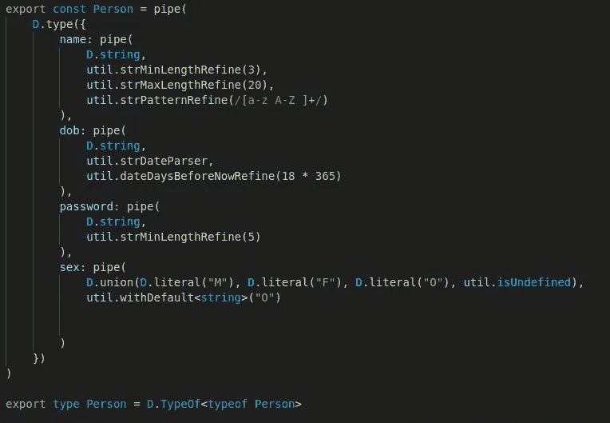
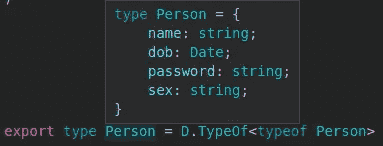
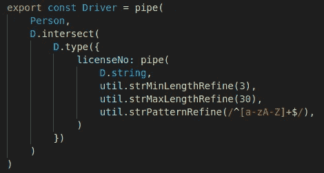
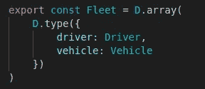
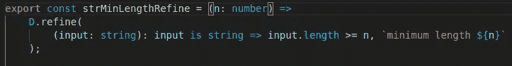
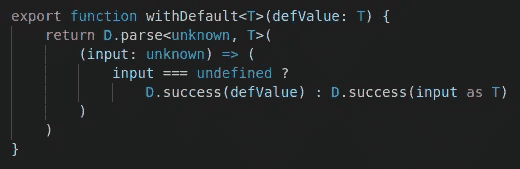

# TypeScript 运行时数据验证器比较

> 原文：<https://javascript.plainenglish.io/a-typescript-runtime-data-validators-comparison-eeedc6b0583a?source=collection_archive---------5----------------------->

## 第 2 部分:io-ts

这是基于我的实践经验的运行时数据验证器比较系列报告的第二篇。在继续本系列的其余部分之前，您应该阅读第一篇文章中的介绍，以理解制作该报告所涉及的目标和测试方法。

1.  [简介](/a-typescript-runtime-data-validators-comparison-50a6abf3c559)
2.  io-ts
3.  [joi](/a-typescript-runtime-data-validators-comparison-c422e431926a)
4.  [没错](/a-typescript-runtime-data-validators-comparison-15f0ea2e3265)
5.  [ajv](/a-typescript-runtime-data-validators-comparison-cdbb532f0b89)
6.  [佐德](/a-typescript-runtime-data-validators-comparison-92887e22ee65)
7.  [超级结构](/a-typescript-runtime-data-validators-comparison-67cb9abb599b)

# 介绍

[io-ts](https://github.com/gcanti/io-ts) 是一个“运行时型 io 解码/编码系统”。它的创建者 gcanti 还为 TypeScript 中的类型函数编程创建了流行的库“fp-ts”。“fp-ts”是“io-ts”的对等依赖。“io-ts”和“fp-ts”都属于函数式编程范式。没有“fp-ts”和对函数式编程概念的一些理解，“io-ts”真的不能使用。

# 设计目标的实现

## 1.一个定义，多种用途——通过小故障实现

静态 TypeScript 类型可以使用 TypeOf 运算符从运行时模式(在 io-ts 中称为“编解码器”)中推断出来。下面显示了如何定义“Person”模式，以及如何从中推断出相应的 TypeScript 类型。注意“fp-ts”中“管道”的使用和代码的函数式编程风格。

在 VS 代码中，将鼠标光标移动到推断出的类型上会显示其详细信息。

但是，推断的类型并不尽可能好地匹配运行时架构。“sex”属性应该是可选的，并且可以作为文字类型的联合(' M'|'F'|'O ')而不是字符串类型。

## 2.可组合和可扩展的模式—已实现

“驱动程序”模式是通过扩展“人员”模式来定义的，无需重新定义其中的属性。

“车队”模式是通过组装“驾驶员”和“车辆”模式来定义的。

## 3.丰富的功能集—不太丰富

一些常见的验证特性，比如要求最小/最大字符串长度和匹配字符串模式，并不是现成的。它们需要由自定义的“refine”来提供。

## 4.完成和中止-早期验证-仅完成验证

io-ts 完成验证并返回一个包含输入数据中所有失败的结果对象。然而，有用的信息隐藏在无数的包装器中，需要一个报告器(提供了默认的报告器)来检索和利用这些信息。

在 io-ts 文档中没有提到提前中止验证。

## 5.可组合和可定制—存档

请参见“人员”模式。io-ts 中的验证“解码器”可以通过“管道”或其他组合符(如“联合”和“细化”)进行组合。您还可以定义自定义解码器或“细化”。

下面是一个自定义的“优化”,用于验证字符串是否有最小长度。

## 6.类型强制和默认—已实现

类型强制和默认值都可以通过编写自定义的“解析”组合子来实现。“解析”组合子可以接收输入类型的值，并输出不同类型的值。下面是用于提供默认值的“withDefault”组合器。

## 7.可遍历模式-未实现

我只是不知道如何从 io-ts 解码器中遍历和提取信息。

## 8.标准—否

# 摘要

io-ts 非常灵活，但对函数式编程也非常固执，甚至将函数式编程的纯粹性置于流畅的开发人员体验之上。它的文档有点稀疏，缺乏细节。要使用 io-ts，你确实不能避免使用 fp-ts 和函数式编程。如果你不熟悉函数式编程概念，姑且说它确实有一个学习曲线。

另一方面，如果你是一个坚持严格的函数式编程规则的人，io-ts 和 fp-ts 对你来说都可能是一个不错的选择。

*代表* [***团队，感谢阅读。***](https://plainenglish.io/)