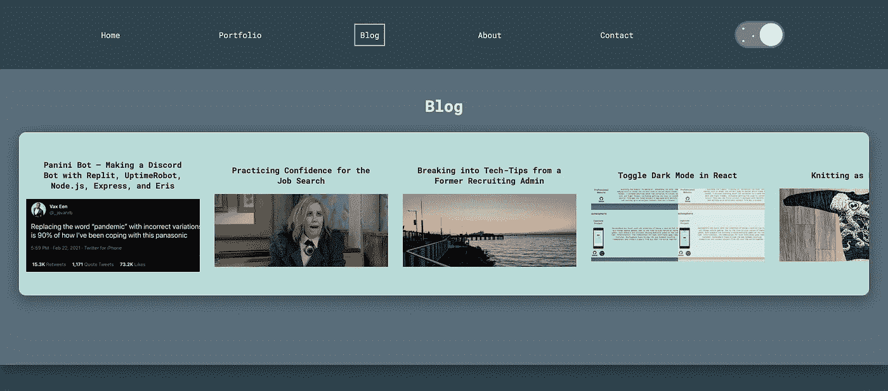
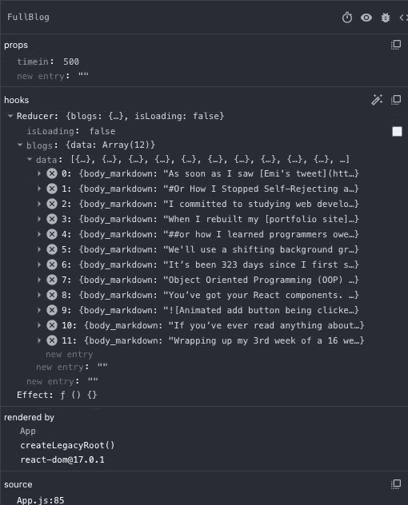
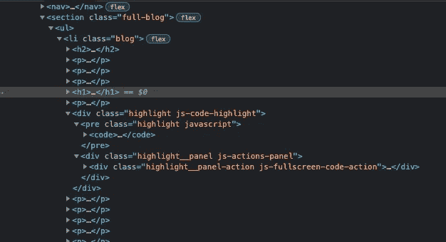

# 用 Netlify 函数和 DEV API 更新我的投资组合站点—演练

> 原文：<https://javascript.plainenglish.io/a-walkthrough-of-updating-my-portfolio-site-with-netlify-functions-and-the-dev-api-ef8312d0f743?source=collection_archive---------11----------------------->



我意识到，在与新开发人员的交谈中，我的大部分博客帖子的格式暗示我在构建项目时从头到尾都遵循线性路径。当你刚开始的时候，感觉高级开发人员已经知道他们开始时的最终结果是什么。而你，另一方面，甚至不知道从哪里开始。带着这个想法，我一点一点地写了这篇文章。结果是一个曲折的旅程，从我如何选择这个项目开始，到部署、我想重温的事情和演示日结束。在这两者之间是代码示例以及它们背后的弯路和动机。

最终，我在五天的空闲时间里写了这篇作品集网站更新，目的是在[虚拟咖啡](https://virtualcoffee.io) [的](https://virtualcoffee.io)'s)演示日展示它。

# 目录

1.[怎么挑什么建？](#b59f)
2。我如何构建它？
3。[设置我的 lambda 服务器](#3915)
4。[在状态](#6f3a)
5 下存储数据。[转换数据](#113a)
6。[为 Blog 和 SingleBlog 组件再做一次](#57c7)
7。[部署](#2d19)8
。[演示日](#f9d2)
9。[结论](#e723)

# 如何挑选要构建的内容？

首先，你必须找到一个要解决的问题。它不一定是一个原创的问题或者是一个以前没有人解决过的问题。只是一个你想解决的问题。

在这种情况下，我一直在为我的博客文章的投资组合站点手写静态 JSX 文件。当我将其中的 10 个导入我的 React 组件时，我知道这不是最终的解决方案，但当我试图在截止日期前部署我的投资组合时，这是最快的解决方案。

当我发现 DEV 有一个 API 可以发送你每个博客的 HTML 时，我在我的 [portfolio site repo](https://github.com/abbeyperini/Portfolio2.0) 中创建了一个分支，重写了我的 FullBlog 组件，并尝试从已建立的 Blog React 组件中调用 API。没有骰子。CORS 误差。现在我知道我需要一台服务器，这样我就可以使用 CORS 软件包或其他解决方案。此时，我还注意到我必须调用 DEV API /articles/me 端点来获取我的每个博客的 id，然后用 id 调用/articles/{id}端点来获取 HTML 版本或找到 markdown 版本的解决方案。

大概一个月的时间，我试图想出一个我想使用的免费服务器托管解决方案。我觉得 Heroku 太慢了。我考虑过使用 gcloud，因为有一些免费的选项，但是我不想再去解析 gcloud 文档了。

我想到采纳我自己的建议，使用我的项目中已经使用的工具。我有一个无服务器的 Netlify 表单，人们喜欢 Netlify 的无服务器 AWS lambda 函数，所以我决定从那里开始。得出这个结论后，离#demoInPublic 月度挑战宣布还有几个星期，我承诺为演示日做这个。

如果 Netlify 没有提供一个优秀的解决方案，我会开始向朋友寻求技术建议，或者选择一项我一直想使用的技术，并开始围绕它进行构建。

# 我该如何构建它？

有疑问的时候，就开始写吧。
——用伪代码写出来。
——写最简单/最小的部分。

当我第一次开始时，我接受了每个项目提示，并在一个函数或类中用伪代码注释写出了需求，如下所示:

```
function getBlogs(requiredData) {
 // http request to API
 // with required headers and data
 // send back response
 // handle errors
}
```

然后我会挑选最小的部分，试着用代码写出来。当我陷入困境或者需要用伪代码来表达想法时，我仍然会使用伪代码。大多数时候，我可以从写代码开始，但无论哪种方式，我仍然选择最小的部分，只专注于让它工作。我必须使用这种方法来设置我的 lambda 服务器，并且几乎每天都在工作中使用。通常最可怕的事情是获取文件中的前几个字符。

## 把它分解成最小的部分

我已经有造型和其余的组件建成，所以对于这个项目，我知道我需要:
1。从 DEV API
2 请求我所有博客的数据。在我的 FullBlog 组件
3 中存储状态数据。转换数据并显示出来
4。对我的博客和 SingleBlog 组件再做一次

我肯定可以进一步分解这些，所以我将从最小部分的最小部分开始——编写一个 [Netlify 函数](https://www.netlify.com/products/functions/)。

# 设置我的 lambda 服务器

首先，我仔细阅读了 Netlify 提供的文档和教程，发现了几个很好的资源来帮助我入门: [Matt Burrell 的 Wish You are Here repo](https://github.com/mattburrell/wishyouwerehere)用于从 API 调用向组件传递数据，以及 [Kent C. Dodd 的教程](https://kentcdodds.com/blog/super-simple-start-to-netlify-functions)用于 netlify-lambda 包技巧。

在花了一个半小时阅读文档并通过反复试验建立了 Netlify 函数之后，我的修改如下:

```
npm install netlify-lambda axios
```

我的项目 repo 的根目录中的一个`netlify.toml`文件，它告诉`netlify-lambda`在构建期间将函数放在哪里:

```
[build]
 functions = “build/functions”
```

我的 repo 的根目录下有一个名为 functions 的文件夹，其中有一个名为`blogPosts.js`的文件，看起来像这样:

```
const axios = require(‘axios’)exports.handler = function () {

 axios.get(‘[https://dev.to/api/articles/me'](https://dev.to/api/articles/me'), {
   headers: {
   “Api-Key”: “{{MY_API_KEY}}”,
   “Content-Type”: ‘application/json’
   }
 })
 .then((response) => { return console.log(response.data) })
 .catch((error) => { return console.log(error) })
}
```

要从 DEV 获取 API 密钥，您必须登录您的帐户，访问[https://dev.to/settings/account](https://dev.to/settings/account)，键入项目名称，然后单击“生成 API 密钥”

在这一点上，我只是在`return` ing `console.log` s，因为我想验证 API 调用正在工作，没有 CORS 错误的机会。在这之后，我花了相当多的时间让我的`netlify-lambda build`和`serve`命令工作，这样我的 lambda 服务器就可以运行了。我必须向我的`package.json`添加 2 个脚本:

```
“start:lambda”: “netlify-lambda serve functions”,
“build:lambda”: “netlify-lambda build functions”
```

“函数”是我的网络函数的源文件夹，这些函数将被构建到`netlify.toml`中引用的“构建/函数”文件夹中。在我最终在脚本和`netlify.toml`中拥有正确的文件夹之前，我得到了很多错误。

所以现在，我可以在终端中运行`npm run start:lambda`并导航到 [http://localhost:9000/。在浏览器中输入 netlify/functions/blog posts](http://localhost:9000/.netlify/functions/blogPosts)并从 https://dev.to/api/articles/me[那里得到一个`console.log`的响应。](https://dev.to/api/articles/me)

接下来，我想测试从我的组件调用 lambda 函数。我将这个函数添加到我的`FullBlog`组件中:

```
async function fetchBlogs() {
 const res = await axios.get(‘[https://abbeyperini.dev/.netlify/functions/blogPosts'](https://abbeyperini.dev/.netlify/functions/blogPosts'))
 .then((response) => { return console.log(response) })
 .catch((error) => { return error })

 return await res
 }
```

然后我得到了一个 CORS 错误。我碰巧在和一些高级开发人员通话，所以我给他们看了。他们指出，链接到我的投资组合领域，而不是本地主机！感谢 [Ray Deck](https://twitter.com/ray_deck) 和 [David Alpert](https://twitter.com/davidalpert) 对 CORS 的建议和指出。从那时起，我停止了当天的编码工作。

醒来后，我短暂地考虑过对我的博客 id 进行硬编码，以避免一次 API 调用。当我不试图思考代码时，思考代码似乎是我过程的一部分。

因此，在这一点上，我没有得到 CORS 错误或组件中的数据。玩了大约一个小时后，我意识到即使我的 lambda 服务器收到了 GET 请求，也没有任何东西被发送回来。我试图实现一个回调 a la Matt Burrell，然后做了一些进一步的挖掘。结果是，Netlify 函数的操作更像是一个服务器路由，而不是一个 JavaScript 函数，所以一旦我将`blogPosts.js`更新成这样:

```
exports.handler = async function (event, context) {
 let response;
 try {
   response = axios.get(‘[https://dev.to/api/articles/me'](https://dev.to/api/articles/me'), {
     headers: {
     “Api-Key”: “{{MY_API_KEY}}”,
     “Content-Type”: ‘application/json’,
     “mode”: ‘cors’
     }
   })
 } catch (err) {
   return {
     statusCode:err.statusCode || 500,
     body: err.message 
   }
 } return {
   statusCode: 200,
   body: JSON.stringify({
   data: response
   })
  }}
```

我又开始从我的 React 组件得到一个 CORS 错误，还有来自 Lambda 服务器的控制台日志，比如:

```
Request from ::1: GET /.netlify/functions/blogPosts
Response with status 200 in 3 ms.
```

而以前，我只能获得 GET 请求日志。

我还简化了我的组件。我第一次尝试使用`useReducer()`,但是在我可以在组件中获得数据之前，我想减少可能的错误数量。这与我目前在请求中硬编码实际的 API 键值的原因是一样的——我想知道我的所有值都被实例化、导入，并且对于调试都是正确的。现在我的整个组件看起来像这样:

```
function FullBlog() { const [data, setData] = useState(“not replaced”) async function get() {
  let res = await axios.get(‘[http://localhost:9000/.netlify/functions/blogPosts'](http://localhost:9000/.netlify/functions/blogPosts'))
  return res
 } useEffect(() => {
   setData(get())
 }, []) return (
   <section className=”full-blog”>
   <p>Data here:{data}</p>
   </section>
 )
}
```

注意:因为我只是在一个`<p>`标签中添加了响应，所以我也得到一个“对象作为一个反应子对象无效(发现:[对象承诺])”在我的浏览器控制台，但这至少告诉我，我得到了一些东西回来。

## 解决 CORS 误差

在这一点上，我有三个选择，在我看来，从最大时间承诺/复杂性到最小:
1。只需编写一个 node express 服务器并托管它
2。写个代理
3。看看响应/请求头是否可以修复它

所以我调出了雷发给我的标题选项。在大约 25 分钟的谷歌搜索、测试和随意添加头之后——包括对 API 的请求——我找到了 Ben Borger 的例子。经过一点点的反复试验，我已经让标题工作了，但是我意识到我还需要一个`await`。之前我只是发出了一个未兑现的承诺。我的组件现在正在接收数据，我的 lambda 函数如下所示:

```
exports.handler = async function (event, context) {
 let response;
 try {
   response = await axios.get(‘[https://dev.to/api/articles/me'](https://dev.to/api/articles/me'), {
     headers: {
       “Api-Key”: “{{MY_API_KEY}}”,
       “Content-Type”: ‘application/json’
     }
   })
 } catch (err) {
   return {
     statusCode:err.statusCode || 500,
     body: err.message,
     headers: {
       “Access-Control-Allow-Origin”: “[http://localhost:3000](http://localhost:3000)”,
       “Access-Control-Allow-Methods": “GET”
     }
   }
 } return {
   statusCode: 200,
   body: JSON.stringify({
   data: response
   }),
   headers: {
     “Access-Control-Allow-Origin”: “[http://localhost:3000](http://localhost:3000)”,
     “Access-Control-Allow-Methods”: “GET”
   }
 }}
```

为了浏览器的安全，我使用了特定的方法和来源，而不仅仅是`*`。

# 在状态中存储数据

所以现在我要回去让我的`useReducer()`工作了。一旦我将数据存储在 state 中，就很容易操作和显示它。

为了简洁起见，我不会从头开始编写 reducer 或 React 组件，但是如果这是您感兴趣的另一个博客，请留下评论。我在和 Kirk 谈论 DEV API 和 T2 vs Redux 的时候写了整个组件。他有一个很棒的 pokemon 示例，旨在展示 typescript 的好处，该示例基于由 Dan Ott 编写的组件。在修复了几个拼写错误后，我的 FullBlog 组件看起来像这样:

```
function FullBlog() { const initialState = {
    isLoading: false,
    blogs: null
  } async function fetchBlogs() {
    const res = await axios.get(‘[http://localhost:9000/.netlify/functions/blogPosts'](http://localhost:9000/.netlify/functions/blogPosts'))
   dispatch({
     type: “blogFetched”,
     payload: res.data
   })
 } const reducer = (state, action) => {
     switch (action.type) {
     case “blogLoading”:
       return {
         …state,
         isLoading: true
       };
     case “blogFetched”:
       return {
         …state,
         isLoading: false,
         blogs: action.payload
       };
     case “blogFetchFail”:
       return {
         …state,
         isLoading: false,
         error: action.payload
       };
     default:
       return {
         …state,
         isLoading: false,
         error: “unknown error”
       };
     }
  } const [state, dispatch] = useReducer(reducer, initialState); useEffect(() => {
   async function load() { dispatch({
       type: “blogLoading”
     })

     fetchBlogs()
   } load()
 }, []) return (
    <section className=”full-blog”>
    <p>Data here</p>
    </section>
  )
}
```

这是我第一次没有将所有的动作类型都设置为变量，我被告知要这样做，因为很容易拼错。当然，我确实拼错了一个动作类型，但是多亏了我的减速器中的`default`块，我几乎立刻就发现了它。

还没有显示任何东西，但是由于有了 [React 开发工具 Chrome 扩展](https://chrome.google.com/webstore/detail/react-developer-tools/fmkadmapgofadopljbjfkapdkoienihi?hl=en)，我可以看到我的组件的状态，如下所示:



这个视图还帮助我意识到，在今天的某个时候，我已经将状态中的变量名改为了 data，而不是 blogs。把它换回来修复了一个不稳定的国家结构。

# 转换数据

如果说我在 bootcamp 中学到了什么，那就是在页面上显示从 API 返回的内容列表的第一步是将数据映射到带有一个键(通常是从 API 返回的 id)和一个要显示的字段(通常是标题字段)的`<li>`标签。首先，我用这个替换了我原来的`return`块:

```
if (!state.isLoading && state.blogs !== null) {
  let blogList = state.blogs.data.map((blog) => {
    return (
      <li key={blog.id}>
        <p>{blog.title}</p>
      </li>
    )
  }) return (
    <section className=”full-blog”>
      <ul>
        {blogList}
      </ul>
    </section>
  )
} else {
  return (
   <p>Blogs loading!</p>
  )
}
```

现在我已经有了一个标题显示列表，我将研究如何显示它。DEV API 从/articles/me 端点返回一个带有`body_markdown`字段的博客数组。首先，我将研究显示降价。

Google 向我展示了一些包，比如 markdown-to-jsx 和 react-markdown，但是带有反勾的代码片段可能会导致问题。你可能已经注意到阅读这篇文章，我的博客经常涉及许多代码块。因为我有点赶时间，所以我决定在这一点上使用来自/articles/{id}端点的带有`body_html`字段的响应。

现在，我需要决定是维护一个博客 id 的静态列表，还是编辑我的 lambda 函数来从/articles/me 中获取所有 id，为每个 id 调用/articles/{id},并返回一个博客数组。我喜欢后者的想法，主要是因为它不涉及维护硬编码数据。

经过一些尝试和错误之后，我的 lambda 服务器现在返回一个带有`body_html`字段的博客数组，如下所示:

```
async function getAllBlogsByID(blogIDs) {
  let blogArray = [] for (let i = 0; i < blogIDs.length; i++) {
    let blog = await getBlogByID(blogIDs[i])
    blogArray.push(blog)
  } return blogArray
}async function getBlogByID(id) {
  let blog = await axios.get(`[https://dev.to/api/articles/${id}`](https://dev.to/api/articles/${id}`), {
    headers: {
      “Api-Key”: “{{MY_API_KEY}}”,
      “Content-Type”: ‘application/json’
    }
  })
  return blog.data
}exports.handler = async function (event, context) {
  let articlesByUser
  let blogIDs = []
  try {
    articlesByUser = await axios.get(‘[https://dev.to/api/articles/me'](https://dev.to/api/articles/me'), {
      headers: {
        “Api-Key”: “{{MY_API_KEY}}”,
        “Content-Type”: ‘application/json’
      }
    })
  } catch (err) {
    return {
      statusCode:err.statusCode || 500,
      body: err.message,
      headers: {
        “Access-Control-Allow-Origin”: “[http://localhost:3000](http://localhost:3000)”,
        “Access-Control-Allow-Methods": “GET”
      }
    }
  } articlesByUser.data.forEach(blog => blogIDs.push(blog.id))
  let allBlogs = await getAllBlogsByID(blogIDs) return {
    statusCode: 200,
    body: JSON.stringify({
      data: allBlogs
    }),
    headers: {
      “Access-Control-Allow-Origin”: “[http://localhost:3000](http://localhost:3000)”,
      “Access-Control-Allow-Methods”: “GET”
    }
  }}
```

然而，当我将`body_html`字段插入到我的 JSX 地图中时，它只是显示一个带有一堆 html 标签的字符串。一个快速的谷歌展示给我`html-react-parser`，在最简单的安装和应用之后，我的博客上加载了漂亮的图片和链接。我所要添加的只是导入(`import parse from ‘html-react-parser’;`)和我的博客地图上的几行文字:

```
let blogList = state.blogs.data.map((blog) => {
  let blogBody = parse(blog.body_html)
  return (
    <li key={blog.id}>
      <h1>{blog.title}</h1>
      {blogBody}
    </li>
 )
})
```

在变量/url 清理和部署之前剩下的就是样式和 Blog 和 SingleBlog 组件，所以今天我就讲到这里。

我编写组件时，假设我可以随心所欲地应用`classNames`，所以我的样式需要稍微调整一下。我还注意到 DEV 在代码块下添加了一些我不想要的图标。我遵循了一个 BEM 命名方案，并用注释组织了我的 CSS，我很高兴它能如此容易地应用到新格式中。

我将把`className=”full-blog`留在组件的`<section>`标签中，将`className=”blog”`添加到地图中的`<li>`中，注释掉本节中的所有其他规则，并删除两条带有 id 的规则。我们的情况已经很好了。我的博客有浅色的背景，一些间距，文本居中，有适当的边距。

接下来，我逐个取消对规则的注释，并开始将带有我不能使用的类名的选择器改为`.blog {element}`选择器。更改我的图像规则提醒我也要更改媒体查询规则。现在，我的图像和它们的标题看起来是正确的。另外，你也应该感谢 DEV 回了我所有的短信。

接下来看代码块，我注意到一些事情。



类名中的空格意味着我只能使用空格之前的部分名称作为有效的 CSS 选择器。幸运的是，这足以隐藏代码块图标。然而，这导致容器`<div>`及其子容器`<pre>`具有相同的类——“高亮”。在我第一次尝试改变选择器之后，除了一个边界被两次应用到`<div>`和`<pre>.`之外，一切都运行良好。谢天谢地，`{{element}}.{{class}}`选择器很容易就解决了这个问题。

最后，标题有点不靠谱。标题是一个`<h2>`，但最大的身体标题是一个`<h1>`。我必须为标题编写一个`:first-of-type`选择器，然后为文章主体中的标题编写选择器。我还删除了我为不必要的长副标题制定的`.blog_published-heading`规则(我喜欢这些)。选择器似乎在很大程度上捕捉到了它们。在某种程度上，我可能想标准化我在 DEV 中设置标题的方式，但不是今天。

在这一点上，通过滚动，我发现了一些我想修复的东西:
-代码块和正文标题周围的边距
-一些图像左对齐而不是居中
-我的代码块居中，而不是我想要的左对齐

添加边距很简单。这些图像都包含在一个带有类`article-body-image-wrapper`的`<a>`中，所以为了解决这个问题，我将添加另一个规则，用`justify-content: center`将 anchor 标签转换成一个 flex 容器。

解决代码块对齐问题也提醒了我，我有媒体对此的疑问。更新这些得到了合适的宽度，但是我的通用选择器`text-align: center`规则比我进一步添加的任何`text-align`规则都更加具体。经过一点试验和错误之后，看起来将`text-align: left`添加到`pre.highlight` 规则中可以解决这个问题。我可以尝试做一些挑剔的事情，但是让我们把摆弄代码块样式添加到我希望在将来重新讨论的事情列表中。

此时，我的 FullBlog 组件的 CSS 如下所示:

```
/* full blog */.blog img {
  max-width: 200px;
  margin: 10px;
}.article-body-image-wrapper {
  display: flex;
  justify-content: center;
}.blog h2:first-of-type {
  font-size: 2em;
}.blog h1 {
  font-size: 1.5em;
  margin: 10px;
}.blog h2 {
  font-size: 1em;
  margin: 10px;
}.blog em {
  font-style: italic;
  font-size: 1em;
  max-width: 250px;
  overflow-wrap: break-word;
}.full-blog {
  background: var( — light-background);
  display: flex;
  flex-direction: column;
  align-items: center;
  justify-content: center;
}.blog {
  margin: 10px 0px 10px 0px;
  padding: 20px;
  border-radius: 10px;
  background: var( — accent);
  display: flex;
  flex-direction: column;
  align-items: center;
  justify-content: center;
}.blog ul {
  flex-direction: column;
  justify-content: center;
  flex-wrap: wrap;
  width: 50%;
}.blog li {
  list-style-type: disc;
  margin: 10px;
  text-align: left;
}.highlight__panel {
  display: none;
}div.highlight {
  background-color: #eee;
  border: 1px solid black;
  padding: 10px;
  border-radius: 10px;
  margin: 10px;
}pre.highlight {
  white-space: pre-wrap;
  max-width: 250px;
  overflow-x: auto;
  text-align: left;
}code {
  padding: 1px 5px 1px 5px;
}.blog p, .blog blockquote {
  padding: 0px;
  margin: 5px;
  text-align: left;
  width: 50%;
}
```

有了这些相关的媒体询问:

```
/* media queries */[@media](http://twitter.com/media) screen and (min-width: 350px) { pre.highlight {
    max-width: 300px;
  }
}[@media](http://twitter.com/media) screen and (min-width: 525px) { .blog img {
    max-width: 250px;
  } pre.highlight {
    max-width: 500px;
  }
}[@media](http://twitter.com/media) screen and (min-width: 700px) { .subAbout, .subContact, .blog {
    margin: 20px;
  } .blog img {
    max-width: 300px;
  } pre.highlight {
    max-width: 650px;
  }
}[@media](http://twitter.com/media) screen and (min-width: 900px) { .blog img {
    max-width: 500px;
  } pre.highlight {
    max-width: 100%;
  }
}[@media](http://twitter.com/media) screen and (min-width: 1200px) { .blog em {
    max-width: 500px;
  }
}
```

# 对 Blog 和 SingleBlog 组件重复上述操作

博客组件位于我的作品集的主页上，显示我所有博客的预览，带有标题和封面图片。我希望我的 Blog 组件能够获取与 FullBlog 相同的信息，但只显示其中的一小部分。当您在 blog 组件中单击一篇博文的标题时，它应该只加载该博文的 SingleBlog 组件。

在这一点上，我需要考虑我的状态架构，尽量不要重复代码。我试着将我的 reducer、state 和`fetchBlogs()`移动到它们共同的父组件中，但是这真的打乱了我的状态。在这一点上，我将复制一些代码，并考虑我是否甚至需要 Fullblog 组件，或者我是否可以从我的字体页面重构 Blog 组件，以便在将来的某个时候处理预览、单个 Blog 和完整 Blog。

我的博客组件已经有了一个从父组件传递下来的回调函数，用于选择要呈现的单个博客。我将重写它以使用博客 id 并触发一个 lambda 函数，但首先让我们让这个组件加载博客预览。稍微摆弄了一下，我的预览正在加载。不幸的是，DEV 没有封面图片的替代文本，所以我的替代文本是非描述性的。Blog 和 FullBlog 的主要区别是我的地图:

```
let blogPreviewList = state.blogs.data.map((blog) => {
  let altText = `cover image for ${blog.title}`
  let blogImage = ‘’;if (blog.cover_image) {
  blogImage = blog.cover_image
} else if (blog.social_image) {
  blogImage = blog.social_image
}return (
  <li key={blog.id} className=”blog”>
    <h2 onClick={() => chooseComponent({id: blog.id})}>{blog.title}</h2>
    </img>
  </li>
 )
})
```

现在，我花几分钟看我的回调函数，试图记住它是如何工作的。我的`app.js`文件中的主要组件 App 具有显示哪些组件的状态，以及一个使用`setState()`并被传递给博客组件的`chooseComponent()`函数。

```
function App() {
 const [hidden, setHidden] = useState(false);
 const [single, setSingle] = useState(false);
 const [singleShow, setSingleShow] = useState(‘’);const chooseComponent = (component) => {
  setSingle(true);
  setSingleShow(component);
}<MainFull condition={hidden && !single} component={<Blog chooseComponent={chooseComponent} />} />
```

主要的组件和条件分别是渲染组件的 CSS 转换和状态。下面是我的博客组件中的 passing `chooseComponent()`的样子:

```
function Blog(props) { const chooseComponent = (component) => {
    props.chooseComponent(component);
  }
```

在`app.js`中，我为让`chooseComponent()`使用博客 id 所做的更改如下所示:

```
const [singleBlogID, setSingleBlogID] = useState(0);const chooseComponent = (component) => {
  if (component.id) {
    setSingle(true)
    setSingleBlogID(component.id)
    setSingleShow(“SingleBlog”)
  } else {
    setSingle(true);
    setSingleShow(component);
  } 
}<Single condition={hidden && single && singleShow === “SingleBlog”} component={<SingleBlog id={singleBlogID} />}/>
```

接下来，我创建了我的 SingleBlog 组件。我将从 props 中的博客预览中传递 id，将其添加到 state 中，并创建一个对 lambda 函数的新请求。现在我只需要找到一种方法将 id 传递给 lambda 函数。这是一天休息的好地方。

在使用 lambda 函数一段时间后，我发现在 url 中传递 id 是可行的，而在主体中带有 id 的 POST 请求却不行。我的`SingleBlog.js`文件现在看起来像这样:

```
const axios = require(‘axios’)exports.handler = async function (event, context) {let id = event.queryStringParameters.id
  try {
    let blog = await axios.get(`[https://dev.to/api/articles/${id}`](https://dev.to/api/articles/${id}`), {
      headers: {
        “Api-Key”: “{{MY_API_KEY}}”,
        “Content-Type”: ‘application/json’
      }
    })return {
      statusCode: 200,
      body: JSON.stringify({
        data: blog.data
      }),
      headers: {
        "Access-Control-Allow-Origin": "[http://localhost:3000](http://localhost:3000)"
        "Access-Control-Allow-Methods": "GET"
      }
    } } catch (err) {
    console.log(err)
    return {
      statusCode:err.statusCode || 500,
      body: err.message,
      headers: {
        "Access-Control-Allow-Origin": "[http://localhost:3000](http://localhost:3000)"
        "Access-Control-Allow-Methods": "GET"
      }
    }
  }}
```

我不得不稍微调整一下我的`SingleBlog`组件，但是 CSS 一旦加载数据就可以完美地应用。我将 id 带出状态，并在 Blog 中的`onClick()`中传递它:

```
<h2 className=”preview_button” onClick={() => chooseComponent({id: blog.id})}>{blog.title}</h2>
```

我的 SingleBlog `fetchSingleBlog()`和`useEffect()`函数现在看起来像这样:

```
async function fetchSingleBlog(id) {
  const res = await axios.get(`[http://localhost:9000/.netlify/functions/singleBlog?id=${id}`](http://localhost:9000/.netlify/functions/singleBlog?id=${id}`)) dispatch({
    type: “blogFetched”,
    payload: res.data.data
  })
}useEffect(() => { async function load() { dispatch({
      type: “blogLoading”
    })

    fetchSingleBlog(props.id)
  } load()
 }, [])if (!state.isLoading && state.blog !== null) { let blogBody = parse(state.blog.body_html) return (
    <section className=”full-blog”>
      <ul>
        <li key={state.blog.id} className=”blog”>
          <h2>{state.blog.title}</h2>
          {blogBody}
         </li>
      </ul>
    </section>
  )
} else {
  return (
    <p>Blogs loading!</p>
  )
}
```

我的博客预览 CSS 样式应用起来也相当轻松。我唯一调整的是`.preview`和`.preview_image`的宽度和高度规则，因为 DEV 返回的封面图片的横向格式与我使用的不同。然而，它更加标准化，这很好。

## 组件中的错误处理

部署前的最后一件事——我有一个错误动作类型，但是目前没有向 reducer 发送任何错误！

首先，我像这样更新我的 axios 请求:

```
async function fetchBlogs() {
  axios.get(‘[http://localhost:9000/.netlify/functions/blogPosts'](http://localhost:9000/.netlify/functions/blogPosts'))
  .then((res) => {
    dispatch({
      type: “blogFetched”,
      payload: res.data
    })
  }).catch((error) => {
    dispatch({
      type: “blogFetchFail”,
      payload: error
    })
  })
}
```

然后，我将一个`else if`语句添加到我的返回结果中，位于我的组件的底部:

```
else if (!state.isLoading && state.error) {
  return (
    <p>There was an error! Try again later.</p>
  )
} 
```

# 部署

当我试图入睡时，我意识到我把钥匙交给了一家公共回购公司。幸运的是，我可以从我的手机上撤销它。早上我生成了一把新钥匙。然后是清理我的钥匙和路线的时候了。

我曾经在某个地方读到过，如果您在环境变量的开头添加`REACT_APP_`，那么`.env`文件将与 React 一起工作，在我的例子中，这立即被证明是错误的。然而，我的错误处理工作得很好！

常规的 dotenv 包不是为前端设计的，所以接下来我将尝试 dotenv-webpack。在安装并添加了一个带有导入的`webpack.config.js`文件后，我重命名了我的`API_KEY`变量，添加了一个`BASE_URL`变量和一个`ORIGIN_URL`变量，但它仍然不工作。

我所有的阅读都向我保证 lambda 函数将能够访问我在 Netlify 的 UI 中设置的环境变量，并且有一种方法可以使用 netlify-dev 包在本地为它们设置环境变量。此时，我的演示还不到 48 小时，所以我将对 URL 进行硬编码，看看部署是否可行，并使本地环境变量成为以后的问题。值得注意的是，我的 React 组件和 lambda 函数在部署后都将位于 https://abbeyperini.dev 中，所以我可能只需要为本地开发解决那些 CORS 问题。

在第一次部署之后，我必须将`props.id`添加到我的 SingleBlog 组件的依赖数组中，因为如果出现警告，Netlify 构建就会失败。第二次部署导致了一次成功的构建，但是函数没有显示出来。Netlify 会在构建日志中告诉你它是否在部署函数，并且有一个函数选项卡可以在函数运行时查看日志。在多次尝试和阅读大量文档和论坛帖子后，我最终将我的`netlify.toml`改为 Matt Burrell 使用的:

```
[build]
  Command = “npm run build && npm run build:lambda”
  Functions = “netlify”
  Publish = “build”
```

我认为它解决了我的函数不能构建的问题，因为它告诉 Netlify 运行 build 命令。将它们移动到 Netlify 期望的默认文件夹中可能也没有坏处。嵌套文件夹可能有问题。

在 deploy attempt 9 中，我将`console.log(error)`添加到我的 blogPosts 函数中，并意识到我在昨晚撤销 API 键后还没有旋转它。然而，一切都正常，包括 Netlify UI 中设置的`API_KEY` 环境变量！环境变量似乎是在构建时被拉进来的，所以如果你编辑了一个，你必须触发一个新的构建才能看到它。我的站点通常由主分支的`git push`来触发构建，但是在部署选项卡中有一个按钮来触发部署。最后，一切都是生活和工作！

在这一点上，我仍然有一个我想重温的事情列表:
-找到一个 markdown 解析解决方案来避免我偶尔从许多 API 调用中得到的 429 错误— [完成！](https://abbeyperini.medium.com/blog-page-accessibility-deep-dive-92ffb5f5ee8d)
——代码块样式——[完成！](https://abbeyperini.medium.com/blog-page-accessibility-deep-dive-92ffb5f5ee8d)
-可爱的错误和加载图形— [完成！](/adding-shiba-inu-loading-and-error-svgs-to-my-react-site-48f59806362c)
-可能将我的 3 个博客组件重构为 1 个或 2 个，以减少重复代码— [完成！](https://abbeyperini.medium.com/blog-page-accessibility-deep-dive-92ffb5f5ee8d)

# 演示日

从历史上看，演示日不是我的强项。最初，我很难描述我为什么要构建我所构建的东西，也没有深入任何关于我的代码的细节。在这一点上，我仍然会非常紧张，并开始说得非常快。

虚拟咖啡演示日对我来说比过去好得多。尽管我是最后一名，但我在开始时还是以正常速度起步，只是稍微加快了一点。为了做好准备，我制作了一个我想展示的功能的快速视频，以防它在演示前/演示过程中被破坏。我写下了我想涵盖的内容，包括我想展示的代码片段，并在演示前的几个小时里练习了几次。

演示结束后，[贾斯汀·诺尔](https://twitter.com/JustinNoelDev)伸出手来告诉我，我可以通过添加`prefers-reduced-motion` `@media`查询使我的网站的登陆页面更容易访问。我为这个博客添加的最后一段代码如下所示:

```
[@media](http://twitter.com/media) (prefers-reduced-motion) {
  .bg, .bg2, .bg3 {
    animation-name: dissolve;
  }
}
```

您可以在 [MDN 参考文档](https://developer.mozilla.org/en-US/docs/Web/CSS/@media/prefers-reduced-motion)中了解有关该查询和触发该规则的用户设置的更多信息。我很感谢我没有使用任何非常激烈的动画，我在登陆这个之前尝试过，这正是我想要的反馈类型，每当我分享我的代码。

# 结论

我写这篇博客的目的是想让大家明白，建造东西很少是一个线性的过程。我也希望它能让我了解如何分解、处理和解决大大小小的问题。你可以查看我的[投资组合回购](https://github.com/abbeyperini/Portfolio2.0)中的所有代码，并观看我的[演示日记录](https://drive.google.com/file/d/1DXMEfr5-AQn6vk9ntCK5VPKv4C6Ogidc/view?usp=sharing)。

也许你也注意到了我不是一个人这么做的。我使用了从未谋面的开发人员编写的文档、教程和代码片段。(大声喊出来，DEV API 的文档中有响应结构示例——非常有用！)当我遇到一个 CORS 问题时，我曾短暂地与资深开发人员配对。这个特定项目的动力来自其他高级开发人员，他们在视频电话中告诉我一些我不知道的事情。更不用说，如果没有来自[虚拟咖啡](https://virtualcoffee.io)的演示日，我就不会得到可访问性提示或找到完成它的动力。

## 附言

我提到过想要重新标准化我在 DEV 博客文章中写标题的方式。当交叉发布到 Medium 时，我注意到是我把我的标题写为`<h2>` s。我已经把我的 JSX 和 CSS 更新为`<h1>` s，所以现在我页面上的所有标题都是降序排列的。为了便于访问，我还是想回去把我在 DEV 上的所有标题降级，让`<h2>`和`<h3>`出现在我的文章正文中。

*更多内容尽在*[***plain English . io***](http://plainenglish.io/)