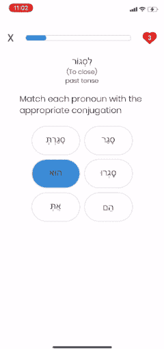

# 举例说明 JavaScript 中的函数组合

> 原文：<https://javascript.plainenglish.io/a-working-example-of-function-composition-in-javascript-5e8c704a13ca?source=collection_archive---------6----------------------->

## 函数式编程:在执行长过程时，函数组合是保持代码整洁、可读的一种很好的方式。

在本文中，我们将简要介绍函数组合的概念，并讨论它如何使 JavaScript 项目更具可读性。然后，我们将讨论一个工作示例来演示这一点。


## 那么什么是函数合成呢？

数学上，[函数合成](https://www.mathsisfun.com/sets/functions-composition.html)是将一个函数应用于另一个函数的结果，例如:

```
Given:
**g(x) = x + 5
f(x) = x / 2**Let's evaluate: **f(g(5))**First...
**g(5) = 5 + 5** //we get 10Then...
**f(10) = 10 / 2** //we get 5So... **f(g(5)) = 5**
```

如果你明白了，太好了！但我们是程序员，不是数学家，对吗？那么我们如何用比较科学的术语来定义它呢？

> **“功能组合**是将两个或两个以上的功能组合起来产生一个新功能的过程。将函数组合在一起就像是将一系列管道连接在一起，让我们的数据流过。”— [Eric Elliot，JavaScript 高手访谈:什么是函数组合？](https://medium.com/javascript-scene/master-the-javascript-interview-what-is-function-composition-20dfb109a1a0)

现在让我们在 ES6 中尝试一下:

好的。现在感觉不错，但是当我们需要组合越来越多的函数时会发生什么呢？比如说:

```
a(b(c(d(e(5))))
```

读起来不太愉快，是吗？这就是常用的 compose 函数的用处。

## 构成

Compose 将从一个函数获取输出，并自动将它修补到下一个函数的输入，并一次又一次地重复这个过程，直到它吐出最终值。我们可以使用一个库(如 ramda 或 lodash ),也可以创建自己的组合方法，如下所示:

基本上，这个高阶函数接受任意数量的函数作为参数，然后返回一个函数，这个函数将从右到左调用这些给定的函数。你可以在这里阅读更多关于它是如何工作的[。这有点令人困惑，所以让我们用之前介绍的例子来试一试:](https://medium.com/free-code-camp/pipe-and-compose-in-javascript-5b04004ac937)

现在可能感觉不到显著的差异，但是考虑一下当作品变得非常大时，例如:

```
**a(b(c(d(e(5))))**becomes...**compose(a,b,c,d,e)(5)**
```

谈论更少的括号和更多的可读性，我说的对吗？

## 一个工作实例

让我们探索一下 compose 函数，它被用来为一个教希伯来语动词变化的[教育应用实例化一个匹配游戏](https://github.com/jtalz/hebrootsMobileClient)。最后，这里是我们应该期待看到的:



假设我们得到了一组`conjugation_pronoun`对象(在西班牙语中，出于同样的 ASCII 字符目的),如下所示:

忘记所有本质的样式细节，现在只关注 JavaScript，我们如何将这些数据转化为我们的最终产品？要考虑以下几点:**配对游戏一共呈现六张牌。三个动词变化和三个代词。另外，卡片是随机排列的。**基于这些考虑，初始化我们的匹配游戏的程序步骤必须是:

1.随机选择 3 个变化代词对象
2。独立代词和动词变化
3。洗牌的对象(牌)顺序
4。显示用户界面

首先，让我们构建我们的助手方法。

接下来，假设我们有一个名为`**displayUI**` 的函数，它获取我们的最终输出，并在屏幕上显示所有的卡片，让我们探索几种不同的方法来将我们的助手方法联系在一起。

这真的很麻烦，让我想起了链接，并且不太可能让你成为团队中最受欢迎的开发人员。我认为这里的另一个问题是陷入超深度嵌套函数调用的可能性，这是我们想要避免的。

这个怎么样？

这样更好，但我认为还是有办法去掉不必要的赘言。我们也可以不需要声明一次性使用的变量。

让我们尝试使用我们的**编写**函数:

看那个！很好用！

## 结论

通过利用 compose 函数，我们成功地执行了所有必要的任务，并且用更简洁、可读性更好、但描述性更强的几行代码实现了相同的目标。

随意查看完整应用程序[的源代码。如果你打算使用 compose 和/或类似的函数，我还推荐你去看看](https://github.com/jtalz/hebrootsMobileClient) [lodash](https://lodash.com/docs/4.17.15) 或 [ramda](https://ramdajs.com/) 库。

谢谢！