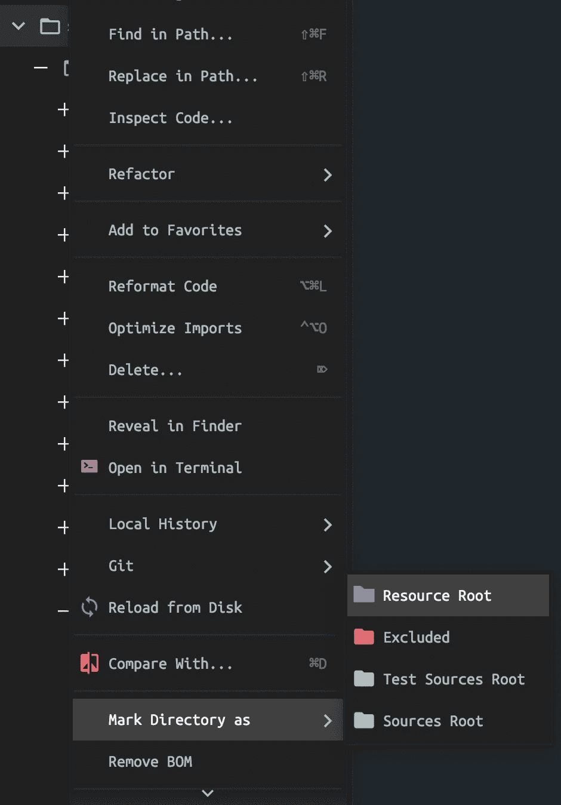
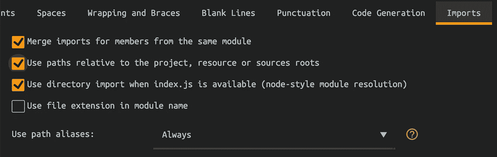

# 不再../../../在 React 中导入

> 原文：<https://javascript.plainenglish.io/absolute-imports-for-create-react-app-components-eb0eadf2e1c8?source=collection_archive---------20----------------------->

Photo by [Andy Li](https://unsplash.com/@andasta?utm_source=unsplash&utm_medium=referral&utm_content=creditCopyText) on [Unsplash](https://unsplash.com/s/photos/imports?utm_source=unsplash&utm_medium=referral&utm_content=creditCopyText)

在 [Create React App](https://create-react-app.dev/) 中配置绝对导入的步骤，没有任何第三方包。

是进口`../../../../somecomponents`这样的组件吗？那么你应该更新到绝对进口。

# 绝对进口的好处

1.  您可以通过导入将现有代码移动到其他组件，而不做任何更改。
2.  使用导入路径，您可以很容易地确定组件实际放置的位置。
3.  更干净的代码。
4.  更容易写。

# 配置绝对导入

为了支持绝对导入，在根目录下创建一个名为`jsconfig.json`的文件，并添加下面的代码。

现在让我们将下面组件中的相对导入转换为绝对导入

上述进口将改为如下

现在我们的进口是干净的，可以理解的。

# 在 JET Brains IDEs 中配置

对于像 WebStorm，PhpStorm，RubyMine 等 JET Brains IDEs，我们需要添加一些额外的配置来支持绝对导入

1.  `Right-click`到`src`文件夹，选择`Mark Directory as`，点击`Resource Root`。

2.接下来选择**首选项** - > **编辑器** - > **代码样式**->**JavaScript**->**导入**并检查**使用相对于项目、资源或源根的路径**并单击**应用。**

# **VS 代码**

VS 代码中不需要做任何修改。它将自动从`jsconfig.json`文件导入配置。

# 资源

1.  [VS 代码 jsconfig.json](https://code.visualstudio.com/docs/languages/jsconfig)
2.  [喷射脑浆代号](https://www.jetbrains.com/help/idea/settings-code-style-javascript.html#ws_js_settings_editor_code_style_imports_tab)

# 结论

绝对导入使组件更加可读和干净。我希望你已经发现这是有用的。感谢您的阅读。

*更多内容请看*[***plain English . io***](http://plainenglish.io/)