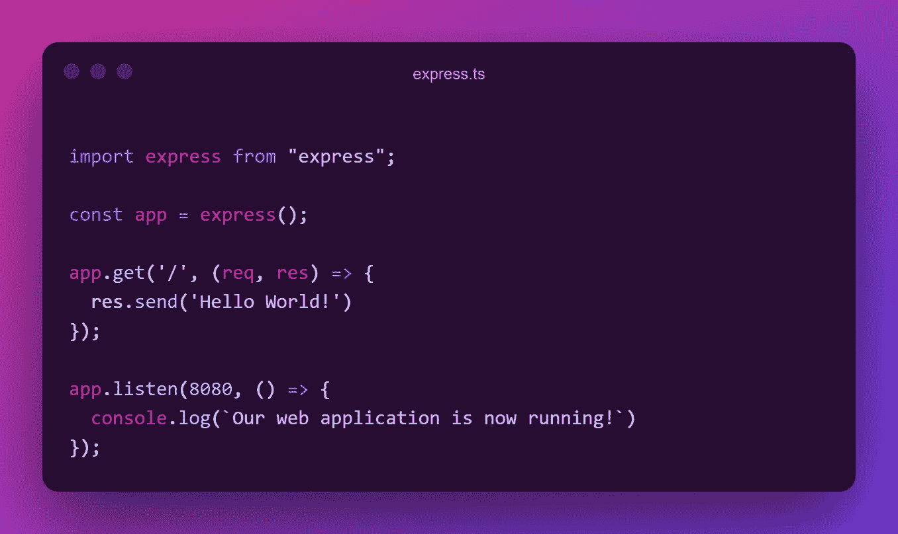
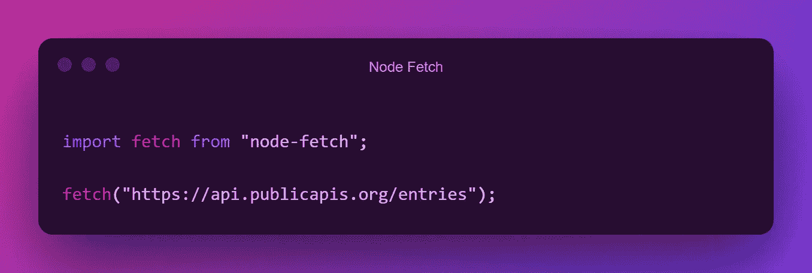
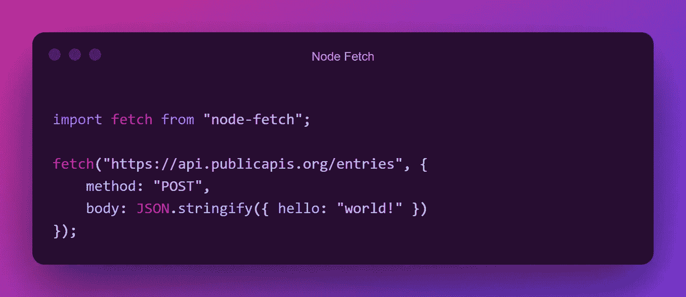
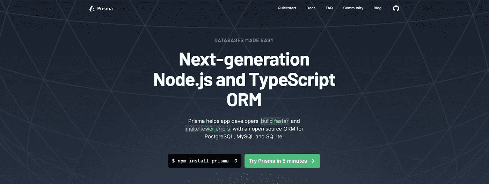
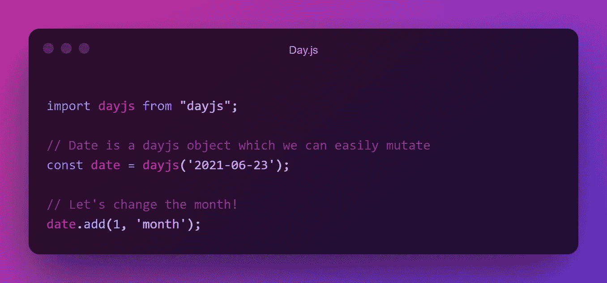
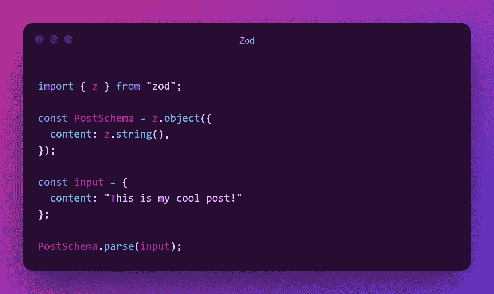

# 作为开发人员，我离不开 Node.js 库

> 原文：<https://javascript.plainenglish.io/absolutely-essential-node-js-frameworks-and-packages-for-developers-c7d9dd2945a6?source=collection_archive---------9----------------------->

让我们面对现实吧，JavaScript 是一种令人惊叹的语言，但是如果没有成千上万的不可思议的库为该语言添加更多的功能，它就不会如此令人惊叹。

在今天的文章中，我将回顾我个人最喜欢的，强调最好的开源软件！

Picture by Gabriel Sollmann ([https://unsplash.com/@gabons](https://unsplash.com/@gabons))

# [表示](https://expressjs.com/)

没有我们的好朋友快递，图书馆目录是不完整的。
Express 是使用 Node.js 创建 web 应用程序的最快和最简单的方法！

只需要几行代码，您就可以接受 web 请求了。请看下面的例子。

Easy example of how to use Express

## **我使用快递是为了什么？**

*   使用像 EJS 这样的模板引擎创建 web 应用程序
*   为您的前端应用程序创建 REST APIs

## 您为什么要使用快递？

*   这是超级容易学的
*   难以置信的可靠性
*   易于在 Heroku 或 DigitalOcean 等平台上部署

# [节点获取](https://github.com/node-fetch/node-fetch)

这个是我获取数据的常用库。有很多选择，比如 Axios 或 Request，但最后，我总是会回到好的旧节点提取。一个令人难以置信的 Node.js 库，它为您提供了一种非常结构化的获取数据的方法！

使用节点提取发送基本的 GET 请求可以在一行中完成。这难道不可思议吗？

A simple GET-request with Node Fetch

发送开机自检请求也不再困难了！

A POST-request with a body using Node Fetch

简而言之，这个超轻的模块是您唯一需要的请求库！

## 我使用节点提取做什么？

*   向网络服务器发送 HTTP 请求

## 为什么要使用节点提取？

*   它真的很轻
*   结构良好的 API

# [Prisma](https://www.prisma.io/)

Prisma 是一个令人难以置信的 ORM，您可以用它与您的数据库交互。如果您曾经使用过数据库，您可能会知道它变得非常复杂，非常快速。Prisma 通过为您提供一个易于交互的 API 来解决这个问题！

创建一个数据库模式，Prisma 会处理所有其他事情！我永远无法在这么短的段落里解释一切，但幸运的是，我已经做了一个关于如何使用它的详细教程。

如果你想了解更多关于 Prisma 是如何工作的，我建议你阅读我的 media 上的[完整教程！](https://medium.com/codex/getting-started-with-the-best-typescript-orm-e0655dd3966)

## 我用普里什蒂纳做什么？

*   与您的数据库交互

## 你为什么要用普丽丝玛？

*   它解决了数据库最大的问题，保持代码和数据库同步。

# [Day.js](https://github.com/iamkun/dayjs)

日期和时间是一个非常棘手的问题。许多图书馆都致力于解决这个问题，但是有一个图书馆非常突出。

为什么你会问？Day.js 非常小，我说的非常小是指 2kB。

别担心，它不缺少任何重要的功能。你可以解析、变异和比较日期。所有这些都来自这个小小的图书馆！

Mutating a date with Day.js

## 我用 Day.js 做什么？

*   格式化和处理日期

## 为什么要用 Day.js？

*   它很小，2kB！
*   用起来感觉很直观

# 佐德

有没有想过如何可靠地解析输入，而不必担心可能错过的东西？我也是，但后来我发现了佐德。该库使得将数据与预定义的模式进行比较变得非常容易。

让我告诉你怎么做！

An example of how to use Zod

正如您在这个简短的示例中看到的，我们只需要做几件事情。

*   定义模式
*   创建或获取我们的输入
*   将我们的输入与模式进行比较

如果给定的输入与模式不匹配，Zod 将抛出一个验证错误，您可以捕捉该错误以向用户提供反馈。如果解析通过，那么您可以 100%确定给定输入的格式是正确的！

## 我用佐德做什么？

*   解析输入

## 你为什么要用佐德？

*   Zod 关注开发者友好性
*   也很小，只有 8kB

我错过图书馆了吗？你最喜欢哪一个？让我知道！

祝你有不可思议的一天！💛

*更多内容尽在*[***plain English . io***](http://plainenglish.io/)