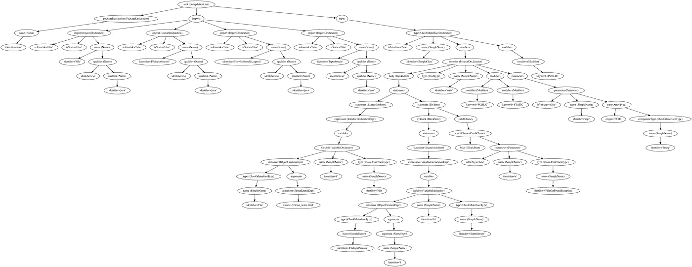
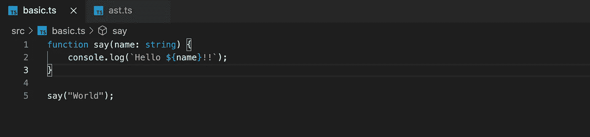
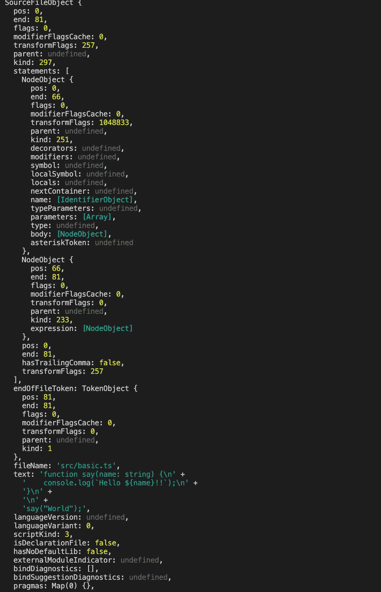
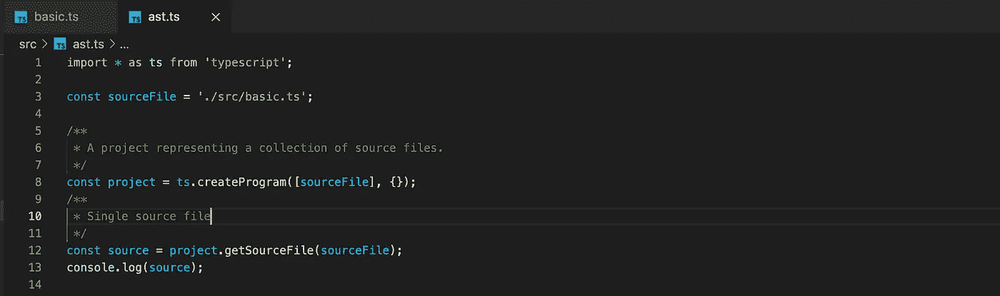
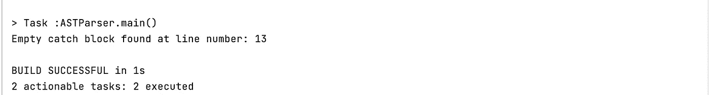
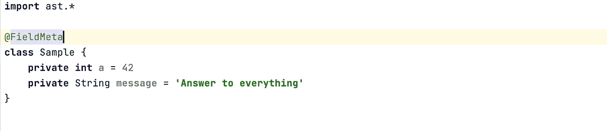
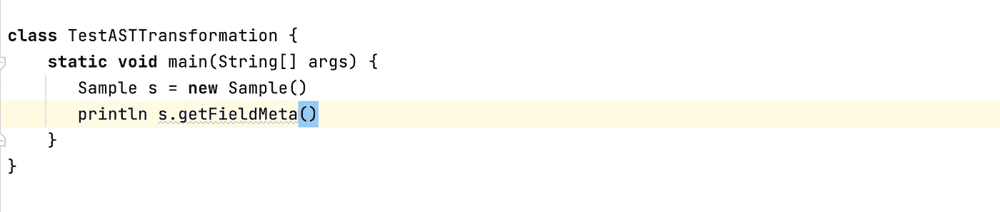
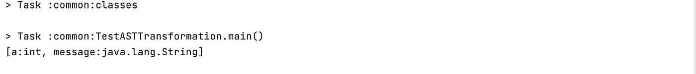

# 什么是抽象语法树(AST)？

> 原文：<https://javascript.plainenglish.io/abstract-syntax-tree-ast-f075b190e631?source=collection_archive---------12----------------------->

## 深入探究 ASTs，用三种不同的编程语言举例说明

AST for a simple Java class

我们编写的大部分代码在开发工作流程中的某个时候会变成一个**抽象语法树(AST)** 。通常 AST 被认为是编译器的一部分，但是有很多地方和用例可以使用它。虽然编译器设计书籍可能会区分语法和语义树表示，但下图是一个简单的模型。

Simplified compilation flow

## 这是什么？

ASTs 是用高级编程语言编写的源代码的树形表示。当一段代码在被转换成机器码或其他中间表示(IR)之前被编写时，它会经历以下过程

*   *词法分析*是将字符流转化为记号的过程，这些记号可用于语法分析。这通常在单个源文件上执行。
*   *语法分析*是将令牌转换成数据结构(AST)的过程，该数据结构可用于执行各种分析和转换。
*   *代码生成*是对 AST 进行进一步优化并生成目标代码的步骤。对于 TypeScript 编译器，这可能是机器码、JVM 字节码或 JavaScript。

让我们看一个 TypeScript 中的例子。下面是一个简单的函数，让我们试着在 AST 中寻找相同的函数。

Simple function

AST for the simple function

从截图中可以看出，源代码已经被解析，树型结构已经建立。这是通过使用 TypeScript 编译器 API 解析源文件来完成的(参见下图)。一旦构建了 AST，就可以在其上编写转换，或者输出到另一种目标语言，或者实现横切关注点等。在下一节中，我们将研究一些 ASTs 的用例。

## 代码质量检查

我们用一个例子来理解这个。假设您想要对 Java 代码库执行离线分析，并识别出哪些地方有空的 catch 块(有一些代码分析工具，如 [PMD](https://pmd.github.io/) 或 [Checkstyle](https://github.com/checkstyle/checkstyle) 可以即时完成这项工作)。但是为了理解幕后发生的事情，让我们使用 [javaparser](https://javaparser.org/) 库来做这件事。下面的代码解析一个 Java 源文件并构建一个 AST，然后识别空的 catch 块。

如果有一个像下面这样的测试类，

我们应该能够识别空的 catch 块并打印出行号。如果我们编写一个简单的 main 方法并运行它，您应该会在控制台中看到如下内容。(本文开头的图片是 SimpleClass 的点格式 AST)

## 代码转换

Groovy 是一种基于 JVM 的编程语言，它提供了一个很好的 API 来挂钩编译器生命周期并转换 AST。在下面的例子中，我们将看到如何使用 Groovy 的编译时元编程能力。

假设您想要在一些 POJO 中公开一个方法，该方法将返回该类的所有属性及其数据类型*。*这可以通过使用 Groovy 的本地转换并创建一个可以在 POJO 上使用的注释来实现。

要查看它的运行情况，让我们编写一个简单的 POJO，

并调用它，

当执行时，您应该看到下面的内容，在这里您可以获得属性名及其类型。

## 林挺

> **lint** 或 **linter** ，是一个[静态代码分析](https://en.wikipedia.org/wiki/Static_program_analysis)工具，用于标记编程错误、[bug](https://en.wikipedia.org/wiki/Software_bug)、风格错误和可疑构造。— [维基百科](https://en.wikipedia.org/wiki/Lint_(software))

JavaScript 最流行的 linters 之一是 [ESLint](https://eslint.org/) ，它利用 AST 对 JavaScript 源代码进行检查。ESLint 利用 Espree 解析源代码，然后在 AST 上应用规则。

**运输工具**

Transpilers 做源到源的翻译编译。例如 [Babel](https://babeljs.io/) 是一个帮助我们在源代码中利用新的 JavaScript 语言特性的工具，但最终会为旧版本生成代码。这样做的原因可能是为了支持旧的浏览器等。Babel 基本上遵循了前面提到的步骤，将源代码翻译成特定的语言版本。

总之，理解您所使用的编程语言的 AST 可能是开发人员工具包中的一个强大工具。还有更多 AST 有用的用例。

## 参考

 [## AST 浏览器

### 在线 AST 浏览器。

astexplorer.net](https://astexplorer.net/)  [## 重新审视类型脚本编译器 API

### 两年前，我写过关于 TypeScript 编译器 API 的文章。那项调查，以及围绕那篇博文的讨论…

blog.scottlogic.com](https://blog.scottlogic.com/2017/05/02/typescript-compiler-api-revisited.html)  [## 大西洋时间

### SyntaxKind，它在 AST 中标识它的类型，以及它的，当实例化到…

basarat.gitbook.io](https://basarat.gitbook.io/typescript/overview/ast)  [## JavaParser - Home

### 当选择开源技术时，知道你的选择会得到持续的回报是很重要的…

javaparser.org](https://javaparser.org/)  [## 运行时和编译时元编程

### 这类转换包括 AST 转换，它有助于删除样板代码。这是典型的…

groovy-lang.org](https://groovy-lang.org/metaprogramming.html#_code_generation_transformations)