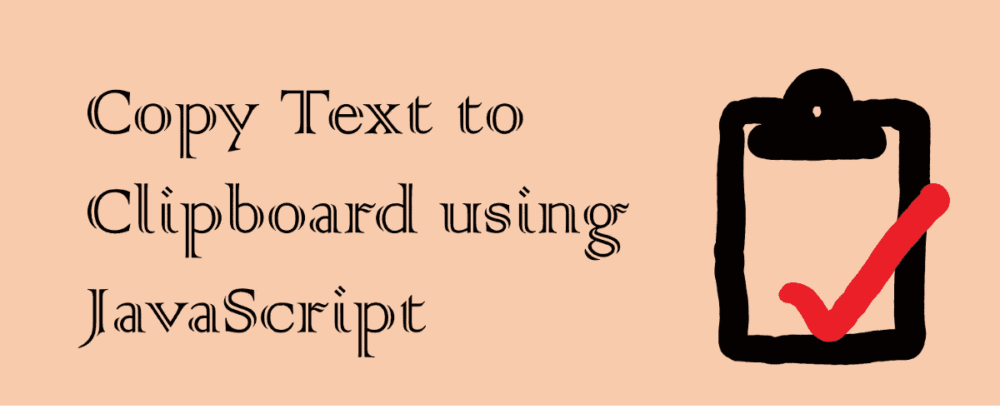
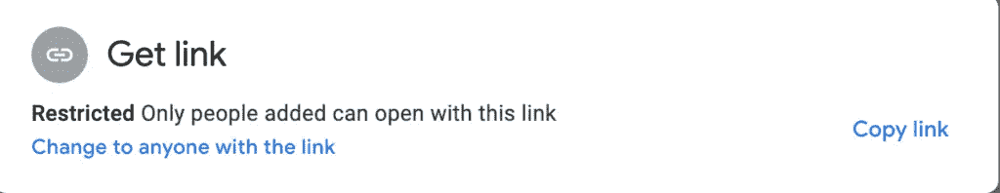

# 在 JavaScript 中访问剪贴板

> 原文：<https://javascript.plainenglish.io/access-the-clipboard-in-javascript-3b6de050b81b?source=collection_archive---------20----------------------->



开发人员可能是这个星球上最懒的人。在所有的东西中，复制粘贴是我们最喜欢的键盘快捷键。但是有什么比打 CTRL + C 更好的呢？让一个按钮帮你复印！现在，在 JavaScript 中使用异步版本的剪贴板 API 就可以做到这一点。

您可能在从网站上复制代码、API 密钥或从 Google Drive 复制链接时遇到过这种情况:



# 剪贴板 API

document.execCommand()在剪贴板 API 出现之前就已经可以复制文本了。但是这是一个同步调用，不能在所有浏览器上正常工作(权限访问也不一致)，并且有一些相关的安全风险。

所有浏览器都支持较新的异步剪贴板 API，并且更加安全(默认情况下，仅适用于 HTTPS 页面，后台标签不可用)。

# 使用 JavaScript 实现

```
// copying to clipboard
navigator.clipboard.writeText(SOME_VALUE)
    .then(() => alert("Text is now stored your cliboard!"));// copying from clipboard
await readText = await navigator.clipboard.readText();
```

我们将需要更多的代码来检测浏览器的支持和错误处理。但这就是 API 的要点。

所有现代浏览器都支持这两种方法。就是这样。希望这是有帮助的，你开始在相关的地方使用它。

*原载于 2021 年 9 月 9 日*[*【https://www.wisdomgeek.com】*](https://www.wisdomgeek.com/development/web-development/javascript/accessing-the-clipboard-in-javascript/)*。*