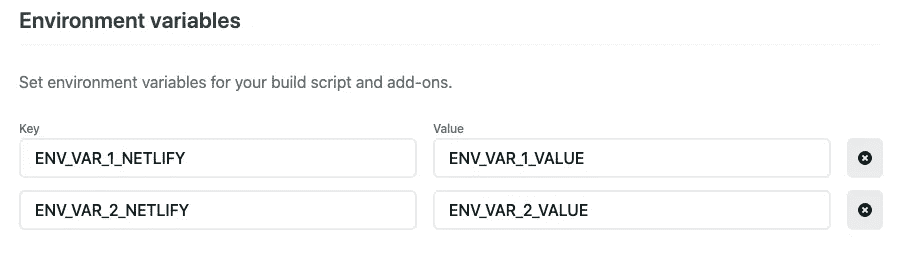
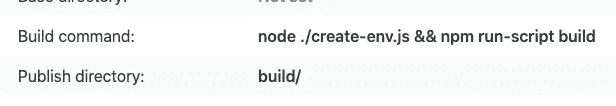

# 如何在网络上访问 React 环境变量

> 原文：<https://javascript.plainenglish.io/accessing-react-environment-variables-on-netlify-6228c304f690?source=collection_archive---------7----------------------->


您刚刚完成了最新的 React 应用程序的开发，您已经准备好与世界其他地方分享它了。唯一阻碍您的是部署应用程序。

有许多方法可以实现这一点，但是本文将指导您如何在 Netlify 上托管您的应用程序，以及如何正确配置任何前端环境变量。

## 什么是环境变量？

环境变量是在程序外部定义的变量，由名称/值对组成。然后，您可以在代码中的任何位置引用该变量的名称，以便访问其值。

## 先决条件

*   安装`[**react-dotenv**](https://www.npmjs.com/package/react-dotenv)` npm 包
*   您的应用程序已正确同步到 Github 存储库
*   你有一个净账户

## 托管您的项目

继续登录您的 Netlify 帐户，然后导航至**团队概述**选项卡。点击按钮从 Git 添加一个**新站点。从可用的提供者中选择 **GitHub** ，这将提示您允许 GitHub 访问您的凭证。登录后，您可以搜索您的存储库，选择要部署的分支，并配置构建设置。现在，我们可以让构建设置保持不变，然后单击**部署站点**，但是一旦我们在应用程序中正确配置了`react-dotenv`，我们将稍后再回到这个问题。**

## 在 react 应用程序中配置“react-dotenv”库

安装好`**react-dotenv**`后，让我们进入`package.json`文件并进行如下编辑。`"scripts"`键应该包括`react-dotenv`作为`"start"`和`"build"`命令的一部分，如下所示:

```
"scripts": { "start": "react-dotenv && react-scripts start", "build": "react-dotenv && react-scripts build", "test": "react-scripts test", "eject": "react-scripts eject"}
```

接下来，假设我们有两个环境变量`ENV_VAR_1`和`ENV_VAR_2`，我们需要将下面的键/值对添加到我们的`package.json`文件的末尾:

```
"react-dotenv": { "whitelist": [ "ENV_VAR_1", "ENV_VAR_2" ]}
```

通常，我们会将环境变量存储在项目根文件夹中的`.env`文件中，但是我们绝不会将该文件推送到 GitHub 存储库中，因为它包含敏感数据(比如秘密的&访问密钥)。

为了使用这些变量，我们可以简单地在我们的组件(`import env from 'react-dotenv'`)中导入`react-dotenv`，然后引用变量名`env.ENV_VAR_1`。

## 动态创建`.env`文件

由于我们从不将`.env`文件推送到 GitHub 仓库，我们可以编写一个小脚本，在 Netlify 部署我们的构建时生成这个文件。对于这个脚本，我们将使用来自`fs`库的 JavaScript 的`writeFileSync()`函数，看起来像这样:

```
const fs = require('fs')
const path = `./.env`
const vars = `
 ENV_VAR_1=${process.env.ENV_VAR_1_NETLIFY}\n
 ENV_VAR_2=${process.env.ENV_VAR_2_NETLIFY}
`fs.writeFileSync(path, vars)
```

注意:我们可以通过引用`process.env.ENV_VAR_NAME`来访问 Netlify 中定义的环境变量(详见下文)。

## 配置网络生活站点设置

接下来，让我们登录我们的 Netlify 帐户，并导航到我们新站点的**站点设置**选项卡。在**Build&Deploy>Environment**下，我们可以指定我们希望在程序中使用的环境变量，应该如下所示:



这是我们应该指定环境变量的实际值的唯一地方。接下来，我们需要告诉 Netlify 通过执行我们的定制脚本来生成我们的`.env`文件:



## 结论

太好了！配置好一切之后，让我们转到 **Deploy** 选项卡，为我们的应用程序触发一个新的部署。

build 命令应该生成一个`.env`文件，它将使用我们在 Netlify 中指定的值来定义我们的环境变量，允许我们通过在组件中导入`.react-dotenv`库来访问它们的值。

编码快乐！

*更多内容请看*[***plain English . io***](https://plainenglish.io/)