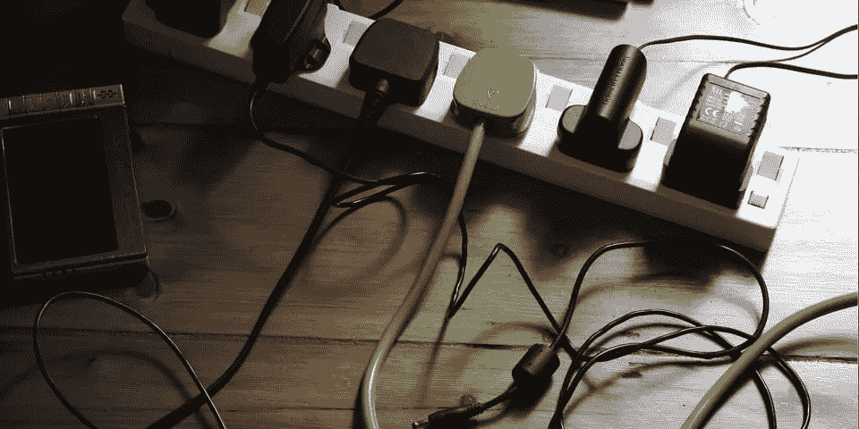
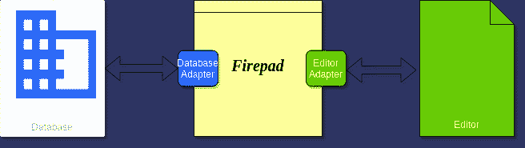

# 适配器模式:创建一个，使用多个

> 原文：<https://javascript.plainenglish.io/adapter-pattern-create-one-use-many-ee928f02a2d8?source=collection_archive---------14----------------------->

创建界面作为你与外界的契约。借助适配器，在多个插座中使用多个插头。


Plugs and Sockets of Various Kinds

想象一下你要去欧洲旅行。通常你会带着手机和充电器。现在，当你在全国旅行时，你意识到你的手机电量很低，于是你立即继续寻找电源插座，你找到了。唉！插座设计与您的充电适配器不匹配。但你很幸运，你带了一个便携式通用电源插座，可以将欧洲端口转换成多个通用端口。嘣，你解决了问题。



Portable Universal Power Outlet

# 适配器

不完全是。你确实得到了连接手机充电适配器所需的插座，但你携带的通用电源插座需要一个与欧洲插座兼容的适配器。所以如果你在美国，你需要一个与美国插座兼容的适配器。

因此，不管任何形式的分层和/或抽象，您都需要一个恒定的接口来与外部世界通信。该接口将作为你的电力公司与电源的合同。这确实包括一定量的耦合，但是提供了实现部分以发展和适应采取任何形式，即充电电缆可以具有任何适配器，只要它被支持在插座上。

# Firepad 的奇特案例

我真希望你还没有听说过 Firepad。如果你还没有，这是一个实时协作文本编辑器。正如你所料，它是一个实时数据库 *(Firebase)* 和一个编辑器*(目前支持 Ace、CodeMirror 和 Monaco)* 的组合。但要意识到，Firepad 既没有实现数据库，也没有实现编辑器，它更像是两者之间的桥梁，就像你的通用电源插座一样。



Firepad Architecture Simplified

Firepad 负责将编辑器中的任何内容更改转换为一组可序列化和可逆的操作，并分别借助编辑器适配器和数据库适配器将它们与实时数据库同步。为了使编辑器与远程用户同步，所有现有的操作都从实时数据库中取出，然后用相同的适配器转换回特定编辑器上的文本操作。有趣的是，你甚至可以在频道的不同端有不同的编辑器，但仍然可以看到相同的内容，实时和同步的。

# 添加对新编辑器的支持

为了便于理解，让我们假设我们有一个新的编辑器，叫做另一个编辑器，简称为 *YAE* 。现在，为了使它与 Firepad 兼容，我们必须添加一个适配器，以便它可以很容易地移植到。下面是 *EditorAdapter* 的接口，对于所有编辑器适配器都是一样的。

```
interface IEditorAdapter {
  /**
   * `detach` Removes Editor from Editor Adapter
   */
  detach(): void;
  /**
   * `registerCallback` attaches callback for Editor Event handling from top-level
   * @param callbacks - Map of Editor Events and Callbacks
   */
  registerCallbacks(callbacks: EditorEventCallbacks): void;
  /**
   * `registerUndo` attaches callback for Editor Event handling from top-level
   * @param callback - Undo Event Handler
   */
  registerUndo(callback: NoopCallback): void;
  /**
   * `registerRedo` attaches callback for Editor Event handling from top-level
   * @param callback - Redo Event Handler
   */
  registerRedo(callback: NoopCallback): void;
  /**
   * `getCursor` Returns Cursor position of current User in Editor
   */
  getCursor(): ICursor | null;
  /**
   * `setCursor` Add Cursor position of current User in Editor
   * @param cursor - Cursor Object of Current User
   */
  setCursor(cursor: ICursor): void;
  /**
   * `setOtherCursor` Add Cursor position of Remote Users in Editor
   * @param cursor - Cursor Object of Remote User
   * @param color - HexaDecimal/RGB Color Code for Cursor/Selection
   * @param clientID - Remote User ID
   */
  setOtherCursor(cursor: ICursor, color: string, clientID: number): IDisposable;
  /**
   * `getText` Returns current content of the Editor
   */
  getText(): string;
  /**
   * `setText` Sets current content of the Editor
   * @param text - Text Content
   */
  setText(text: string): void;
}
```

添加对 *YAE* 的支持将需要我们编写一个 *YAEAdapter* 类来实现上述接口，同时与 *YAE* 的编辑器 API 进行交互。就是这样！

另一方面， *Firepad* 对象将根据传递给它的编辑器，用一个特定的编辑器适配器进行实例化。从那时起， *Firepad* 将通过编辑器处理编辑器，期待上述接口被实现。例如，下面的代码片段获取当前用户的光标位置和选择细节，以便与所有遥控器同步。

```
EditorClient.prototype.updateCursor = function () {
  this.cursor = this.editorAdapter.getCursor();
}
```

只要 *YAEAdapter* 正确实现了方法 *getCursor* ，所有订阅这个特定 *Firepad* 实例的用户都会看到用户的光标。

# 结论

简而言之，适配器模式*(也称为适配器-插座模式、适配器-端口模式和插头-端口模式)*是一种通过将接口作为合同提供给消费者模块和应用程序来分离实际实现的方法。