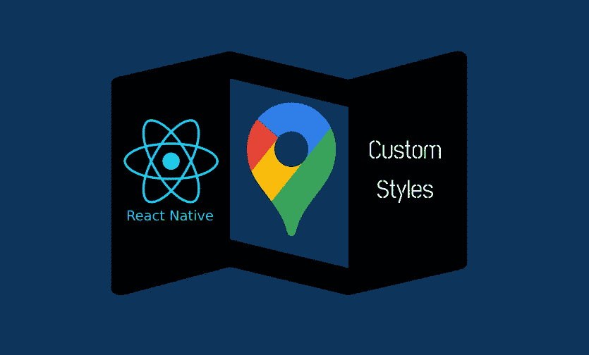
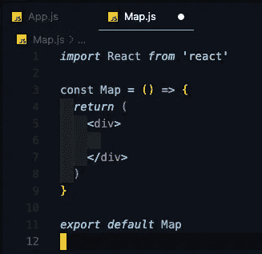
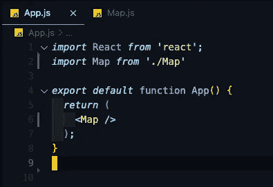
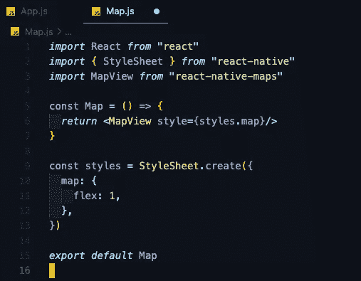
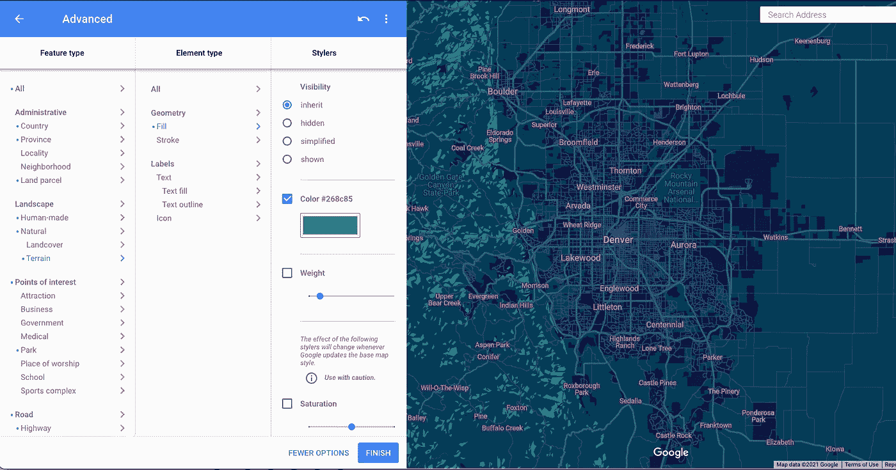
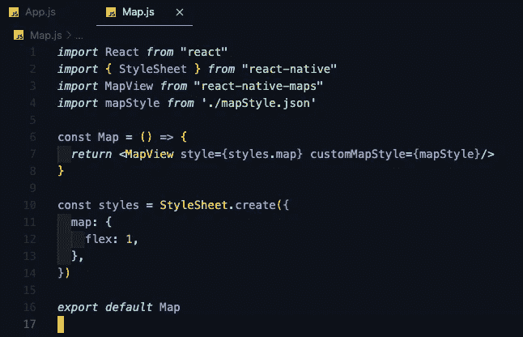
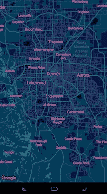

# 将地图添加到 React 本机应用程序中，并使其看起来流畅

> 原文：<https://javascript.plainenglish.io/add-a-map-to-your-app-and-make-it-look-sick-react-native-2398c75be86b?source=collection_archive---------8----------------------->



你好，我亲爱的读者们！今天，我们将通过简单的步骤，将风格化的谷歌地图添加到您的 React 本机应用程序中。

我们将使用 MapView 构建一个地图组件，并使用 Google 的样式向导对地图进行样式化，使其与您的应用程序相匹配！

在本教程中，我们将使用 Expo CLI。我假设您已经安装了 Expo，了解 JSON 文件的工作方式，并对 React Native 有基本的了解。我们去追吧！

前往您的终端，让我们启动一个新的 React 本地项目。我称我们的应用程序为“风格化地图”。

```
expo init styled-map
```

我们将使用普通的旧“空白模板”。在我们在 expo 中打开项目之前，让我们继续安装我们需要的包。

```
npx expo-cli install react-native-maps
```

react-native-maps 安装完成后，继续使用以下命令打开我们的项目:

```
expo start
```

现在这些应该都很熟悉了。不要把事情搞得太复杂，让我们删除 App.js 中返回的所有内容，创建一个名为 Map.js 的新文件

我喜欢用片段“rafce”。这将生成一个 ES6 功能组件，该组件的名称与文件名相同，并且它将自动导出它。如果这个代码片段对您不起作用，我建议安装“ES7 React/Redux/graph QL/React-Native snippets”扩展。



现在我们已经有了地图组件，让我们快速导入并返回到 App.js 中。



接下来，回到我们的地图组件，我们将...

```
import MapView from 'react-native-maps'
```

从地图组件返回地图视图，然后…你将什么也看不见！这是因为贴图的工作方式类似于 React Native 中的图像，我们必须指定一个高度。因此，我们必须从 React Native 导入样式表，创建样式表，并将样式分配给我们的 MapView。让我们添加 flex: 1，这样地图的高度就是全屏尺寸。



哒哒！我们的 React 原生应用程序中有一个全功能的谷歌地图。但是它看起来很简单！

接下来，我们将前往谷歌的造型向导，我们可以添加自定义颜色到我们的地图的每个方面！[https://mapstyle.withgoogle.com/](https://mapstyle.withgoogle.com/)

我们只是要使用旧风格的向导，而谷歌的新云向导仍处于测试阶段。在这里，我们可以选择六个主题之一，标准，银色，复古，黑暗，夜晚和茄子。然后，我们可以选择“更多选项”，并添加自定义颜色；道路，地形，地标和任何你可能想要的东西！！！



一旦你有了你想要的地图样式，点击“完成”。它将为您生成一个 JSON 文件。复制 JSON 并返回到您的文本编辑器。

在我们的文本编辑器中添加一个名为“mapStyle.json”的新文件。将 Google 为我们生成的 JSON 粘贴到那里。然后转到我们的 Map.js 组件。我们将导入新的 JSON 样式，并将它们传递到 MapView 中的“customMapStyle”属性中！



恭喜你！你的 React 原生应用中正式有了风格化的地图！



我希望你喜欢这个快速教程！如果你有什么可以推荐的，或者你觉得有帮助，请在下面留下你的评论。非常感谢您的阅读！编码快乐！