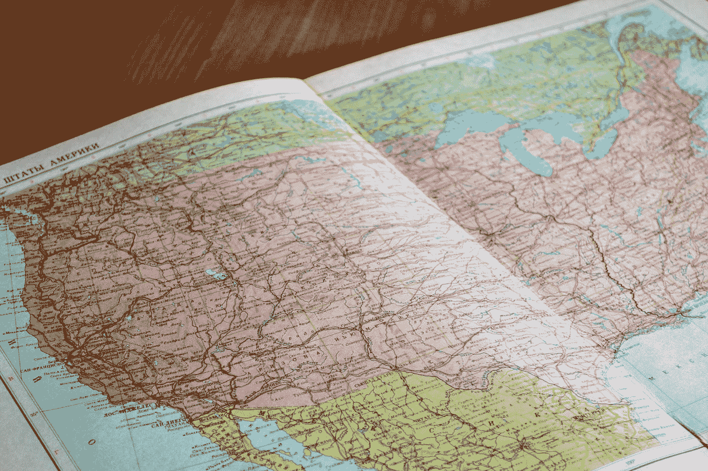

# 使用 Visx 库将墨卡托地图添加到我们的 React 应用程序中

> 原文：<https://javascript.plainenglish.io/add-a-mercator-map-into-our-react-app-with-the-visx-library-9eeaaa92d07a?source=collection_archive---------19----------------------->



Photo by [John-Mark Smith](https://unsplash.com/@mrrrk_smith?utm_source=medium&utm_medium=referral) on [Unsplash](https://unsplash.com?utm_source=medium&utm_medium=referral)

Visx 是一个库，让我们可以轻松地将图形添加到 React 应用程序中。

在本文中，我们将了解如何使用它将地图视图添加到 React 应用程序中

# 安装所需的软件包

我们必须安装一些模块来创建地图。

首先，我们运行:

```
npm i @visx/geo @visx/responsive @visx/scale
```

安装软件包。

# 添加地图

我们可以通过编写以下内容来添加带有墨卡托投影的地图:

```
import React from "react";
import { scaleQuantize } from "@visx/scale";
import { Mercator, Graticule } from "@visx/geo";
import * as topojson from "topojson-client";
import topology from "./world-topo.json";const background = "#f9f7e8";
const world = topojson.feature(topology, topology.objects.units);const color = scaleQuantize({
  domain: [
    Math.min(...world.features.map((f) => f.geometry.coordinates.length)),
    Math.max(...world.features.map((f) => f.geometry.coordinates.length))
  ],
  range: [
    "#ffb01d",
    "#ffa020",
    "#ff9221",
    "#ff8424",
    "#ff7425",
    "#fc5e2f",
    "#f94b3a",
    "#f63a48"
  ]
});const Example = ({ width, height, events = false }) => {
  const centerX = width / 2;
  const centerY = height / 2;
  const scale = (width / 630) * 100; return width < 10 ? null : (
    <svg width={width} height={height}>
      <rect
        x={0}
        y={0}
        width={width}
        height={height}
        fill={background}
        rx={14}
      />
      <Mercator
        data={world.features}
        scale={scale}
        translate={[centerX, centerY + 50]}
      >
        {(mercator) => (
          <g>
            <Graticule
              graticule={(g) => mercator.path(g) || ""}
              stroke="rgba(33,33,33,0.05)"
            />
            {mercator.features.map(({ feature, path }, i) => (
              <path
                key={`map-feature-${i}`}
                d={path || ""}
                fill={color(feature.geometry.coordinates.length)}
                stroke={background}
                strokeWidth={0.5}
                onClick={() => {
                  if (events)
                    alert(
                      `Clicked: ${feature.properties.name} (${feature.id})`
                    );
                }}
              />
            ))}
          </g>
        )}
      </Mercator>
    </svg>
  );
};export default function App() {
  return (
    <div className="App">
      <Example width={500} height={300} />
    </div>
  );
}
```

`world-topo.json`可在[https://code sandbox . io/s/github/Airbnb/visx/tree/master/packages/visx-demo/src/sandboxes/visx-geo-custom？file=/world-topo.json](https://codesandbox.io/s/github/airbnb/visx/tree/master/packages/visx-demo/src/sandboxes/visx-geo-custom?file=/world-topo.json)

我们添加了`color`变量来添加地图上国家的颜色。

然后在`Example`组件中，我们添加了`centerX`和`centerY`变量来设置地图的中心。

`scale`有初始缩放级别。

然后添加一张使用墨卡托投影的 2D 地图，我们添加了`Mercator`组件。

将`data`属性设置为`world`变量，该变量是使用 th `topology` JSON 作为参数从`topojson.feature`方法创建的。

然后在它的渲染道具中，我们添加了`Graticule`组件来添加地图网格线。

并且`path`元素绘制国家。

# 结论

我们可以通过 Visx 库轻松地将简单的 2D 地图添加到 React 应用程序中。

喜欢这篇文章吗？如果有，通过 [**订阅我们的 YouTube 频道**](https://www.youtube.com/channel/UCtipWUghju290NWcn8jhyAw?sub_confirmation=true) **获取更多类似内容！**

*更多内容尽在* [***说白了***](https://plainenglish.io/)