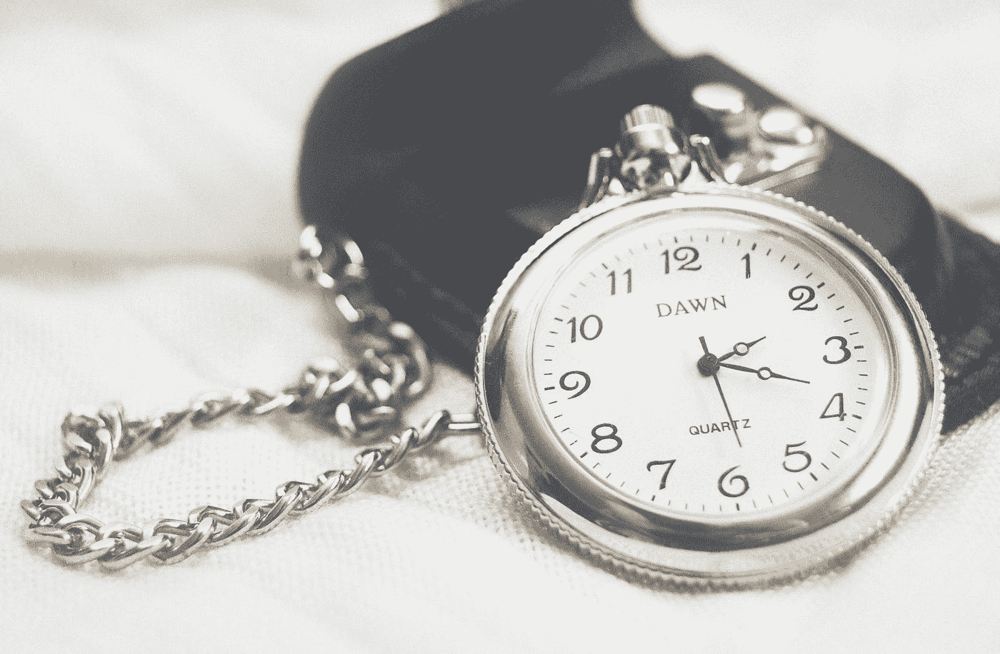

# 向 Vue 应用程序添加时间线

> 原文：<https://javascript.plainenglish.io/add-a-timeline-to-a-vue-app-580d60d8d41c?source=collection_archive---------30----------------------->



Photo by [Isabella Christina](https://unsplash.com/@christina?utm_source=medium&utm_medium=referral) on [Unsplash](https://unsplash.com?utm_source=medium&utm_medium=referral)

我们可以用预制组件向 Vue 应用添加时间线。

在本文中，我们将研究如何使用这些组件添加时间轴。

# Vue 水平时间轴

Vue Horizontal Timeline 包是一个易于使用的包，让我们可以为我们的 Vue 应用程序添加一个轮廓。

要安装它，我们运行:

```
npm i vue-horizontal-timeline
```

然后我们可以通过写来使用它:

`main.js`

```
import Vue from "vue";
import App from "./App.vue";
import VueHorizontalTimeline from "vue-horizontal-timeline";Vue.use(VueHorizontalTimeline);
Vue.config.productionTip = false;new Vue({
  render: (h) => h(App)
}).$mount("#app");
```

`App.vue`

```
<template>
  <vue-horizontal-timeline :items="items"/>
</template>

<script>
export default {
  data() {
    const example1 = {
      title: "Title example 1",
      content: "Lorem ipsum dolor sit amet."
    };
    const example2 = {
      title: "Title example 2",
      content: "Lorem ipsum dolor sit amet."
    };
    const example3 = {
      title: "Title example 3",
      content: "Lorem ipsum dolor sit amet."
    };
    const items = [example1, example2, example3]; return { items };
  }
};
</script>
```

我们在`main.js`中注册了`VueHorizontalTimeline`。

然后在`App.vue`中，我们添加了`vue-horizontal-timeline`组件来添加时间轴。

`items`道具有物品。每个条目都有`title`和`content`属性来显示标题和内容。

`items-selected`有被点击时设置的对象。

`item-unique-key`有钥匙。

`title-attr`有标题的属性名。

`title-centered`让我们设置是否将标题居中。

`title-substr`让我们为标题设置副标题。

我们可以把`title`换成`content`，设置内容。

`min-width`具有时间线的最小宽度。

`min-height`具有时间线的最小高度。

`timeline-padding`有时间轴填充。

`timeline-background`有时间线的背景。

`line-color`有时间线线条的颜色。

`clickable`使返回对象的卡片可点击。

# vue-可爱-时间轴

另一个为 Vue 应用添加时间轴的库是 vue-cute-timeline 库。

要安装它，我们运行:

```
yarn add vue-cute-timeline --save
```

然后我们可以通过使用`timeline`、`timeline-title`和`timeline-item`组件来使用它。

例如，我们可以写:

```
<template>
  <timeline>
    <timeline-title>title</timeline-title>
    <timeline-item bg-color="#9dd8e0">item1</timeline-item>
    <timeline-item :hollow="true">item2</timeline-item>
  </timeline>
</template><script>
import { Timeline, TimelineItem, TimelineTitle } from "vue-cute-timeline";export default {
  components: {
    Timeline,
    TimelineItem,
    TimelineTitle
  }
};
</script>
```

我们设置`bg-color`来设置圆点的背景颜色。

`hollow`使圆点变空。

我们会看到垂直时间轴。

`timeline-item`的`others`槽可以用来替换我们自己形象的圆。

例如，我们可以写:

```
<template>
  <timeline>
    <timeline-title>title</timeline-title>
    <timeline-item bg-color="#9dd8e0">
      
      item1
    </timeline-item>
    <timeline-item :hollow="true">item2</timeline-item>
  </timeline>
</template><script>
import { Timeline, TimelineItem, TimelineTitle } from "vue-cute-timeline";export default {
  components: {
    Timeline,
    TimelineItem,
    TimelineTitle
  }
};
</script>
```

在点内添加图像。

# 结论

我们可以添加 vue 水平时间轴或 vue-cute-timeline 包来为 Vue 应用程序添加时间轴。

喜欢这篇文章吗？如果有，通过 [**订阅我们的 YouTube 频道**](https://www.youtube.com/channel/UCtipWUghju290NWcn8jhyAw?sub_confirmation=true) **获取更多类似内容！**