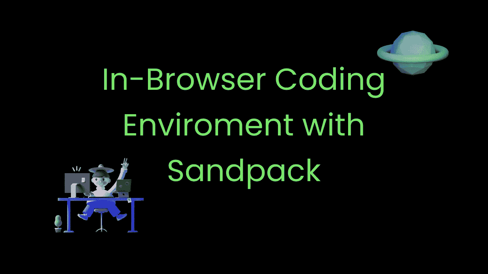
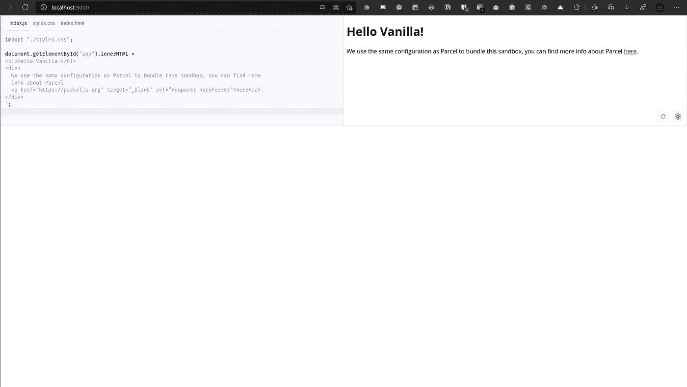
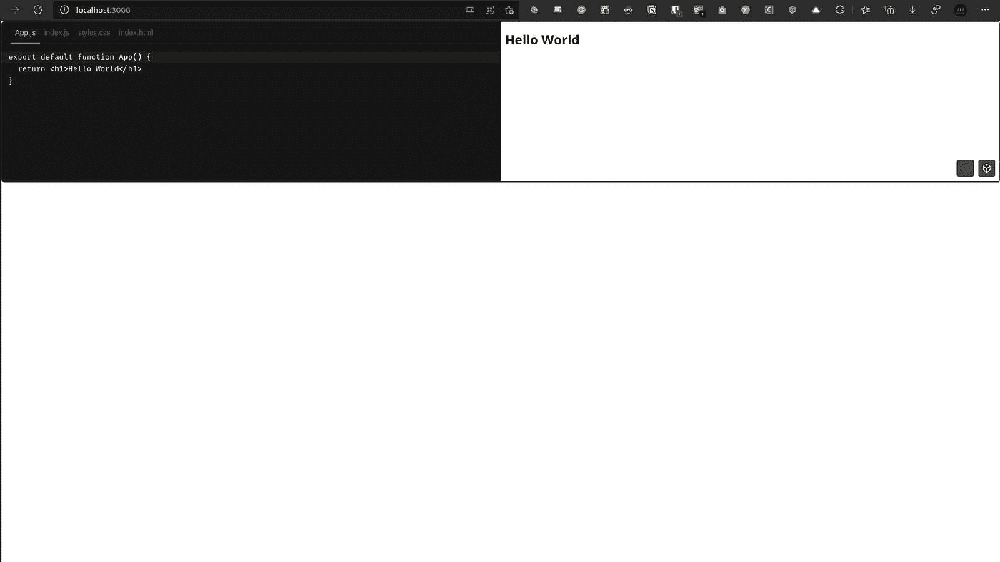
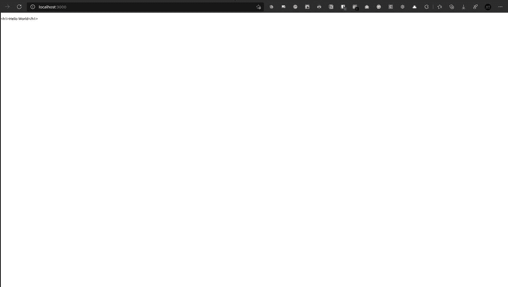
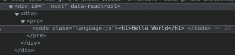
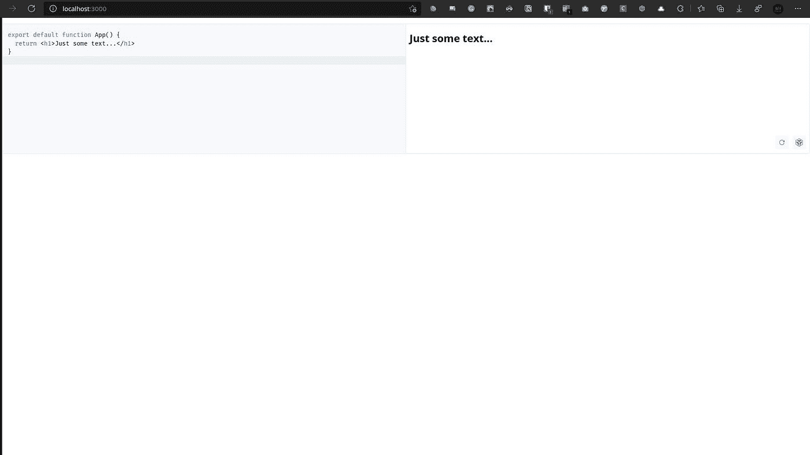

# 使用 Sandpack 为 React 应用程序添加浏览器内代码预览

> 原文：<https://javascript.plainenglish.io/add-an-in-browser-code-preview-to-your-react-application-with-sandpack-c4e3205b4581?source=collection_archive---------12----------------------->



Sandpack 是一个运行在浏览器上的实时编码环境。它是由 [CodeSandbox](https://codesandbox.io/) 背后的团队制作的。这里的主要目的是为用户提供交互的例子。我看到它在博客文章和文档中被广泛使用(事实上，正在进行的工作， [new React Docs](https://beta.reactjs.org/learn) 正在使用 Sandpack)。在本文中，我们将了解如何将 Sandpack 添加到 React 应用程序中，然后在 Next.js 应用程序中将其与 [Next MDX Remote](https://github.com/hashicorp/next-mdx-remote) 集成。

# 向我们的项目添加沙包

我们将把沙包添加到 react 应用程序(用 [create react app](https://github.com/facebook/create-react-app) 制作)中，尽管这个过程对于 Next.js 或 Gatsby 应该是完全相同的。

创建一个 starter react 项目并导航到其中

```
npx create-react-app sandpack-demo
cd sandpack-demo
```

> *注意:如果您喜欢，请随意使用纱线卷装管理器。*

现在，让我们安装沙包

```
npm install @codesandbox/sandpack-react
```

这就是依赖关系，现在让我们继续向应用程序添加 Sandpack。

继续删除`App.css`、`App.test.js`、`setupTests.js`和`logo.svg`。同时删除`App.js`中的所有样板代码。应该是这样的-

现在，让我们在`App.js`导入填砂

这里，我们还导入了一个包含编辑器和预览样式的 CSS 文件。

我们还应该加入沙袋的成分-

就是这样！！！现在让我们通过运行`npm start`来启动开发服务器。导航到 [http://localhost:3000/](http://localhost:3000/) ，这就是你应该看到的



# 自定义模板

Sandpack 使用的默认模板是 vanilla js，但我们也可以使用其他模板，如 react、vue、angular 等。让我们看看 react 模板的运行情况。只需添加`template`属性并将值指定为`react` -

请随意浏览 [Sandpack 自定义内容文档](https://sandpack.codesandbox.io/docs/getting-started/custom-content)，获取更多模板和如何添加自定义代码的信息。

# 自定义主题

我们也可以自定义主题。让我们看看添加一个预先构建的主题-

这是编辑器应该有的样子-



请随意浏览 [Sandpack 自定义 UI 文档](https://sandpack.codesandbox.io/docs/getting-started/custom-ui)以获得更多主题和关于构建主题的信息。

最后，这就是我们的`App.js`的样子-

现在，这只是沙包的开始，但现在让我们看看它在一个更真实的世界中的应用。请随意浏览[填砂文档](https://sandpack.codesandbox.io/docs/)以获得更详细的指南和 API 参考。

# 对下一个 MDX 遥控器使用沙包

[Next MDX Remote](https://github.com/hashicorp/next-mdx-remote) 是一个解析 MDX 内容(markdown 但也支持 JSX)的库，并通过 Next.js 中的`getStaticProps`或`getServersideProps`帮助加载它们。它主要用于文档和博客文章。今天，我们将把 Next MDX Remote 添加到 Next.js 应用程序中，并通过用 Sandpack 替换它来自定义代码组件。首先，让我们创建一个新的 Next.js 应用程序并导航到其中

```
npx create-next-app sandpack-next-mdx-remote
cd sandpack-next-mdx-remote
```

现在，让我们删除`styles`目录下的`Home.module.css`，并删除`pages`目录下`index.js`中的样板代码。它应该是这样的-

# 添加下一个 MDX 遥控器

下一步是添加和设置下一个 MDX Remote，让我们开始吧

```
npm install next-mdx-remote
```

现在，让我们转到`index.js`并添加以下代码-

请注意，我只是用代码块写下一些基本的降价。通常，这种降价来自外部文件，并与 frontmatter 配对，但这不是我在本文中要讨论的内容。

现在让我们通过运行`npm run dev`来启动开发服务器。导航到 [http://localhost:3000/](http://localhost:3000/) 后，我们的页面应该是这样的



注意，现在正在呈现一个简单的 HTML `code`元素



现在，我可以使用 [remark prism](https://www.npmjs.com/package/remark-prism) 来添加语法高亮显示，但是因为我们无论如何都要使用 Sandpack，所以让我们转而使用它。

# 将沙包添加到下一个 MDX 遥控器

首先，让我们安装沙包包-

```
npm install @codesandbox/sandpack-react
```

现在让我们创建一个名为`components`的目录，并在其中添加一个名为`CustomMDXCode.js`的文件。将以下代码添加到该文件中-

在这里，我们正在导入沙包，制作一个自定义组件，在一些道具中传递。这些属性将包含文件的文件名、要使用的模板，当然还有代码。请注意，我们通过字符串插值在文件名的开头添加了一个`/`，这是 Sandpack 所要求的。

现在，让我们回到我们的`index.js`文件，做一些修改来利用新组件的使用

这里，我们将为 code 属性添加一个定制组件(所有 mdx 组件的引用—[https://mdxjs.com/table-of-components/](https://mdxjs.com/table-of-components/))，它就是我们之前创建的 Sandpack 组件。我们还将 markdown 源更改为`javascript`，添加了一个`template`属性并将其指向`react`，添加了一个`filename`属性并将文件命名为`App.js`，并编写了一个简单的函数来显示代码部分的一些文本。

这就是我们的页面现在的样子-



# 结论

这就是本文的全部内容。我希望你喜欢它，并学会了如何添加沙包到你的反应应用程序。如果你有任何问题，请随意评论这篇文章或通过 [Twitter](https://twitter.com/AnishDe12020) 联系我。

沙包—[https://sandpack.codesandbox.io/](https://sandpack.codesandbox.io/)

Sanpack 文档—[https://sandpack.codesandbox.io/docs/](https://sandpack.codesandbox.io/docs/)

沙包 GitHub—[https://github.com/codesandbox/sandpack](https://github.com/codesandbox/sandpack)

下一个 MDX 遥控器—[https://github.com/hashicorp/next-mdx-remote](https://github.com/hashicorp/next-mdx-remote)

所有 MDX 组件—【https://mdxjs.com/table-of-components/ 

*原载于*[*https://blog . anishde . dev*](https://blog.anishde.dev/adding-an-in-browser-code-preview-to-your-react-application-with-sandpack)*。*

*更多内容看* [***说白了. io***](http://plainenglish.io/) ***。*** *报名参加我们的**[***免费每周简讯这里***](http://newsletter.plainenglish.io/) ***。****