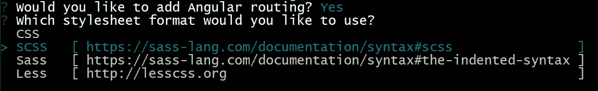
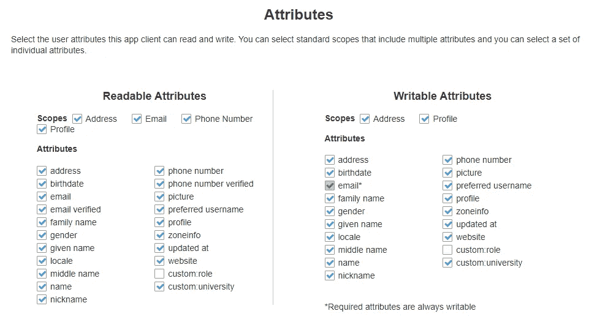

# 将 AWS Cognito Auth 添加到您的 Angular 应用程序，无需放大

> 原文：<https://javascript.plainenglish.io/add-aws-cognito-auth-to-your-angular-app-without-amplify-64dfe656c65a?source=collection_archive---------0----------------------->

## AWS Cognito 与 amazon-cognito-identity-js 集成


Photo by [cottonbro](https://www.pexels.com/@cottonbro?utm_content=attributionCopyText&utm_medium=referral&utm_source=pexels) from [Pexels](https://www.pexels.com/photo/city-fashion-man-couple-7777521/?utm_content=attributionCopyText&utm_medium=referral&utm_source=pexels)

AWS Cognito 是一种身份管理服务，可以帮助开发人员在更短的时间内在他们的应用程序中实现身份验证。有了 Cognito，开发人员不必花费太多的时间和精力从零开始构建认证流程，也不必担心可伸缩性、安全性等问题。

将 Cognito 集成到单页应用程序中的常见方法是使用 [Amplify library](https://github.com/aws-amplify/amplify-js) 。然而，如果我们只想在应用程序中使用整个 Amplify 库来实现 Cognito 认证特性，那么使用它可能会有些多余。

在本文中，我们将把 Cognito auth 添加到一个 Angular 应用程序中，并使用最少的依赖项。尽管本文特别关注 Angular 框架，但是您将能够对本文中的代码进行一些调整，并在任何单页面应用程序中使用它。

# 创建新的角度项目

要创建新的 Angular 项目，我们首先需要安装 Angular CLI。[如果还没有的话先安装](http://npm install -g @angular/cli)。

```
npm install -g @angular/cli
```

然后，在您的首选目录中，执行命令`ng new <app_name>`。选择添加角度路由并选择您最熟悉的样式表格式。Angular CLI 会处理剩下的事情。



Add routing and stylesheet format

# 安装依赖项

如前所述，安装整个 Amplify 库仅仅是为了设置 Cognito 认证可能是多余的。因此，为了避免这种情况，我们将只对 Cognito 使用 JS 库，名为[Amazon-cogn ITO-identity-JS](https://www.npmjs.com/package/amazon-cognito-identity-js)。

在 Angular 项目中，运行以下命令来安装库。

```
npm i amazon-cognito-identity-js
```

# 创建用户界面

现在让我们为登录和注册页面创建用户界面。在终端中，从 Angular 项目文件夹中逐个执行以下命令。这将在新创建的`auth`目录中创建两个名为`sign-in`和`sign-up`的角度组件。

```
ng generate component auth/sign-in
ng generate component auth/sign-up
```

## 创建注册页面

打开`auth/sign-up/sign-up.component.html`，为我们的注册表单添加以下代码。我们将在本教程的后面添加用户寄存器逻辑。

> 因为主要重点是展示 Cognito 特性，所以我决定使用最少的 HTML 样板。您可以随心所欲地在视图中添加样式。

## 创建登录页面

打开`auth/sign-in/sign-in.component.html`，添加以下代码。我们将在本教程的下一步中添加用户登录逻辑。

## 创建仪表板页面

为了演示如何保护受保护的页面，让我们创建另一个名为 dashboard 的页面。在终端中执行以下命令。

```
ng generate component dashboard
```

然后打开`dashboard/dashboard.component.html`并添加以下代码。

现在我们已经创建了所有需要的用户界面。让我们来看看如何构建 Cognito 认证的逻辑。

# 建筑认证

## 设置环境变量

为了实现 Cognito 认证，我们需要您的 Cognito 用户池的 ID 和您的用户池客户端的 ID。因为将这些应用范围内的配置变量存储为环境变量是一个最佳实践，所以打开`environments/environment.ts`并修改环境对象，如下所示。

```
export const environment = {
    production: false,
    cognitoUserPoolId: <your_cognito_user_pool_id>,
    cognitoAppClientId: <your_cognito_app_client_id>
};
```

现在，我们可以通过导入和引用`environment`对象，在应用程序代码中访问这些环境变量。

## 实现注册的逻辑

打开`auth/sign-up/sign-up.component.ts`，添加以下代码。

你可能想知道在`formData`对象中前缀为`custom:`的对象键是什么意思。Amazon Cognito 支持大量现成的用户属性，如`name`、`email_address`、`family_name`、`birthdate`等，但我们仍然希望为特定的应用程序需求提供一些自定义属性。这里，`university`就是这样一个自定义用户属性。因此，在为`university`字段插入值时，我们应该给它加上前缀`custom:`。



attributes that the user pool supports + two custom attributes

## 4.3 实现登录逻辑

打开`auth/sign-in/sign-in.component.ts`并添加以下代码。在这里，我使用电子邮件地址作为用户名，但是您可以自由地使用任何值，只要它对于特定用户是唯一的。

## 4.4 实现签出逻辑

打开`dashboard/dashboard.component.ts`并添加以下内容。

dashboard.component.ts

## 4.5 实施路线保护

Angular 中的 Route guards 可用于在我们的应用程序中的路由上实现自定义逻辑。我们使用`canActivate` route guard 在允许用户查看受保护的页面之前检查用户是否已经被认证。在本教程中，我们将保护仪表板页面。

要生成路由保护，请运行以下命令。出现提示时，选择`canActivate`。

```
ng g guard auth/auth-guard --skipTests=true
```

这将在`auth`目录中创建一个`auth.guard.ts`文件。用以下代码修改它的代码。

现在，我们的 route guard 中的`canActivate`方法将在呈现页面之前检查当前用户是否已经过身份验证，并返回一个布尔响应。如果为真，则允许用户查看受保护的页面，否则不会。

为了完成我们的设置，我们需要一个 AuthService，它包含实际检查用户是否拥有有效会话的功能。运行以下 CLI 命令来生成服务文件。

```
ng g service auth/auth
```

打开创建的`auth/auth.service.ts`文件并添加以下代码。我们在上面的`canActivate` route guard 中使用了`isLogged`函数，来确定当前用户是否拥有有效的会话，

同样，打开`app-routing.module.ts`并将`AuthService`添加到`providers`数组中。

```
import { AuthService } from './auth/auth.service';
.
.
.
@NgModule({
  imports: [RouterModule.forRoot(routes)],
  exports: [RouterModule],
  providers: [AuthService]
})
```

# 检查它是否工作…

我们已经在 Angular 应用程序中完成了 Cognito 身份验证的开发，现在是时候测试我们的实现了。尝试使用有效的电子邮件地址注册，然后登录。如果一切正常，您应该能够在没有经过身份验证的情况下访问仪表板。

> **注意:**请记住，在尝试登录之前，必须确认注册用户。我没有在本教程中实现它，因为它会使这篇文章变得更长，所以我把它留给你去尝试，但是添加它非常简单。您可以使用`amazon-cognito-identity-js`提供的`confirmRegistration`功能以编程方式确认用户(最可行和可靠的方式)，或者通过 Cognito 用户池仪表板手动确认用户(只是为了快速测试/演示)。

在本教程中，我们学习了如何将 AWS Cognito 身份验证添加到 Angular 应用程序中。如果你遇到任何困难，请在回复中告诉我。另外，您可以参考 Github 上本教程的示例应用程序。

[](https://github.com/pavinduLakshan/angular-aws-cognito-auth-demo) [## GitHub-pavinduLakshan/Angular-AWS-cogni to-auth-demo:带有 AWS Cognito 的示例角度应用程序…

### 此项目是使用 Angular CLI 版本 12.1.2 生成的。为开发服务器运行 ng serve。导航到…

github.com](https://github.com/pavinduLakshan/angular-aws-cognito-auth-demo) 

感谢你阅读❤️

*更多内容看**[***说白了. io***](http://plainenglish.io/)*