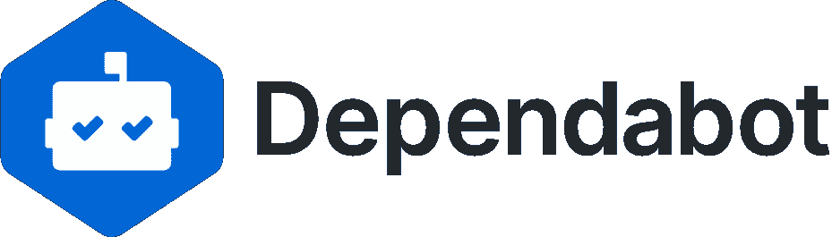

# 将 Dependabot 添加到 GitHub 上的 npm 项目

> 原文：<https://javascript.plainenglish.io/add-dependabot-to-npm-projects-on-github-6d2ed4ca0ed3?source=collection_archive---------6----------------------->



[Dependabot](https://dependabot.com/)

[dependent bot](https://dependabot.com/)自动更新 [GitHub](https://github.com/) 上项目的依赖关系。我们将讨论如何自动更新 npm 或 Node.js 项目的依赖关系。

# 配置

创建`.github/dependabot.yml`:

```
$ mkdir -p .github/
$ touch .github/dependabot.yml
```

添加最低(*要求的*)配置:

给定配置后，Dependabot 将使用位于存储库根(`/`)的包清单(`package.json`)每天检查`npm`更新。

有关更多选项，请查看[“依赖性更新的配置选项”](https://docs.github.com/en/free-pro-team@latest/github/administering-a-repository/configuration-options-for-dependency-updates)。

# 例子

假设`webpack`最近发布了版本`5.0.0`，而你在`4.0.0`上。

在 UTC 时间早上 5 点，Dependabot 将扫描您的`package.json`，并打开一个 pull 请求(PR)来合并分支`dependabot/npm_and_yarn/webpack-5.0.0`到`master`。

提交消息将类似于:

```
build(deps-dev): bump webpack from 4.0.0 to 5.0.0
```

PR 描述将包含 webpack 的发行说明、变更日志和/或提交。

[*本文原载于 2021 年 1 月 10 日《remarkablemark.org》。*](https://b.remarkabl.org/39rkAmu)