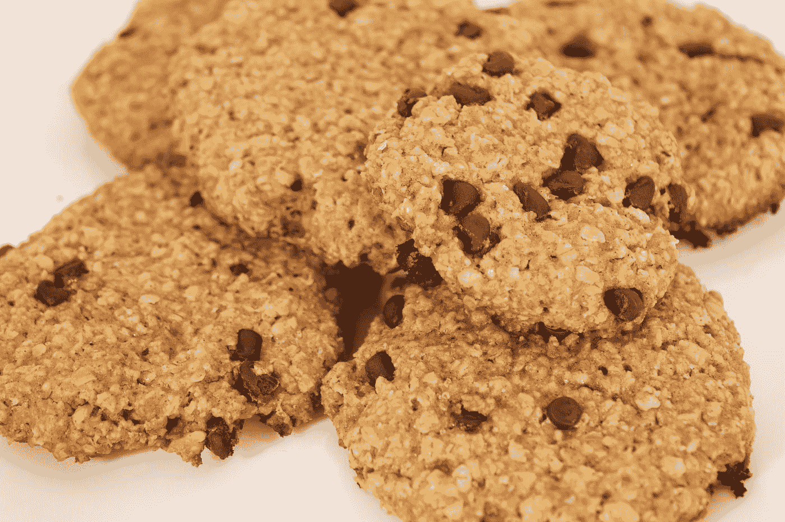

# 使用 vue-meta 向我们的 Vue 应用程序添加元数据

> 原文：<https://javascript.plainenglish.io/add-metadata-to-our-vue-app-with-vue-meta-298f573f758b?source=collection_archive---------17----------------------->



Photo by [Nicolás Varela](https://unsplash.com/@polygraph?utm_source=medium&utm_medium=referral) on [Unsplash](https://unsplash.com?utm_source=medium&utm_medium=referral)

为了在我们的 Vue 应用中轻松添加元标签，我们可以使用 vue-meta 库。

在本文中，我们将了解如何使用 Vue 元库来为我们的 Vue 应用添加元标签。

# 装置

我们可以通过运行以下命令来安装它:

```
yarn add vue-meta
```

或者

```
npm i vue-meta
```

此外，我们可以用脚本标签直接包含这个库。

可以通过编写以下内容来添加 dev 版本:

```
<script src="https://unpkg.com/vue-meta/dist/vue-meta.js"></script>
```

生产版本可以通过编写以下内容来添加:

```
<script src="https://unpkg.com/vue-meta/dist/vue-meta.min.js"></script>
```

# 添加元标签

要添加标签，我们必须注册插件。

为此，我们写道:

```
import Vue from "vue";
import App from "./App.vue";
import VueMeta from "vue-meta";Vue.use(VueMeta);
Vue.config.productionTip = false;new Vue({
  render: (h) => h(App)
}).$mount("#app");
```

在`main.js`中添加插件。

我们还可以添加一个带有一些选项的对象作为第二个参数:

```
import Vue from "vue";
import App from "./App.vue";
import VueMeta from "vue-meta";Vue.use(VueMeta, {
  keyName: "metaInfo",
  attribute: "data-vue-meta",
  ssrAttribute: "data-vue-meta-server-rendered",
  tagIDKeyName: "vmid",
  refreshOnceOnNavigation: true
});
Vue.config.productionTip = false;new Vue({
  render: (h) => h(App)
}).$mount("#app");
```

`keyName`是组件选项的名称，它包含了所有要转换为元标签和属性的信息。

`attributre`是属性的名称，让 vue-meta 知道它应该如何管理和忽略。

`ssrAttribute`是添加到`html`标签的属性名，用来通知 vue-meta 服务器已经生成了 meta 标签。

`tagIDKeyName`是告诉 vue-meta 覆盖标签列表中的项目的属性。

`refreshOnceOnNavigation`页面导航开始后暂停更新，到了`true`时导航结束后恢复更新。

它可以帮助提高速度，并修复更换样式时的闪烁。

一旦我们注册了插件，我们可以添加`metaInfo`属性来添加 meta 标签:

```
<template>
  <div id="app"></div>
</template><script>
export default {
  name: "App",
  metaInfo: {
    title: "App Title",
    titleTemplate: "%s | My Awesome Webapp"
  }
};
</script>
```

属性添加了将被占位符替换的标题。

这意味着`'App Title'`将取代`%s`占位符，形成`title`标签的文本内容。

我们可以用 vue-meta 给`head`添加样式标签。例如，我们可以写:

```
<template>
  <div id="app">
    <div class="loading">loading</div>
  </div>
</template><script>
export default {
  name: "App",
  metaInfo: {
    style: [
      {
        vmid: "page-load-overlay",
        innerHTML: `
          body div.loading {
            z-index: 999;
            background-color: yellow;
            opacity: 0.9;
          }
        `
      }
    ]
  },
  data() {
    return {
      cssTexts: []
    };
  },
  mounted() {
    this.cssTexts.push({
      vmid: "page-load-overlay",
      innerHTML: null
    });
  }
};
</script>
```

我们用值将`style`属性设置为一个对象。

此外，我们可以动态加载样式:

```
<template>
  <div id="app">
    <div class="loading">loading</div>
  </div>
</template><script>
export default {
  name: "App",
  metaInfo() {
    const style = this.cssTexts;
    return { style };
  },
  data() {
    return {
      cssTexts: []
    };
  },
  mounted() {
    this.cssTexts.push({
      vmid: "page-load-overlay",
      innerHTML: `
        body div.loading {
          z-index: 999;
          background-color: yellow;
          opacity: 0.9;
        }
      `
    });
  }
};
</script>
```

`this.cssTexts.push`推送样式。

# 结论

我们可以用 vue-meta 库向 head 标签添加元数据。

喜欢这篇文章吗？如果有，通过 [**订阅我们的 YouTube 频道**](https://www.youtube.com/channel/UCtipWUghju290NWcn8jhyAw?sub_confirmation=true) **获取更多类似内容！**