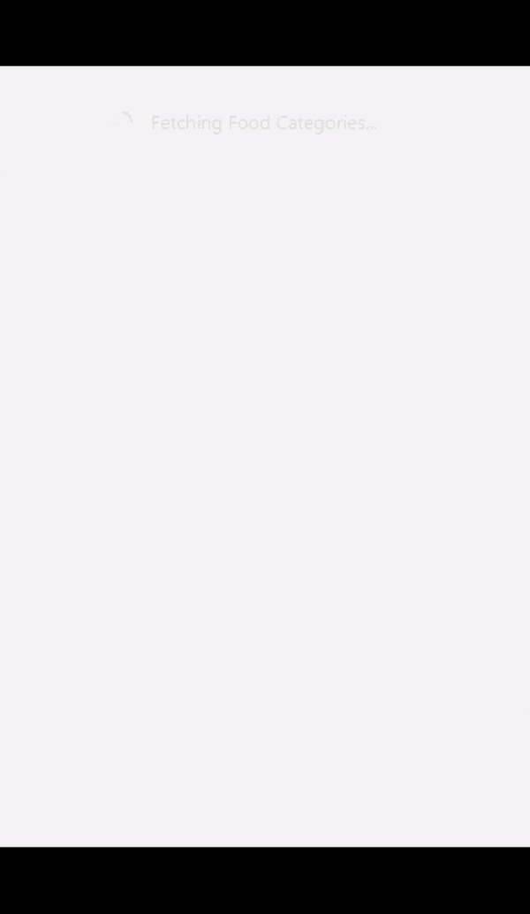
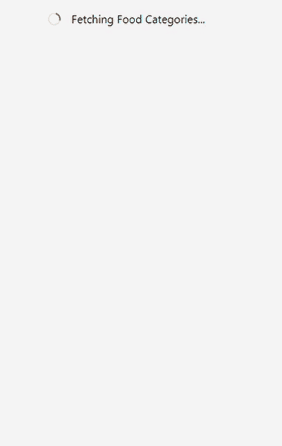
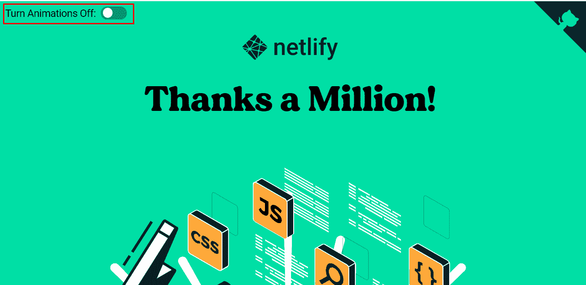

# 添加对角度动画中减少运动的支持

> 原文：<https://javascript.plainenglish.io/add-support-for-reduced-motion-in-angular-animations-6095c345a956?source=collection_archive---------13----------------------->


在本文中，我们将了解为什么需要减少运动支持。我们还将了解媒体查询及其各种用法。最后，我们将看到如何禁用角度动画。

如果你只是对主要代码感兴趣，去[禁用动画](https://indepth.dev/posts/1436/add-support-for-reduced-motion-in-angular-animations#a-service-to-disable-animations)。在那里，我们将创建一个服务，它将帮助我们识别用户对减少运动的偏好。或者直接看一下[代码](https://github.com/shhdharmen/indepth-ng-reduced-motion)。

# 动画

动画可以用在各种网页上。通常，它们用于向用户提供反馈，以表明某个操作已被接收并正在处理。它可以是用户滚动时出现的小动画，也可以是展示新产品的有弹性的动画。我们通常会在大多数网页上看到横幅和公告的自上而下的动画。

但并不是每个人都喜欢动画，也有晕船或前庭运动障碍的人。禁用或减少动画是一项重要的辅助功能。幸运的是，CSS media query‘prefers-reduced-motion’帮助开发者服务于这类用户。

## 偏好-减少运动

`prefers-reduced-motion`媒体查询检测用户是否已经请求操作系统最小化它使用的动画或运动的数量。

它可以取两个值:

**无偏好—** 表示系统不知道用户的偏好。该关键字值在[布尔上下文](https://drafts.csswg.org/mediaqueries-5/#boolean-context)中被评估为假。

**减少—** 表示用户已经通知系统，他们更喜欢最小化移动或动画量的界面，最好是移除所有不必要的移动。

> *此媒体查询仍在* [*媒体查询第五级*](https://drafts.csswg.org/mediaqueries-5/#descdef-media-prefers-reduced-motion) *的草稿中，但大多数* [*最新浏览器今天都支持*](https://caniuse.com/prefers-reduced-motion) *了。*

## 与 CSS 一起使用

对于 CSS，您可以简单地使用它，如下所示:

```
/*
  If the user has expressed their preference for
  reduced motion, then don't use animations on loader.
*/
[@media](http://twitter.com/media) (prefers-reduced-motion: reduce) {
  .loader {
    animation: none;
  }
}/*
  If the browser understands the media query and the user
  explicitly hasn't set a preference, then use animations on loaders.
*/
[@media](http://twitter.com/media) (prefers-reduced-motion: no-preference) {
  .loader {
    /* `spin` keyframes are defined elsewhere */
    animation: spin 0.5s linear infinite both;
  }
}
```

另一种方法是将所有动画放在一个单独的文件中，并通过带有“link”元素的“media”属性有条件地加载它:

```
<link rel="stylesheet" href="animations.css" media="(prefers-reduced-motion: no-preference)">
```

## JavaScript 的用法

当首选项改变时，浏览器将动态处理 CSS 规则。但是使用 JavaScript，我们将不得不监听变化并以编程方式处理动画。

```
const mediaQuery = window.matchMedia('(prefers-reduced-motion: reduce)');
mediaQuery.addEventListener('change', () => {
  console.log(mediaQuery.media, mediaQuery.matches);
  // Stop JavaScript-based animations.
});
```

让我们看看上面的方法如何帮助我们制作有角度的动画。

# 角度动画

Angular 的动画系统是建立在 CSS 功能的基础上的，这意味着你可以动画化浏览器认为可以动画化的任何属性。如果你是第一次使用角度动画，我会推荐你阅读由[@ William Juan 27](https://twitter.com/williamjuan27?lang=en):[Angular-Angular Depth](https://indepth.dev/posts/1285/in-depth-guide-into-animations-in-angular)的动画深度指南的文章。

我们将创建一个服务，它将有一个可观察的`prefers-reduced-motion`媒体查询。然后，我们可以在组件中使用它来禁用动画。

如果您使用的是 Angular CLI，您可以使用以下命令快速创建服务:

```
ng g s core/services/media-match
```

让我们修改 *media-match.service.ts* 的内容:

```
// src/app/core/services/media-match.service.tsimport { Injectable } from '[@angular/core](http://twitter.com/angular/core)';
import { BehaviorSubject, Observable } from 'rxjs';// types
export interface MediaQueriesMap {
  _type: MediaQueryType;
  _query: string;
}export type MediaQueryType = 'prefers-reduced-motion';// media queries list
export const MEDIA_QUERIES: MediaQueriesMap[] = [
  {
    _type: 'prefers-reduced-motion',
    _query: '(prefers-reduced-motion: reduce)',
  },
];[@Injectable](http://twitter.com/Injectable)({ providedIn: 'root' })
export class MediaMatchService {
  private _mediaQueryListeners!: {
    [key in MediaQueryType]: BehaviorSubject<boolean>;
  };
  public mediaQueryListeners$!: {
    [key in MediaQueryType]: Observable<boolean>;
  };constructor() {
    MEDIA_QUERIES.forEach((mq) => this.matchMedia(mq));
  }private matchMedia(mq: MediaQueriesMap) {
    this._mediaQueryListeners = {
      ...this._mediaQueryListeners,
      [mq._type]: new BehaviorSubject<boolean>(false),
    };this.mediaQueryListeners$ = {
      ...this.mediaQueryListeners$,
      [mq._type]: this._mediaQueryListeners[mq._type].asObservable(),
    };const mediaQueryList = window.matchMedia(mq._query);this._mediaQueryListeners[mq._type].next(mediaQueryList.matches);mediaQueryList.addEventListener('change', (ev: MediaQueryListEvent) => {
      this._mediaQueryListeners[mq._type].next(ev.matches);
    });
  }
}
```

下面是上面代码的情况:

```
export const MEDIA_QUERIES: MediaQueriesMap[] = [
  {
    _type: 'prefers-reduced-motion',
    _query: '(prefers-reduced-motion: reduce)',
  },
];
```

首先，我们定义一个常数，它包含一组媒体查询类型及其实际查询。

```
private _mediaQueryListeners!: {
    [key in MediaQueryType]: BehaviorSubject<boolean>;
  };
```

其次，我们将创建一个 JSON 对象，它将包含每种媒体查询类型的主题。它会根据`[MediaQueryList.matches](https://developer.mozilla.org/en-US/docs/Web/API/MediaQueryList/matches)`发出`true`或`false`。

```
public mediaQueryListeners$!: {
    [key in MediaQueryType]: Observable<boolean>;
  };
```

第三，我们正在创建 observables 的 JSON，它将基于我们之前创建的主题。该服务的消费者将使用该属性。

```
constructor() {
    MEDIA_QUERIES.forEach((mq) => this.matchMedia(mq));
  }
```

第四，我们通过为每组`MEDIA_QUERIES`常量调用一个方法`matchMedia`来构建前面的两个 JSON 属性。

现在，让我们看看方法`matchMedia`:

```
private matchMedia(mq: MediaQueriesMap) {
    this._mediaQueryListeners = {
      ...this._mediaQueryListeners,
      [mq._type]: new BehaviorSubject<boolean>(false),
    };this.mediaQueryListeners$ = {
      ...this.mediaQueryListeners$,
      [mq._type]: this._mediaQueryListeners[mq._type].asObservable(),
    };
  }
```

该方法采用一个参数`mq: MediaQueriesMap`，它是一组媒体查询类型(` _type `)和实际查询(` _query `)。首先，它通过为新的`_type`添加一个主题来更新现有的主题 JSON。然后使用同一个主题，为同一个`_type`更新可观察对象的 JSON。

```
private matchMedia(mq: MediaQueriesMap) {
    // ...const mediaQueryList = window.matchMedia(mq._query);this._mediaQueryListeners[mq._type].next(mediaQueryList.matches);mediaQueryList.addEventListener('change', (ev: MediaQueryListEvent) => {
      this._mediaQueryListeners[mq._type].next(ev.matches);
    });
  }
```

更新完主题和观察对象后，就该得到查询结果了。上面的代码非常清晰简单。

注意，我们甚至在监听`change`事件之前就发出了`mediaQueryList.matches`的结果。背后的原因是让初始值从服务中发出。如果我们不这样做，只是简单地倾听变化，可能会发生这样的情况，用户在访问应用程序时已经将`reduced`设置为他们的运动偏好，但我们的应用程序仍将继续显示动画。

保存主题/观察对象的 JSON 的一个好处是你可以添加更多的媒体查询。例如，您想创建一个媒体查询来检查横向方向，您可以这样做:

1.在`MediaQueryType`中添加类型，因此它将变成:

```
export type MediaQueryType = 'prefers-reduced-motion' | 'orientation-landscape';
```

2.在`MEDIA_QUERIES`中添加实际查询:

```
export const MEDIA_QUERIES: MediaQueriesMap[] = [
  {
    _type: 'prefers-reduced-motion',
    _query: '(prefers-reduced-motion: reduce)',
  },
  {
    _type: 'orientation-landscape',
    _query: '(orientation:landscape)',
  },
];
```

3.并在您的组件中使用它:

```
public orientationLandscape$ = this.mediaMatch.mediaQueryListeners$['orientation-landscape'];
```

## 带动画的应用

为了在 angular 中启用动画，我们需要在根模块中导入`[BrowserAnimationsModule](https://angular.io/api/platform-browser/animations/BrowserAnimationsModule)`。

我已经创建了一个应用程序，它有一个基本的用户界面，并设置了动画和服务。你可以在 [GitHub Repo](https://github.com/shhdharmen/indepth-ng-reduced-motion) 上查看代码。

让我们用动画来看看应用程序的输出:



## 带有禁用动画的应用程序

要禁用动画，首先，我们将使用*src/app/app . component . ts:*中的服务`MediaMatchService`

```
// src/app/app.component.ts// ...export class AppComponent implements OnInit, OnDestroy {
//...disableAnimations$ = this.mediaMatch.mediaQueryListeners$['prefers-reduced-motion'];constructor(
    private mediaMatch: MediaMatchService
  ) {}// ...
}
```

然后，可以在 HTML 元素上放置一个名为的特殊动画控件绑定，以禁用该元素以及任何嵌套元素上的动画。为真时，`@.disabled`绑定阻止所有动画渲染。

我们把它放到*src/app/app . component . html*里吧:

```
<!-- src/app/app.component.html --><div class="container" [@.disabled]="disableAnimations$ | async">
  <!-- rest remains same -->
</div>
```

现在让我们看看我们的应用程序在使用`reduced`动作渲染时的样子:



正如你所看到的，现在它不能用动画来渲染应用程序。

## NoopAnimationsModule

我们也可以使用`[NoopAnimationsModule](https://angular.io/api/platform-browser/animations/NoopAnimationsModule)`来禁用特定模块的角度动画。不要用`BrowserAnimationsModule`直接导入就好了。

但是`prefers-reduced-motion`提供了更多的灵活性，因为它允许非常容易地根据用户偏好加载动画。

## 从用户界面控制动画

如果你不想使用`prefers-reduced-motion`查询，你可以集成一些控件，像开关或复选框，这将允许用户禁用或启用动画运行时。

Netlify 的 [Netlify 达到一百万开发者！网站是这种方法的一个很好的例子，他们在左上角增加了一个开关来控制动画。](https://million-devs.netlify.com/)



但是，建议通过媒体查询禁用动画，因为它更容易访问，并使用户不必执行额外的操作。

## 角度 v12

Angular 团队正致力于通过`BrowserAnimationsModule.withConfig`增加一个特性来支持禁用动画。这在 [v12.0.0-next.3](https://github.com/angular/angular/blob/master/CHANGELOG.md#1200-next3-2021-03-03) 中已经可用:

```
import { NgModule } from "[@angular/core](http://twitter.com/angular/core)";
import { BrowserAnimationsModule } from "[@angular/platform-browser](http://twitter.com/angular/platform-browser)/animations";
import { AppComponent } from "./app.component";export function prefersReducedMotion(): boolean {
  const mediaQueryList = window.matchMedia("(prefers-reduced-motion)");return mediaQueryList.matches;
}[@NgModule](http://twitter.com/NgModule)({
  imports: [
    BrowserAnimationsModule.withConfig({
      disableAnimations: prefersReducedMotion()
    })
  ],
  declarations: [AppComponent],
  bootstrap: [AppComponent]
})
export class AppModule {}
```

# 结论

我们看到了`prefers-reduced-motion`媒体查询的用法，它的重要性，以及它如何帮助我们禁用 angular 中的动画。我们还看到了其他一些禁用它们的方法，但是推荐使用媒体查询。

而在 v12 中，你可以简单地使用`BrowserAnimationsModule.withConfig`来禁用动画。

我为我们上面做的所有代码创建了一个 GitHub repo。

**延伸阅读**

*   [偏好减少运动:有时运动越少越好](https://web.dev/prefers-reduced-motion/)
*   [角度动画深度指南](https://indepth.dev/posts/1285/in-depth-guide-into-animations-in-angular)
*   [运行时禁用角度动画—开发社区👩‍💻👨‍💻](https://dev.to/this-is-angular/disabling-angular-animations-at-runtime-9a6)

*原载于*[*https://indepth . dev*](https://indepth.dev/posts/1436/add-support-for-reduced-motion-in-angular-animations)*。*

*更多内容请看*[*plain English . io*](http://plainenglish.io/)