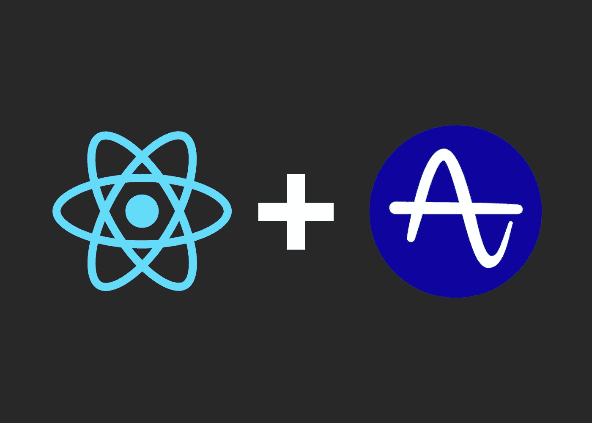
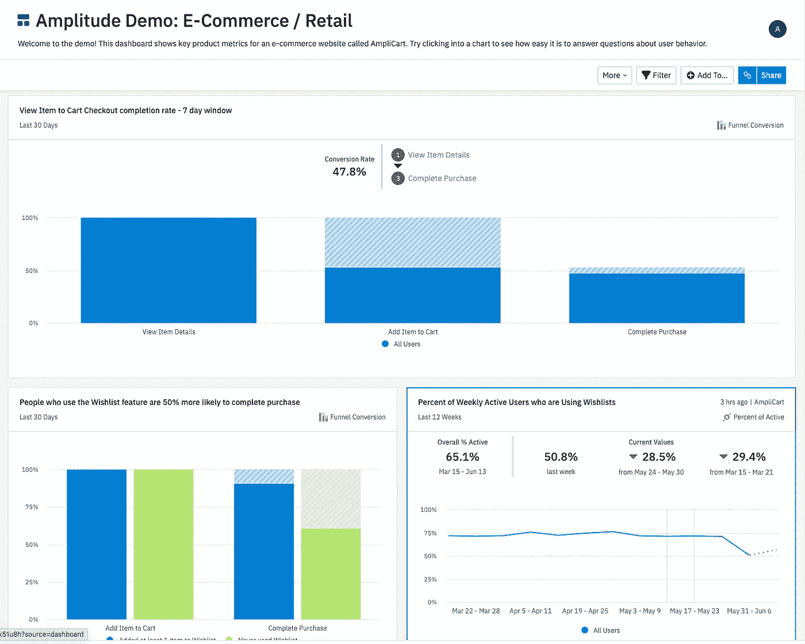

# 如何向 React 应用程序添加分析

> 原文：<https://javascript.plainenglish.io/adding-analytics-to-your-react-application-b584265f9fae?source=collection_archive---------3----------------------->

使用 Amplitude 的 npm 库



# 振幅

Amplitude 是一家数据分析初创公司，旨在让向网络或移动应用添加分析变得简单易行。这是一家 Y Combinator 公司，并得到了红杉等一些大型风险投资公司的支持。

由于其有效性和简单性，他们在疫情期间看到了客户增长的巨大繁荣，以及随之而来的估值的大幅上升(在撰写本文时最近估值为 40 亿美元)。

所有这些原因(简单性、定制选项、干净的用户界面、在行业中的广泛采用)是我的公司选择使用它们来处理 React 应用程序上的数据分析的原因。以下是您将它添加到您的邮箱中的方法:

# 注册

第一步将是在 [Amplitude 的网站](https://amplitude.com/)上注册试用。你需要创建一个帐户，并提供一些关于你的公司/应用程序的基本信息。

一旦您创建了一个帐户，您将被带到仪表板，在那里您的所有数据都将存在。它看起来会像这样:



Source: [https://analytics.amplitude.com/login/my-demo](https://analytics.amplitude.com/login/my-demo)

在这里，您可以访问一些极其重要的信息，如每日、每周和每月活跃用户的数量，以及这些趋势是如何随着时间的推移而演变的。

你还可以看到一些信息，比如用户留存率、花在应用上的时间、各种营销活动的转换率，以及你的网站或登陆页面的 A/B 测试结果。你甚至可以微调结果，例如，如果你想查看从 Twitter 访问你的应用程序的用户数量，以及点击你的应用程序至少 2 个页面的用户数量，你可以使用 Amplitude dashboard 查看！

# 与 React 集成

将振幅跟踪添加到您的应用程序的最简单方法是通过他们的 [npm 包](https://www.npmjs.com/package/amplitude-js)。只需运行:

```
npm i amplitude-js
```

然后在 React 应用程序中创建一个名为“amplitude.js”的文件

在内部添加以下内容:

```
import amplitude from "amplitude-js";//Code to import config info about your appimport { env } from "services/configs";const API_KEY =env === "app"? "PRODUCTION_API_KEY_HERE": "DEV_API_KEY_HERE";//If you only have one environment, just put the single API keyamplitude.getInstance().init(API_KEY, null, {// optional configuration options includeUtm: true, includeGclid: true, includeReferrer: true,});export { amplitude };
```

所以让我们解开这段代码。

在顶部，我从 configs 文件夹中导入了一个名为 env 的东西。这是我的应用程序的配置文件，包含了一些关于我如何加载它的信息。它包含一些 API 密钥和我的数据库的信息，但也包含这行代码:

```
export const env = process.env.REACT_APP_ENV;
```

如果设置正确，这将提供关于您的 React 应用程序当前使用的环境的信息。在我的例子中，它只有两种可能性“dev”(用于开发，非实时环境)或“app”(用于真正的实时部署应用)。

接下来，您将需要您的 API 密钥。根据您工作的环境，您可能设置了不同的振幅项目，每个项目都有自己的调。你可以在你的项目的[设置页面](https://help.amplitude.com/hc/en-us/articles/360043750992)找到钥匙。确保用项目的正确密钥替换上面的字符串。

最后，您有一个 options 对象，您可以传递 init 函数来加载带有某些特性的振幅。

这里列出了所有可能的选项及其描述。在我的例子中，我使用 includeUtm、includeGclid 和 includeReferrer 选项进行初始化。

最后，您只想在文件底部导出这个初始化的振幅对象。这将是您导入到您的应用程序中以添加事件跟踪的内容。

## 向组件添加跟踪

现在，无论您想在哪里使用振幅跟踪，您都需要确保在代码的顶部导入新创建的振幅对象(如果它与我的不匹配，请确保放置正确的文件路径)。

```
**import { amplitude } from "components/amplitude";**import logo from './logo.svg';import './App.css';function App() {return (
  <div className="App">
    <div> My App </div>
  </div>
  );
}export default App;
```

假设您想要跟踪电子商务应用程序中购物车按钮被点击的次数。

```
**import { amplitude } from "components/amplitude";**import logo from './logo.svg';
import ItemCard from 'components/ItemCard';import './App.css';function App() {displayItems = () => {
  props.items.map(item => <ItemCard name=item.name/>
}**logClick = () => {** **amplitude.getInstance().logEvent('cartButtonClicked', itemsInCart)** **}**return (
  <div className="App">
    <h1>My E-Commerce Store</h1>
      {displayItems}
      <Button onClick={**logClick**}> Add to Cart </Button> </div>
  );
}export default App;
```

然后，您可以将类似这样的内容添加到您的代码中，每次单击按钮时，它都会记录一个“cartButtonClicked”类型的事件，然后跟踪用户购物车中的所有商品。

发挥创造力，你就可以追踪各种事物。

很多人也用它来跟踪错误。

假设您想要跟踪某个广告活动的用户注册。您可以在代码中添加这样的内容，其中状态 3 表示用户已完成注册:

```
<Route{...rest}
  render={(routeProps) => {
    if (RedirectComponent && status !== 3) {
      return <RedirectComponent {...props} {...routeProps} />;
    } else if (status === 0) {
      return <NotLoggedIn />;
    } else if (status === 1 || status === 2) {
      return <Redirect to="/onboarding" />;
    } else if (status === 3) {
      analyticsMessage && analytics.logEvent(analyticsMessage);
      analyticsMessage &&
        **amplitude.getInstance().logEvent(analyticsMessage)**;
    return <Component {...props} {...routeProps} />;
    }
  }}
/>
```

现在，如果用户处于状态 3，事件将被记录到振幅中，以便您可以跟踪转换率。

*更多内容尽在*[plain English . io](http://plainenglish.io/)