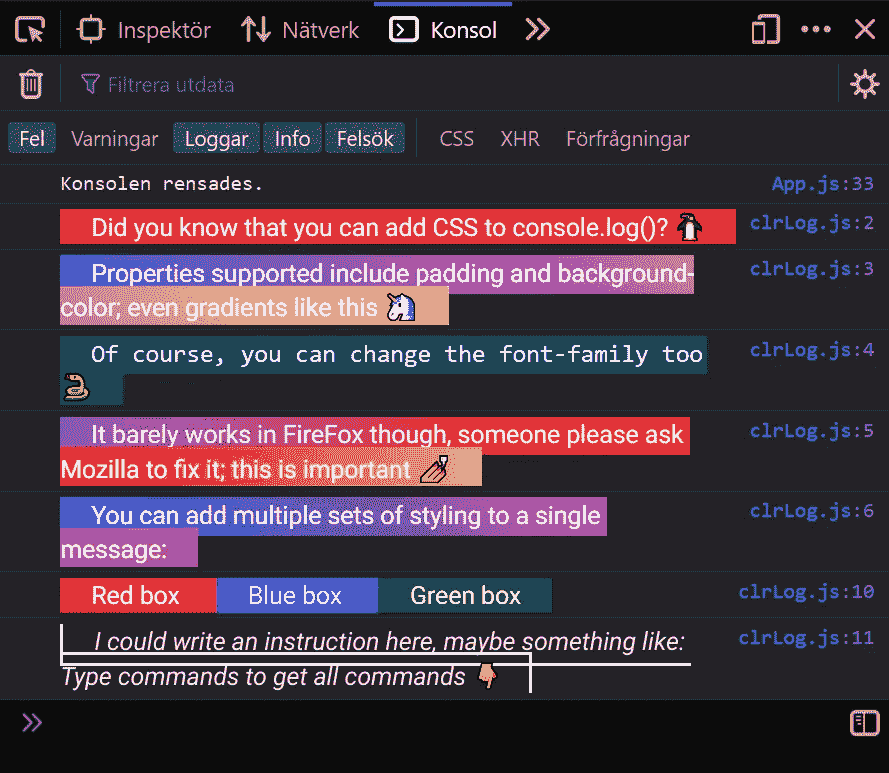

# 将 CSS 添加到 console.log()

> 原文：<https://javascript.plainenglish.io/adding-css-to-console-log-dde2e167ee7a?source=collection_archive---------2----------------------->

## 让您的控制台丰富多彩

Screenshot of styled console.log() messages taken in the Brave web browser. Image by the author.

每个 web 开发人员都熟悉 console.log()函数，该函数通常用于在开发过程中调试值。由于它通常只被用作调试工具，您可能没有意识到 console.log()实际上提供了一些广泛的特性，比如样式。

我最近[写了一篇文章](/a-prettier-console-log-786f46d0bc3c)，描述了如何向 console.log()添加 CSS 来创建漂亮的标签。然而，在过去的几天里，我觉得我应该用第二篇文章来扩展这个概念，在更广阔的背景下探索更多的风格选择。您可以向 console.log()消息添加各种样式属性，我将向您展示其中的一些。

我将向您展示一些代码来创建各种样式的消息，每个消息后面都有在 Brave web 浏览器的开发人员控制台中看到的输出(这与您在 Chrome 中得到的输出完全相同)。最后，我将讨论 Firefox，它的行为有点不同。

你可以在这个 [CodePen](https://codepen.io/jacob_bergdahl/pen/oNZqqJg) 上找到所有这些 console.log()消息的完整代码。

# 简单而丰富多彩的信息

Code to create a colorful console.log() message. Find the full code on this [CodePen](https://codepen.io/jacob_bergdahl/pen/oNZqqJg). Image by the author.

Output in Brave created by running the above code. Image by the author.

在这个 console.log()消息中，我应用了背景颜色、字体、一些填充和一点行高。CSS 很简单，但输出却非常令人愉快。在整篇文章中，您将看到类似的样式，只是略有不同。请注意，必须将“%c”添加到 console.log()中，才能将样式作为第二个参数添加。

# 带有背景渐变的邮件

Code to create a colorful console.log() message with a background gradient. Find the full code on this [CodePen](https://codepen.io/jacob_bergdahl/pen/oNZqqJg). Image by the author.

Output in Brave created by running the above code. Image by the author.

与前一条消息类似的样式，但是带有背景渐变。

# 带边框的邮件

Code to create a colorful console.log() message with a border. Find the full code on this [CodePen](https://codepen.io/jacob_bergdahl/pen/oNZqqJg). Image by the author.

Output in Brave created by running the above code. Image by the author.

您还可以在 console.log()消息中使用 border 属性。我也在这里使用斜体。

# 有边框半径的消息

Code to create a colorful console.log() message with a border radius. Find the full code on this [CodePen](https://codepen.io/jacob_bergdahl/pen/oNZqqJg). Image by the author.

Output in Brave created by running the above code. Image by the author.

console.log()样式甚至支持 border-radius。

# 具有多组样式的消息

Code to create a colorful console.log() message with multiple sets of styling. Find the full code on this [CodePen](https://codepen.io/jacob_bergdahl/pen/oNZqqJg). Image by the author.

Output in Brave created by running the above code. Image by the author.

您可以向单个 console.log()消息添加多组样式。请注意%c 是如何根据其后提供的参数为其后出现的任何文本添加样式的。例如，如果您想将某个单词加粗，这可能会很有用。

# 火狐是怎么回事？

Screenshot of styled console.log() messages taken in Firefox Developer Edition. Image by the author.

嗯，在 Firefox 里看起来肯定是一团糟。作为 Mozilla 网络浏览器的忠实粉丝，我对 CSS 在其控制台中几乎不受支持感到有点失望。当然，这可能不是 Mozilla 列表中的首要任务，但一个简单的两像素宽的边框变成一堆乱七八糟的线条有点不可思议。

如果你真的打算设计控制台消息，记住 Firefox 的局限性可能很重要。注意，第一条 console.log()消息，然后是一条企鹅消息，即使在 Firefox 中看起来也很正常。

奇怪的是，Firefox 支持 Chromium 不支持的一些属性，比如 cursor 属性:

Code to create a colorful console.log() message that changes the cursor. Find the full code on this [CodePen](https://codepen.io/jacob_bergdahl/pen/oNZqqJg). Image by the author.

Output in Firefox Developer Edition created by running the above code. Image by the author.

在基于 Chromium 的浏览器中，光标只是默认的。也就是说，我不确定 cursor 属性在 console.log()消息中有多大用处。如果你好奇的话，在 Firefox 和 Chromium 浏览器中，当用户将鼠标悬停在 console.log()内的 URL 上时，光标会变成指针选项。

# 结论

您可以用非常简单的样式创建真正丰富多彩的 console.log()消息。这样做的一个用例可以是创建[漂亮的标签](/a-prettier-console-log-786f46d0bc3c)，使您的调试更加丰富多彩，或者甚至在生产中包含消息，尽管这很不常见。

在任何情况下，我们都可以在我们的生活中使用更多的颜色，所以请尝试一下，让我知道你是否梦想出一些真正漂亮的游戏机。

*更多内容尽在*[plain English . io](http://plainenglish.io/)