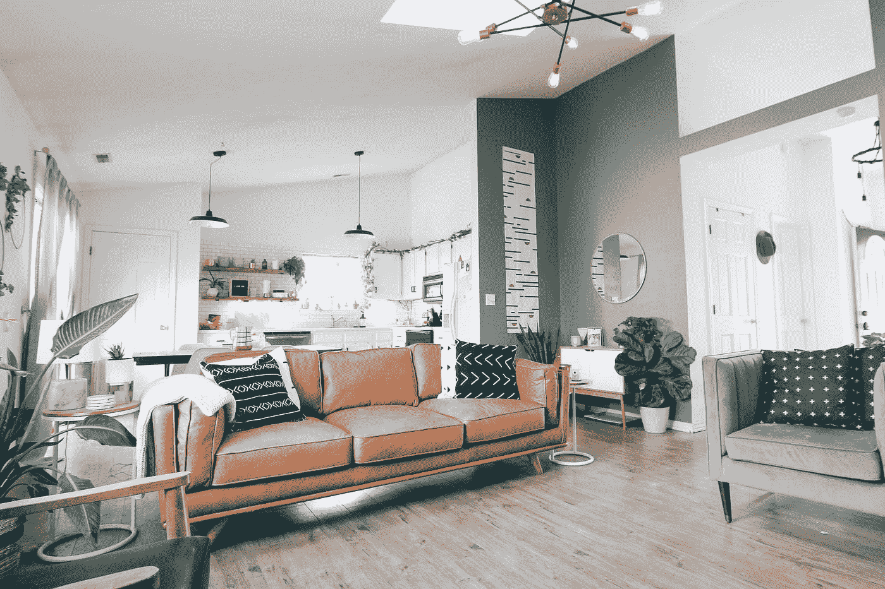

# 使用 D3 向 React 应用程序添加图形— Lab Color、拖放和缩放

> 原文：<https://javascript.plainenglish.io/adding-graphics-to-a-react-app-with-d3-lab-color-drag-and-drop-and-zoom-c7d85493c52a?source=collection_archive---------11----------------------->



Photo by [Kara Eads](https://unsplash.com/@karaeads?utm_source=medium&utm_medium=referral) on [Unsplash](https://unsplash.com?utm_source=medium&utm_medium=referral)

D3 让我们可以轻松地向前端 web 应用添加图形。

Vue 是一个流行的前端 web 框架。

他们合作得很好。在本文中，我们将了解如何使用 D3 为 Vue 应用添加图形。

# 实验室颜色

`d3.lab`方法创建一个新的 lab 颜色。

要使用它，我们可以写:

```
import React, { useEffect } from "react";
import * as d3 from "d3";export default function App() {
  useEffect(() => {
    const lab = d3.lab("blue");
    console.log(lab);
  }, []); return <div className="App"></div>;
}
```

然后我们看到:

```
{l: 29.567572863553245, a: 68.29865326565671, b: -112.02942991288025, opacity: 1}
```

记录在案。

# 过渡

我们可以在 React 应用程序中添加 D3 转场。

为此，我们写道:

```
import React, { useEffect } from "react";
import * as d3 from "d3";export default function App() {
  useEffect(() => {
    d3.selectAll("body")
      .transition()
      .style("background-color", "yellow")
      .transition()
      .delay(5000)
      .style("background-color", "green")
      .delay(2000)
      .remove();
  }, []); return <div className="App"></div>;
}
```

我们选择了`body`元素。

然后我们调用`transition`方法来创建转换。

`style`方法将背景颜色过渡的样式设置为黄色。

那么我们有 5 秒钟的延迟。

然后我们设置背景颜色为绿色。

然后我们调用`delay`来显示绿色背景 2 秒钟。

最后，我们调用`remove`来移除过渡。

# 拖放

使用 D3，我们可以在 React 应用程序中添加拖放功能。

例如，我们可以写:

```
import React, { useEffect } from "react";
import * as d3 from "d3";export default function App() {
  useEffect(() => {
    d3.select("g")
      .datum({
        x: 0,
        y: 0
      })
      .call(
        d3.drag().on("drag", function (d) {
          d3.select(this).attr("transform", `translate(${d.x} , ${d.y})`);
        })
      );
  }, []); return (
    <div className="App">
      <svg>
        <g>
          <rect x="40" y="10" width="50" height="50" fill="teal"></rect>
        </g>
      </svg>
    </div>
  );
}
```

添加一个矩形并启用拖放功能。

我们得到了`g`元素。

然后我们调用`call`方法来观察`g`元素上的拖动事件，以设置`translate` CSS 属性来移动矩形的位置。

# 变焦

我们可以给形状添加缩放功能。

然后我们可以使用鼠标滚轮来放大和缩小 SVG。

例如，我们可以写:

```
import React, { useEffect } from "react";
import * as d3 from "d3";export default function App() {
  useEffect(() => {
    const svg = d3
      .select("#zoom")
      .append("svg")
      .attr("width", 460)
      .attr("height", 460)
      .call(
        d3.zoom().on("zoom", function (d) {
          svg.attr("transform", d.transform);
        })
      )
      .append("g"); svg
      .append("circle")
      .attr("cx", 100)
      .attr("cy", 100)
      .attr("r", 40)
      .style("fill", "#68b2a1");
  }, []); return (
    <div className="App">
      <div id="zoom"></div>
    </div>
  );
}
```

我们获取 ID 为`zoom`的 div，然后将`svg`添加到其中，并为`svg`设置`width`和`height`。

然后我们调用`call`方法让我们监听`zoom`事件并相应地应用转换。

接下来，我们添加`circle`，用`cx`和`cy`表示圆心的 x 和 y 坐标。

`r`有半径，`fill`有圆的背景色。

现在我们可以使用鼠标滚轮来放大和缩小。

# 结论

我们可以创建一个 lab 颜色，添加过渡，拖放，并用 D3 缩放到 React 应用程序中。

喜欢这篇文章吗？如果有，通过 [**订阅我们的 YouTube 频道**](https://www.youtube.com/channel/UCtipWUghju290NWcn8jhyAw?sub_confirmation=true) **获取更多类似内容！**