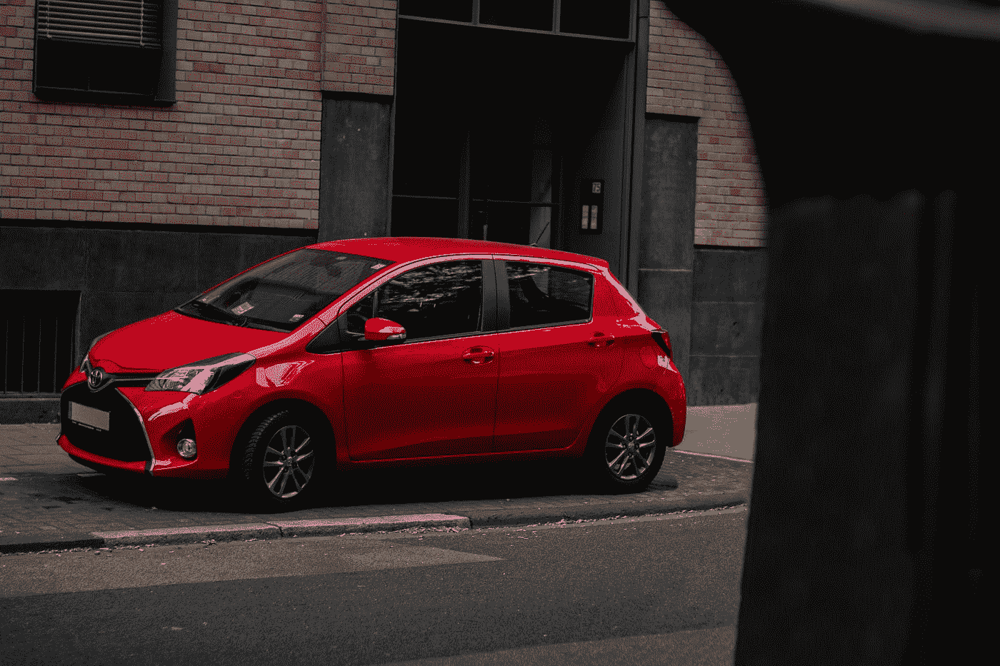

# 使用 D3 向 Vue 应用程序添加图形—圆形、椭圆形和变换

> 原文：<https://javascript.plainenglish.io/adding-graphics-to-a-vue-app-with-d3-circle-ellipse-and-transforms-c0fad058c486?source=collection_archive---------12----------------------->



Photo by [Leon Seibert](https://unsplash.com/@yapics?utm_source=medium&utm_medium=referral) on [Unsplash](https://unsplash.com?utm_source=medium&utm_medium=referral)

D3 让我们可以轻松地向前端 web 应用添加图形。

Vue 是一个流行的前端 web 框架。

他们合作得很好。在本文中，我们将了解如何使用 D3 为 Vue 应用添加图形。

# 圆形元素

我们可以在我们的 Vue 应用程序中添加一个带有 D3 的圆圈。

例如，我们可以写:

```
<template>
  <div id="app">
    <div id="svgcontainer"></div>
  </div>
</template><script>
import * as d3 from "d3";
import Vue from "vue";export default {
  name: "App",
  mounted() {
    Vue.nextTick(() => {
      const width = 300;
      const height = 300;
      const svg = d3
        .select("#svgcontainer")
        .append("svg")
        .attr("width", width)
        .attr("height", height);
      svg
        .append("circle")
        .attr("cx", 200)
        .attr("cy", 50)
        .attr("r", 20)
        .attr("fill", "lightgreen");
    });
  },
};
</script>
```

添加圆。

我们用`d3.select`方法创建了`svg`元素。

我们选择 ID 为`svgcontainer`的 div。

然后我们用`attr`方法设置`width`和`height`来设置`svg`元素的宽度和高度。

然后我们通过使用`'circle'`参数调用`append`来添加这个圆。

我们用`attr`方法设置圆心的 x 和 y 坐标。

`'cx'`设置中心的 x 坐标。

`'cy'`设置中心的 y 坐标。

`'fill'`设置圆的背景颜色。

`'r'`设置圆的半径。

# 椭圆元素

要添加一个椭圆，我们可以做一些类似的事情。

例如，我们可以写:

```
<template>
  <div id="app">
    <div id="svgcontainer"></div>
  </div>
</template><script>
import * as d3 from "d3";
import Vue from "vue";export default {
  name: "App",
  mounted() {
    Vue.nextTick(() => {
      const width = 300;
      const height = 300;
      const svg = d3
        .select("#svgcontainer")
        .append("svg")
        .attr("width", width)
        .attr("height", height);
      svg
        .append("ellipse")
        .attr("cx", 200)
        .attr("cy", 50)
        .attr("rx", 100)
        .attr("ry", 50)
        .attr("fill", "lightgreen");
    });
  },
};
</script>
```

我们把`'circle'`改成了`'ellipse'`。

然后我们添加`'rx'`和`'ry'`属性代替`'r'`。

`'rx'`设置水平半径，`'ry'`设置垂直半径。

# SVG 变换

我们可以用 D3 来转换 SVG。

例如，我们可以写:

```
<template>
  <div id="app">
    <div id="svgcontainer"></div>
  </div>
</template><script>
import * as d3 from "d3";
import Vue from "vue";export default {
  name: "App",
  mounted() {
    Vue.nextTick(() => {
      const width = 300;
      const height = 300;
      const svg = d3
        .select("#svgcontainer")
        .append("svg")
        .attr("width", width)
        .attr("height", height); const group = svg
        .append("g")
        .attr("transform", "translate(60, 60) rotate(30)"); const rect = group
        .append("rect")
        .attr("x", 20)
        .attr("y", 20)
        .attr("width", 60)
        .attr("height", 30)
        .attr("fill", "green");
    });
  },
};
</script>
```

首先，我们用`'transform'`字符串调用`attr`来设置`svg`元素的`transform` CSS 属性。

`translate(60, 60)`将 SVG 分别向右和向下移动 60 个像素。

`rotate(30)`将 SVG 旋转 30 度。

然后我们用`append`方法调用 append rectangle，用`'rect'`作为参数，并设置所有属性。

# 结论

我们可以添加圆形和椭圆形，并在 Vue 应用程序中使用 D3 变换形状。