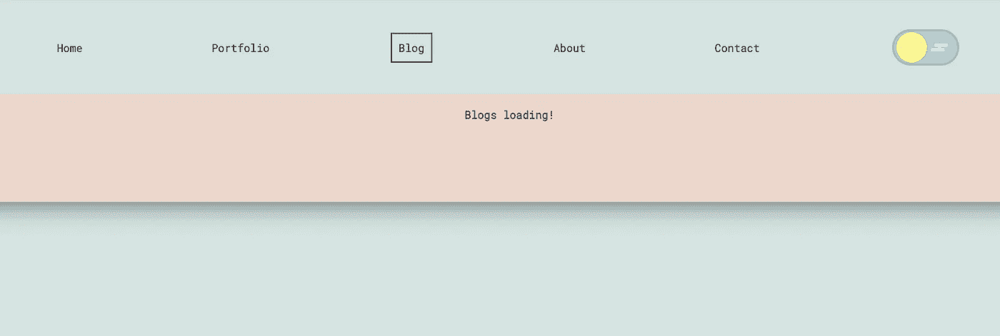
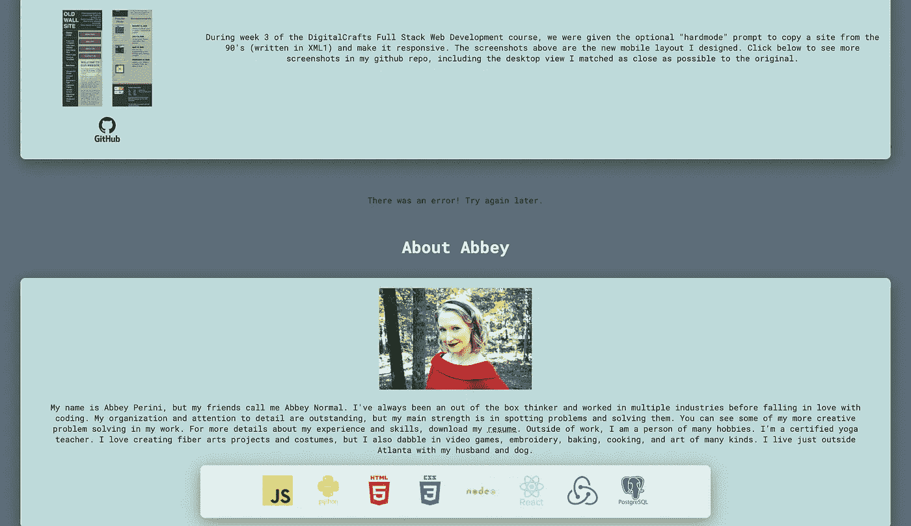
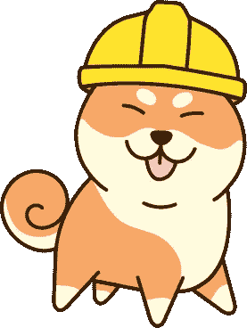
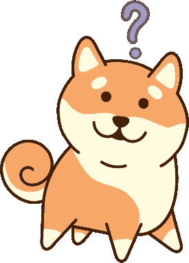
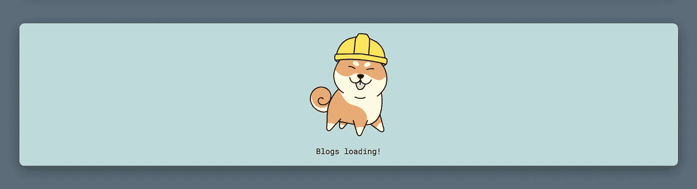
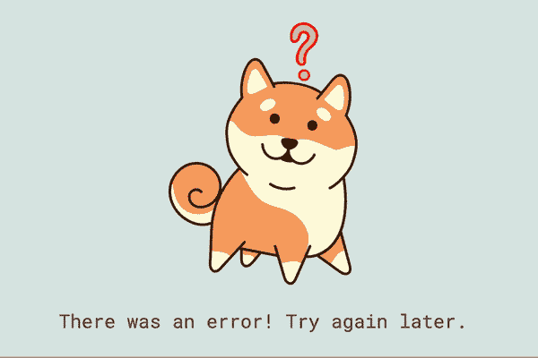

# 将柴犬加载和错误 SVG 添加到我的 React 站点

> 原文：<https://javascript.plainenglish.io/adding-shiba-inu-loading-and-error-svgs-to-my-react-site-48f59806362c?source=collection_archive---------21----------------------->

当我[更新我的作品集网站](/a-walkthrough-of-updating-my-portfolio-site-with-netlify-functions-and-the-dev-api-ef8312d0f743)的博客部分时，我意识到我有一个很好的机会来绘制一些可爱的 SVG，并把我的加载和错误消息提升到一个新的水平。

当我开始时，加载文本如下所示:



错误文本如下所示:



我花了几个小时制作我的装货图:



我的错误图形是:



我准备把它们添加到我的网站上！

关于我如何制作这些柴犬图片，以及如何找到或制作你自己的图片的更多信息，请查看我的帖子[为网络寻找图片并优化它们](https://abbeyperini.medium.com/sourcing-images-and-optimizing-them-for-the-web-a0157f711e2b)。

# 将 SVG 放入我的 React 应用程序

我的复杂的柴犬 SVG 有点大(30-35kb)，但是我选择了`.svg`格式而不是`.png`格式，原因如下:

1.  我刚刚通过重写我的博客从开发应用程序接口中删除了数百张照片
2.  PNG 压缩仅将它们压缩到 21KB
3.  易于调整大小
4.  动画

我首先创建两个新组件——Error . js 和 Loading.js。我最初的错误组件如下所示:

```
import React from ‘react’;function Error() {
 return (
 <div> 
 <p>There was an error! Try again later.</p>
 </div>
 )
}export default Error
```

有几种方法可以将 SVG 导入到组件中。如果我使用 CDN 或其他图像托管工具，我可以使用一个带有`src`链接的``，如下所示:

```

```

或者我可以使用一个``,将 SVG 像 JPEG 或 PNG 一样保存和导入:

```
import React from ‘react’;
import ConfusedShiba from ‘../images/confused-shiba-inu.svg’function Error() {
 return (
 <div>
 </img> 
 <p>There was an error! Try again later.</p>
 </div>
 )
}export default Error
```

这两者都不能让我以编程方式制作动画或更改 SVG。将代码直接粘贴到 React 组件将允许我这样做，但是我的柴犬 SVG 的复杂性使得代码非常长。这是我网站上一个非常简单的 SVG 的 React 包装器的例子。代码是我登陆页面上“查看我的作品”按钮中的旋转箭头，而`<line>`是我的第一个 SVG 代码！

```
function Error() {
 return (
 <div>
 <svg role=”img” aria-labelledby=”arrowTitle arrowDesc” fill=’none’ stroke=’#0E1A27' stroke-width=’8' stroke-dashoffset=’0' stroke-dasharray=’0' stroke-linecap=’round’ stroke-linejoin=’round’ xmlns=’[http://www.w3.org/2000/svg'](http://www.w3.org/2000/svg') viewBox=’0 0 100 100'>
 <title id=”arrowTitle”>Arrow</title>
 <desc id=”arrowDesc”>arrow that spins on hover</desc>
 <line x1=”70" y1=”50" x2=”0" y2=”50" />
 <polyline fill=”none” points=”30,10 80,50 30,90 “/>
 </svg>
 <p>There was an error! Try again later.</p>
 </div>
 )
}
```

最终，我选择利用`create-react-app`的选项来导入一个 SVG 作为组件。以这种方式将 SVG 转换成 DOM[是昂贵的](https://twitter.com/garrett_codes/status/1382842270647517188)，但是在这种情况下，我的站点上只有不到 10 个 SVG 是以这种方式导入的，并且它们都在使用中。对于一个更大的站点，我会使用 Webpack [资产模块](https://webpack.js.org/guides/asset-modules/)或者像 [Font Awesome](https://fontawesome.com/) 这样的图标库来研究像 [SVGR](https://react-svgr.com/) 这样的包。我的错误组件现在看起来像这样:

```
import React from ‘react’;
import {ReactComponent as ConfusedShiba} from ‘../images/confused-shiba-inu.svg’function Error() {
 return (
 <div>
 <ConfusedShiba />
 <p>There was an error! Try again later.</p>
 </div>
 )
}export default Error
```

我将我的错误组件和非常相似的加载组件导入到我的博客组件中，如下所示:

```
import Error from ‘../components/Error’;
import Loading from ‘../components/Loading’;} else if (!state.isLoading && state.error) {
 return (
 <Error />
 )
 } else {
 return (
 <Loading />
 )
 }
}
```

现在我的柴犬在我的网站上，但是因为没有样式，它们很大，并且仍然在错误的背景上。是时候添加一些 CSS 了。首先，我知道我需要为我的柴犬准备一些衬垫和一个`max-width`规则。

```
/* error and loading graphics */.error-graphic {
 padding: 20px 20px 0px 20px;
 max-width: 200px;
}.loading-graphic {
 padding: 20px 20px 0px 20px;
 max-width: 200px;
}
```

200 像素在我的笔记本电脑屏幕上看起来不错，所以这可能是我想去的最大的。这意味着我需要添加媒体查询，并将此规则中的宽度更改为我所能达到的最小宽度，因为我使用了移动优先的设计，使我的网站响应速度降低到 280px。

```
.error-graphic {
 padding: 20px 20px 0px 20px;
 max-width: 100px;
}.loading-graphic {
 padding: 20px 20px 0px 20px;
 max-width: 100px;
}[@media](http://twitter.com/media) screen and (min-width: 350px) {
 .error-graphic, .loading-graphic {
 max-width: 150px;
 }
}[@media](http://twitter.com/media) screen and (min-width: 525px) {
 .error-graphic, .loading-graphic {
 max-width: 200px;
 }
}
```

接下来，我添加容器样式来匹配我的站点的其余部分，结果如下所示:



但这还不是全部！我注意到我的错误柴犬的问号不符合我的容器背景的最低对比度标准。因为这张图片没有向页面添加信息，所以它添加信息并不重要，但是我可以让它在多种颜色之间循环，至少其中一种颜色应该符合标准。另外，使用 CSS 变量来改变我的 SVG 的颜色是我在 React 帖子中最喜欢的部分之一。

为此，我必须直接编辑我的 SVG 代码。首先，在我的 Chrome 浏览器中使用`right click > inspect`，我找到了我想要制作动画的`<path>`和`<circle>`。然后，我给它们添加“questionMark”、“questionMarkFill”、“question mark dot”`id`属性，这样我总能找到它们。接下来，我用我的颜色移除在 SVG 中创建的`<style>` Illustrator，并将它们重写为 CSS 规则。这个 SVG 和我的另一个 Shiba Inu 都有相同的 Illustrator 命名的类，比如“cls-1 ”,所以我也重命名了这些类。在谷歌搜索了大量“SVG CSS 颜色旋转”的变体并决定使用`@keyframes`和`hsla()`之后，我找到了[丹·威尔逊的专业颜色数学](https://danielcwilson.com/blog/2019/09/huedini/)。使用它，我编写了两个 CSS 动画来逐步循环显示颜色:

```
[@keyframes](http://twitter.com/keyframes) colorRotate-fill {
 0%, 100% {
 fill: hsl(0,100%,50%);
 }
 10% {
 fill: hsl(36,100%,50%);
 }
 20% {
 fill: hsl(72,100%,50%);
 }
 30% {
 fill: hsl(108,100%,50%);
 }
 40% {
 fill: hsl(144,100%,50%);
 }
 50% {
 fill: hsl(180,100%,50%);
 }
 60% {
 fill: hsl(216,100%,50%);
 }
 70% {
 fill: hsl(252,100%,50%);
 }
 80% {
 fill: hsl(288,100%,50%);
 }
 90% {
 fill: hsl(324,100%,50%);
 }
}[@keyframes](http://twitter.com/keyframes) colorRotate-fill-hsla {
 0%, 100% {
 fill: hsla(0,100%,50%,.2);
 }
 10% {
 fill: hsla(36,100%,50%,.2);
 }
 20% {
 fill: hsla(72,100%,50%,.2);
 }
 30% {
 fill: hsla(108,100%,50%,.2);
 }
 40% {
 fill: hsla(144,100%,50%,.2);
 }
 50% {
 fill: hsla(180,100%,50%,.2);
 }
 60% {
 fill: hsla(216,100%,50%,.2);
 }
 70% {
 fill: hsla(252,100%,50%,.2);
 }
 80% {
 fill: hsla(288,100%,50%,.2);
 }
 90% {
 fill: hsla(324,100%,50%,.2);
 }
}
```

“hsla”中的“a”代表透明度，其中 0 表示完全透明，1 表示完全不透明。我制作 SVG 的方式需要第三个规则`colorRotate-stroke`，它看起来和`colorRotate-fill`完全一样，但是用属性`stroke`代替属性`fill`。然后，我将规则应用于适当的新类:

```
.error-graphic_qm_dot {
 fill:#a19ece;
 stroke:#524f77;
 stroke-miterlimit:10;
 stroke-width:3px;
 animation-name: colorRotate-stroke, colorRotate-fill-hsla;
 animation-duration: 3000ms;
 animation-fill-mode: forwards;
 transition: all 360ms ease-in;
 animation-iteration-count: infinite;
}
```

结果看起来像这样:



# 关于 SVG 可达性的一个注记

在研究 SVG 的过程中，我发现了[推荐的标签来包含](https://css-tricks.com/accessible-svgs/)以使 SVG 可访问。我已经更新了我站点上的所有 SVG，在`<svg>`标签中有了`<title>`、`<desc>`和`role="img”`和`aria-labelledby=”titleID descID”`属性。

在研究制作 SVG 动画时，我发现彩色动画可能会引发一些可访问性问题，所以我应用了我在我的网站的更新博客部分的[演示中了解到的一个规则:](/a-walkthrough-of-updating-my-portfolio-site-with-netlify-functions-and-the-dev-api-ef8312d0f743)

```
[@media](http://twitter.com/media) (prefers-reduced-motion) {
 .error-graphic_qm-fill, .error-graphic_qm-lines, .error-graphic_qm-lines {
 animation-name: dissolve;
 }
}
```

# 结论

我真的很喜欢制作和设计这些柴犬 SVG。要深入了解网络图片类型以及如何免费制作或找到自己的图片，请查看本文的姊妹博客[为网络寻找图片并优化它们](https://abbeyperini.medium.com/sourcing-images-and-optimizing-them-for-the-web-a0157f711e2b)。你可以在[的 https://abbeyperini.dev](https://abbeyperini.dev) 查看这些文章，并在[的回购](https://github.com/abbeyperini/Portfolio2.0)中查看我的网站的所有代码。

*更多内容请看*[***plain English . io***](http://plainenglish.io)