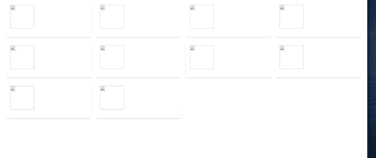

# 使用 CSS 添加骨骼加载动画

> 原文：<https://javascript.plainenglish.io/adding-skeleton-loading-animation-with-css-e6833f6e1d0a?source=collection_archive---------0----------------------->

骨骼加载动画这个术语可能看起来很新，但你几乎在每个流行的平台上都见过(例如脸书、Youtube、LinkedIn 等)。

当网站内容由于网络速度较慢而需要时间加载时，我们通常会看到一个表示内容正在加载的加载图标/gif。
表示内容仍在加载的旧方式:


上面的加载图标会让用户知道内容正在被加载。但是，这不是一个很好的用户体验。

我们怎样才能让它变得更好？

**介绍骨骼装载屏幕:**


骨架加载动画是仍在加载的信息的动画占位符。它模仿了整个视图的结构和外观。


这就是**“骨骼载入画面！”。**它表示将要加载的 ui 的结构。


# 让我们学习如何在我们的应用程序中实现这一点

完整源代码: [Github Repo](https://github.com/ankitsaxena21/Skeleton-Loading-Animation-With-CSS)

下面是一个简单的代码，它从 [fake store api](https://fakestoreapi.com/) 获取数据，并在 DOM 上填充数据。

```
<!DOCTYPE html>
<html lang="en">
<head>
  <meta charset="UTF-8">
  <meta http-equiv="X-UA-Compatible" content="IE=edge">
  <meta name="viewport" content="width=device-width, initial-scale=1.0">
  <title>Document</title>
  <link rel="stylesheet" href="styles.css">
</head>
<body>
  <div class="grid"></div>

  <template id="card-template">
    <div class="card">
      <div class="header">
        
        <div class="title" data-title>
        </div>
      </div>
      <div data-body>
      </div>
    </div>
  </template>
</body>
<script>
  const grid = document.querySelector('.grid')
  const cardTemplate = document.getElementById('card-template')fetch("[https://fakestoreapi.com/products/category/electronics](https://fakestoreapi.com/products/category/electronics)")
    .then(res => res.json())
    .then(posts => {
      grid.innerHTML = ''
      posts.forEach(post => {
        const div = cardTemplate.content.cloneNode(true)
        div.querySelector('[data-img]').src = post.image
        div.querySelector('[data-title]').textContent="$"+post.price
        div.querySelector('[data-body]').textContent = post.title
        grid.append(div)
      })
  })
</script>
</html>
```

现在，我们的应用程序的加载看起来像这样。



现在让我们添加骨骼加载动画。

用下面给出的代码替换 body 标记中的内容。我们在之前的代码中增加了一些 div 和类。

```
<div class="grid"></div>

  <template id="card-template">
    <div class="card">
      <div class="header">
        
        <div class="title" data-title>
          <div class="skeleton skeleton-text"></div>
          <div class="skeleton skeleton-text"></div>
        </div>
      </div>
      <div data-body>
        <div class="skeleton skeleton-text"></div>
        <div class="skeleton skeleton-text"></div>
        <div class="skeleton skeleton-text"></div>
        <div class="skeleton skeleton-text"></div>
      </div>
    </div>
  </template>
```

的。骷髅和。框架文本类用于显示要加载的内容的占位符元素。

现在让我们添加所需的 CSS。

```
.skeleton {
  opacity: .7;
  animation: skeleton-loading 1s linear infinite alternate;
}.skeleton-text {
  width: 100%;
  height: .5rem;
  margin-bottom: .25rem;
  border-radius: .125rem;
}.skeleton-text:last-child {
  margin-bottom: 0;
  width: 80%;
}[@keyframes](http://twitter.com/keyframes) skeleton-loading {
  0% {
    background-color: hsl(200, 20%, 70%);
  }100% {
    background-color: hsl(200, 20%, 95%);
  }
}
```

。skeleton 类有一个自定义动画，名为“skeleton-loading ”,用于改变背景颜色，持续时间为 1 秒，循环计数为无穷大(保持重复)。

现在要显示一些占位符框架卡片和文本，并用实际获取的内容替换它们，在发出获取请求之前添加一个 for 循环(如下所示)。它将从我们的模板中克隆所有数据，并将其放入网格中。

```
//inside the script tag
const grid = document.querySelector('.grid')
const cardTemplate = document.getElementById('card-template')
for (let i = 0; i < 6; i++) {
  grid.append(cardTemplate.content.cloneNode(true))
}fetch("[https://fakestoreapi.com/products/category/electronics](https://fakestoreapi.com/products/category/electronics)")
    .then(res => res.json())
    .then(posts => {
      grid.innerHTML = ''
      posts.forEach(post => {
        const div = cardTemplate.content.cloneNode(true)
        div.querySelector('[data-img]').src = post.image
        div.querySelector('[data-title]').textContent = "$" + post.price
        div.querySelector('[data-body]').textContent = post.title
        grid.append(div)
      })
  })
```

现在，通过这些改变，我们已经成功地将骨骼加载动画添加到我们的应用程序中。(在 chrome dev tools 的“网络”标签中选择“慢速 3G ”,查看在网络较慢的情况下页面如何加载)

**最终结果:**


源代码: [Github Repo](https://github.com/ankitsaxena21/Skeleton-Loading-Animation-With-CSS)

这就是你如何用 CSS 实现骨骼加载动画。我希望你们中的一些人会发现这对我很有用。