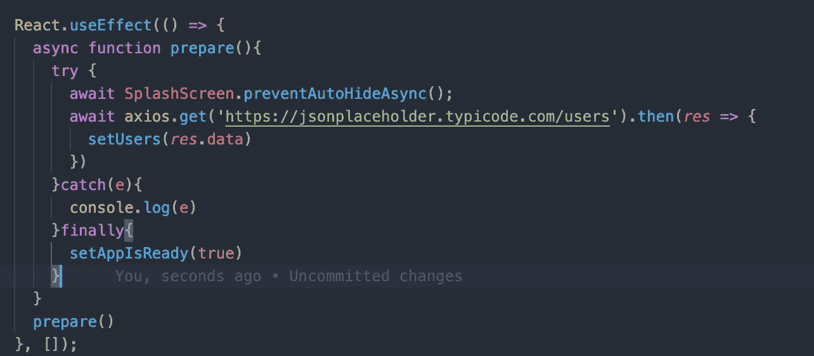
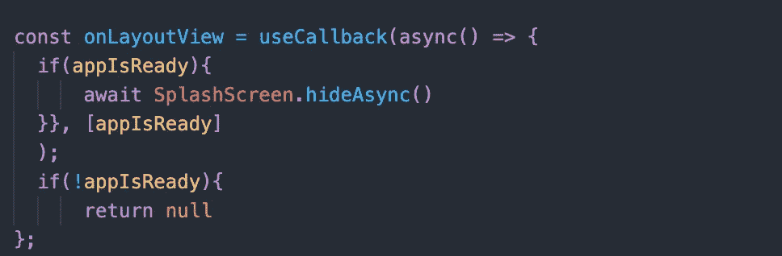
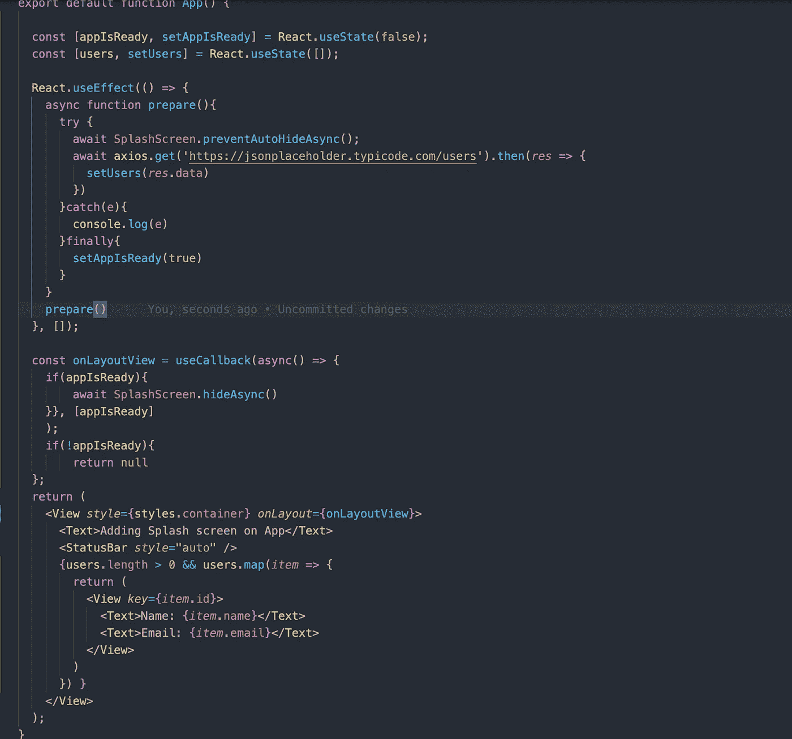
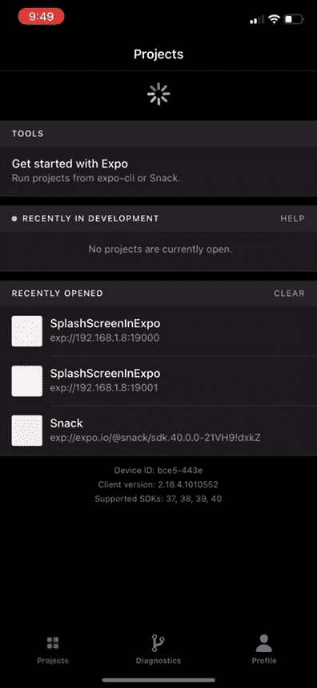

# 如何向 React 本机应用程序添加闪屏

> 原文：<https://javascript.plainenglish.io/adding-splashscreen-to-react-native-app-f688b664e6e9?source=collection_archive---------6----------------------->

添加闪屏，显示 logo，在后台取必要的数据，同时向用户显示闪屏。

在我看来，闪屏是一个被低估的功能。它有很多好处，对于你的应用程序来说，有一个坚固的闪屏的两个主要优点如下-

1.  **第一印象就是最后印象**，告诉你的用户一点关于你的产品，它是做什么的，有什么用？
2.  当闪屏在后台加载时获取必要的数据。
3.  处理网络错误，如互联网未连接的情况

这些小的边缘外壳提供了良好的用户体验。理解用户打开你的应用程序的方式，在后台加载用户数据时只需几毫秒。我们使用我们的标志和描述来展示一些关于我们产品的信息，这在我看来给了一个坚实的第一印象，有助于用户在应用程序中保持。

# 概观

1.  我们将使用 Expo 为 react 本地应用程序创建的存储库。([读取安装](https://shreyvijayvargiya26.medium.com/adding-splashscreen-to-react-native-app-f688b664e6e9))
2.  在目录中添加应用程序的闪屏图像
3.  更新应用程序上的闪屏停留时间
4.  自定义闪屏的配置。
5.  在后台获取样本数据。

# 添加闪屏

Expo 开箱即用提供了一个包来为你的应用程序添加闪屏。如果您没有使用 react-native，那么您可以使用一个简单的 `[https://www.npmjs.com/package/react-native-splash-screen](https://www.npmjs.com/package/react-native-splash-screen)` npm 包。

```
[https://docs.expo.io/versions/v40.0.0/sdk/splash-screen/](https://docs.expo.io/versions/v40.0.0/sdk/splash-screen/)
```

要添加闪屏，请选择您想要作为闪屏的图像，并将该图像添加到根目录的 assets 文件夹中。然后转到 app.json，看到按键“splash”作为一个对象，这将是你的 SplashScreen 配置。在“splash”键对象中，您可以看到“image”键。继续使用您刚才添加的图像的名称编辑该键。

# **定制闪屏&获取数据**

接下来，我们将增加闪屏的停留时间，并使用示例 API 获取数据。`expo-splash-screen`包提供了如下两种方法-

*   **hideAsync —** 立即隐藏闪屏，否则用户会立即看到黑屏。
*   **preventAutoHideAsync** —调用方法后立即显示闪屏

我们可以使用方法来更新显示闪屏的**状态**，根据**状态**值，我们可以调用我们的 API 来获取数据。在 **App.js** 文件中，我们创建了一个名为 **isAppReady** 的**状态**，它决定了闪屏的状态。

```
const [appIsReady, setAppIsReady] = React.useState(false);
```

# 方法

*   使 SplashScreen 可见，并在此期间获取日期
*   获取数据后，立即更新 **appIsReady** 值
*   更新值后，交叉检查更新的值，如果是真的，然后隐藏闪屏

为了获取数据，我们创建了一个名为 **prepare()的函数。**该方法仅在显示闪屏后获取数据。



The App.js file

我们首先显示了闪屏，然后从示例 API 中获取数据，并根据该数据更新用户状态。一旦在 try and catch 的 **finally** 中更新了该数据，我们就更新了 **appIsReady** 的状态。我们仍然不能直接显示闪屏，因为用户可以看到空白屏幕。如果我们立即在 **finally** 方法中显示闪屏，用户将被踢至几毫秒的空白屏幕。
因此，我们将使用另一个名为 **onLayout** 的 react-native 方法，它在组件的 render 方法之前被调用，在这个 onLayout 中，我们将只在 **appIsReady** 值为真时隐藏闪屏。为了更好地理解，我添加了代码的图像。



Our onLayout method

在 **onLayout** 方法中，我们已经检查了我们的 **appIsReady** 值是否为真，然后相应地我们使用 SplashScreen 方法隐藏 SplashScreen。我们现在可以将这个 **onLayout** 方法作为道具传递给我们的根组件。你可以在下面的链接上阅读更多关于 **onLayout** 方法的信息，这是一个非常有用的方法，尤其是当你想动态计算组件尺寸的时候。



App.js

这是我们整个 app.js 代码的样子。在添加了所有内容之后，我在下面添加了一个视频，来看看数据是如何获取的，以及闪屏在真实设备上的样子。



GIF for the final application

# **结论**

Expo 提供了一种非常简单的方法来处理开发生产级应用程序的大多数重要情况。在我看来，这可能是 react-native 的未来。我将在使用 expo 的 react-native 中覆盖更多关于动画、认证和支付的文章，敬请关注。

直到，下一次，有一个美好的一天，人们。

*更多内容请看*[***plain English . io***](https://plainenglish.io/)