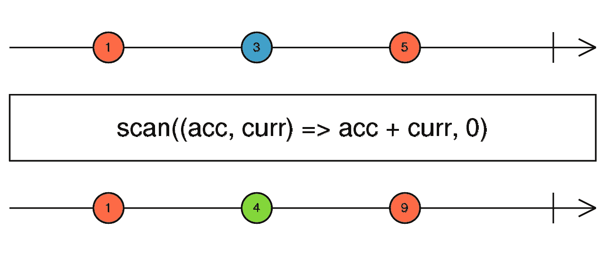

# 2022 年你必须准备的高级角度面试题

> 原文：<https://javascript.plainenglish.io/advanced-angular-interview-questions-you-must-prepare-for-in-2022-f79545eaa46d?source=collection_archive---------0----------------------->

## 最新角度面试问题


Photo by [Andrew Neel](https://unsplash.com/@andrewtneel?utm_source=medium&utm_medium=referral) on [Unsplash](https://unsplash.com?utm_source=medium&utm_medium=referral)

最近，我试图为即将到来的面试做准备，在谷歌上搜索，打开链接，每次都看到相同的问题，这有点困难。所以，我想到了分享我的发现，以及如果有人在准备面试，最常见的问题是什么。

以下是在最近的 Angular 开发者面试中最常被问到的面试问题。这些 Angular 面试问题和答案有助于准备从初级到高级的 Angular 开发者面试。此外，这篇文章涵盖了你在 2022 年必须准备的基本问题。

我也更新了我在前端开发工作中经常问的问题。

让我们从一些基本问题开始:

# 1.constructor 和 ngOnInit 有什么区别？

面试官脑海中出现的一个常见问题是，构造函数和 ngOnInit 之间有什么区别？我们通常的回答是，我们在构造函数中写依赖关系，而在 ngOninit 中写逻辑。

有时候，面试官会查我们还知道些什么？为什么不能把服务或者逻辑放在构造函数里？

简单的答案是，有时，我们需要等到所有的依赖项都加载完毕；或者对于父/子组件，我们可能需要等到组件加载完毕。这就是为什么最好用 ngOnInit 编写逻辑的原因。

让我们检查一下其他的不同之处。


***为了更好地理解这个概念，我们来看看一些实用的代码。***

【https://stackblitz.com/edit/ngoninit-vs-constructor 

# 2.组件和指令有什么区别？

这个也很常见。简单的答案是指令没有影子 DOM，而组件有 HTML。组件用来破坏基于特性的应用程序，而指令只帮助改变某些元素的行为。

让我们来看看其他一些不同之处。


***让我们来看看一些实用的代码，以便更好地理解这个概念。***

[https://stackblitz.com/edit/angular-directive](https://stackblitz.com/edit/angular-directive)

# 3.ElementRef、TemplateRef 和 viewContainerRef 有什么区别？

这个问题适用于更高级的角度面试，面试官想知道你是如何操作视图的，或者你是否有在角度应用程序中创建动态视图的经验。

让我们用例子来看看 ElementRef、TemplateRef 和 viewContainterRef 之间的区别。


> ElementRef 示例:


> TemplateRef 示例:


> ViewContainerRef 示例:


***为了更好地理解这个概念，我们来看看一些实用的代码。***

[https://stack blitz . com/edit/element ref-template ref-viewcontainerref](https://stackblitz.com/edit/elementref-templateref-viewcontainerref)

## 开始写吧！我在 4 个月内赚了 4000 多美元

[](/i-earned-over-4000-in-4-months-on-medium-6a63c7da60e) [## 我在 4 个月内赚了 4000 多美元

### 我用简单英语写 JavaScript 的中级旅程，以及我如何在 4 个月内赚了 4000 多美元

javascript.plainenglish.io](/i-earned-over-4000-in-4-months-on-medium-6a63c7da60e) 

# 4.ng-content、ng-template、ng-container 有什么区别？

看起来不一样吗？是的，当我学习 Angular 时，这三个关键词对我来说都是一样的，但实际上，它们都有自己的目的。

让我们通过例子来看看 ng-content、ng-template 和 ng-container 之间的区别。


> ng-含量示例:


> ng 模板示例:


> ng 容器示例:


***让我们来看看一些实用的代码，以便更好地理解这个概念。***

[https://stack blitz . com/edit/angular-ng-template-ng-content-ng-container-example](https://stackblitz.com/edit/angular-ng-template-ng-content-ng-container-example)

# 5.视图子级和内容子级的区别是什么？

我们确实处理很多父子或子组件。因为 Angular 不支持动态创建组件，也不支持根据组件的关系访问相关组件，所以采访者希望我们知道视图-子组件和内容-子组件之间的区别。

让我们通过例子来看看子视图和子内容之间的区别。


> 视图-子示例:


> 内容-子示例:


***为了更好地理解这个概念，我们来看看一些实用的代码。***

[https://stackblitz.com/edit/angulr-view-content-child](https://stackblitz.com/edit/angulr-view-content-child)

# 6.组件视图、主体视图和嵌入视图之间有什么区别？

这是一个高级的 Angular 面试问题，可以用来了解 Angular 中不同的视图是如何工作的。

让我们通过示例来检查组件视图、主体视图和嵌入视图之间的区别。


> 嵌入式视图示例:


> 主机视图示例:


***为了更好地理解这个概念，我们来看看一些实用的代码。***

[https://stackblitz.com/edit/ng-embedded-view](https://stackblitz.com/edit/ng-embedded-view)

***看看我的新文章……***

## 程序员的 30 种减压方法

[](https://js.plainenglish.io/30-friday-stress-relievers-for-programmers-fbcfede676f7) [## 程序员的 30 种减压方法

### 程序员为什么没有乐趣？

js .平原英语. io](https://js.plainenglish.io/30-friday-stress-relievers-for-programmers-fbcfede676f7) 

# 7.去抖时间和油门时间有什么区别？

当我们处理反应式表单，并希望用户根据输入输入并检查服务时，这两个术语非常方便。


***为了更好地理解这个概念，我们来看看一些实用的代码。***

【https://stackblitz.com/edit/throttletimevsdebouncetime 

[](/frontend-interview-question-what-is-the-difference-between-change-vs-ngmodelchange-f6bb3cb26dbc) [## 角度面试问题:‘改变’和‘ngModelChange’有什么区别？

### 最常见的前端面试问题 2021

javascript.plainenglish.io](/frontend-interview-question-what-is-the-difference-between-change-vs-ngmodelchange-f6bb3cb26dbc) 

# 8.forEach 和 map 有什么区别？

我们来讨论一下基本的 JavaScript 面试问题。有时面试官会问我们什么时候可以使用 forEach 和 map，它们之间有什么区别。

让我们来看看 forEach 和 map 之间的区别。


***让我们来看看一些实用的代码，以便更好地理解这个概念。***

[https://stackblitz.com/edit/ken-demo-foreach-vs-map](https://stackblitz.com/edit/ken-demo-foreach-vs-map)

# 9.ng-content 和 ng-templateoutlet 有什么区别？

当我们处理多个模板时，最好在模板本身中编写可重用的逻辑。了解这两个术语可以增加你在开发人员面试中获胜的机会。


> ng-含量示例:


> ng-templateoutlet 示例:


***为了更好地理解这个概念，我们来看看一些实用的代码。***

[https://stack blitz . com/edit/ngtemplate outlet-and-content-projection](https://stackblitz.com/edit/ngtemplateoutlet-and-content-projection)

[https://stackblitz.com/edit/ng-content-demo-example](https://stackblitz.com/edit/ng-content-demo-example)

# 10.forchild 和 forroot 有什么区别？

这是一个有点高级的话题，但基本的区别是通过使用 forchild 和 forroot，我们可以改变应用程序中服务实例的可见性。

如果你想更多地了解这个话题。请检查这篇文章。

[](https://medium.com/javascript-in-plain-english/understand-angulars-forroot-and-forchild-f27fbc41cb7b) [## 理解根和孩子角度

### 以及为什么我们需要它们来路由

medium.com](https://medium.com/javascript-in-plain-english/understand-angulars-forroot-and-forchild-f27fbc41cb7b) 

***让我们来看看一些实用的代码，以便更好地理解这个概念。***

[https://stack blitz . com/edit/4-for root-vs-for child-with-for root-and-for child](https://stackblitz.com/edit/4-forroot-vs-forchild-with-forroot-and-forchild)

# 11.为什么我们在 RXJS 中使用管道操作符。有什么用？

pipe 方法有助于将多个 rxjs 函数编写在一起，并且它将所有东西结合在一起。

例如:

```
of(1,2,3).pipe(
 map(x => x + 1),
 filter(x => x > 2)
);
```

1.  `pipe()`函数将您想要组合的函数作为其参数，并返回一个新函数，当执行该函数时，将按顺序运行组合的函数。
2.  我们可以使用。pipe()方法来传入一个或多个操作符函数，这些操作符函数可以处理和转换可观察集合中的每一项。

***让我们来看看一些实用的代码，以便更好地理解这个概念。***

[https://stackblitz.com/edit/rxjs-pipe](https://stackblitz.com/edit/rxjs-pipe)

# 12.在 Angular 应用程序中使用异步管道和订阅函数有什么区别？

我们确实在应用程序中大量使用了异步管道和订阅函数，但是它们之间的基本区别是什么，为什么我们使用一个而不是另一个？

我们去看看。


***让我们来看看一些实用的代码，以便更好地理解这个概念。***

[https://stack blitz . com/edit/component-vs-async-pipe-subscriptions-angular](https://stackblitz.com/edit/component-vs-async-pipe-subscriptions-angular)

[](/a-guide-to-the-20-best-vscode-extensions-for-frontend-developers-f75a5d716091) [## 面向前端开发人员的 20 个最佳 VSCode 扩展指南

### 面向前端开发的 VSCode 最有用扩展的综合指南

javascript.plainenglish.io](/a-guide-to-the-20-best-vscode-extensions-for-frontend-developers-f75a5d716091) 

# 13.承诺和可观察的区别是什么？

我们确实处理了两个关键字 lot，但是什么时候我们应该使用 promise 和 observable 呢？如果我们知道承诺和可观察到的区别，这将有助于我们理解。


***为了更好地理解这个概念，我们来看看一些实用的代码。***

[https://stackblitz.com/edit/observable-vs-promises](https://stackblitz.com/edit/observable-vs-promises)

# 14.事件发射器和主体有什么区别？

当我们想要将子组件与父组件进行通信时，我们使用 EventEmitter，而当我们想要在非关系组件之间进行通信时，可以使用 subjects。

下面是它们之间的两个区别。


***为了更好地理解这个概念，我们来看看一些实用的代码。***

[https://stack blitz . com/edit/angular-subject-vs-event-emitter](https://stackblitz.com/edit/angular-subject-vs-event-emitter)

## 在 Angular 中防止按钮点击时多次服务呼叫的 5 种方法

[](https://medium.com/javascript-in-plain-english/4-ways-to-prevent-multiple-service-calls-on-button-click-in-angular-ff7c2797faf8) [## 在 Angular 中防止按钮点击时多次服务呼叫的 5 种方法

### 在 HTTP 服务给出响应之前显示加载程序的 5 种方法

medium.com](https://medium.com/javascript-in-plain-english/4-ways-to-prevent-multiple-service-calls-on-button-click-in-angular-ff7c2797faf8) 

# 15.可观察和主体有什么区别？

这是角面试中常见的问题之一。我们来理解一下可观察和主体的区别。


***为了更好地理解这个概念，我们来看看一些实用的代码。***

【https://stackblitz.com/edit/observables-and-subjects 

# 16.激活的路由和激活的路由快照有什么区别？

激活的路线与激活的路线快照之间的主要区别在于，激活的路线我们可以订阅可观察的，而激活的路线快照仅发出一个值。

***让我们来看看一些实用的代码，以便更好地理解这个概念。***

[https://stack blitz . com/edit/angular-router-snapshot-and-params-Yakov](https://stackblitz.com/edit/angular-router-snapshot-and-params-yakov)

# 17.讨论在你的角度应用中使用的一种不同的加载策略

这种问题问的是检查你用了多深的 Angular。大多数时候我们会回答懒惰加载和急切加载，但是还有一个我们应该考虑的。

## 急切装载

急切加载的功能模块将在应用程序启动前加载。这是默认的模块加载策略。

[https://stackblitz.com/edit/ang-eager-loading-example](https://stackblitz.com/edit/ang-eager-loading-example)

## 惰性装载

延迟加载下的功能模块将在应用程序启动后按需加载。这有助于更快地启动应用程序。

[https://stackblitz.com/edit/angular6-lazy-loading](https://stackblitz.com/edit/angular6-lazy-loading)

## 预加载

预加载的功能模块将在应用程序启动后自动加载。

[https://stack blitz . com/edit/angular-custom-preload-strategy](https://stackblitz.com/edit/angular-custom-preloading-strategy)

要了解如何使用，请点击下面的链接

[](https://medium.com/@lifei.8886196/eager-loading-lazy-loading-and-pre-loading-in-angular-2-what-when-and-how-798bd107090c) [## Angular 2+中的急切加载、延迟加载和预加载:什么、何时以及如何加载？

### 自 2016 年以来，Angular 2+一直是现代 web 应用程序非常受欢迎的前端平台。它引入了一种…

medium.com](https://medium.com/@lifei.8886196/eager-loading-lazy-loading-and-pre-loading-in-angular-2-what-when-and-how-798bd107090c) 

> 让我们继续回答更多的问题。

# 18.什么是元数据？

听说过这个词吗？我们确实以类装饰器、属性装饰器或其他方式使用这个日常元。

让我们来定义元数据。

> 元数据用于修饰一个类，以便它可以被配置为一个类的预期行为。

下面是 Angular 中使用的元数据的例子。

1.  ***类装饰者***—@组件
2.  ***属性装饰者***—@输入
3.  ***方法装饰者***——@ HostListner
4.  ***参数装饰器***——@注入

# 19.routerlinkActive 有什么用途？

当我们在应用程序中使用 navbar 时，这是最常用的指令。当我们想要基于活动选项卡编写 CSS 时，routerlinkActive 用布尔条件检查。

**RouterLinkActive** 是一个指令，用于在绑定到 RouterLink 的 HTML 元素中添加或删除类。使用这个指令，我们可以根据当前的路由器状态切换活动路由器链接的 CSS 类。该指令的主要**用途**是突出显示当前激活的路线。

***为了更好地理解这个概念，我们来看看一些实用的代码。***

[https://stackblitz.com/edit/angular-routerlinkactive](https://stackblitz.com/edit/angular-routerlinkactive)

# 20.我们在 Angular 中使用泛型。

这是 Angular 最新的面试问题之一。面试官想通过对物体或特定的观察对象或事件进行打字来检查你写得有多干净。

我们通常在不同的地方使用泛型。

1.  ***定义发射器时***

```
Output() click : EventEmitter<string> = new EventEmitter<string>()
```

2. ***捕捉来自可观察对象的响应***

```
data: Observable<IResponse>
```

3. ***定义接口***

```
interface Item {
info:string,
…
}
Input public items: Item[]
```

[](/fix-memory-leaks-in-angular-b4f6bdc6e271) [## 提高角度应用的性能

### 角度性能和优化清单

javascript.plainenglish.io](/fix-memory-leaks-in-angular-b4f6bdc6e271) 

# 21.外卡路线是什么？

如果有人键入了不正确的路径，一个常用的通配符路由将重定向到此路由。

如果请求的路由 URL 不属于代码中提到的内容，我们会在控制台中得到一个错误。

因此，为了避免这种错误，并告诉用户该路由不存在，我们使用**通配符路由。**

示例:


***为了更好地理解这个概念，我们来看看一些实用的代码。***

[https://stack blitz . com/edit/angular-feature-modules-final-and-wild card-route-example](https://stackblitz.com/edit/angular-feature-modules-final-and-wildcard-route-example)

# 22.ngIf 和 hidden 有什么区别？

两者不是一样的吗？两者都有隐藏东西的功能。不，但如果你检查 ngIf 不会加载模板，如果条件得到假，而隐藏将加载模板并隐藏它。

**ngIf** 如果表达式为假，将对数据进行注释。这种方式甚至不加载数据，导致 HTML 加载速度更快。

**【隐藏】**将加载数据，并用*隐藏* HTML 属性对其进行标记。这样，即使数据不可见，也可以加载。

所以当我们希望显示/隐藏状态经常改变时，最好使用*【隐藏】*，例如在一个按钮点击事件中，这样我们就不必在每次点击按钮时都加载数据，只需改变它的*隐藏*属性就足够了。

# 23.什么是路由器插座？

我们确实在主应用程序组件 HTML 中看到了这个标签。但这是什么呢？让我们来理解这个术语。

router-outlet 是一个可从`@angular/router`包中获得的指令，路由器使用它来标记应该在哪里插入模板、匹配的组件。

由于路由器出口，您的应用程序将有多个视图/页面，应用程序模板充当您的应用程序的外壳。您添加到外壳中的任何元素都将在每个视图中呈现，只有路由器出口标记的部分会在视图之间发生变化。


# 24.路由器状态是什么？

因为术语定义的路由器状态维护路由的状态，并且可以通过订阅特定的路由事件来访问。

*我们来详细了解一下。*

RouterState 和 ActivatedRoute 类似于它们的快照副本，除了它们将所有值公开为可观察值，这对于处理随时间变化的值非常有用。

**路由器实例化的任何组件都可以注入其 ActivatedRoute。**

如果我们从“/inbox/33/messages/44”导航到“/inbox/33/messages/45”，可观察的数据将发出一组带有新消息对象的新数据，组件将显示消息 45。

## 访问快照

路由器将参数和数据公开为可观察的，这在大多数情况下是方便的，但并不总是如此。有时候，我们想要的是一个可以立刻检查的状态快照。

***为了更好地理解这个概念，我们来看看一些实用的代码。***

[https://stackblitz.com/edit/angular-routerlink-state](https://stackblitz.com/edit/angular-routerlink-state)

# 25.什么是活动路由？

**ActivatedRoute 提供对 URL、参数、数据、查询参数和片段观察值的访问。**

**URL 更改是路由中任何更改的来源。**必须这样，因为用户有能力直接修改位置。

**每当 URL 改变时，路由器从中导出一组新的参数**:路由器获取匹配的 URL 段的位置参数(例如‘:id’)和最后匹配的 URL 段的矩阵参数，并组合这些参数。这个操作很简单:URL 必须随着参数的改变而改变。或者换句话说，相同的 URL 将总是产生相同的参数集。

**接下来，路由器调用路由的数据解析器，并将结果与提供的静态数据相结合。**

鉴于以下情况:

首先导航到“/inbox/33/data/44”，然后导航到“/inbox/33/data/45”，我们将看到:

```
url [{path: ‘data’, params: {}}, {path: ‘44’, params: {}}]
url [{path: ‘data’, params: {}}, {path: ‘45’, params: {}}]
```

# 26.以角度解释不同的注入。

在 Angular 面试问题中，一个常见的面试问题是您如何在 Angular 应用中使用注射？

我们有 5 种不同的方式来提供依赖注入

1.  **使用类**
2.  **使用价值**
3.  **使用工厂**
4.  **代币厂**
5.  **成分注入**

要了解更多详细的实现，请查看下面的文章。

[](https://medium.com/its-tinkoff/what-can-you-provide-with-dependency-injection-in-angular-d7adcfd42db) [## Angular 中的依赖注入能提供什么？

### Angular 有强大的依赖注入基础。我们可以通过我们的应用程序传输任何数据，转换数据并替换…

medium.com](https://medium.com/its-tinkoff/what-can-you-provide-with-dependency-injection-in-angular-d7adcfd42db) 

***详细解释可以查看角度文档。***

[https://stackblitz.com/angular/pmmpqkbmanl](https://stackblitz.com/angular/pmmpqkbmanl)

# 27.在 Angular 中实现翻译的最好方法是什么？

在单页面应用程序中，一个主要特性是动态多语言支持。但是有时候面试官会问你在你的申请中有没有实现翻译？

最常用的库是 ngx-translate，它通过添加 JSON 来提供翻译。

***为了更好地理解这个概念，我们来看看一些实用的代码。***

[https://stackblitz.com/edit/ngx-translate-example](https://stackblitz.com/edit/ngx-translate-example)

要在您的应用程序中学习和实现翻译，请查看下面的文章。

 [## 如何翻译角度应用

### 请按照以下步骤使用翻译。

atit53.medium.com](https://atit53.medium.com/how-to-translate-angular-applications-24f5bbe9f1d7) 

> 让我们继续回答更多的问题。

# 28.解释角度的不同布线参数。

我们确实使用路由参数来维护数据，或者有时在从一条路由导航到另一条路由时传递数据。

Angular 支持以下布线参数。

1.  必需的参数
2.  可选参数
3.  查询参数
4.  导航附加

要了解有关路由参数的更多细节，请查看以下文章。

[](https://medium.com/javascript-in-plain-english/how-to-send-data-through-routing-paths-in-angular-31ea50cb0256) [## 如何在 Angular 中通过路由路径发送数据

### 如何在 Angular 中通过路由路径发送数据

如何通过 Angularmedium.com 的路由路径发送数据](https://medium.com/javascript-in-plain-english/how-to-send-data-through-routing-paths-in-angular-31ea50cb0256) 

# 29.什么是 Angular 中的虚拟卷轴？

在这里，面试官想检查你是否掌握了最新的角度特征。

虚拟渲染背后的核心概念是只渲染可见的项目。

例如，如果应用程序中有数千个警报，一种有效的方法是只加载可见的元素，当它们不可见时，通过用新的元素替换它们来卸载它们。

在@angular/cdk 中已经有了虚拟滚动的初始实现。(7.0.0 版-测试版)

***为了更好地理解这个概念，我们来看看一些实用的代码。***

[https://stackblitz.com/edit/angular-virtual-scrolling](https://stackblitz.com/edit/angular-virtual-scrolling)

# 30.路由参数和查询参数有什么区别？

查询参数和[路线参数](/routing/routeparams)的主要区别在于路线参数对于确定路线是必不可少的，而查询参数是可选的。

让我们了解 Angular 中路由的一些基础知识。

## 声明路线参数

显示特定产品详细信息的组件的路由将需要该产品 ID 的路由参数。我们可以使用下面的`Routes`来实现它:

```
export const routes: Routes = [{ path: '', redirectTo: 'data', pathMatch: 'full' },{ path: 'data', component: DataList },{ path: 'data/:id', component: DataDetails }];
```

注意`product-details`路径中的`:id`路径，它将参数放置在路径中。例如，要查看 ID 为 5 的产品的详细信息页面，您必须使用以下 URL: `localhost:3000/product-details/5`

## 传递查询参数

使用`[queryParams]`指令和`[routerLink]`来传递查询参数。例如:

```
<a [routerLink]="['data-list']" [queryParams]="{ page: 99 }">Go to Page 99</a>
```

或者，我们可以使用`Router`服务以编程方式导航:

```
goToPage(pageNum) {this.router.navigate(['/data-list'], { queryParams: { page: pageNum } });}
```

[](/33-javascript-useful-shorthands-cheat-list-2021-e08b46a1a688) [## 2021 年你应该知道的 JavaScript 顶级优化技术

### 使用现代速记技术、技巧和诀窍优化您的 JavaScript 代码。

javascript.plainenglish.io](/33-javascript-useful-shorthands-cheat-list-2021-e08b46a1a688) 

# 31.解释 Angular 中支持的不同防护装置。

这是角度应用中最常见的问题之一。

在 Angular 有五个主要的守卫。它守卫着道路的入口。

*   `CanActivate`:在路由之前会被调用:*可以用来阻止路由到特定的路径*
*   `CanActivateChild`:会在转到子组件之前被调用:*可以用来阻止子路径*的加载
*   `CanDeactivate`:销毁组件前调用:*可用于处理浏览器事件*
*   `CanLoad`:在模块加载前调用:*可以用来阻止模块*的加载
*   `Resolve`:加载组件前调用:*可用于加载组件前预取数据*

***为了更好地理解这个概念，我们来看看一些实用的代码。***

[https://stackblitz.com/edit/route-guard](https://stackblitz.com/edit/route-guard)

要了解实现，请参阅本文

[](https://medium.com/@ryanchenkie_40935/angular-authentication-using-route-guards-bf7a4ca13ae3) [## 角度认证:使用路由保护

### Angular 附带了许多内置特性，对处理身份验证非常有帮助。我想我的…

medium.com](https://medium.com/@ryanchenkie_40935/angular-authentication-using-route-guards-bf7a4ca13ae3) 

# 32.懒得加载组件的最好方法是什么？

当我们想要减少包的大小并避免一起加载所有模块时，延迟加载模块是最佳实践之一。

但是惰性加载组件呢？这意味着我们加载模块，但不加载组件，直到我们需要它们。它基本上根据需要创建动态组件，并在使用后立即销毁。

***为了更好地理解这个概念，我们来看看一些实用的代码。***

[https://stackblitz.com/edit/ivy-lazy-loading-component](https://stackblitz.com/edit/ivy-lazy-loading-component)

下面的文章解释了我们如何在 Angular 中延迟加载组件。

[](https://medium.com/angular-in-depth/lazy-load-components-in-angular-596357ab05d8) [## 以角度表示的惰性负载分量

### 用 Ivy 和 Angular 9 延迟加载 Angular 组件

medium.com](https://medium.com/angular-in-depth/lazy-load-components-in-angular-596357ab05d8) 

# 33.我们有什么办法可以用 Angular 显示 app 版本？

当我们处理大量部署时，最好显示应用程序版本，这有助于团队之间就变更进行沟通。

可以通过以下步骤实现。

1.  在您的`/tsconfig.json`(有时在`/src/tsconfig.app.json`中也是必要的)中，启用 resolveJsonModule 选项(之后需要重新启动 webpack dev 服务器):

```
"compilerOptions": {
      ...
      "resolveJsonModule": true
      ...
```

1.  然后在你的组件中，例如`/src/app/app.component.ts`使用版本信息:

```
import { version } from '../../package.json';
    ...
    export class AppComponent {
      public version: string = version;
    }
```

也可以在您的 environment.ts 文件中执行步骤 2，这样就可以从那里访问版本信息。

# 34.ES6 中的发电机有哪些？

生成器函数可以暂停并恢复一次或多次，这使得它们很有趣，并且与普通函数非常不同。当函数暂停时，它允许其他函数和代码执行。默认情况下，生成器是异步的。

***为了更好地理解这个概念，我们来看看一些实用的代码。***

[https://stackblitz.com/edit/es6-generators](https://stackblitz.com/edit/es6-generators)

# 35.解释应用程序中的错误机制。

所有应用程序都有其全局错误机制来处理错误并将其记录在 Splunk 或 new relic 上。团队的大多数成员都遵循全局错误机制，该机制会记录是否有任何问题出现，以便进行跟踪，并将用户重定向到特定的路线。

***为了更好地理解这个概念，我们来看看一些实用的代码。***

[https://stackblitz.com/edit/global-error-handler](https://stackblitz.com/edit/global-error-handler)

如果你想了解我们如何实现全局错误机制，请查看这篇文章。

[](https://medium.com/angular-in-depth/expecting-the-unexpected-best-practices-for-error-handling-in-angular-21c3662ef9e4) [## 期待意外 Angular 中错误处理的最佳实践

### "期待意想不到的事情显示了完全现代的智慧."——奥斯卡·王尔德

medium.com](https://medium.com/angular-in-depth/expecting-the-unexpected-best-practices-for-error-handling-in-angular-21c3662ef9e4) 

# 36.Angular 中的自举是什么？

大多数时候，当我们想到这个词的时候，我们会想到一个自举库，但自举不是初始化或加载我们的 Angular 应用程序的技术。

有时候面试官会问角度应用如何加载，或者一开始就解释角度应用加载。让我们检查一下答案。

**Angular 采取以下步骤加载我们的第一个视图。**

1.  Main.ts 应用程序入口点
2.  Index.html 负载
3.  角度、第三方库和应用程序负载
4.  应用模块
5.  应用程序组件
6.  app-root 将在其中添加组件 HTML

欲知详情见下文。

[https://www . tektutorialshub . com/angular/angular-Bootstrapping-application/#:~:text = Bootstrapping % 20 is % 20a % 20 technique % 20 of，to % 20 load % 20 our % 20 first % 20 view](https://www.tektutorialshub.com/angular/angular-bootstrapping-application/#:~:text=Bootstrapping%20is%20a%20technique%20of,to%20load%20our%20first%20view)。

# 37.什么是角元素？我们为什么使用它？

随着 Angular 的成长，它有了非常好的特性。如果你听说过微服务架构使应用程序更加健壮，Angular 也在做同样的事情。

使用 Angular 元素，我们可以将 Angular 应用程序即插即用到其他前端框架。

随着 Angular 6 的发布，新的 Angular Elements 功能现已完全可用。通过使用 Angular 元素，您可以将 Angular 组件打包为自定义元素，这是一种以与框架无关的方式定义新 HTML 元素的 web 标准。

[](https://netbasal.com/understanding-the-magic-behind-angular-elements-8e6804f32e9f) [## 🎩理解棱角元素背后的魔力

### 角形腹板部件

netbasal.com](https://netbasal.com/understanding-the-magic-behind-angular-elements-8e6804f32e9f) 

> 让我们继续回答更多的问题。

# 38.箭头函数和常规函数有什么区别？

我见过面试官开始问一些基本的 JavaScript 问题来测试应聘者的知识。

我知道箭头函数的语法比较简单，而常规函数的语法比较复杂。

面试官大多了解水有多深:)

**回答:**

***1。参数绑定*** :

箭头函数不支持参数绑定，而常规函数支持参数绑定(但是我们可以使用 spread 运算符在箭头函数中添加参数)

**②*。*本关键词:**

箭头函数不支持该关键字，而常规函数有自己的关键字支持。这个特性使得常规的函数使用工厂方法来创建对象。

***3。新增关键词:***

使用函数声明创建的常规函数是可构造的，并且可以使用 new 关键字调用。然而，箭头函数只能被调用而不能被构造，也就是说，箭头函数永远不能被用作构造函数。

***4。重复参数:***

常规函数允许重复参数，而箭头函数不允许重复参数。

# 39.函数式编程语言和面向对象编程语言的区别是什么？你更喜欢哪一个，为什么？

我见过一些面试官开始问这种问题，以获取求职者关于他们目前正在从事的编程语言的知识。


geeksforgeeks

函数式编程的优势和特点是:

*   **纯函数**
*   **功能组成**
*   **避免共享状态**
*   **避免突变状态**
*   **提供高阶函数**

# 40.JavaScript 和 TypeScript 有什么区别？

候选人:TypeScript 是 JavaScript 的超集。

我看到大多数候选人的答案很简单，因为他们不知道 Angular 为什么使用 TypeScript 的许多优点。

*   TypeScript 是一种面向对象的编程语言，而 JavaScript 是一种脚本语言。
*   TypeScript 有静态类型的特性，而 JavaScript 没有这个特性。
*   TypeScript 支持模块，而 JavaScript 不支持模块。
*   TypeScript 支持接口，但 JavaScript 不支持接口。
*   TypeScript 支持方法中的可选参数，但 JavaScript 不支持方法中的可选参数。

**使用 TypeScript 优于 JavaScript 的优势**

*   TypeScript 总是在运行时给出编译错误，因此在部署之前解决这个问题更容易
*   TypeScript 支持静态类型，这允许在编译时检查类型正确性。

[https://JavaScript . plain English . io/routereusestrategy-simplified-in-angular-2e 358 db 618d 9](/routereusestrategy-simplified-in-angular-2e358db618d9)

# 41.你对闭包了解多少？

闭包是一个函数的组合，该函数被捆绑在一起(被封闭),并引用其周围的状态(词法环境)。换句话说，闭包允许您从内部函数访问外部函数的范围。在 JavaScript 中，闭包是在每次创建函数时创建的。

实际上，如果我们想让任何函数都不能访问的变量成为私有变量，我们可以使用闭包。

下面是我从堆栈溢出中找到的简单例子。

假设，您想要**统计用户点击网站上的按钮**的次数。
为此，我们在按钮的`**onClick**`事件上触发一个函数来更新变量的计数

```
<button onclick="updateClickCount()">click</button>
```

# 现在可能有很多方法，比如:

1)您可以使用一个**全局变量**和一个函数来增加**计数器**:

```
var counter = 0;function updateClickCount() {
    ++counter;
    // do something with counter
}
```

但是，缺陷在于**页面上的任何脚本都可以改变计数器，而无需调用** `**updateClickCount()**`。

2)现在，您可能会考虑在函数中声明变量:

```
function updateClickCount() {
    var counter = 0;
    ++counter;
    // do something with counter
}
```

但是，嘿！每次调用`updateClickCount()`函数时，**计数器再次被设置为 1。**

3)思考**嵌套函数**？

嵌套函数可以访问它们“上面”的作用域。在这个例子中，内部函数`updateClickCount()`可以访问父函数`countWrapper()`中的计数器变量

```
function countWrapper() {
    var counter = 0;
    function updateClickCount() {
    ++counter;
    // do something with counter
    }
    updateClickCount();    
    return counter; 
}
```

如果您可以从外部访问`updateClickCount()`函数，并且您还需要找到一种只执行一次`counter = 0`而不是每次都执行的方法，那么这就解决了计数器的难题。

4) **封场救援！(自调用功能)**:

```
var updateClickCount=(function(){
    var counter=0;return function(){
     ++counter;
     // do something with counter
    }
})();
```

自调用函数只运行一次。它将`counter`设置为零(0)，并返回一个函数表达式。

这样`updateClickCount`就变成了函数。“精彩”的地方在于它可以访问父作用域中的计数器。

这叫做 **JavaScript 闭包**。这使得函数有可能拥有“*私有*变量。

`counter`受匿名函数的作用域保护，只能使用 add 函数修改！

> **让我们转向角度问题:**

# 42.模板驱动表单和反应式表单有什么区别？


# 43.Angular 中有哪些不同类型的绑定？

## 单向数据绑定

1.  **插值绑定:**它是**一个**绑定变量，在 HTML 元素中通过添加像

```
*{{value}}*.
```

**2。属性绑定:**它是在组件中声明的绑定特定属性。

```
<button [disabled]= “isDisabled” >
```

**3。属性绑定:**属性绑定用于绑定视图元素的属性特性。

```
<td [attr.colspan]= “val”></td>
```

**4。类绑定:**通过使用这个绑定方法，我们可以有条件地将 CSS 类添加到元素中，从而创建动态样式的元素。

```
<td class= “td” [class.red]= “val.age < 40">{{val.name}}</td>
```

**5。样式绑定:**与提供特定样式绑定的类绑定相同。

```
<h1 [style.color]=”red”>Red</h1>
```

## 双向数据绑定

这种绑定提供了组件和 HTML 之间的双向通信。

```
<input [(ngModel)] ='val'>
```

## 事件绑定

此绑定允许绑定到事件。

```
(click)=”myClickFunction($event)”
```

> 让我们继续回答更多的问题。

# 45.您最常用哪些 RXJS 操作符来处理 HTTP 服务？

下面是 Angular 中处理 HTTP 服务最常用的 RXJS 操作符。

**SUBSCRIBE** : subscribe 用于从观察对象中获取数据。

```
const data$ = this.service.getData(id);data$.subscribe((response:IResponse) => console.log(response));
```

**捕捉错误:**捕捉错误操作符用于处理错误，返回可观察到的错误信息如下。


[https://rxjs-dev.firebaseapp.com/api/operators](https://rxjs-dev.firebaseapp.com/api/operators)

```
const data$ = this.service.getData(id);data$.pipe(catchError(error => of (`error occured: ${error}`))).subscribe((response:IResponse) => console.log(response));
```

**联合收割机最新**

Combine Latest 运算符用于仅从多个可观测源中发出最新值。

当我们试图进行多个 API 调用时，就会用到它。注意:在每个可观察值发出至少一个值之前，combinelatest 不会发出初始值。


[https://rxjs-dev.firebaseapp.com/api/operators](https://rxjs-dev.firebaseapp.com/api/operators)

```
initializeDetails(id: string): void {
    combineLatest([
            this.service.getInitData(),
            this.service.getDetails(id),
        ])
        .pipe(
            catchError((error: HttpErrorResponse) => {
                return throwError(error);
            }),
            finalize(() => ),
            takeUntil(this._ngUnsubscribe$),
        )
        .subscribe(() => {});
}
```

要查看运行示例，请查看这个 stackblitz

[https://stackblitz.com/edit/angular-rxjs-combinelatest](https://stackblitz.com/edit/angular-rxjs-combinelatest)

**去抖时间&不同，直到改变**

在必须控制用户输入速率的情况下，这些操作符是理想的选择，例如提前键入。


[https://rxjs-dev.firebaseapp.com/api/operators](https://rxjs-dev.firebaseapp.com/api/operators)

```
const inputValue = document.querySelector('input');
const dataObservable$ = fromEvent(inputValue, 'input');
dataObservable$.pipe(
        map(event => event.target.value),
        debounceTime(2000),
        distinctUntilChanged())
    .subscribe((data) => console.log(data));
```

你可以在这里找到实际的例子。

[https://stack blitz . com/edit/rxjs-de bounce time-distinctuntilchanged](https://stackblitz.com/edit/rxjs-debouncetime-distinctuntilchanged)

**点击**

Tap 操作符更像是一个实用操作符，可以用来执行透明的操作，比如日志记录。

```
const dataObservable$ = of (8, 9, 10, 11, 12);
dataObservable$.pipe(
    tap(val => console.log(`BEFORE MAP DATA: ${val}`)),
    map(val => val + 20),
    tap(val => console.log(`AFTER MAP DATA: ${val}`))
).subscribe(data => console.log(data));
```

你可以在这里查看实际例子。

[https://stackblitz.com/edit/rxjs-tap-take](https://stackblitz.com/edit/rxjs-tap-take)

**开关图**

回调或承诺的一个主要问题是，我们很难中途取消请求。

例如，如果你正在看某个视频，几秒钟后你想换一个新的视频..此时，我们仍在等待以前的视频请求，新的请求出现了。我们如何取消那个请求？这可能吗？

是的，SwitchMap 使之成为可能。

SwitchMap operator 提供了一种简单的机制来取消这些网络请求。例如，使用 switchMap 操作符查看下面的代码。


[https://rxjs-dev.firebaseapp.com/api/operators](https://rxjs-dev.firebaseapp.com/api/operators)

```
const obs$1 = fromEvent(document, 'click');
const obs$2 = interval(1000);
const finalObs$ = obs$1.pipe(
    switchMap(event => obs$2)
);
const subscription = finalObs$.subscribe((value) => console.log(value));
```

你可以在这里查看实际例子。

[https://stackblitz.com/edit/switchmap-syp5b1](https://stackblitz.com/edit/switchmap-syp5b1)

**分叉连接**

它用于组合多个可观测值，并使它们成为一个流。

它将等待所有的观察完成，然后它将发出一个数组，因此等待所有 HTTP 服务提供响应是有用的。


[https://rxjs-dev.firebaseapp.com/api/operators](https://rxjs-dev.firebaseapp.com/api/operators)

```
const service1 = http.get < Data1[] > (this.data1);
const service2 = http.get < Data2[] > (this.data2);forkJoin([service1, service2])
    .subscribe(res => {
        this.data = res;
        console.log('Stream Data', res);
    });
}
```

你可以在这里玩实际的例子。

https://stackblitz.com/edit/angular-rxjs-forkjoin-example

**重试**

如果服务返回一个错误，该方法将重新订阅源可观察值，达到参数中写入的最大计数。


[https://rxjs-dev.firebaseapp.com/api/operators](https://rxjs-dev.firebaseapp.com/api/operators)

```
this.authService.getData()
  .pipe(
     retry(3), // you retry 3 times
     delay(1000) // each retry will start after 1 second,
  )
  .subscribe(res => {
     // success
  })
```

重试可以在拦截器中使用，以便在失败后重试 HTTP 服务调用。你可以在这里查看重试的实际例子。

[https://stackblitz.com/edit/angular-dcv7vw](https://stackblitz.com/edit/angular-dcv7vw)

# 46.哪些 RXJS 运算符用于转换或操作数据？

下面是转换数据最常用的 RXJS 运算符。

**地图**

地图的工作方式与 JavaScript 地图功能相同。它主要用于将响应转换为新的数组。


[https://rxjs-dev.firebaseapp.com/api/operators](https://rxjs-dev.firebaseapp.com/api/operators)

```
const data = [{
 id: 1,
 value: ‘one’
}, {
 id: 2,
 value: ‘two’
}, {
 id: 3,
 value: ‘three’
}];const dataObservable$ = from(data).pipe(
 map(data => data.value)
).subscribe(x => console.log(x));
```

**减少**

将来自源的可观察值减少为源完成时发出的单个值。


[https://rxjs-dev.firebaseapp.com/api/operators](https://rxjs-dev.firebaseapp.com/api/operators)

```
const data = of(1, 2, 3, 4);const sum = data.pipe(reduce((acc, val) => acc + val));//output: Sum: 10const subscribe = sum.subscribe(val => console.log('Sum:', val));
```

**TOARRAY**

收集所有源发射，并在源完成时以阵列形式发射。


[https://rxjs-dev.firebaseapp.com/api/operators](https://rxjs-dev.firebaseapp.com/api/operators)

```
interval(100).pipe(take(10), toArray()).subscribe(console.log);
```

**扫描**

它将源上发出的所有值组合起来并连接它们。reduce 和 scan 之间的唯一区别是它发出中间累积。



[https://rxjs-dev.firebaseapp.com/api/operators](https://rxjs-dev.firebaseapp.com/api/operators)

```
const clickEvent = fromEvent(document, 'click');
const observableOne = clickEvent.pipe(mapTo(1));
const seed = 0;
const data = observableOne.pipe(scan((acc, one) => acc + one, seed));
data.subscribe(val => console.log(val));
```

# 46.mergemap/switchmap/concatmap 和 exhaustmap 有什么区别，我们可以在哪里使用它们？

我喜欢来自 ZahiC 的 StackOverflow 的最佳答案之一

*   **mergeMap** —立即为任何源项目创建一个可观察项，所有之前的可观察项保持有效


[https://rxjs-dev.firebaseapp.com/api/operators](https://rxjs-dev.firebaseapp.com/api/operators)

*   **串联图**——在创建下一个观察对象之前，等待上一个观察对象完成


[https://rxjs-dev.firebaseapp.com/api/operators](https://rxjs-dev.firebaseapp.com/api/operators)

*   **switchMap** —对于任何源项目，完成前一个可观察对象并立即创建下一个


[https://rxjs-dev.firebaseapp.com/api/operators](https://rxjs-dev.firebaseapp.com/api/operators)

*   **穷尽图**——当先前的可观察项未完成时，源项被忽略


[https://rxjs-dev.firebaseapp.com/api/operators](https://rxjs-dev.firebaseapp.com/api/operators)

为了更清楚地理解，让我们看看下面的动画

**如果你观察到了**

1.  只有在用户完成输入后，switchmap 才会返回外部的可观察值，因此一旦新字母开始输入，它就会取消所有旧的可观察值。
2.  **concatmap** 将为我键入的每个字母调用，因此每次用户键入内容时外部可观察到的调用，因此我们可以看到所有键入的字母都有 1 秒的延迟
3.  **mergemap** 将被立即调用，但它将保留旧的可观察对象。
4.  **exhausmap** 将在开始新的观察对象之前等待一个观察对象完成，因此您可以看到外部观察对象可能没有在文本框中键入最新的值。

你可以在这里找到一些实际的例子。

[https://stackblitz.com/edit/rxjs-map-diff](https://stackblitz.com/edit/rxjs-map-diff)

# 47.在 Angular 中讨论不同的装饰者。

装饰器的主要目的之一是存储关于类、方法或属性的元数据。正如我们已经探讨过的，装饰器的全部目的是存储关于类、方法或属性的元数据。

*   **类装修工:** `@Component` `@NgModule` `@Pipe`
*   **属性装饰者为属性内类:** `@Input` `@Output` `@ContentChild` `@ContentChildren` `@ViewChild` `@ViewChildren`
*   **类内部方法的方法装饰者:** `@HostListener` `@HostBinding`
*   **类构造函数内部参数的参数装饰器:** `@Inject`

# 48.用 Angular 解释不同的生命周期方法。

1.  **构造函数**:类实例化时调用的默认方法。
2.  **ngOnChanges** :当创建一个新组件时执行，当带有@Input 的绑定属性之一改变时，它也是唯一一个在被调用时接受一个参数的钩子，该参数被称为 SimpleChanges。
3.  **ngOnInit** :组件初始化后调用。这不允许组件在 DOM 上可见。这在构造函数之后运行。
4.  **ngDoCheck** :变更检测运行时运行。如果没有变化，即使只是发生了一个事件，它也会运行，以防万一，以确定是否有什么发生了变化。(例如:它将在一个按钮点击事件之后运行，而不管它是否正在改变)
5.  **ngAfterContentInit** :这是在内容(ng-content)被投影到视图中之后调用的。
6.  **ngAfterContentChecked** :在检查完每个投影内容后调用。
7.  **ngafterviewit**:在组件视图(和子视图)初始化后调用。
8.  **ngAfterViewChecked** :每次视图(和子视图)被检查时调用。

# 49.解释角度生命周期挂钩的层次。

Raed Khalaf 给出的这个图表对我检查角度生命周期钩子的流程帮助很大。


让我们看看它实际上是如何工作的。

[https://stackblitz.com/edit/lifecycle-hooks-angular](https://stackblitz.com/edit/lifecycle-hooks-angular)

# 50.渲染器 2 是什么？

`Renderer2`是一个简单的 DOM 操纵浏览器 API 的默认包装器。Renderer2 主要用于创建自定义指令。

```
constructor(el: ElementRef, renderer: Renderer2) {
    renderer.addClass(el.nativeElement, 'some');
}
```

你可以在这里找到实际的例子。

[https://stackblitz.com/edit/renderer2-example-2](https://stackblitz.com/edit/renderer2-example-2)

# 51.渲染器和 ElementRef 有什么区别？

我喜欢 StackOverflow 的[君特·佐奇鲍尔](https://stackoverflow.com/users/217408/g%c3%bcnter-z%c3%b6chbauer)提供的答案。

`Renderer`是 DOM 的部分抽象类。使用`Renderer`操作 DOM 不会破坏服务器端呈现或 Web Workers(直接访问 DOM 会破坏它们)。

`ElementRef`是一个可以保存对 DOM 元素的引用的类。在浏览器 DOM 实际上不可用的环境中，这又是一个不能打破的抽象。

如果`ElementRef`被注入到一个组件中，那么注入的实例就是对当前组件的宿主元素的引用。

`Renderer`作用于 DOM，`ElementRef`是对`Renderer`作用的 DOM 中的元素的引用。

# 52.Zone.js 是什么？

来自一个 StackOverflow 由[阿伦瓦拉文](https://stackoverflow.com/users/4305935/arunvalaven)回答

Zone 为浏览器中的所有异步操作创建了一个包装器，比如用户交互、HTTP、定时器以及任何其他可能导致状态改变的变化。

> *区域知道这些操作何时完成。依次，* ***从区域中订阅通知*** *，用于这些操作中的任何一个操作完成时。这让 Angular 知道它可以运行其* ***变化检测*** *算法，并重新渲染任何已发生变化的内容。这可以最大限度地减少渲染波动，提高渲染效率。*

在某些情况下，我们可能希望我们的代码在没有区域的情况下执行，那么我们可以使用 **NgZone 的`**runOutsideAngular**` 方法。**

当我们在区域外运行时，Angular 不会选择任何异步事件，这意味着不会检测到任何变化。这意味着视图将不会更新，直到我们重新进入该区域。

只有当我们不想一直更新视图，而想在某个时间后更新视图时，这个特性才是有用的。

下面是 stackblitz 实际检查。

[**https://stackblitz.com/edit/angular-zone-psplsu**](https://stackblitz.com/edit/angular-zone-psplsu)

# 53.Angular 中的竞争条件是什么？

竞态条件大多发生在自动完成功能中，其中用户绑定一个输入单词“test ”, API 服务调用恰好获取“test”的数据，在此期间，用户突然开始键入其他字符“test ”, API 首先获取“abc”的结果……现在旧的“test”服务调用完成，并给出测试结果，这可能导致“abc”的数据被覆盖。

当一个可观察对象由于某种原因被延迟，而另一个可观察对象先完成时，就会发生这种情况。

**解决方案:**

为了解决这个问题，我们需要在用户开始输入“abc”时取消旧的“测试”可观察值。RXJS 提供了一个使用 switchmap 的解决方案来实现这一点。

```
this.form
    .get('userInput')
    .valueChanges
    .pipe(
        debounceTime(500),
        tap(() => this.isLoading = true),
        switchMap(value => this.service.search({
                name: value
            }, 1)
            .pipe(
                finalize(() => this.isLoading = false),
            )
        )
    )
    .subscribe(response => this.data = response);
```

你可以在这里看到实际的例子。

[https://stack blitz . com/edit/angular-material-autocomplete-async 2](https://stackblitz.com/edit/angular-material-autocomplete-async2)

# 54.Angular 中的回调、承诺和异步/等待是什么？

回调:回调是传递给另一个函数的函数。当第一个函数完成后，它将运行第二个函数。

```
function(callback){
  //do some tasks 
   callback();
}
```

**承诺:**承诺用于处理操作的异步结果。JavaScript 被设计成在代码的其他同步部分可以运行之前，不等待异步代码块完全执行。有了承诺，我们可以推迟代码块的执行，直到异步请求完成。这样，其他操作可以不间断地继续运行。([来源](https://www.loginradius.com/blog/async/callback-vs-promises-vs-async-await/))

```
test(function(){
    return test1(function(){
        return test2(function(){
            return test3(function(){
                done()
            })
        })
    })
})
```

它使它更具可读性，像这样:

```
test()
    .then(test1)
    .then(test2)
    .then(test3)
    .then(done)
```

**Async/Await:**Async 函数用来写异步代码，具体来说就是承诺。在这个函数中，关键字 **await** 用于暂停一个承诺的执行，直到它被解决。换句话说，它等待承诺解决，然后恢复异步功能。

```
async function test(){
    let data = await getData() // it waits until we get data
    return data;
}
```

要了解更多详细的解释，我建议你看看这篇文章。

[https://medium . com/front-end-weekly/callbacks-promises-and-async-await-ad 4756 e01d 90](https://medium.com/front-end-weekly/callbacks-promises-and-async-await-ad4756e01d90)

# 55.Angular 中的主机绑定和主机侦听器是什么？

`**@HostListener**` -将持续监听用`@HostListener`声明的主机元素发出的事件。

`**@HostBinding**` -它将属性绑定到宿主元素，如果绑定发生任何情况，`HostBinding`将更新宿主元素。

简单来说，

*   `@HostBinding`:这个装饰器将一个**类属性**绑定到主机元素的一个属性。
*   `@HostListener`:这个装饰器将一个**类方法**绑定到主机元素的一个事件。

***你可以在这里玩一个实际的例子。***

[https://stackblitz.com/edit/hostbinding-hostlistener](https://stackblitz.com/edit/hostbinding-hostlistener)

# 56.Angular 中的依赖注入是什么？

依赖注入(DI)是 Angular 的核心概念，它允许一个类从另一个类接收依赖。在 Angular 中，大多数时候依赖注入是通过将一个服务类注入到一个组件或模块类中来完成的。

简单来说，

一种编码模式，其中一个类从外部来源接收它需要的对象实例(称为依赖关系),而不是自己创建它们。

你可以在这里找到实际的例子。

[https://stack blitz . com/edit/angular-dependency-injection-services-example](https://stackblitz.com/edit/angular-dependency-injection-services-example)

# 57.以角度解释摘要周期/变化检测周期。

在使用变化检测周期执行的角度摘要周期的较新版本中。

当用户更改 DOM 中的任何内容时，会发生以下事件

1.  用户更新 DOM
2.  Angular 使用 zone 来跟踪任何异步任务(点击、设置间隔、服务请求)
3.  角度检测变化
4.  变更检测从上到下检查组件树中的每个组件，以查看是否发生了任何模型变更。

*   应用程序引导过程中创建的角度组件树和变化检测器将被激活
*   检测器将当前值与先前值进行比较
*   如果数值改变，它会将`isChanged` 设置为真。
*   注意:这种变化检测不是深度比较。

5.如果有新值，组件的视图将被更新。


[https://www.mokkapps.de/blog/the-last-guide-for-angular-change-detection-you-will-ever-need/](https://www.mokkapps.de/blog/the-last-guide-for-angular-change-detection-you-will-ever-need/)

# 58.markForCheck 和 detectchanges 有什么区别？

`cd.detectChanges()`将从当前组件一直到它的后代运行变更检测。

`cd.markForCheck()`不会运行变更检测，但会将其祖先标记为需要运行变更检测。下一次发生任何更改检测时，它也将为那些被标记的组件运行。

*   如果我们想减少变化检测的次数就叫用`cd.markForCheck()`。通常，变更会影响多个组件，在某个地方会调用变更检测。
*   如果我们在一个祖先多于后代的组件中改变状态，你可以通过使用`detectChanges()`来提高性能，因为我们没有必要在组件的祖先上运行变化检测。

# 59.克隆对象的方法有哪些？

有三种方法可以在 Angular 中克隆对象。

**1。原生方法(深层复制)**

最好也是最古老的克隆方法之一是使用 JSON.stringify 进行本地深度克隆

`JSON.parse(JSON.stringify(object))`

```
const a = {
  string: 'string',
  number: 123,
  bool: false,
  nul: null,
  date: new Date(),  // stringified
  undef: undefined,  // lost
  inf: Infinity,  // forced to 'null'
  re: /.*/,  // lost
}
console.log(a);
console.log(typeof a.date);  // Date object
const clone = JSON.parse(JSON.stringify(a));
console.log(clone);
console.log(typeof clone.date);  // result of .toISOString()
```

**2。使用库的可靠克隆(深层拷贝)**

我们可以使用已经可用的库，例如

*   lodash—`[cloneDeep](https://lodash.com/docs#cloneDeep)`；可以通过 [lodash.clonedeep](https://www.npmjs.com/package/lodash.clonedeep) 模块单独导入，如果您还没有使用提供深度克隆功能的库，这可能是您的最佳选择

```
var objects = [{ 'a': 1 }, { 'b': 2 }];var deep = _.cloneDeep(objects);
```

**3。ES6(浅层拷贝)**

ES6 提供了两种不同的方法来克隆对象，一种是 Object.assign，另一种是 spread，operator。

```
var data= {val: "string"};
var newdata= Object.assign({}, data);
var newdata3= {...data};  // Spread Operator
```

# 60.解释 Angular 应用程序如何加载/初始化。

以下是 ng 服务后将执行的步骤。

1.  它从 Angular.json 开始，那里有 Angular 项目的所有配置，它将检查所有路径和配置，并搜索 main.ts 文件。
2.  main.ts 是应用程序的入口点。它调用引导模块并告诉构建器引导应用程序。
3.  Angular 中的 bootstrap 是什么？它将与网页的 HTML 交互并提供数据。
4.  然后，我们启动一个 Angular 应用程序，并将 app.module.ts 作为参数传递。在 app.module.ts 中我们告诉 Angular: *“有一个 app 组件是你自己尝试启动时应该知道的”。*
5.  Angular 现在分析这个应用程序组件，读取我们传递到那里的设置，那里有*选择器应用程序根*。
6.  现在 Angular 知道所有的模块、组件和脚本。
7.  现在，Angular 能够处理 index.html 中的 *app-root* ，并且知道*选择器*的规则。
8.  *应用根选择器*应插入应用组件并加载应用 component.html
9.  这就是角度应用的开始。

(来源:[https://dev . to/casperns/how-angular-trigger-index html-and-start-working-1l 46](https://dev.to/casperns/how-angular-trigger-indexhtml-and-start-working-1l46))

# 61.一个@Input()值在 Angular 中变化时如何检测非原语类型数据？

你可以查看这篇文章，以获得详细的了解。

[](/how-to-detect-when-an-input-value-changes-in-angular-5872c77517fc) [## 如何检测输入()值在角度上的变化

### 检测输入值何时改变角度

javascript.plainenglish.io](/how-to-detect-when-an-input-value-changes-in-angular-5872c77517fc) 

# 62.Angular 中有哪些不同的封装策略？

1.  **视图封装。None:** 通过使用这种方法，我们将样式暴露给外部组件。(注意:我们需要确保使用正确的选择器)
2.  **视图封装。仿真:**这是默认的方法，如果我们覆盖了一些东西，基本上不会暴露样式，我们也可以使用全局样式。
3.  **视图封装。ShadowDom:** 这种封装策略利用了 ShadowDom，因此它使用自己的 shadowRoot 来呈现组件。

# 63.Angular 中的暗影 DOM 是什么？

Shadow DOM 基本上允许将一组 DOM 实现隐藏在单个元素中(这是组件的基本思想)，并将样式封装到元素中。

Angular 不使用**阴影 DOM** (默认)也不使用**虚拟 DOM** 。

使用`encapsulation: ViewEncapsulation.Emulated`(默认)时，没有**阴影 DOM** ，因为样式封装只是模拟的。

`encapsulation: ViewEncapsulation.Native`在本地支持的浏览器上启用**阴影 DOM** ，或者在加载 web 组件 polyfill 时再次模拟。

**影子 DOM** 也不像虚拟 DOM 那样以性能为目标，而是风格封装。

# 64.解释 Angular 中不同类型的指令。

Angular 中有三种指令:

1.  组件—带有模板的指令。
2.  结构化指令—通过添加和删除 DOM 元素来更改 DOM 布局。( ***ngIf** ， ***ngFor** )
3.  属性指令—更改元素、组件或其他指令的外观或行为

```
[@Directive](http://twitter.com/Directive)({
    selector: '[appHighlight]'
})
export class HighlightDirective {
    constructor(el: ElementRef) {
        el.nativeElement.style.backgroundColor = 'yellow';
    }
}
```

HTML 可以是

```
<p appHighlight>Highlight me!</p>
```

# 65.退订可观察对象的最好方法是什么？

如果我们不“取消订阅”可观察对象，它会导致 Angular 应用程序中的内存泄漏。

有几种方法可以取消订阅 observables。

1.  退订方法
2.  aync 管道
3.  RXJS 接受运算符
4.  RXJS 第一运算符
5.  npm 库，如(全部取消订阅，子接收器)

# 66.什么是角语服务？

Angular 语言服务为代码编辑器提供了一种在 Angular 模板中获得完成、错误、提示和导航的方法。它可以在单独的 HTML 文件中使用外部模板，也可以使用内嵌模板。

语言服务包括:

*   完成列表
*   AOT 诊断消息
*   快速信息
*   转到定义

(来源:[https://angular.io/guide/language-service](https://angular.io/guide/language-service))

# 67.Angular 的 canLoad 和 canActivate 的区别？

**CanLoad** 防护装置防止加载惰性加载模块。当我们不想让用户导航到模块的任何路线，甚至不想加载模块时，可以使用这种方法。

```
{
    path: 'test',
    loadChildren: 'app/test/test.module#TestModule',
    canLoad: [AuthGuardService]
},
```

**可激活**防护装置，防止未经授权的用户进入路线。这种保护不会阻止模块自己加载。

```
{ 
      path: '',
      component: TestComponent,
      children: [ 
        {
          path: 'test-data',
          component: TestListComponent,
          canActivate: [ AuthGuardService ]
        }
      ]
    }
```

## 68.如何检查路线角度是否改变？

我们可以在组件构造器中订阅路由器事件。NavigationStart 和 NavigationEnd 或任何其他事件可用于检查活动。

```
constructor(private router: Router) {
router.events.subscribe(
        (event) => {
            if (event instanceof NavigationStart)
                // startroute
            if (event instanceof NavigationEnd) {
                // end route
            }
        });
}
```

# 69.用 Angular 解释不同的路由器事件

1.  导航开始:导航开始。
2.  RouteConfigLoadStart:在路由器惰性加载路由配置之前。
3.  RouteConfigLoadEnd:延迟加载路由后。
4.  路由被识别:当路由器解析 URL 并且路由被识别时。
5.  GuardsCheckStart:当路由器开始路由的*保护*阶段时。
6.  ChildActivationStart:当路由器开始激活路由的子项时。
7.  ActivationStart:路由器开始激活路由时。
8.  GuardsCheckEnd:当路由器成功完成路由的*保护*阶段时。
9.  ResolveStart:当路由器开始路由的*解析*阶段时。
10.  ResolveEnd:当路由器成功完成路由的*解析*阶段时。
11.  ChildActivationEnd:当路由器完成激活路由的子项时。
12.  激活结束:路由器完成激活路由时。
13.  导航结束:导航成功结束时。
14.  NavigationCancel:取消导航时。
15.  NavigationError:当导航由于意外错误而失败时。
16.  Scroll:当用户滚动时。

(来源:【https://angular.io/api/router/Event )

# 70.触发角度变化检测的手动方式有哪些？

我们可以使用以下方法在 Angular 中手动触发变化检测。

*   **NgZone.run(callback)** —它将评估角度区域内的回调函数。NgZone 是一个可注入的服务，用于在角度区域内部或外部执行工作。
*   **ApplicationRef.tick()** —这将检查整个组件树，以检测角度的变化。
*   **changeedetectorref . detect changes()**—这将只检查组件及其子视图的变化检测。

71.从角度讨论不同的管道。

72.你在 Angular 中遵循的最佳安全实践是什么？

73.提高角度性能的最佳方法是什么？

74.你处理过检查后表情发生变化的错误吗？

75.如果已经加载了一个模块，该如何处理？

76.你在 Angular 中创建了自定义库吗？

77.你在应用中分析内存的方法有哪些？

78.用 Angular 解释不同的路由器事件？

79.Angular 中的数据类型有哪些？

80.优化异步验证器的最好方法是什么？

81.Angular 中的 Enums 是什么？

82.JavaScript 中的 find 和 filter 有什么区别？

83.防止在 Angular 中点击按钮时出现多个服务呼叫。

84.如何在 Angular 中的组件之间传递数据？

85.(change)和(ngModelChange)有什么区别？

86.声明、提供者和导入有什么区别？

87.如何在角元件库(比如角材)中覆盖 CSS？

88.如何将组件中的字符串动态绑定到 HTML？

89.如何在同一个元素上设置 ngFor 和 ngIf？

90.你能举一个内置验证器的例子吗？

91.什么是入门组件？

92.什么是有角度的可观察和观察者？

93.Angular 里的服务人员是什么？

94.如何在 Angular 中用最新版本更新所有库？

95.什么是拦截器？您如何配置您的应用程序/

96.解释你的 Angular 应用的架构。

97.解释一些你最常用的测试角度组件的方法。

98.你在应用中使用了哪些不同的 SCSS 函数？

99.OnPush 和默认变更检测有什么区别？

100.如何将数据绑定到模板？

101.takeWhile 和 takeUntil RXJS 运算符有什么区别？

102.behavior Subject/Subject/replay Subject 和 Async Subject 有什么区别？

103.解释 ng-temple、ng-content、ng-container 和 ng-templateOutlet 的实际用法。

104.为什么我们在 route 中使用 forchild 和 forroot 方法？它的用途是什么？

105.如何将所有角度库更新到最新版本？

106.Angular 中的内容投影是什么，它是如何工作的？

107.Angular 中的 APP _ INITILIZER 是什么，是用来做什么的？

108.解释角度应用中的路由重用策略。

109.Angular 中的服务器端渲染是如何工作的？

110.Angular 里的服务人员是什么？如何使用它们？

> 如果您正在寻找其余问题的答案，请回复我。

# 延伸阅读:

[](/frontend-interview-question-what-is-the-difference-between-change-vs-ngmodelchange-f6bb3cb26dbc) [## 角度面试问题:‘改变’和‘ngModelChange’有什么区别？

### 最常见的前端面试问题 2021

javascript.plainenglish.io](/frontend-interview-question-what-is-the-difference-between-change-vs-ngmodelchange-f6bb3cb26dbc) [](/what-are-the-different-built-in-pipes-available-in-angular-f59bbae6c949) [## Angular 有哪些不同的内置管道？

### 你必须为下一次面试准备的 100 个问题。

javascript.plainenglish.io](/what-are-the-different-built-in-pipes-available-in-angular-f59bbae6c949) [](/how-to-get-the-current-value-of-an-rxjs-subject-or-observable-b5eb666b20f6) [## 如何获得 RxJS 主题或可观察对象的当前值

### 获取 RxJS 可观察值的当前值——每日角度提示、技巧和最佳实践

javascript.plainenglish.io](/how-to-get-the-current-value-of-an-rxjs-subject-or-observable-b5eb666b20f6) [](/a-guide-to-the-20-best-vscode-extensions-for-frontend-developers-f75a5d716091) [## 面向前端开发人员的 20 个最佳 VSCode 扩展指南

### 面向前端开发的 VSCode 最有用扩展的综合指南

javascript.plainenglish.io](/a-guide-to-the-20-best-vscode-extensions-for-frontend-developers-f75a5d716091) [](/33-javascript-useful-shorthands-cheat-list-2021-e08b46a1a688) [## 2021 年你应该知道的 JavaScript 顶级优化技术

### 使用现代速记技术、技巧和诀窍优化您的 JavaScript 代码。

javascript.plainenglish.io](/33-javascript-useful-shorthands-cheat-list-2021-e08b46a1a688) [](/routereusestrategy-simplified-in-angular-2e358db618d9) [## 路由使用策略在角度上得到简化

### Angular 中的路由复用策略是什么？如何实施？

javascript.plainenglish.io](/routereusestrategy-simplified-in-angular-2e358db618d9) 

*更多内容看* [***说白了. io***](http://plainenglish.io/) ***。*** *报名参加我们的* [***免费每周简讯点击这里***](http://newsletter.plainenglish.io/) ***。***