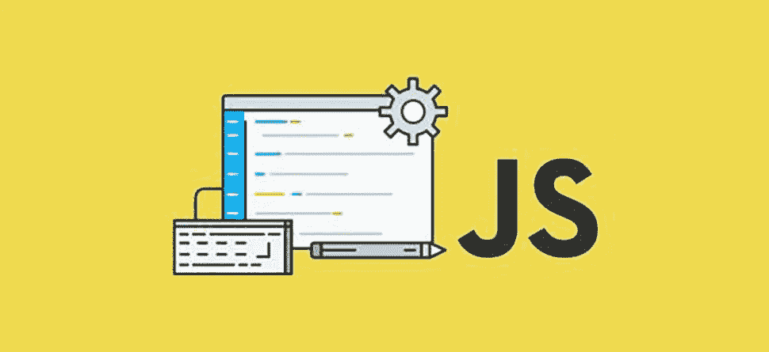
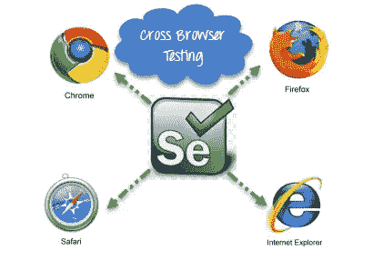
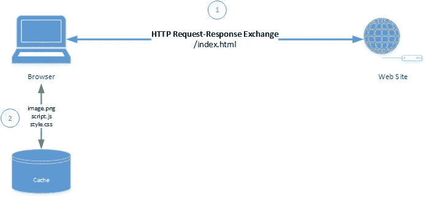
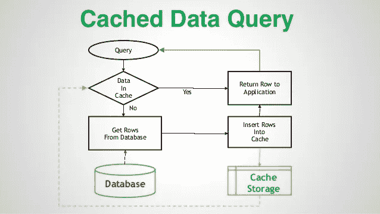

# JavaScript 的高级概念

> 原文：<https://javascript.plainenglish.io/advanced-concepts-of-javascript-c00aa47ec20e?source=collection_archive---------2----------------------->

## 一些高级 JavaScript 概念

If you want to be a JavaScript Developer, you must know these things.

**01。** **错误处理:**有时候我们的代码会有错误。这些错误的发生是因为我们的错误，可能是一个意外的输入，或者是一百个其他的原因。所以，我们使用 **try…catch** 来处理这些错误。

**try…catch:** 它有两个主要模块: **try** 和 **catch** 。首先执行“try”块。如果没有错误，则**捕捉(错误)**被忽略。如果有发生，那么 **try** 执行停止，然后 catch(error)显示错误。

示例:

try…catch block syntax

**02。花括号:**我们应该在给定的方法中使用花括号，而不是使用其他方法。因为这种方法通常可读性更强。

示例:

**03。行长:**没人喜欢读横线里的长代码。最佳做法是将它们分开。

示例:

04 年。好的评论:评论可以单行: **//** 多行:**/*……*/**开头。在这个例子中，我向你展示了如何在我们的代码中编写好的注释。

示例:

05。跨浏览器测试:这是一个质量保证过程，检查一个 web 应用程序、网站或页面功能是否确实适用于最终用户的多个浏览器和设备。

示例:

06 年。你知道缓存吗？

缓存是一个通用的计算机概念，旨在提高任何应用程序的性能，无论是桌面、移动还是 web 应用程序。通过数据可用性为 It 提供效率。它在几个地方存储经常访问的数据。然后，从通用数据存储向请求者提供数据。

**07。客户端缓存:**帮助限制用户在本地保存引用数据的数据成本支出。客户端请求的数据可能不大，但实际上是持续需要的。

示例:

client-side caching

**08。服务器端缓存:**这有助于限制服务器及其底层系统的成本。许多请求是由客户提出的。可以使用相同的数据对其进行响应。

示例:

server-side-caching

**09。展开运算符:**展开运算符用于将多个数组的所有元素组合成一个数组，并组合数组或对象。spread 运算符通常用三个点 **(…)** 书写。

示例:

**10。默认参数:**在函数的参数中声明变量时，我们可以用一个**等号**来设置默认的**值**。

示例:

**11。箭头函数:**箭头函数是对函数声明的**快捷方式**的一种方法。它基本上会缩短我们的函数语法。

示例:

*更多内容尽在*[*plain English . io*](http://plainenglish.io/)