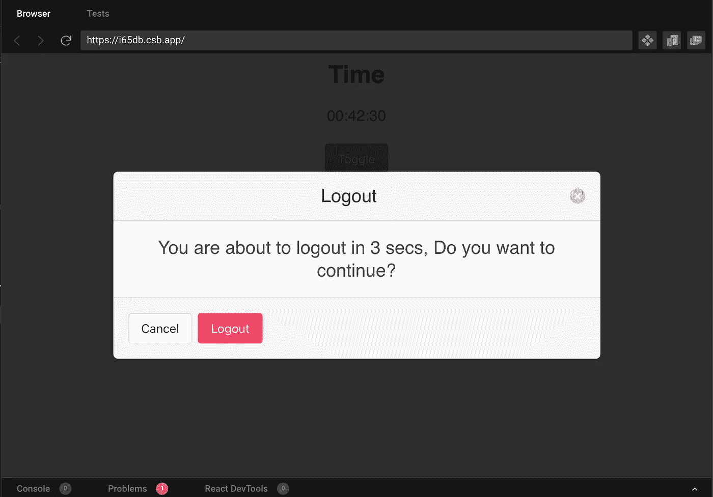

# 高级 React:如何使用钩子构建用户空闲组件

> 原文：<https://javascript.plainenglish.io/advanced-react-how-to-build-user-idle-component-using-hooks-81f8ef6fdefc?source=collection_archive---------2----------------------->


Photo by [Lukas Blazek](https://unsplash.com/@goumbik?utm_source=medium&utm_medium=referral) on [Unsplash](https://unsplash.com?utm_source=medium&utm_medium=referral)

在一个网站上，你可能想观察用户的参与程度。如果用户没有与您的网站互动，您可能还想从网站上**注销**用户。构建/实现一个空闲组件可能是棘手而复杂的。有像[反应-空闲-定时器](https://www.npmjs.com/package/react-idle-timer)这样的模块可以使用。然而，本文的目的是理解 React 的高级概念，并从头开始构建它。

**要求:**闲置组件必须具备以下特性

1.  **模态/弹出:**需要一个模态弹出来向与网站交互的用户显示消息
2.  **定时器:**定时器可以是一个作业/服务/功能，当用户空闲一段给定时间时，它触发一个事件来打开一个模态。
3.  **运动跟踪器/中断:**您还想让事件监听器监听用户运动并重置计时器。
4.  **倒计时:**您可能还想在模式弹出菜单上显示倒计时数字。



## 构建起始项目

对于这个演示，我将使用 TypeScript。JavaScript 版本将会很简单，并在文章末尾给出。

```
# Create a react.js starter project with typescript templatenpx create-react-app idle-timer --template=typescript
```

## 构建简单的模型弹出窗口

你可以从头开始设计一个弹出窗口。然而，对于这个演示，我将使用一个简单的 CSS UI 库 [bulma.io](https://bulma.io/) 。*布尔玛是一个简单的 CSS 库，它没有任何其他的 JS/CSS 依赖。*

首先，你需要在 **App.css** 中导入 CSS 模块

```
/* App.css */@import "https://cdn.jsdelivr.net/npm/bulma@0.9.3/css/bulma.min.css";.ccontainer {
  font-family: sans-serif;
  text-align: center;
  margin: 10px 20px;
}
```

一旦你导入了 **bulma.min.css，**现在你可以使用基本的 **HTML (JSX)** 创建一个定制的模态弹出窗口。

```
// IdlePopup.tsxinterface IIdlePopup {}const IdlePopup = ({}: IIdlePopup) => {
  return (
    <div className={"modal"}>
      <div className="modal-background"></div>
      <div className="modal-card">
        <header className="modal-card-head">
          <p className="modal-card-title">Logout</p>
          <button className="delete" aria-label="close"></button>
        </header>
        <section className="modal-card-body">
          <h4 className="subtitle is-4">
            You are about to logout in 5sec, Do you want to continue?
          </h4>
        </section>
        <footer className="modal-card-foot">
          <button className="button">Cancel</button>
          <button className="button is-danger">Logout</button>
        </footer>
      </div>
    </div>
  );
};
export default IdlePopup;
```

让我们导入应用程序组件。

```
## App.tsximport "./App.css";
import IdlePopup from "./IdlePopup";
function App() {
  return (
    <div className="ccontainer">
      <p className="title is-3 is-spaced">Time</p>
      <p className="subtitle is-5"></p>
      <button className="button is-success">Toggle</button>
      <IdlePopup />
    </div>
  );
}export default App;
```

如果你注意到模态是不可见的。为此，我们需要在 **IdleComponent** 中添加一个 **show** prop。我们还需要一个 onClose 回调函数。每当用户按下**注销**或**取消**时，我们必须通知应用程序。

```
/// IdlePopup.tsxinterface IIdlePopup {
  **show?: boolean;
  onClose: (isLogout: boolean) => void;**
}const IdlePopup = ({ **show, onClose** }: IIdlePopup) => {
  return (
    <div className=**{`modal ${show ? "is-active" : ""}`}**>
      <!-- Rest of the code--/>
          <button
            className="delete"
            aria-label="close"
            **onClick={() => onClose(false)}**
          ></button>
        </header>
        <!-- Rest of the code--/>
        <footer className="modal-card-foot">
          <button className="button" **onClick={() => onClose(false)}**>
            Cancel
          </button>
          <button className="button is-danger" **onClick={() => onClose(true)}**>
            Logout
          </button>
        </footer>
      </div>
    </div>
  );
};
export default IdlePopup;
```

让我们更新 **App.tsx**

```
/// App.tsximport { useState } from "react";
import "./App.css";
import IdlePopup from "./IdlePopup";function App() {
  **const [open, setOpen] = useState(false);**return (
    <div className="ccontainer">
      <p className="title is-3 is-spaced">Time</p>
      <p className="subtitle is-5"></p>
      <button className="button is-success" **onClick={() => setOpen(!open)}**>
        Toggle
      </button>
      <IdlePopup
        **show={open}
        onClose={(isLogout) => {
          setOpen(false);
          if (isLogout) {
            alert("Logout");
          } else {
            alert("Reset timer..");
          }
        }}**
      />
    </div>
  );
}export default App;
```

既然我们的模态弹出窗口已经准备好了。让我们实现定时器逻辑。

## **定时器**

一段时间的逻辑很简单。你需要在每次挂载时创建一个 **useEffect** 你必须绑定一个 setTimeout 函数。当超时发生时，模式弹出窗口将会打开。根据用户操作，您可以注销或重置计时器。你可以使用一个 **useRef** 定时器 id 来解决这个重置定时器的问题。然而，我将使用一些其他的方法。对于这个问题，我们可以用一个状态变量。给定的**使用效果**观察变量。每当手表变量发生变化时。 **useEffect** 将重新触发并创建 setTimeout 事件。

```
/// App.tsximport { useEffect, useState } from "react";
import "./App.css";
import IdlePopup from "./IdlePopup";export enum TIMEOUTS {
  IDLE_TIMEOUT = 60 * 1000, // 60sec
  LOGOUT_POPUP = 10 * 1000,
  ONE_SEC = 1000,
}function App() {
  const [open, setOpen] = useState(false);
  **const [reset, setReset] = useState(Date.now());****useEffect(() => {
    const id = setTimeout(() => {
      setOpen(true);
    }, TIMEOUTS.IDLE_TIMEOUT);** **return clearTimeout.bind(null, id);
  }, [reset]);** return (
    <div className="ccontainer">
     <!-- Rest of the code--/>
      <IdlePopup
        show={open}
        onClose={(isLogout) => {
          setOpen(false);
          if (isLogout) {
            alert("Logout");
          } else {
            **setReset(Date.now());**
          }
        }}
      />
    </div>
  );
}export default App;
```

## **用户中断**

您还想在用户中断时重置定时器。用户中断可以是点击、鼠标移动或 API 调用。为简单起见，我将使用 DOM 事件，如单击和鼠标悬停。

```
/// App.tsximport { useCallback, useEffect, useState } from "react";const domEvents = ["click", "scroll", "keypress"];
function App() {
  const [open, setOpen] = useState(false);
  const [reset, setReset] = useState(Date.now());**const resetFn = useCallback(() => setReset(Date.now()), []);****useEffect(() => {
    domEvents.forEach((event) => document.addEventListener(event, resetFn));
    return () => {
      domEvents.forEach((event) =>
        document.removeEventListener(event, resetFn)
      );
    };
  }, [resetFn]);**

  return (
    <div className="ccontainer">
      <!-- Rest of the code--/>
    </div>
  );
}export default App;
```

## 倒计时[可选]

倒计时在其他功能中也很棘手。最大的挑战是根据时间同时显示倒计时和触发 onClose。下面给出的代码有点粗糙。你可以根据你的需要来清理。

```
/// IdlePopup.tsximport { useEffect, useRef, useState } from "react";
import { TIMEOUTS } from "./App";// <!-- Rest of the code--/>const IdlePopup = ({ show, onClose }: IIdlePopup) => { **const [time, setTime] = useState(TIMEOUTS.LOGOUT_POPUP / TIMEOUTS.ONE_SEC);
  const mounted = useRef(0);****useEffect(() => {
    if (show) {
      if (time <= 1) {
        mounted.current && window.clearTimeout(mounted.current);
        onClose(true);
        return;
      }
      mounted.current = window.setTimeout(
        () => setTime(time - 1),
        TIMEOUTS.ONE_SEC
      );
    } else {
      setTime(TIMEOUTS.LOGOUT_POPUP / TIMEOUTS.ONE_SEC);
    }
    return () => {
      mounted.current && window.clearTimeout(mounted.current);
    };
  }, [show, time]);**return (
    <div className={`modal ${show ? "is-active" : ""}`}>
      <div className="modal-background"></div>
      <div className="modal-card">
        <!-- Rest of the code--/>
        <section className="modal-card-body">
          <h4 className="subtitle is-4">
            You are about to logout in **{time}**, Do you want to continue?
          </h4>
        </section>
        <!-- Rest of the code--/>
      </div>
    </div>
  );
};
export default IdlePopup;
```

完整的工作解决方案可以在 CodeSandbox 上找到。JavaScript 版本可以参考 App2.js 和 IdlePopup2.js。

*更多内容请看*[***plain English . io***](http://plainenglish.io/)