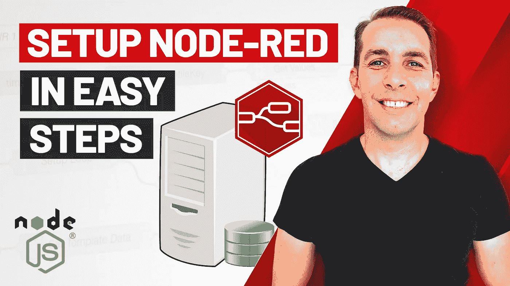

# Node-RED 的高级设置非常简单

> 原文：<https://javascript.plainenglish.io/advanced-setup-of-node-red-in-easy-steps-7d9500782bcb?source=collection_archive---------18----------------------->

在本文中，我将向您展示如何安装包含可选高级功能的 [Node-RED](https://nodered.org) 服务器，这些功能在 Node-RED 的[文档](https://nodered.org/docs/getting-started/)中提到的标准安装中默认不可用。

如果你正在关注我的[并使用 Node-RED](https://www.youtube.com/playlist?list=PLISqeoHsXJYBriF8VE_CrDvNGURq2c2m6) 系列，你会知道我的意图是教你如何使用 Node-RED 作为商业应用开发和集成的工具，而不仅仅是家庭自动化和基于爱好的项目。为了实现这一点，我们不能以传统的方式设置 Node-RED，即在本地机器上将它作为一个全局模块安装。我们需要更多的控制和灵活性。例如:

*   运行 Node-RED 的多个实例
*   容器化并部署到各种内部和云环境
*   与第三方服务集成

一切都需要从一个 Node-RED 实例中实现，而今天的安装将为我们提供这一点。

# 在 YouTube 上观看视频

# 需要节点 JS 和 NPM

首先，您需要在您的机器上至少安装 Node JS [12.18](https://nodejs.org/download/release/v12.18.4/) 或更高版本。如果你有一个旧版本或者没有安装[节点](https://nodejs.org/en/)，我强烈推荐使用一个节点版本管理器来安装一个或多个版本的节点。有很多优秀的版本管理器，但是我想直接推荐一下， [NVM](https://github.com/nvm-sh/nvm) 是我们在 [Agilit-e](https://agilite.io) 使用的一个版本管理器，它工作得非常好。您不仅可以轻松地在 Node 的不同版本之间切换，NVM 还会处理您的操作系统上的权限问题，这些问题有时会在直接安装 Node 时出现。

# 在 GitHub 上找到“agilite-node-red”

现在，我们将要使用的样板 Node-RED 服务器可以在 GitHub 上找到，名为 [agilite-node-red](https://github.com/agilitehub/agilite-node-red) 。这个回购由 Agilit-e 的团队维护，并提供前面提到的控制和灵活性。

# 下载相关版本

一旦样板文件在浏览器中打开，将分支从主文件切换到 [7.3.1](https://github.com/agilitehub/agilite-node-red/tree/7.3.1) 。这是根据本文发布的当前样板版本，兼容**节点 12.18** 并运行 **Node-RED 1.3.4** 。如果您在这篇文章发布后很久还在阅读它，那么您可以切换到支持 Node 和 Node-RED 升级版本的新分支。请参考这些版本的**自述文件**。

一旦您切换到分支 **7.3.1** ，点击**代码**按钮，然后点击**下载 zip** 将样板文件下载到您的本地环境。一个下载下来，解压 zip 文件，这个文件会将样板文件解压到一个名为 **agilite-node-red-7.3.1** 的文件夹中。

# 安装节点模块

通过您的终端或命令提示符，导航到样板文件夹并运行下面的命令`npm ci — only=production`。这将安装基于 **package-lock.json** 文件的主要项目依赖项，并忽略您不需要的开发依赖项。这确保样板文件的节点模块按照我们预期的方式安装，以避免可能的不一致和问题。

一旦 NPM 安装完成，输入命令`npm run main`。这将启动 Node-RED 服务器，您现在可以通过打开首选的 web 浏览器并输入 URL:[http://localhost:6020](http://localhost:6020)来访问它。如果一切顺利，您将看到**红色节点编辑器**在您的浏览器窗口中打开。您现在可以开始使用 Node-RED 了。

# 结论

如前所述，这个样板文件提供了 Node-RED 和更多的东西，在我的[启动和运行 Node-RED](https://www.youtube.com/playlist?list=PLISqeoHsXJYBriF8VE_CrDvNGURq2c2m6) 系列中，我将一步一步地带领大家。

所以如果你还没有，一定要订阅我的 YouTube 频道，或者关注我的网站。与此同时，我欢迎您仔细阅读这个样板文件的配置，它可以在 **config/templates** 文件夹中的一个名为 **default-config.json** 的文件中找到。

这是大部分魔法发生的地方，但很快会有更多的。

下次再见，谢谢你的阅读。

*更多内容看*[***plain English . io***](http://plainenglish.io)