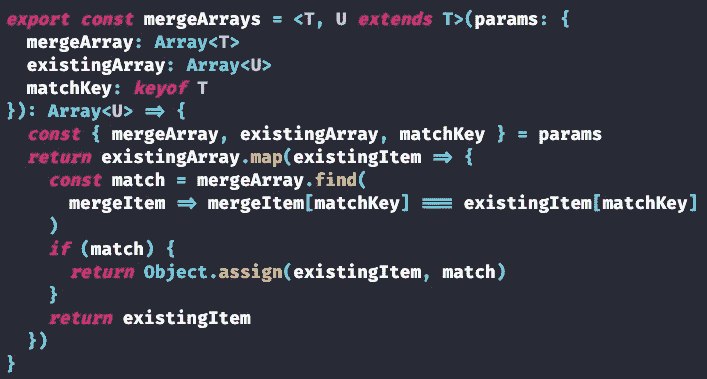

# 高级类型脚本:合并对象数组的通用函数

> 原文：<https://javascript.plainenglish.io/advanced-typescript-a-generic-function-to-merge-object-arrays-cb0bd9a5c382?source=collection_archive---------9----------------------->

## SaaS 产品档案中的另一个强大的通用功能。



The mergeArrays function we’ll be building.

[*这篇文章反映在我的博客 chrisfrew.in*](https://chrisfrew.in/blog/advanced-typescript-generic-array-merging/)

# TypeScript 泛型疯狂！

我就是无法停止编写这些通用函数！这是继我上一篇文章[之后的又一个强大的通用函数，构建一个通用函数来根据特定的测试值](https://dev.to/blog/advanced-typescript-a-generic-function-to-update-and-manipulate-object-arrays/)更新特定键处的数组。当我试图为 [ReduxPlate](https://reduxplate.com/) 维护尽可能干净的代码库时，我继续为这些易于使用但功能强大的通用函数寻找新的用例。

# 动机

通常，在进行状态修改时，您希望将从 API 或其他来源获得的一些属性合并或添加到对象中。您**可以**为您想要更新的键显式编写键/值分配…或者您可以利用 JavaScript 的内置`Object.assign`函数和 TypeScript 的通用功能，只为您整个应用程序中需要的所有合并操作编写一个这样的函数！😄

例如，在 ReduxPlate 中，我有两种类型，`IFile`和`IEditorSettings`:

`IFile`:

```
export default interface IFile {
    fileLabel: string
    code: string
}
```

`IEditorSettings`:

```
export default interface IEditorSettings extends IFile {
  isActive: boolean
}
```

`IEditorSettings`扩展了`IFile`，并且只有一个额外的属性:`isActive`。当访问者点击“生成！”按钮时，来自服务器的响应返回类型为`IFile`而不是`IEditorSettings`的对象数组，因为服务器不关心`isActive`属性。`isActive`仅涉及用于显示目的的前端。然后我将`IFile`数组合并到现有的`IEditorSettings`数组中，在不修改`isActive`现有值的情况下更新代码。让我们看看我是如何编写这个功能的第一次迭代。

# 天真的实施

一个初始的实现可以足够快地组装起来。`fileLabel`作为一个键，我们可以在上面比较我们的对象。然后，我用匹配文件返回的`match.code`值替换`editorSetting.code`的值(如果找到匹配的话):

```
const editorSettings = useState(...) // existing object array of IEditorSettings, stateful
const files = <<API fetch code here>> // array of IFile returned by API
...
editorSettings.map(editorSetting => {
  const match = files.find(
    file => file.fileLabel === editorSetting.fileLabel
  )
  if (match) {
    editorSetting.code = match.code
  }
  return editorSetting
})
```

如果后面有更多属性内置到`IFile`里怎么办？也许是每个文件上的一系列导入或警告？这些也是我们想要合并到现有状态中的属性。如果我们可以将这些属性添加到`IFile`中，而不必手动编辑上面的`if`块中的代码，那就最好了。让我们创建一个通用的 util 函数来为*任何*两个相关类型的对象数组完成合并任务。

# 通用类型

让我们假设有一些类型为`T`的对象，和一些更复杂的对象类型`U`，其中`U extends T`。我们希望将类型为`T`的对象数组合并到类型为`U`的更复杂的对象数组中，并返回类型为`U`的新数组。我们不必假设这些数组是有组织的，或者长度相同。因此，我们需要确保在某种类型的`matchKey`上合并适当的对象，这必须是`keyof T`，因为`U`中的一些键可能在`T`中不存在。定义了`matchKey`之后，我们应该只需要另外两个数组，现有数组和传入数组，来定义这个函数的签名:

```
export const mergeArrays = <T, U extends T>(params: {
  mergeArray: Array<T>
  existingArray: Array<U>
  matchKey: keyof T
}): Array<U>
```

这里我像在 [updateArray](https://dev.to/snippets/#updateArray) 函数中一样利用了`params`模式，因为它使得调用代码更容易阅读。

# 履行

我们可以从`params`对象中提取所有的参数。然后，我们遍历现有的数组，试图在`matchKey`上找到一个匹配。如果这样做，我们将把匹配对象中的所有值赋给现有对象。如果没有，我们只需通过返回来保留现有的项目:

```
const { mergeArray, existingArray, matchKey } = params
return existingArray.map(existingItem => {
  const match = mergeArray.find(
    mergeItem => mergeItem[matchKey] === existingItem[matchKey]
  )
  if (match) {
    return Object.assign(existingItem, match)
  }
  return existingItem
})
```

# 决赛成绩

结合函数签名和主体，我向您展示`mergeArrays`实用函数:

```
export const mergeArrays = <T, U extends T>(params: {
  mergeArray: Array<T>
  existingArray: Array<U>
  matchKey: keyof T
}): Array<U> => {
  const { mergeArray, existingArray, matchKey } = params
  return existingArray.map(existingItem => {
    const match = mergeArray.find(
      mergeItem => mergeItem[matchKey] === existingItem[matchKey]
    )
    if (match) {
      return Object.assign(existingItem, match)
    }
    return existingItem
  })
}
```

# 谢谢！

一如既往，感谢阅读，敬请关注📻—将会有更多这些强大的通用函数出现！结合我的[通用搜索、排序和过滤功能](https://dev.to/blog/react-typescript-generic-search-sort-and-filters/)——以及我藏在其他项目代码中的一些其他秘密好东西——我想我会出版某种“高级类型脚本食谱”📘那包括他们所有人！

干杯！🍻

克莉丝

*更多内容尽在*[plain English . io](http://plainenglish.io/)