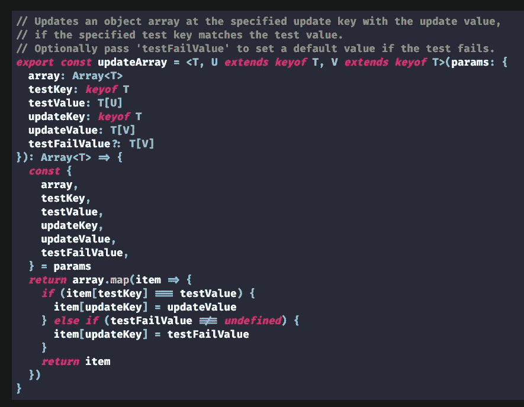

# 高级类型脚本:更新和操作对象数组的通用函数

> 原文：<https://javascript.plainenglish.io/advanced-typescript-a-generic-function-to-update-and-manipulate-object-arrays-caacd601cedf?source=collection_archive---------2----------------------->

## **终极力量的另一个奇特的通用功能！**



updateArray.ts in all its glory.

*这篇文章是* [*镜像在我的博客*](https://chrisfrew.in/blog/advanced-typescript-a-generic-function-to-update-and-manipulate-object-arrays/) *上，在那里你可以找到* ***方式*** *更好的代码片段——它们也是可以复制和粘贴的！*

# 总是推动更干净的代码

在构建我最新的 SaaS 产品[redexplate](https://reduxplate.com/)时，我意识到一个常见的模式不断出现在我的数组操作函数中。我总是在特定的键上更新特定的值，基于对某个*其他*键的特定测试。

**Plug:说到*[*Redux plate*](https://reduxplate.com/)*，它会自动为您生成 Redux 代码，* [*我正在写一本书，记录我在构建 ReduxPlate*](https://chrisfrew.in/book) 、*的过程中所走的每一步，从样板启动程序到最终的成品。如果你能来看看，我会很高兴的！是的，你没看错！我真的从头到尾构建了 ReduxPlate，就在你的眼前——而且代码都是公开的！*

例如，对于 [ReduxPlate 主页](https://reduxplate.com/)上的编辑器小部件，我使用 IEditorSettings 类型的有状态数组来确定哪个编辑器当前是活动的，以及编辑器中的实际代码值是什么:

```
***export* *default* *interface* IEditorSetting {** **fileLabel: string** **code: string** **isActive: boolean****}**
```

这种行为要求我编写两个事件处理程序:

`**onChangeCode**`当代码改变时:

```
***const* onChangeCode = (code: string) => {** **setEditorSettingsState(editorSettingsState.map(editorSetting => {** ***if* (editorSetting.isActive) {** **editorSetting.code = code** **}** ***return* editorSetting** **}))****}**
```

和`**onChangeTab**`用于当编辑器标签改变时:

```
***const* onChangeTab = (fileLabel: string) => {****setEditorSettingsState(editorSettingsState.map(editorSetting => {** **editorSetting.isActive = editorSetting.fileLabel === fileLabel** ***return* editorSetting** **}))****}**
```

仔细研究这两个函数。对于这两者，我映射了一个状态变量`**editorSettingsState**`，并根据一些测试条件在数组中设置了一个属性。在`**onChangeCode**`中，测试条件是`**isActive**`属性值是否为真。在`**onChangeTab**`中，测试条件是`**fileLabel**`属性值是否与传入的`**fileLabel**`相匹配。与`**onChangeCode**`相反，`**onChangeTab**`将为数组中的*所有*项设置`**isActive**`值。

通过一点努力，我们应该能够实现一个通用函数，我们可以用它来替换这些函数，更重要的是:在我们需要相同类型功能的应用程序中重用。

# 重写这两个函数，以便更好地了解它们的结构

为了更好地理解我们将要编写的函数，让我们用一个`**else**`语句扩展这两个函数，同时保持它们的功能完全相同。

对于`**onChangeCode**`:

```
***const* onChangeCode = (code: string) => {** **setEditorSettingsState(editorSettingsState.map(editorSetting => {** ***if* (editorSetting.isActive) {** **editorSetting.code = code** **} *else* {** **// do nothing :)** **}** ***return* editorSetting** **}))****}**
```

对于`**onChangeTab**`:

```
***const* onChangeTab = (fileLabel: string) => {****setEditorSettingsState(editorSettingsState.map(editorSetting => {** ***if* (editorSetting.fileLabel === fileLabel) {** **editorSetting.isActive = true** **} *else* {** **editorSetting.isActive = false** **}** ***return* editorSetting** **}))****}**
```

在这种形式中，很明显我们的泛型函数应该有某种测试标准，这将存在于`**if**`语句中。然后，如果测试标准通过，我们需要在数组中更新属性的键和值。此外，`**else**`块中发生的事情应该是可选的——也就是说，如果测试失败，应该有一个可选的方法来设置默认值。这实际上意味着这将成为一个`**else if**`块。

我们新的泛型函数的主体将采用与这两个扩展函数相同的形式:

```
***return* array.map(item => {** ***if* (item[testKey] === testValue) {** **item[updateKey] = updateValue** **} *else* *if* (testFailValue !== *undefined*) {** **item[updateKey] = testFailValue** **}** ***return* item****})**
```

我们需要提供一个`**testKey**`和值作为测试标准，如果测试通过，还需要提供一个`**updateKey**`和`**updateValue**`。最后，一个可选参数将是`**testFailValue**`。如果`**testFailValue**`不是`**undefined**`，那么我们将执行`**else if**`块。

# 键入函数

编写这个函数最具挑战性的部分是确保为`**testValue**`传递的值与预期的`**T[testKey]**`类型相匹配。对于`**updateValue**` / `**testFailValue**`带`**T[updateKey]**`应该也是如此。使用 TypeScript，*有可能做到这一点，尽管我们需要在调用签名中显式地提供一点信息来执行它。我们讨论的`**array**`是`**Array<T>**`类型，这一点很清楚。但是`**testKey**`和`**updateKey**`的类型呢？我们需要引入两个更通用的类型来让它们工作，`**U**`和`**V**`。为了确保`**testKey**`和`**updateKey**`都是对象`**T**`的实际键，我们将使用 TypeScripts 的`**extends**`关键字，即将`**U**`定义为`**U extends keyof T**`，将`**V**`定义为`**V extends keyof T**`。*

定义了类型`**U**`和`**V**`后，`**testKey**`和`**updateKey**`可以用`**keyof T**`来定义，以及它们对应的值:`**testValue**`为`**T[U]**`,`**updateValue**`为`**T[V]**`。`**testFailValue**`跟`**updateValue**`同类型`**T[V]**`。最后，由于这是一个数组函数`**map**`，我们将返回一个类型为`**T**`的新数组。因为这个签名相当复杂，所以我将它们都添加到一个`**param**`对象中，这样当我们调用这个`**updateArray**`函数时，它将易于阅读和理解。这样的结构也使得以后扩展和添加额外的参数更加容易。

所以，我们有我们的函数签名:

```
***export* *const* updateArray = <T, U *extends* *keyof* T, V *extends* *keyof* T>(params: {** **array: Array<T>** **testKey: *keyof* T** **testValue: T[U]** **updateKey: *keyof* T** **updateValue: T[V]** **testFailValue?: T[V]****}): Array<T>**
```

# 决赛成绩

从上面钩住`**map**`逻辑，完整的`**updateArray**`功能为:

```
**// Updates an object array at the specified update key with the update value,****// if the specified test key matches the test value.****// Optionally pass 'testFailValue' to set a default value if the test fails.*****export* *const* updateArray = <T, U *extends* *keyof* T, V *extends* *keyof* T>(params: {** **array: Array<T>** **testKey: *keyof* T** **testValue: T[U]** **updateKey: *keyof* T** **updateValue: T[V]** **testFailValue?: T[V]****}): Array<T> => {*****const* {** **array,** **testKey,** **testValue,** **updateKey,** **updateValue,** **testFailValue,****} = params*****return* array.map(item => {** ***if* (item[testKey] === testValue) {** **item[updateKey] = updateValue** **} *else* *if* (testFailValue !== *undefined*) {** **item[updateKey] = testFailValue** **}** ***return* item** **})****}**
```

对该功能的一个可能的改进是区分成功和失败时的`**updateKey**`。如果测试失败，也许在某些罕见的情况下，您会想要设置其他键的值。

# 用它！

让我们回到最初的函数，重构它们以使用我们喜欢的通用函数`**updateArray**`。

参考上面的`**IEditorSetting**`可能会有帮助(回想一下`**editorSettingsState**`是`**IEditorSetting**`的数组)。这是重构后的`**onChangeCode**`:

```
***const* onChangeCode = (code: string) => {** **setEditorSettingsState(updateArray({** **array: editorSettingsState,** **testKey: "isActive",** **testValue: true,** **updateKey: "code",** **updateValue: code,** **}))****}**
```

和`**onChangeTab**`:

```
***const* onChangeTab = (fileLabel: string) => {** **setEditorSettingsState(updateArray({** **array: editorSettingsState,** **testKey: "fileLabel",** **testValue: fileLabel,** **updateKey: "isActive",** **updateValue: true,** **testFailValue: false,** **}))****}**
```

感谢我们的`**U extends keyof T**`和`**U extends keyof T**`，我们的函数是类型安全的:例如，TypeScript 不允许将类似`**"hello world"**`的字符串传递给`**updateValue**`，因为`**isActive**`键上的`**IEditorSetting**`的预期类型是`**boolean**`。

恭喜，我们完成了！

# 冗长与可重用性和可读性

的确，调用`**updateArray**`相当冗长。然而，当你考虑到我们不再需要考虑在我们的应用程序中设计所有那些讨厌的`**map**`操作时，这是一个很小的代价！

这是不是一种过度优化？我不这么认为——用 React 或 Redux，或者两者都用，看看你自己的项目。我保证你有相同的数组映射和操作时间，无论是在你的状态变化还是渲染函数！

# 谢谢！

有了这个强大的通用函数，您再也不需要考虑属性级别的`**map**`数组操作了！此外，强类型签名还可以防止您传递与相应键的预期类型不一致的`**testValue**`或`**updateValue**`！

干杯！🍺

*   克莉丝

*更多内容请看*[*plain English . io*](http://plainenglish.io/)