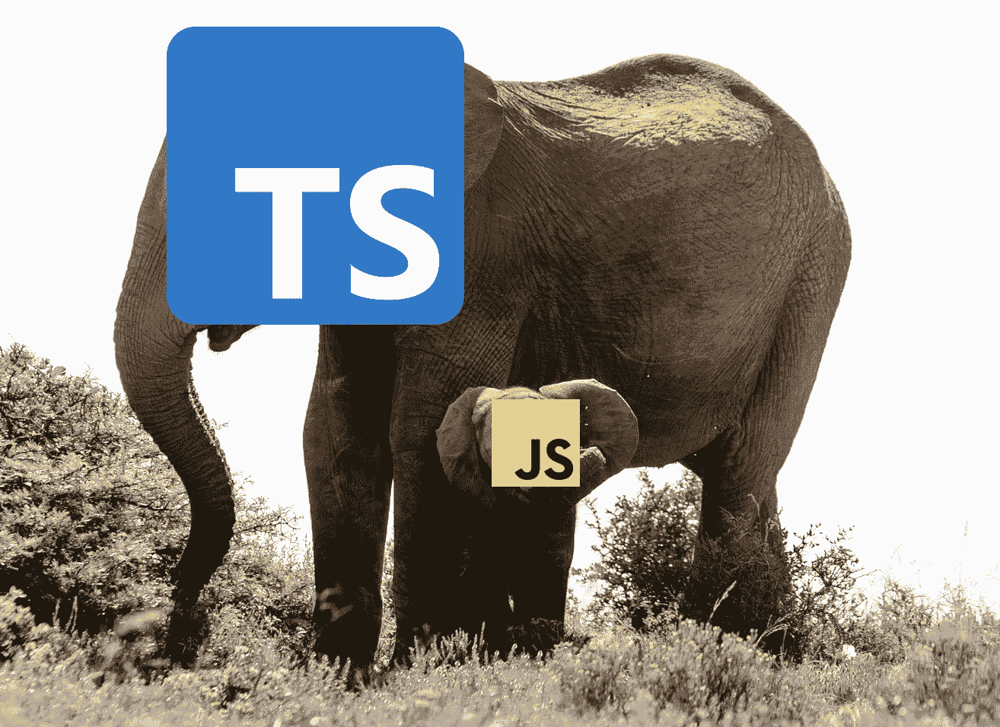
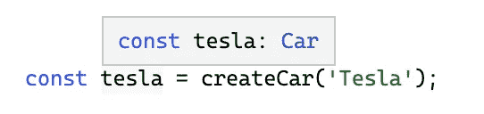
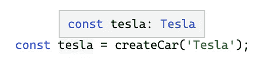

# 具有代码挑战的高级类型脚本:条件类型

> 原文：<https://javascript.plainenglish.io/advanced-typescript-with-code-challenges-conditional-types-8dd4e63818a5?source=collection_archive---------9----------------------->

## 学习高级的 TypeScript 特性，并将它们应用到实际的代码练习中

Photo template by [Rachel Claire](https://www.pexels.com/de-de/@rachel-claire?utm_content=attributionCopyText&utm_medium=referral&utm_source=pexels) from [Pexels](https://www.pexels.com/de-de/foto/natur-feld-trocken-tier-4577793/?utm_content=attributionCopyText&utm_medium=referral&utm_source=pexels)

TypeScript 太牛了！越来越多的项目将它作为主要的编程语言。尤其是在前端开发领域，构建大型应用程序变得至关重要。虽然像 Angular 这样的框架提供 Typescript 作为主要语言，但所有已知的库，如 React 或 VueJS，都支持静态类型语言。

> 它不仅是最流行的语言之一，也是发展最快的语言之一。— [Github](https://www.businessinsider.com/most-popular-programming-languages-github-2019-11#7-typescript-4)

作为发展最快的编程语言之一，越来越多的功能被不断添加。每增加一项新功能，它都会变得更加强大。掌握它们会让你的代码更健壮、更整洁、更容易重构。在本文中，我们将学习**条件类型**，并在实际的代码挑战中应用我们所学的内容。

> […]它非常类似于 JavaScript，但是具有更强大的功能，可以帮助开发人员构建大规模的应用程序。”— [Github](https://www.businessinsider.com/most-popular-programming-languages-github-2019-11#7-typescript-4)

以下是一些最重要的高级 Typescript 功能的概述:

 [## 网络亮点- PDF 和网络荧光笔

### Web Highlights 是一个在 Web 上突出显示文本的工具，可以更有效地组织您的研究。提升你的…

web-highlights.com](https://web-highlights.com/) 

我还将在接下来的文章中解释这些特性，并提供实际的代码练习。我将在这个概述中链接我的文章。跟着我不要错过他们。

# 条件类型

Typescript 允许您创建所谓的条件类型。它们允许我们在运行时保证类型。

> *条件类型*帮助描述输入和输出类型之间的关系。—[typescriptlang.org](https://www.typescriptlang.org/docs/handbook/2/conditional-types.html)

条件类型的形式类似于 JavaScript 中的条件表达式(`condition ? trueExpression : falseExpression`):

当`SomeType`被赋值给`OtherType`时，你将得到第一个分支中的类型`TrueType`(“真”分支)；否则，您将在后一个分支中得到类型`FalseType`(“假”分支)。

使用条件类型的力量来自于将它们与[泛型](/advanced-typescript-generics-1b30d6b5dd49)相结合。一个实际的例子最容易说明这背后的概念。

 [## 具有代码挑战的高级类型脚本:泛型

### 学习高级的 Typescript 特性，并将它们应用到实际的代码练习中

javascript.plainenglish.io](/advanced-typescript-generics-1b30d6b5dd49) 

让我们来看看这个代码片段，其中我们提供了[工厂方法](/design-patterns-with-typescript-examples-factory-method-4d145887b141) `createCar(brand)`，它负责为给定的汽车品牌创建相应的汽车。

只要我们同意超类`Car`的返回类型，这就很好，而且工作得很好。例如，当调用`createCar('Tesla')`时，Typescript 不会直接知道返回类型是`Tesla`，但会返回`Car`作为返回类型:

让我们通过使用条件类型来调整我们的`createCar(brand)`函数，以直接向函数的用户推断正确的子类:

同样，让我们调用`createCar('Tesla')`可以看到 Typescript 直接推断出相应的`Tesla`类型:

你可以在这个[类型脚本游戏场](https://www.typescriptlang.org/play?ts=4.4.4#code/FASwdgLgpgTgZgQwMZQAQGEE1Qb2Kg1AIxgTABMAuDLAIVIoG5gBfYYJAGwQGcfUAggFdyIVCAC2AB05QJUSP0zY8hVEgD2YHhBhCkEDTAAUUoUU4gkxBlRox6ZcqgC8qAOTDR7gJS42bFy8-AAqUDzc4tKy8or2uPiEmtq6+oYmZhZWNk7Uyo4Urh5hEQi+-qzsEACeUmj5tkWeIiDuqAA+xeHc7szANXWoBeQhGsoAPMOoUAAe0BRKdLYAfEWJBFOz8+T8zd6oAPyCLaiU60ONWwo7XaVtRyWRZ2pgUABusH1wQmAGIFrqGBQBDQCabObXRYOFbGEi5C5OHzUYajMErBJqHgAdxAECQAAtYbY-Ko1EleGg9q1nmTaUCIEIYGBUK8scdRMY-LwERRUVhJitmLSCEgKbcejThYR6YzmazUI8EJzUNyUWN+cNlkLheQoIghJwIJKpagIPiYBo2QBRGAWkwAA2UOUK7gAJDg4RQWG0wBoIKgeEIpFIjNByAA6e0+bUEALsDhaHSm7oIIpIIEgqDKYzuRW+PrJJMIE5udPA0FYHNeVrRoA)里摆弄代码。

# 代码挑战💻

你可以在这个[打字稿操场(起始码)](https://www.typescriptlang.org/play?ts=4.4.4#code/PQKhCgAJshJA7SAXAFgU0gGwIYGcmQDGA9gCYCW8A5kStppmtWrgDSQDuGhATmtkjSlk6SADMArvEJJyxRFBh14pRgFF4s2SwAUTLeRYBKEQMgTcLSABUAngAcMAcQnYepXMmKRSaQuV9IRWhSCR5KGh4pWQBbDA50VDQeSGIwyH1yJFtIck9sSABVSxTiFIAFHjIJGQA6IJhIAEFCEncIzFt2MTLIAuLkkQxlVTQBnh0LZJNJaVl5BphsFXFegsrqmSHIEcYN0JkdeyqDpBM8jIAPPwlBUlrwYLhEVAuSQLRrnn9Ldi5OcgMDKYcgxSgCDBJRbQXZoDQGXSZbS4GZSGRyRDLYRpFLZRyQKiudy4epPADqGFI8gA5AR4GghLkCMtbDEyhgAEZ+bBTTjxQGYPqkABWFgIOOh4jQSEIKAAIgJsDo8WhUXMMV5IHwkGEXqJPo4ZIyVakxJKodrdZAAG70CSU8h8GSdeoUojLPqywzWyEoC4cnJPCwRIjyCjzeD0ZAOFgPJ5qS6EZI-NAALieTwAjPUAMJ8CHbEgqLIYqMmpr2cgAJRY9nkljsjmsxHhWVsj0aACZ6gBZbAAa19GDE0tlCqQBVm6IWVCYyXIhD6K15UKeMCL4dLgvLlZruDr8AbMebreymstPD13DKfH3YZDFertfraAzkBAwEe4Eogh4YmwSaQKeOQAN5PAEqaQPg4TUAA3OAAC+jw-sk-6AeMVyCConjAZAYGNJGcSQdBETwUh36aKhAEYPsNQEJ8WEeEBmhtnhTy+LgvDkPYEbEUgMFUGRjxFvgkBsoQ-bjLgkHjAA2gAupAAC8kCyU8IG5KQkEAESZtp7CEWmkDUgAyssE6QDmOAWNSkAIaw6maTpnb6ZAhmQdSABSCxysQaC2Uh8nwSJBDif2tEyNJkARUgCnKapjkQZAumuRxXE8RiHkxZAmYBQ5jQaUl2kuewaXhBl8hZScdGQJ2AXgEFX47k+d6HmgAA81iYUwTHAQAfMpTwAD54VBE46lF1K4DUSa4Lg1KwT4iqQdYCmLUhjQjRp+ACBYHnJFUPALRkPCHXxAnrfB4B4LY0jiGiEZSjKKA9sQEmdd12HMVoth9ToYXjtgK0KUYkEbGCljtY+e4HpD1h9QN+EwBeiD0hw0VVBDaA6LeykDbeOhI400A7RNHnTa0LDzflxMhMtYlvf2gNPAhRhGEJ4AmjFMMvvF0PPm17UxX1V03XdU6PSOz0xbgOigxjxBY0L1UyDzbWI08KNPbKr0Sf9jMy+ziGPCa4xq5YfO7gLkPjCLjxi4uEsalLspSXLYOY3kHVm9baAa40Wsuy9jP6xJUlG+RzXm2gjYYCp1JTEdkAjdSxybEgC1fg793qgsQeA8qMaQfzrVHo4JhE1BHBZLKkCF+XbG09AhB4BgCclNS6ZN8TgejigbtG93LcW6nKsZ133fI9KVpBzLcvwd3vj-hImBIBPk8iFU6NqKdZQ6AABjmaSYMI8DEAQI4yCgS0WcQZomtSAAkIEqgh1L74PMBIeR4BOwssLjEmCUGSJQK5PBEsQRgtRMDECoAfEyM0qaSAYDkGB2BfDCETpBZ+idaiGQQh-Dmf9ECwhikcMeHt05gMaBAqBMC4H7wQZTOayDOhYGIOgxkadTjYJAtwuitQyrcQjAQiO9tcC3Udg9DUO0eBIArPYOWjd1z1gIInXA0d4rYA4NgLI2t5SKh0O3ZI1JP7N1UZAfhkVNEqW0boi+fcC6j3TqYq6jRyBmh0AAQiAckDRvtIAADJAmWLHv40uqpk4jXUdHWopMLDKSUvHA6ZRbJDRGlYpA4TYZoDieNBJSTkm7yOtQpuqAt5uTQNvYpRimiIBSaUVoYRGQJEBMOPuIZcCK0pIqWopiWZfhofWSBuT6HwMQSwlebCg6MhwSUbJL5BG9MYNQVACFzDzNqIQ8Bwy6GwPGcw3ArCcgzOEM-TJCy2pLInNApgVA1mhPTiSbZQZ5mxNIL0noPA1AARQL4lISkBoAJKP8tmbiYAXPeZ8soPzZTkPTnjHYWI9hj3hacMFX5yKyPkfYRR7MgA)里解习题。如果你被卡住了，你可以在这个[打字游戏场(解决方案代码)](https://www.typescriptlang.org/play?ts=4.4.4#code/PQKhCgAJshJA7SAXAFgU0gGwIYGcmQDGA9gCYCW8A5kStppmtWrgDSQDuGhATmtkjSlk6SADMArvEJJyxRFBh14pRgFF4s2SwAUTLeRYBKEQMgTcLSABUAngAcMAcQnYepXMmKRSaQuV9IRWhSCR5KGh4pWQBbDA50VDQeSGIwyH1yJFtIck9sSABVSxTiFIAFHjIJGQA6IJhIAEFCEncIzFt2MTLIAuLkkQxlVTQBnh0LZJNJaVl5BphsFXFegsrqmSHIEcYN0JkdeyqDpBM8jIAPPwlBUlrwYLhEVAuSQLRrnn9Ldi5OcgMDKYcgxSgCDBJRbQXZoDQGXSZbS4GZSGRyRDLYRpFLZRyQKiudy4epPADqGFI8gA5AR4GghLkCMtbDEyhgAEZ+bBTTjxQGYPqkABWFgIOOh4jQSEIKAAIgJsDo8WhUXMMV5IHwkGEXqJPo4ZIyVakxJKodrdZAAG70CSU8h8GSdeoUojLPqywzWyEoC4cnJPCwRIjyCjzeD0ZAOFgPJ5qS6EZI-NAALieTwAjPUAMJ8CHbEgqLIYqMmpr2cgAJRY9nkljsjmsxHhWVsj0aACZ6gBZbAAa19GDE0tlCqQBVm6IWVCYyXIhD6K15UKeMCL4dLgvLlZruDr8AbMebreymstPD13DKfH3YZDFertfraAzkBAwEe4Eogh4YmwSaQKeOQAN5PAEqaQPg4TUAA3OAAC+jw-sk-6AeMVyCConjAZAYGNJGcSQdBETwUh36aKhAEYPsNQEJ8WEeEBmhtnhTy+LgvDkPYEbEUgMFUGRjxFvgkBsoQ-bjLgkHjAA2gAupAAC8kCyU8IG5KQkEAESZtp7CEWmkDUgAyssE6QDmOAWNSkAIaw6maTpnb6ZAhmQdSABSCxysQaC2Uh8nwSJBDif2tEyNJkARUgCnKapjkQZAumuRxXE8RiHkxZAmYBQ5jQaUl2kuewaXhBl8hZScdGQJ2AXgEFX47k+d6HmgAA81iYUwTHAQAfMpTwAD54VBE46lF1K4DUSa4Lg1KwT4iqQdYCmLUhjQjRp+ACBYHnJFUPALRkPCHXxAnrfB4B4LY0jiGiEZSjKKA9sQEmdd12HMVoth9ToYXjtgK0KUYkEbGCljtY+e4HpD1h9QN+EwBeiD0hw0VVBDaA6LeykDbeOhI400A7RNHnTa0LDzflxMhMtYlvf2gNPAhRhGEJ4AmjFMMvvF0PPm17UxX1V03XdU6PSOz0xbgOigxjxBY0L1UyDzbWI08KNPbKr0Sf9jMy+ziGPCa4xq5YfO7gLkPjCLjxi4uEsalLspSXLYOY3kHVm9baAa40Wsuy9jP6xJUlG+RzXm2gjYYCp1JTEdkAjdSxybEgC0mzGzRW61R5Ni2LHZJ12cMT1nj83nMcxgNKlPLHn1MQnJS2QA-EUJSQJB9el5cjGeKnKsZ5A7fZd3BFoD6PCi7gt2Ow9zujvKiol-iZdfZXsPV44f0qitMby+DXtQ7nW8ny1W+xyeRe2KvfsI2xjS4BwWSypAyoH4-tPuhbzfJNS6Zv7E0DkvN2Jg8AKyVpvF859o5X0Lj9O+CM7ZAMIHgDAg904ALXN-EB0sh6y3AZ4I+kNoGCzIfnGOCC2xIIRvBIBvh-wSEwEgQBQCYCoCqOjNQp0yg6AAAY5jSJgYQ8BiAEBHDIFAS0LLEDNCaakAASECKoELUn4UbRoSFyLgCdgsWE4xJglBkiUEwRNQyHmIIwWomBiBUAESZGaVNJAMByLY7AvhhCJ0gsoxOtRDIIQ0RzPRiBYQxSOEPD26czFPBElYtANi7EOKcXNFxnQsDEA8YyNOpwfEgRyXRWoZVuIRkCRHe2s9xYLwWDtHgSAKz2Dll-aAIVzAlFwNHeK2AODYCyNrZeE4dB-yOpo9c9YCAFMip0lS3TekSKXoDIZkyM5G3AmaHQABCIxyQOm+0gAAMn2ZAZZuyq4mCGiNROpyt61FJhYZSSl44HTKLZC5xyCHR1ueNe5jynm8JGc04mnDiDozRkBf5QymiIGeaUVoYRGQJEBMOJeIZcCK0pIqWo1IjAsy-I0OJ1jbH2P4Y4ymqTmHpKDoyXx7TPmkExYwagqAEJtJ2bUIJsT6zxMScS0ls1cBpJyFS4QyiTl0oZUwKgzL3npxJByoMtLfZFMxT0HgagAIoG2SkJSA0DElC1WzK6jQxVKvpROWoqr1WygienPGOwsR7CHja04hqvzkVqfU+wjT2ZAA)找到解决方案。当然，你也可以将&的打字稿代码复制粘贴到你选择的 IDE 中。

## 介绍

在上次的编码挑战中，我们创建了函数`handleEntities(entities)`，它使用**类型的守卫**在运行时决定我们的实体是`User`还是`Product`。相应地，对于`User`执行`handleUser(user)`功能，对于`Product`执行`handleProduct(product)`功能。

在这个代码练习中，我们将删除`handleEntities(entities)`函数和我们的类型保护。我们不再需要它，因为我们将调整我们的`fetchData(type)`函数来直接返回返回值的预期类型。我们可以通过使用条件类型来实现这一点。

## 锻炼

1.  创建条件类型`ApiResponseTypeToEntity`
2.  使`fetchData`函数通用，并使用条件类型`ApiResponseTypeToEntity`返回相应的`ApiResponse`

## 密码

以下是本练习的**启动代码**:

## 解决办法

以下是本练习的**解决方案代码**:

# 最后的想法

我希望你喜欢阅读这篇文章。我将在后续文章中发布更多关于高级 Typescript 特性的文章。我还写关于 Web 组件、前端框架、软件设计原则和许多其他主题的文章。跟着我不要错过他们。🙏

我总是很乐意回答问题，也乐于接受批评。请随时联系我。😊

[**这里是无限制访问这里每一个内容的链接**](https://medium.com/@mariusbongarts/membership) 。如果你用这个链接注册，我会赚一小笔钱，不需要你额外付费。

 [## 通过我的推荐链接加入 Medium-Marius bong arts

### 作为一个媒体会员，你的会员费的一部分会给你阅读的作家，你可以完全接触到每一个故事…

medium.com](https://medium.com/@mariusbongarts/membership) 

# 关于作者

Marius Bongarts 是埃森哲互动公司的软件工程分析师。他还创建了 [Web Highlights 扩展](https://chrome.google.com/webstore/detail/web-highlights-+-bookmark/hldjnlbobkdkghfidgoecgmklcemanhm)，允许用户在标签和目录的帮助下组织文本亮点和书签。

通过**[**LinkedIn**](https://www.linkedin.com/in/marius-bongarts-6b3638171/)**与我联系。****

# **进一步阅读**

** [## Web 组件会取代前端框架吗？

### 它们是为解决不同的问题而构建的。

javascript.plainenglish.io](/will-web-components-replace-frontend-frameworks-535891d779ba)  [## 为什么你必须学习软件设计模式

### 设计模式让你更快地写出更好的代码。

javascript.plainenglish.io](/why-you-must-learn-software-design-patterns-befd77f88713)  [## 使用类型脚本的设计模式示例:适配器

### 适配器模式使两个现有的接口协同工作。通过将其应用到现实生活中的例子，它是…

javascript.plainenglish.io](/design-patterns-with-real-life-typescript-examples-adapter-d183af1f1462)  [## 带有类型脚本示例的设计模式:Singleton

### 单例模式确保一个类只有一个实例。

javascript.plainenglish.io](/design-patterns-with-typescript-examples-singleton-8add6b26d4da)  [## 用 Web 组件构建自己的博客组合:基础

### 第 1 部分—定制元素、阴影 DOM 和 HTML 模板

javascript.plainenglish.io](/showcase-your-medium-articles-with-web-components-part-1-basics-d2c6618e9482)  [## 作为全栈开发人员，你应该马上学会的 5 项技能

### 现在就学习吧，你会后悔错过的

javascript.plainenglish.io](/5-skills-you-dont-get-around-to-learn-as-a-fullstack-developer-409f13c394c7) 

*更多内容看* [***说白了. io***](http://plainenglish.io/) ***。*** *报名参加我们的* [***免费每周简讯点击这里***](http://newsletter.plainenglish.io/) ***。*****